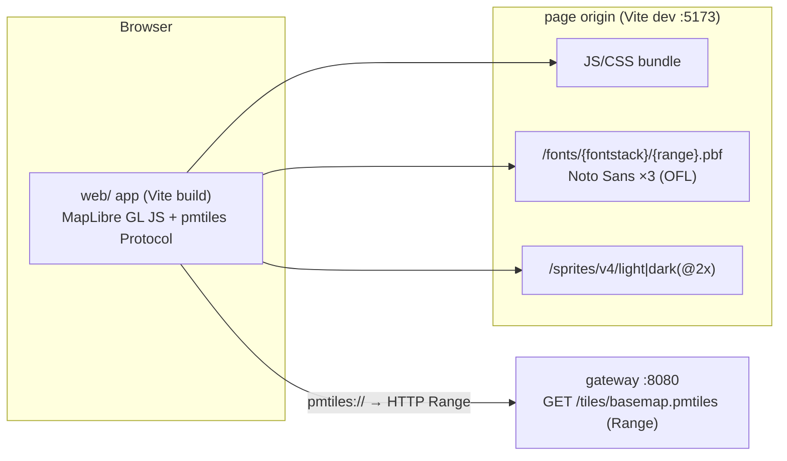

# ADR-0004: Web demo. Style generated in the client from `@protomaps/basemaps`, Mongolian label rule applied as an override, glyphs and sprites bundled in `web/`, own UI controls

- **Status:** accepted
- **Date:** 2026-09-29
- **Stories:** NAV-002 (the pattern is reused by NAV-003 and NAV-004 on the web)

## Context
NAV-002 is the first client. It shows the NAV-001 basemap (`GET /tiles/basemap.pmtiles`, operation `getBasemapPmtiles`, ADR-0002) in MapLibre GL JS, with the label rule `name:mn` → `name` → `name:en` (CLAUDE.md rule 7), day and night styles, a mn/en UI, "my location", and loading / tiles-unavailable / offline states. The story fixes these constraints:
- **Frontend only.** No change under `backend/`, `infra/` or `openapi.yaml`. The gateway is a shared, read-only service.
- **Only two hosts at runtime:** the page origin and the gateway (AC 46). No font CDN and no `protomaps.github.io`.
- Every bundled asset has its licence recorded (AC 36).

ADR-0002 left one item open: "`name:mn` is not in the Protomaps tiles … Revisit in NAV-002." This ADR resolves it for the client.

Measured on 2026-09-29 in this environment (Node 22, npm registry and GitHub raw reachable):

| Fact | Evidence |
|---|---|
| Current packages: `maplibre-gl` 6.11.2, `pmtiles` 4.5.0, `@protomaps/basemaps` 5.7.2 (all BSD-3-Clause). Build tooling: `vite` 8.3.1 (MIT), `typescript` 7.0.2 (Apache-2.0) | `npm view` |
| `@protomaps/basemaps` `layers(source, flavor, {lang})` generates 71 layers, 14 of them symbol layers. **`mn` is not in `language_script_pairs`** (only `en` and `ru` of our three). With `lang: "mn"`, the generated `text-field` is a multi-line `format` expression that reads `name:mn`, `name:en`, `pgf:name`, `name2`, `name3`, `script*` and switches to a `Noto Sans Devanagari Regular v1` font. It shows `name:en` on top of the native name. **This breaks NAV-002 AC 7**, whatever `lang` we pass | probe script against the package |
| Symbol layers that show a feature name: `water_waterway_label`, `roads_labels_minor`, `roads_labels_major`, `water_label_ocean`, `water_label_lakes`, `earth_label_islands`, `pois`, `places_subplace`, `places_region` (also `ref`/`ref:en` abbreviations at low zoom), `places_locality`, `places_country` (only `name:mn`/`name:en`, never `name`). Non-name text: `address_label` (`addr_housenumber`), `roads_shields` (`shield_text`). Icon-only: `roads_oneway` | same probe |
| If every name-bearing `text-field` is replaced with `["coalesce",["get","name:mn"],["get","name"],["get","name:en"]]` and the Devanagari font is replaced with `Noto Sans Regular`, the light and dark styles pass `validateStyleMin` with **0 errors**, no forbidden key remains, and only the font stacks `Noto Sans Regular`, `Noto Sans Medium` and `Noto Sans Italic` are used | same probe with `@maplibre/maplibre-gl-style-spec` |
| Fonts and sprites: `github.com/protomaps/basemaps-assets` commit `028c18f713baecad011301ff7a69acc39bcc2ae7` (2025-10-31). The repo has no releases, so we pin the commit. `fonts/` is Noto Sans glyph PBFs (font-maker), **SIL OFL 1.1** (`fonts/OFL.txt`). `sprites/v4/{light,dark,…}{,@2x}.{json,png}` are "derived from MIT-licensed tangrams/icons". The scripts are BSD-3 | repo README and licence files |
| `Noto Sans Regular` has 256 range files, **6.24 MB in total**, 64 of them larger than 1 KB. Range `1024-1279` contains all 256 code points U+0400–U+04FF, including **Ө ө Ү ү** (U+04E8/E9, U+04AE/AF). Range `6144-6399` contains traditional Mongolian script glyphs (U+1800–U+18F5) | glyph PBF decoded |
| `pmtiles` 4.5.0: (a) `SharedPromiseCache` caches the **rejected** header promise per URL, so after one start-up failure every later request on the same `PMTiles` instance fails at once until it is replaced or invalidated. (b) On an ETag change or 416 it throws `EtagMismatch`, invalidates, and retries once by itself. (c) `errorOnMissingTile` defaults to `false`: a tile that is absent from the archive (empty countryside, outside the extract) gives an empty tile, not an error. (d) With `metadata: false` (default) the generated TileJSON has no `attribution`. (e) It sends `Range` (and `cache: reload` after a mismatch), which the gateway CORS config already allows (ADR-0002 §3) | library source |
| `maplibre-gl` 6.11.2 exports `addProtocol`. UI strings can be set only through the constructor option `locale` (for example `ScaleControl.Kilometers`). There is **no runtime setter**, and the built-in `AttributionControl` switches to compact (an "i" button) on narrow maps | type definitions, docs |
| At the time of writing the gateway was **not reachable** (`GET /health` refused: the NAV-001 change-request rebuild was running). Nothing in this ADR has been checked against the live Mongolia archive | `curl` |

## Decision

### 1. Shape: a static single-page app. No new backend endpoint

The only runtime dependency on the backend is the existing `getBasemapPmtiles`. **No contract change and no backend task.** Serving style, glyphs and sprites from the gateway is a follow-up that happens only when a second client needs to share them (see Consequences).

### 2. Pinned dependencies (exact versions, no `^`)
`maplibre-gl@6.11.2`, `pmtiles@4.5.0`, `@protomaps/basemaps@5.7.2`. Build and dev tooling: `vite` 8.x and `typescript` (pinned in `package-lock.json`). No UI framework and no i18n library: plain TypeScript plus DOM, per the mobile-engineer rules.
*Allowed fallback without a new ADR:* if `pmtiles@4.5.0` turns out to be incompatible with `maplibre-gl@6`, pin the newest `maplibre-gl@5.x` and record it in the notices file.

### 3. Style: generated at runtime from the upstream package, with our label rule as an override
- `buildStyle(theme, cfg)` returns a MapLibre style v8 object:
  - `sources.protomaps = { type: "vector", url: "pmtiles://" + tilesUrl }`.
  - `layers = applyLabelRule(layers("protomaps", flavor, { lang: "en" }))`. `lang` is irrelevant after the override. `en` keeps the generator on a supported path.
  - **Day** = `{ ...namedFlavor("light"), ...DAY_OVERRIDES }`. **Night** = `{ ...namedFlavor("dark"), ...NIGHT_OVERRIDES }`. The override objects hold exactly the colours from `docs/design/map-style.md` and `docs/design/tokens.json`, keyed by the Protomaps `Flavor` field names (for example `background`, `earth`, `water`, `major`, `highway`, `city_label`, `roads_label_major`).
  - Sprite: `sprites/v4/light` for day and `sprites/v4/dark` for night. Glyphs: `fonts/{fontstack}/{range}.pbf`. Both are **absolute** URLs, built as `location.origin + import.meta.env.BASE_URL + "fonts/{fontstack}/{range}.pbf"` by string concatenation. Do not use `new URL(...)`, because it percent-encodes the `{}` tokens.
- **`applyLabelRule` (the normative label rule for every web map in this product):**
  - Export one constant, `LABEL_EXPRESSION = ["coalesce", ["get","name:mn"], ["get","name"], ["get","name:en"]]`.
  - On every symbol layer whose `text-field` references a name key (`name`, `name:*`, `name2`, `name3`, `pgf:*`, `ref:en`), replace `text-field` with `LABEL_EXPRESSION`.
  - Leave `addr_housenumber` and `shield_text` layers unchanged.
  - Replace any `text-font` that names a non-bundled stack (for example Devanagari) with `["Noto Sans Regular"]`, and keep the upstream Medium/Regular zoom switch.
  - Consequences: `places_region` loses its low-zoom `ref` abbreviations, and `places_country` gains `name` (for example «Монгол Улс») instead of being empty for countries without `name:mn`/`name:en`.
  - A unit test asserts, for both themes, that (1) every name-bearing symbol layer's `text-field` deep-equals `LABEL_EXPRESSION`, (2) no layer string contains `name:ru`, `pgf:`, `name2`, `name3` or any `name:<lang>` other than `mn`/`en`, (3) the set of fonts used is a subset of the bundled stacks, and (4) `validateStyleMin` returns no errors. This test is what makes a `@protomaps/basemaps` version bump safe.
- **Theme switch** = `map.setStyle(buildStyle(other, cfg))` (diffing on). Runtime layers (location dot, accuracy circle) are re-added on `style.load`. The camera is not touched.
- We do **not** fork the style or commit a generated style JSON. Upstream upgrades are a version bump, re-checked by the test above.

### 4. Bundled assets (vendored in git under `web/public/`)
| Path in `web/public/` | Source (basemaps-assets @ `028c18f7…`) | Licence | Size |
|---|---|---|---|
| `fonts/Noto Sans Regular/*.pbf` (all 256 ranges) | `fonts/Noto Sans Regular/` | SIL OFL 1.1 | 6.24 MB (measured) |
| `fonts/Noto Sans Medium/*.pbf`, `fonts/Noto Sans Italic/*.pbf` (all 256 ranges each) | same | SIL OFL 1.1 | about 6 MB each (estimate) |
| `fonts/OFL.txt` | `fonts/OFL.txt` | (licence text) | |
| `sprites/v4/{light,dark}{,@2x}.{json,png}` | `sprites/v4/` | MIT (tangrams/icons) | small |

- The whole range set is bundled, not a subset. MapLibre requests a range only when a label needs it. The full set avoids 404 gaps (Cyrillic, Latin, and the Mongolian-script range U+1800), and about 19 MB is acceptable for a local dev demo. The `Noto Sans Devanagari Regular v1` stack is **not** bundled.
- The assets are vendored (committed) rather than downloaded at install time. The reason: a clean checkout followed by `npm ci` and `npm run dev` then works with only the npm registry reachable, and the files are reviewed like code. `web/scripts/vendor-assets.sh <commit>` re-fetches them for upgrades and writes a `SHA256SUMS` file next to them.
- `web/THIRD_PARTY_NOTICES.md` lists every bundled or shipped item: MapLibre GL JS, pmtiles, `@protomaps/basemaps` (style code, BSD-3), the Noto Sans glyphs (OFL 1.1 in full), the sprites (MIT, tangrams/icons, full text), and any other runtime dependency. Each entry has its source URL, version or commit, and licence (NAV-002 AC 36).

### 5. Tiles access and failure handling (client-side only)
- **Configuration.** `VITE_GATEWAY_BASE_URL` (in `web/.env.example`, default `http://localhost:8080`). Strip trailing slashes. `tilesUrl = base + "/tiles/basemap.pmtiles"`. Never append a query string: the contract has none.
- **Protocol.** Register one `Protocol` once (`metadata: false`, `errorOnMissingTile: false`) with `maplibregl.addProtocol("pmtiles", protocol.tile)`. There is no attribution from the source: the app renders its own (§6).
- **"Дахин оролдох" (retry)** must first run `protocol.add(new PMTiles(tilesUrl))`, a fresh instance that drops the cached rejected header (Context, pmtiles (a)), and then `setStyle(buildStyle(...))` again, so that MapLibre re-requests the TileJSON. Language, theme and camera are kept.
- **State signals** (one small state machine, precedence offline > tiles unavailable > loading, NAV-002 AC 45):
  - `loading`: the style has been set and there is no `idle` yet with `isSourceLoaded("protomaps")`. The indicator appears after 300 ms.
  - `tilesUnavailable` at start-up: a map `error` event with `sourceId === "protomaps"` before the first successful load (header or TileJSON failure: closed port, CORS rejection, 404/5xx, "Wrong magic number" for an HTML body), **or** a 10 s watchdog.
  - mid-session banner: 3 consecutive `error` events for tiles of `protomaps`. It clears on the next successful tile (`sourcedata` for `protomaps` with a `tile`).
  - `offline`: `navigator.onLine === false` and the `offline`/`online` window events.
  - Glyph and sprite errors (no `sourceId`) never cause the tiles states. Empty areas produce no error (pmtiles (c)). An ETag change is first retried by pmtiles (b), and if that fails the banner and retry recover.

### 6. UI controls are our own DOM components, not MapLibre's built-in controls
Map options: `attributionControl: false`, `minZoom: 3`, `maxZoom: 19`, `center: [106.9176, 47.9189]` (P1), `zoom: 12`, `bearing: 0`, keyboard, drag-rotate and touch-rotate on.

Own components:
- zoom in/out, disabled at the limits
- compass / north-up, with the needle driven by `map.getBearing()`
- metric scale bar, computed from metres per pixel at the map centre with 1-2-5 rounding
- my location
- theme toggle
- language toggle
- attribution
- state messages

Why: MapLibre control strings can be set only at construction (no live mn↔en switch, NAV-002 AC 31). `AttributionControl` collapses behind "i" on narrow maps (forbidden by AC 34). The geolocation states (denied, stale, unsupported) need our own messages (AC 21 to 24). All strings come from `web/src/i18n/{mn,en}.json`, with identical key sets. `<html lang>` follows the UI language. Language and theme are stored in `localStorage` (no PII).

- **Attribution.** An always-expanded element containing «© OpenStreetMap contributors», linked to `https://www.openstreetmap.org/copyright` (`target="_blank" rel="noopener"`). At zoom ≤ 7, or at all zooms if UX decides so, it also shows the ESA WorldCover credit (ADR-0002 Consequences). Both strings come from the resource files.
- **My location.** No Geolocation or Permissions API call before the first button press (AC 18). Unsupported = `!window.isSecureContext || !("geolocation" in navigator)`, which gives a disabled button (AC 24). Otherwise use `watchPosition({ enableHighAccuracy: true, timeout: 10000, maximumAge: 0 })`. Draw the dot as a DOM marker and the accuracy circle as a GeoJSON polygon in metres in a runtime layer. Follow / not-follow is driven by user camera events. **Coordinates never leave the page:** no request carries them (AC 47).

### 7. Test seams (for QA, no production behaviour change)
- `data-testid` on every control and message.
- `LABEL_EXPRESSION` is importable (a fixture page for NAV-002 AC 8 can use it).
- `window.__nav002 = { map }` is exposed only when `import.meta.env.DEV` is true.
- Failures are simulated in the browser (route interception, closed-port base URL, `setOffline`), never by touching the gateway.

## Alternatives considered
| Option | Pros | Cons |
|---|---|---|
| **Runtime style from `@protomaps/basemaps` + label override + vendored assets (chosen)** | Upstream style as-is, upgraded by version bump. Rule 7 enforced in one tested function. No backend work. Satisfies the "two hosts only" rule | About 19 MB of binary glyphs in git. The override must be re-checked on every style bump (unit test) |
| Use the upstream `lang` option only | Zero custom code | `mn` is unsupported, and the output is two-line `name:en` + native labels using `pgf:name`/`name2` and a Devanagari font. Violates AC 7 |
| Committed static style JSON (generated once) | Simple to inspect, reusable by native clients | Colour overrides and label rule are baked in, and a regeneration step is needed on every change. Acceptable later if Android/iOS want a shared file (easy to switch, not hard to reverse) |
| Serve style, glyphs and sprites from the gateway (`/assets/...`) | One copy for web, Android and iOS. Style fixes without a client release | Needs a contract and backend change during the parallel NAV-001 work (explicitly excluded). No second client exists yet |
| Glyphs from `protomaps.github.io` / a font CDN | Nothing to vendor | Violates AC 46 (only two hosts). External dependency and privacy leak |
| Download assets at `npm install` (postinstall script) | Keeps binaries out of git | Clean setup then needs GitHub access and has a network failure mode. Harder to review |
| Fork the Protomaps tiles to add `name:mn` | Real `name:mn` labels now | Fork without need (ADR-0001 principle). The rule already falls back to `name`, which is Cyrillic Mongolian for most of the country |
| MapLibre built-in controls (Navigation, Geolocate, Scale, Attribution) | Less code | No live language switch, compact attribution, English-only geolocation states. They would still need wrappers, so there are no real savings |
| A UI framework (React/Vue/Svelte) | Component model | More dependencies for about 8 controls. The mobile-engineer rules say plain TypeScript + Vite unless an ADR says otherwise |

## Consequences
- **No backend or contract work for NAV-002.** `openapi.yaml` stays unchanged. The web client uses only `getBasemapPmtiles` (200/206, plus 404/5xx/network failures handled as tiles unavailable).
- The label rule for the web is one exported expression plus a unit test. Android and iOS (NAV-005) must apply the same override to their style, and they may take a generated JSON from the web build (see alternatives).
- **Follow-ups (not built in this run):**
  1. **Upstream `name:mn`.** Propose adding `"mn"` to `OsmNames.ALLOWED_LANGS` in `protomaps/basemaps` (tiles). Filing it publicly needs the user's go-ahead. No fork. Once tiles carry `name:mn`, the web client needs no change.
  2. **Shared style assets for native clients.** When NAV-005 starts, decide between (a) each client bundles its own copy and (b) a gateway static path such as `GET /assets/styles/...`, `/assets/fonts/...`, `/assets/sprites/...`. Option (b) would be a contract change with its own ADR. It is recorded as a backend follow-up request only.
  3. **Unpaved roads (NAV-002 R6).** Check whether the pinned Protomaps tiles schema exposes `surface` on `roads`. Not verified here.
- **Known rendering limit.** Glyphs for traditional Mongolian script are bundled, but MapLibre GL JS draws text horizontally without the contextual joining that Mongolian script needs. Any such `name` renders incorrectly. This is information only (NAV-002 edge case "Missing glyph ranges").
- A `@protomaps/basemaps` or basemaps-assets upgrade is a normal PR: bump the version or commit, re-run `vendor-assets.sh`, and the label-rule test must pass.
