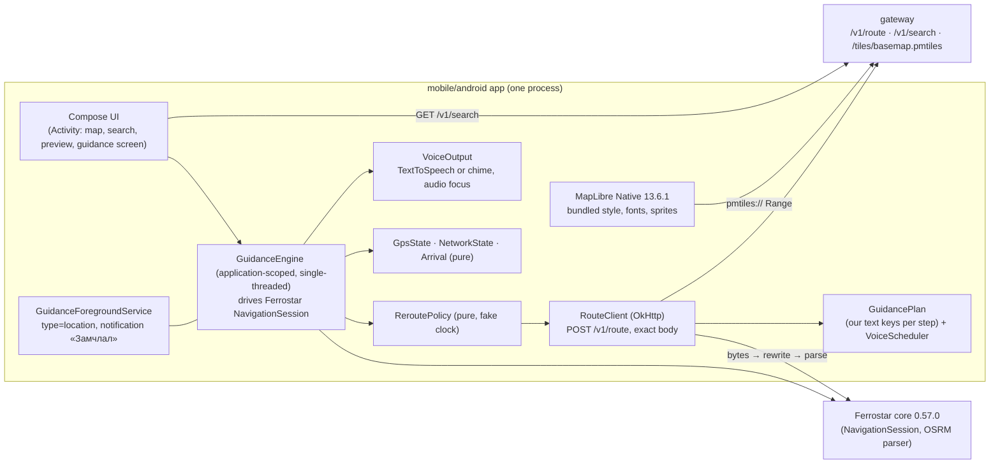

# ADR-0009: Android guidance client. Ferrostar `NavigationSession` driven by the app, app-owned route client and reroute policy, keyed instruction text, bundled style assets

- **Status:** accepted (NAV-005 first slice, Android only)
- **Date:** 2026-10-01
- **Stories:** NAV-005 (design questions A1–A7; AC 5, 14–20, 26–57, 60–72). Follows ADR-0001 (stack), ADR-0004 (style and label rule), ADR-0008 (client-side instruction text). Informs NAV-015 (iOS) and NAV-016 (voice fallback).

## Context
NAV-005 is the first native client. It must navigate a Valhalla route from our gateway with Ferrostar (ADR-0001). It must show and speak **our** glossary text, never Valhalla's `mn-MN` narrative (ADR-0008, NAV-007 F1–F10). Reroutes must follow strict pacing rules (AC 44, 47–50). It must also be verifiable in a container that has no Android emulator (AC 71–73).

**Measured on 2026-10-01 in this environment.** Sources are Ferrostar tag `0.57.0` (raw GitHub sources), the `ferrostar` 0.57.0 crate from crates.io, and the live dev gateway at ≤ 1 request per second with 3 route requests in total.

| # | Fact | Consequence |
|---|---|---|
| F1 | Ferrostar latest release is **0.57.0** (Maven Central, 2026-09-22), artifacts `core`, `ui-compose`, `ui-maplibre`, `ui-formatters`, `google-play-services`, `car-app`, … Built with Kotlin 2.3.20, AGP 9.0.1, `compileSdk` 36, `minSdk` 25, OkHttp 5.3.2, kotlinx-serialization 1.11.0, JNA 5.18.1. Licence BSD-3-Clause | Pin `core` 0.57.0. The app compiles with Kotlin ≥ 2.3 (to read the library metadata) and `compileSdk` 36 |
| F2 | `FerrostarCore` (Kotlin) recalculates on deviation by itself unless `deviationHandler` returns `CorrectiveAction.DoNothing`. Its own policy is a 5 s cool-down on `System.nanoTime()`, 50 m minimum movement and a single in-flight flag. Failures are caught and only logged. Its HTTP path throws `InvalidStatusCodeException(code)` **without headers**, so `Retry-After` is lost. It runs location collection on its own `Dispatchers.IO` scope | The built-in reroute cannot meet AC 44, 47–50, and it cannot be tested with a fake clock. Reroute must be app-owned |
| F3 | The stock Valhalla request generator always adds `filters` (shape attributes), `street_side_tolerance` and `type: break`, and it sends `heading` whenever a course exists, with no speed gate. Options are merged only at the top level | It cannot produce the exact AC 5 / AC 43 body. A custom request is needed |
| F4 | `createOsrmResponseParser(polylinePrecision)` is exported to Kotlin. The parser maps OSRM steps **1:1 and in order** (legs flattened) to `RouteStep`. It copies `maneuver.instruction`, banner `text` and voice `announcement`/`ssmlAnnouncement` verbatim, and keeps `distanceAlongGeometry` as `triggerDistanceBeforeManeuver`. `RouteStep` has no raw `maneuver.type`/`modifier` | Our text can be bound to Ferrostar's steps by step index. Raw OSRM fields must be read by the app itself |
| F5 | `RouteDeviationTracking.StaticThreshold(minimumHorizontalAccuracy, maxAcceptableDeviation)` returns `NoDeviation` for fixes with worse accuracy. One good fix beyond the threshold gives `Deviation(CompletelyOffRoute)` immediately (no debounce). `OffStepOnRoute` means "on a later step", not off-route | Debounce is needed in the app for G6 (single outlier). G7 (60 m accuracy) is already filtered by Ferrostar |
| F6 | `FerrostarSessionBuilder(config).build(route)` returns a `NavigationSession` with `getInitialState(location)` and `updateUserLocation(location, state)`. These are synchronous and give `TripState.Navigating` with `progress.distanceToNextManeuver`, `distanceRemaining`, `durationRemaining`, `remainingSteps`, `deviation`, `spokenInstruction`, raw and snapped location. Session **caching** and the **recorder** are opt-in (`withCaching`, `withRecorder`) | The app can drive navigation deterministically. Caching and recording would store trips on the device (AC 67), so they are not enabled |
| F7 | `FerrostarForegroundService` is a final class whose channel name comes from a library string. `ForegroundServiceManager` is an interface | An app-owned service is simpler than overriding library resources, and it can also handle `onTaskRemoved` (AC 20) |
| F8 | The Ferrostar Rust core ships as `libferrostar.so` for Android ABIs only. Ferrostar's own Rust-backed tests are instrumented `androidTest` | The real core cannot run in host JVM or Robolectric tests out of the box |
| F9 | **Spike:** `cargo build --release --lib` of the crates.io crate `ferrostar-0.57.0.crate` produced a **host `libferrostar.so` (linux-x86_64, 2.3 MB) in 59 s**. The crate resolves `uniffi` **0.31.1**, the same version as Ferrostar's `common/Cargo.lock` at tag 0.57.0, so the UniFFI checksums of the AAR's Kotlin bindings should match. Loading it through JNA from a JVM test was **not** tried | JVM tests can very probably run the real Ferrostar core (§10). This is a mobile task with a fallback |
| F10 | Live `postRoute` (P1 → P3 car, `en-US` and `mn-MN`; P1 → X1 car, `en-US`). (a) `voiceInstructions` of step *k* announce the manoeuvre at the **end** of step *k* (that is step *k+1*'s `maneuver`). The only exception is step 0's first trigger, which is the depart prompt at `distanceAlongGeometry` = step distance. (b) A "continue for N km" post-transition trigger sits at exactly **step distance − 10 m** (18,781/18,771; 21,105/21,095; 8,125/8,115; 1,417/1,407). (c) Short steps put their only trigger at the step start (7/7, 41/41, 32/32 inside roundabouts). (d) Valhalla chains the next manoeuvre ("… Then …") when it follows within about 12–13 s (119 m / 12 s step before `arrive`; 216 m / 13 s step after `depart`). (e) Typical car triggers: about 500–800 m (alert) and about 150–220 m (pre-transition). (f) The arrive step has no trigger; the step before it announces the destination ("Your destination is on the right", 95.7 m). (g) `mn-MN` and `en-US` give the same trigger distances. (h) Banner `primary.text` is often just the street name | Valhalla's triggers have no "now" prompt (15–80 m) and no speed-dependent main prompt. Telling their kinds apart needs a geometric heuristic (the "− 10 m" offset) that would break silently on a Valhalla upgrade. So they cannot deliver the UX prompt schedule (`docs/design/navigation-ux.md` §4.2) reliably. Prompts are scheduled on the device instead (§3.3) |
| F11 | MapLibre Native Android latest stable is **13.6.1** (BSD-2-Clause). `maplibre-compose` latest is 0.18.0. Ferrostar's `ui-maplibre` uses `maplibre-compose` 0.13.0 → MapLibre 13.0.2 | MapLibre is pinned directly. Ferrostar's UI modules are not used (§2) |
| F12 | Maven Central answered **429 "Your ip has exceeded rate limits"** to this container after about ten metadata requests in a burst. Google's mirror of Maven Central (`maven-central.storage-download.googleapis.com/maven2/`) answered the same queries | Build note for the mobile engineer (§11). Not a runtime host |

## Decision

### 1. Shape

- Only Ferrostar's **`core`** artifact is used. `ui-compose`, `ui-maplibre`, `composeui`, `maplibreui`, `google-play-services` and `car-app` are **not** used in this slice. Their views and notification builder render Valhalla text and their own English strings (AC 26, 61), and the camera, attribution and banner rules (AC 2, 21–25, 31) need our own components.
- **`FerrostarCore` is not used** (F2). An app-owned `GuidanceEngine` drives `NavigationSession` (F6) on one dedicated single-threaded dispatcher. All location updates, route replacements and state reads are serialised there, so there is no race between a reroute and a location update. It replaces the roughly 100 lines of `FerrostarCore` the app would otherwise configure around: location collection and service hooks. It keeps the Rust navigation logic (snapping, step advance, deviation detection, trip progress) exactly as upstream ships it. This is use of a public upstream API, not a fork.
- `GuidanceEngine` is **application-scoped**. It is created when «Эхлэх» is pressed and destroyed when guidance ends. The Activity only renders its `StateFlow`. Rotation, theme change and language change recreate the Activity but not the engine, so they cause 0 route requests and 0 repeated prompts (AC 59, 60, 64).
- `NavigationControllerConfig`:
  - `waypointAdvance = WaypointWithinRange(30.0)`.
  - `stepAdvanceCondition = stepAdvanceDistanceEntryAndExit(distanceToEndOfStep = 30, distanceAfterEndOfStep = 5, minimumHorizontalAccuracy = 25)`.
  - `arrivalStepAdvanceCondition = stepAdvanceDistanceToEndOfStep(distance = 30, minimumHorizontalAccuracy = 25)`.
  - `routeDeviationTracking = StaticThreshold(minimumHorizontalAccuracy = 25, maxAcceptableDeviation = 50.0)`.
  - `snappedLocationCourseFiltering = SNAP_TO_ROUTE`.

  The mobile engineer may tune the step-advance distances if a replay shows a late banner change (AC 31), and records the change in the README. The deviation values are the story's (AC 41) and change only through the BA.
- Never call `withCaching`, `withRecorder` or `createFerrostarLogger()` (AC 67).

### 2. A1: route requests. App-owned `RouteClient` against the unchanged contract (openapi 0.5.1, documentation only)
- One `RouteClient` (OkHttp, POST, `Content-Type: application/json`) serves both the preview and every reroute. The body is exactly the AC 5 body. **Field order is free; the set of fields is fixed:**
  - `locations`: `[origin, destination]`, each `{lat, lon}` with ≥ 5 decimals. On a reroute only, `locations[0].heading` is added (see below).
  - `costing`: `auto` | `pedestrian`.
  - `costing_options: {"auto":{"exclude_unpaved":true}}`, only for `auto` with the toggle on.
  - `alternates: 0`, `format: "osrm"`, `banner_instructions: true`, `voice_instructions: true`, `units: "kilometers"`.
  - `language`: `mn-MN` | `en-US`, from the UI language at the time of the request. A later language switch does not re-request (AC 60).
  - **No** `filters`, `street_side_tolerance`, `type`, `heading_tolerance`, `radius`, `id`, toll or other options.
- **Heading (AC 43).** Sent only when the fix has a bearing, its speed is ≥ **2.0 m/s**, and, where `hasBearingAccuracy()` is available, its bearing accuracy is ≤ **45°**. The value is `round(bearing) mod 360`, an integer 0–359. No `heading_tolerance` is sent (Valhalla default 60°). This is the "tolerance" AC 43 leaves to this ADR.
- **Timeouts.** OkHttp `callTimeout` **12 s** (gateway read timeout 10 s plus margin, as NAV-004). Connect timeout 5 s.
- **Status classification.** This is a pure function from HTTP status, headers and body to one of these outcomes, used by the preview (AC 7) and by `ReroutePolicy` (§4):

  | Input | Outcome |
  |---|---|
  | 200 and parse OK | `Ok(route, plan)` |
  | 200 and unparsable, `code` ≠ `Ok` or 0 routes | `BadResponse` |
  | 400 `OsrmError.code` `NoRoute` | `NoRoute` |
  | 400 `NoSegment` or `ValhallaError.error_code` 171 | `OutOfCoverage` |
  | 400 `DistanceExceeded` | `TooFar` |
  | other 400, 413 | `BadRequest` |
  | 429 | `RateLimited(retryAfterS)`, with `Retry-After` parsed as a positive integer, else **5** |
  | 502, 503, 504, `IOException`, call timeout | `Unavailable` |
  | no validated network (checked before sending) | `Offline`, 0 requests |
  | other status | `BadRequest` |
- **Parsing.** Response bytes → `GuidancePlan` built by the app from the raw OSRM JSON (kotlinx-serialization, subset: per step `maneuver.type`, `modifier`, `exit`, `bearing_after`, `name`, `distance`, `duration`, `voiceInstructions[].distanceAlongGeometry`; per route `distance`, `duration`; `waypoints[].distance` for the D51 snap notice) → **text rewrite** (§3.1) → `createOsrmResponseParser(6u).parseResponse(rewrittenBytes)` → Ferrostar `Route`. Step *i* of the plan is step *i* of the Ferrostar route (F4). A step-count mismatch is a `BadResponse`.
- **Search** (`GET /v1/search`, AC 3) follows the NAV-003 request profile already in the contract. The Android client sends the query **as typed** (ADR-0006 assistance is NAV-011). No `reverse` call in this slice (AC 4).
- **Contract impact.** Every field above is already contracted in 0.5.0. Version **0.5.1** adds only documentation: the NAV-005 client profile, the measured voice-trigger layout (informative; not used by NAV-005), the heading rule and new request examples. **No backend implementation change.** The backend only re-runs the contract check with the new examples.

### 3. A2: banner and voice text. Keyed rewrite before parsing, app-rendered banner, notification and voice
**3.1 Rewrite.** Before Ferrostar parses the response, the app replaces every Valhalla text field with an opaque **token**:
- `maneuver.instruction` → `nav:<gen>:m:<step>`
- `bannerInstructions[b].primary/secondary/sub.text` and `components[].text` → `nav:<gen>:b:<step>:<b>`
- `voiceInstructions` → **emptied** (`[]`), so Ferrostar never produces a `spokenInstruction`. Voice timing is the app's (§3.3).

Here `<gen>` is the route generation: 0 for the previewed route, +1 per reroute. The request still sends `voice_instructions: true` because AC 5 requires it. The data is unused on the device, and the BA may drop the flag later to save bytes. Consequences:
- Valhalla text never enters Ferrostar's model, so it cannot be shown, spoken or put in the notification by any path (AC 26). The sentinel test (AC 27) fails loudly if a token or sentinel ever reaches the screen. Tokens are Latin, so the AC 28/33 Latin-letter scans catch them too.
- Text is rendered **at display or speak time** from the token, the plan, the live distance and the **current** UI language. A language switch needs no re-parse and 0 requests (AC 60).
- A token from an older generation resolves to nothing and is dropped, never shown as text of the wrong route.

**3.2 Banner.** The banner, the notification text and the TalkBack announcement come from the plan, not from `TripState.visualInstruction`. This also removes Ferrostar issue #969 (visual instruction null on deviation, story R10). With current step *k* = `route.steps.size − remainingSteps.size`:
- **icon and text:** `maneuverKey(step[k+1].maneuver)` with the ADR-0008 §2 rule table, ported 1:1 to Kotlin (same rule order, same keys, `side()`, the depart sector formula, modulo-360 bearings), then the string resource for the key.
- **distance:** `progress.distanceToNextManeuver`, in the NAV-004 AC 23 format.
- **street line:** `step[k+1].name` with U+200B, U+200C, U+200D and U+FEFF removed. Omitted when empty.
- **During an off-route episode** (§4) the banner shows the reroute text with the secondary line from the last reroute outcome. **After arrival** it shows the arrival text. It is never blank (AC 31).

**3.3 Voice schedule: on the device, implementing `docs/design/navigation-ux.md` §4.2–§4.5.** UX defines what is heard and when; this ADR fixes how. Valhalla's `voiceInstructions` are **not** used for timing (F10). Navigation-ux §4.2 rule 7 leaves this choice to the architect. A pure `VoiceScheduler` runs on the engine thread on every snapshot and on the 1 s ticker:
- **Inputs.** The upcoming manoeuvre *M(k+1)* (current step *k* from Ferrostar), *d* = `progress.distanceToNextManeuver` (live, so the stated distance matches the true distance at speaking time, AC 34), *v* = mean speed over the last 5 s of good fixes, the *gap* (step *k*'s distance), the costing (car or walk), the plan keys of *M(k+1)* and *M(k+2)*, and the GPS and off-route state.
- **Triggers.** The navigation-ux §4.2 table, evaluated with the current *v*:
  - continue on: right after passing a manoeuvre, if *d* ≥ 2 km
  - early: 1,000 m / 2,000 m with the gap conditions
  - main: clamp(*v*·12 s, 100, 250) m, or 500 m when fast
  - now: clamp(*v*·3 s, 15, 80) m
  - walk: main 50 m, now 15 m

  A kind fires once when *d* first falls to or below its distance.
- **Rules.** All of navigation-ux §4.2 rules 1–5 apply:
  - at most once per (generation, manoeuvre index, kind)
  - no prompt for a passed manoeuvre
  - 8 s same-manoeuvre suppression
  - `arrive` gets approaching A11 instead of main; no early prompt; skipped below 30 m
  - `exit roundabout` gets "now" only
  - depart only at start, never after a reroute

  §4.3 catch-up prompts after a reroute and after a GPS restore. §4.4 chaining: ≤ 150 m by car, ≤ 40 m on foot, not before `arrive`, never more than two manoeuvres; the depart prompt is chained at start. §4.5 playback: one utterance at a time, at most one waiting, dropped after 3 s, replaced by a newer prompt for the same manoeuvre; off-route clears the queue.
- **Drop conditions.** No manoeuvre prompts while GPS is lost or an off-route episode is active. Muted prompts count as handled.
- **Client prompts** follow the same playback rules:
  - «Та маршрутаас гарлаа»: once per episode
  - «GPS дохио тасарлаа» / «GPS дохио сэргэлээ»: once each per loss
  - arrival: exactly once, from the arrival detector (§5)
- **Text.** The pure navigation-ux §4.1 generator: distance prefix (AC 32 rounding), instruction from the ADR-0008 key with the voice forms (A10 roundabout with the C4 ordinal, «Тойрогт орно уу»), A11, A12, A13. English uses the `en` resources.
- **Tests.** Everything above is JVM-tested with a fake clock and synthetic snapshot sequences, and checked end to end in the GPX replays (AC 34, 40, 72). The navigation-ux distance and time values are named constants; changes go through UX and BA.

**3.4 Voice output.**
- **Engine.** Android `TextToSpeech`, default engine, on the voice thread. The voice is **usable** only if:
  - init completes within **3 s**, and
  - `setLanguage(Locale("mn","MN"))` (or `Locale("mn")`; for English `Locale.US`, then any `en`) returns neither `LANG_MISSING_DATA` nor `LANG_NOT_SUPPORTED`, and
  - the resulting `voice.locale.language` equals the requested language. Some engines silently fall back to another language, and Mongolian must never be read by a non-Mongolian voice (AC 39).

  Initialisation starts **when the route preview opens** and is re-checked on every language switch (navigation-ux §4.6, AC 38). The engine and voice names go only to a debug log without coordinates.
- **Fallback (D23 minimum, AC 39).** Every prompt becomes the navigation-ux §4.8 **chime** (two sine tones, about 330 ms). It is generated from sine tones, either by a script into a WAV/OGG asset or in code as PCM through `AudioTrack` (mobile's choice). No samples are used, so no third-party licence. The notice A1 is shown once per session as navigation-ux §4.6 specifies. A TTS error during the session switches to the fallback within 1 s for the rest of the session. NAV-016 replaces this after the PO's decision.
- **Audio.** Both TTS and chime use audio attributes usage `USAGE_ASSISTANCE_NAVIGATION_GUIDANCE` and content type speech or sonification. Each prompt requests `AUDIOFOCUS_GAIN_TRANSIENT_MAY_DUCK` (`AudioFocusRequest`, API 26+) and abandons focus within 1 s after `onDone`, `onError` or the end of the chime.
- **Mute** is persisted in DataStore (AC 37).

### 4. A6: off-route detection and reroute policy (app-owned, pure, fake clock)
**Detection.** An **off-route episode** starts after **3 consecutive good fixes** (accuracy ≤ 25 m, age ≤ 10 s) for which Ferrostar reports `CompletelyOffRoute` (that is, > 50 m from every remaining step), spanning ≥ 2 s of fix time:
- G2: detection about 2–3 s after the first good fix > 50 m away (AC 41 needs ≤ 8 s).
- G6 (one outlier): no episode.
- G7 (60 m accuracy): Ferrostar already reports `NoDeviation` (F5).
- `OffStepOnRoute` never starts an episode.

The episode ends when either holds: (a) 2 consecutive good fixes that are not `CompletelyOffRoute`, or (b) a new route becomes active. Episodes do not start while GPS is lost (§5) or after arrival.

**Requests.** `ReroutePolicy` decides *whether and when* to call `RouteClient`. All times come from an injected clock:

| # | Rule | AC |
|---|---|---|
| P1 | At most **1** request in flight | 44 |
| P2 | Consecutive request **starts ≥ 5 s apart** | 44 |
| P3 | At most **6** starts in any rolling **60 s** | 44 |
| P4 | First request of an episode as soon as P1–P3 allow (target ≤ 1 s after detection) | 42 |
| P5 | `Unavailable` (network error, 502/503/504, 12 s timeout): next attempt after back-off **5, 10, 20, 30, 30 … s**. The index resets on `Ok` or at episode end | 48 |
| P6 | `RateLimited(n)`: **0** requests for *n* s (5 s if unreadable), then exactly **1** automatic request if still off-route | 47 |
| P7 | `NoRoute`, `OutOfCoverage`, `BadRequest`, `BadResponse`: next request only after the position has moved ≥ **200 m** from the failed request's origin **and** ≥ **30 s** have passed | 49 |
| P8 | No validated network: **0** requests. When a validated network returns and the episode is still active: 1 request as soon as P1–P3 allow (target ≤ 3 s) | 50 |
| P9 | GPS lost, or no good fix in the last 10 s: 0 requests (no trustworthy origin) | 51 |
| P10 | Guidance ended or arrived: 0 requests. An in-flight call is cancelled (`Call.cancel()`) | 19, 55 |
| P11 | A 200 that arrives **after the episode has ended** (the user returned to the route, AC 46) is **discarded**; the current route stays. A 200 during the episode is applied with `replaceRoute` semantics (new `NavigationSession`, plan generation + 1) within 500 ms | 45, 46 |

The next allowed start is the maximum of all applicable constraints. The secondary banner line is chosen from the last outcome (`Unavailable` → N8, `NoRoute`/`OutOfCoverage` → «Маршрут олдсонгүй», `BadRequest`/`BadResponse` → «Алдаа гарлаа», `Offline` → «Интернэт холболт алга»; none for `RateLimited`).

**Body.** `locations[0]` is the latest good fix plus heading (§2). `locations[1]` is the original destination, **not** Ferrostar's `remainingWaypoints` (Valhalla does not echo location properties, and the snapped destination would drift). `costing`, `costing_options`, `units` and `language` are the ones of the route being followed. The language is the UI language at reroute time; this matters only for the unused narrative.

### 5. GPS loss, network loss, arrival (pure state machines)
- **GPS** (AC 51–53):
  - **Good fix:** accuracy ≤ 25 m and age ≤ 10 s, measured with `elapsedRealtimeNanos`, never wall clock.
  - **Lost:** no good fix for **10 s**. A 1 s ticker on the injected clock checks this, because no fix may arrive at all.
  - **Restored:** the first good fix after a loss.
  - **While lost:** UI progress frozen at the last good snapshot, puck marked stale, manoeuvre prompts dropped, `ReroutePolicy` paused, the off-route debounce reset. Every fix is still passed to Ferrostar, whose accuracy gates (§1) prevent deviation and step advance on poor fixes.
  - **On restore:** the current step is re-evaluated, and prompts for passed manoeuvres are dropped by the §3.3 staleness rule.
- **Network** (AC 50, 54): `ConnectivityManager` default-network callback with `NET_CAPABILITY_VALIDATED`. The indicator is driven by this; guidance does not depend on it.
- **Arrival** (AC 55–57), checked on every fix, fires **once**, when any of these holds:
  - (a) `TripState.Complete`
  - (b) not off-route, a good fix, and `progress.distanceRemaining` ≤ **30 m**
  - (c) a good fix within **30 m** straight-line of the route's last coordinate. This covers G4: stationary 10 m beside the end.

  Then: arrival banner and prompt, `ReroutePolicy` stopped, location updates and the foreground service stopped immediately (AC 55 allows 10 s), arrival panel shown.

### 6. A3: native style assets. Bundled in the APK, generated from the web style code, no gateway path
- **Style JSON.** A script `web/scripts/export-native-style.*` runs the existing web `buildStyle(theme, cfg)` with `assetBaseUrl = "asset://"` and the tiles URL placeholder `{GATEWAY_TILES_URL}`. It writes `mobile/android/app/src/main/assets/style/basemap-day.json` and `basemap-night.json`, which are committed. ADR-0004's "committed static style JSON" alternative is hereby accepted **for native clients only**; the web keeps generating at runtime. The script has a `--check` mode that fails if the committed files are stale (mobile runs it in verification). At runtime the app substitutes `pmtiles://` + gateway base URL + `/tiles/basemap.pmtiles` and loads the style from a JSON string. This adds no web runtime behaviour change; if `buildStyle` needs a refactor to be callable from Node, web tests must still pass unchanged.
- **Label rule.** An Android JVM test reads both JSON files and asserts what ADR-0004 §3 asserts for the web:
  - every name-bearing symbol layer's `text-field` equals `["coalesce",["get","name:mn"],["get","name"],["get","name:en"]]`
  - no `name:ru`, `pgf:`, `name2`, `name3` or other `name:<lang>` remains
  - fonts ⊆ {Noto Sans Regular, Medium, Italic}
  - the tiles placeholder is present once (AC 1)
- **Glyphs and sprites.** These are **not copied into `mobile/`**. A Gradle `Sync` task copies `web/public/fonts/**` and `web/public/sprites/**` (the vendored basemaps-assets commit, ADR-0004 §4) into `build/generated/basemapAssets/`, which is registered as an assets directory. One vendored copy stays in git, and licences are as in `web/THIRD_PARTY_NOTICES.md`. A `mobile/android/THIRD_PARTY_NOTICES.md` lists them plus every Android runtime dependency.
- **Map.** MapLibre Native Android **13.6.1**, used directly (an `AndroidView` wrapper in Compose; `maplibre-compose` only through an amendment to this ADR). MapLibre's built-in attribution and logo are disabled. The app renders its own always-visible «© OpenStreetMap contributors», plus the ESA WorldCover credit at zoom < 8 as on the web, from string resources (AC 2). Theme switch: `setStyle` with the other flavor JSON, then route, puck and markers are re-added on style load; the guidance engine is untouched (AC 59). Compose colours come from `docs/design/tokens.json` through a Gradle task that generates a Kotlin colours file at build time (no copied hex values, as web ADR-0004 Amendment 1).
- **Not chosen:** a gateway static path (`/assets/styles|fonts|sprites`). It would mean a contract change, gateway work next to the NAV-008 files and staging redeploys, and it brings no benefit while there is one native client. Revisit with NAV-015 if iOS and Android drift.

### 7. A4: shared manoeuvre fixture stays at `web/src/route/maneuvers.fixture.json`
The file is **not moved** (0 web changes). A Gradle `Sync` task copies exactly that file into a generated test-resources directory of `:app`. The Android test fails if the file is missing or has 0 cases, and asserts key, params, `mn` and `en` text for 100 % of the cases (AC 29). iOS (NAV-015) does the same. Ownership stays with the mobile engineer, who owns both `web/` and `mobile/`. A change to the fixture must keep both test suites green in the same commit.

### 8. A5: resources and language
- `res/values/strings.xml` holds **Mongolian** (`tools:locale="mn"`), `res/values-en/strings.xml` holds English, with identical key sets (lint `MissingTranslation` and `ExtraTranslation` are errors). Plurals and templates keep placeholders literally (`{n}`, `{ordinal}`, …) as in the glossary. A small formatter replaces them, not `String.format`, so glossary text can be compared byte for byte.
- **Per-app language:**
  - AndroidX `AppCompatDelegate.setApplicationLocales(...)`, with the Activity an `AppCompatActivity`.
  - `res/xml/locales_config.xml` (`mn`, `en`) referenced by `android:localeConfig`.
  - `AppLocalesMetadataHolderService` with `autoStoreLocales=true` for API < 33.
  - On **first launch**, if no app locale is stored, the app sets `mn` explicitly. With `values/` = mn alone, an English-language device would otherwise resolve to `values-en` (AC 60, Open question 3 default).
- A glossary check (the Android equivalent of `web/scripts/check-glossary.mjs`, AC 61) compares every `mn` value with the glossary's Mongolian column. A scan of Kotlin sources finds 0 hard-coded user-facing literals.
- The notification channel name and all notification text come from the app's resources (§9). Ferrostar library strings are not used.

### 9. Location, foreground service, permissions
- **Location provider.** An app-owned provider implementing Ferrostar's `NavigationLocationProviding`:
  - **Guidance:** platform `LocationManager.GPS_PROVIDER` at **1,000 ms**, `minDistance` 0. The last known location is not emitted, and fixes older than 10 s are dropped.
  - **Preview origin (AC 9):** first good fresh fix within 10 s from `GPS_PROVIDER` or, on API 31+, the platform `FUSED_PROVIDER`, whichever comes first.
  - **No Google Play services dependency** (AC 14; Open question 6 default (a)). A Play-services fused provider can be added later behind the same interface.
- **Foreground service.** The app's own `GuidanceForegroundService` implements Ferrostar's `ForegroundServiceManager` contract (F7):
  - Manifest: `android:foregroundServiceType="location"`, `exported="false"`. Permissions `FOREGROUND_SERVICE`, `FOREGROUND_SERVICE_LOCATION`, `POST_NOTIFICATIONS`, `ACCESS_FINE_LOCATION`, `ACCESS_COARSE_LOCATION`. **Never** `ACCESS_BACKGROUND_LOCATION` (AC 8).
  - Started only from the foreground, by «Эхлэх» (a while-in-use permission is enough for a location FGS started from the foreground).
  - Channel «Замчлал», `IMPORTANCE_LOW`.
  - Notification text from the plan (§3.2), updated on each engine state change and at least every 5 s (AC 17).
  - «Дуусгах» action through an explicit, non-exported `PendingIntent` to the service.
  - `onTaskRemoved` ends guidance (AC 20); `START_NOT_STICKY`.
- Keep-screen-on is set on the guidance screen's view (AC 18).

### 10. Test seams and Ferrostar on the JVM
- Packages without Android or Ferrostar types: `instructions` (ADR-0008 port and voice text), `format`, `reroute` (`ReroutePolicy`, classification), `gps`, `arrival`, `voiceplan`. All time is injected. These cover AC 26, 28–30, 32–34, 40, 41, 44, 47–53, 56 with pure JVM tests.
- The adapter `TripState → GuidanceSnapshot` (step index, `distanceToNextManeuver`, remaining distance and duration, deviation kind and distance, raw and snapped location, accuracy, fix time) is the only Ferrostar-typed code apart from `RouteClient` parsing and the engine.
- **Real Ferrostar in JVM tests (F9).** `mobile/android/tools/build-host-ferrostar.sh <version>`:
  - downloads `ferrostar-<version>.crate` from `static.crates.io` and checks it against the crates.io checksum
  - builds it with `cargo build --release --lib`, using `--locked` when the crate ships a lockfile, else asserting that `uniffi` resolves to Ferrostar's locked version
  - writes `libferrostar.so` to a cache **outside the repo**

  The `:app` unit-test task sets `jna.library.path` to that cache and adds the host `net.java.dev.jna:jna:5.18.1` jar to the test runtime classpath. GPX replays (AC 72) then drive `NavigationSession` **synchronously** through the same adapter and engine logic with a virtual clock, so they are deterministic and faster than real time.
  - **Fallback**, if loading fails (checksum mismatch, JNA conflict): replays run against a test-only fake engine (simple polyline progress). The report states that the Ferrostar-specific parts (snapping, step advance, progress numbers) are **not verified** in this environment.
- Robolectric (permission flow, service, notification, keep-screen-on, configuration change, Compose attribution test) uses a fake engine and a fake `MapSurface`. MapLibre's native library does not load on the JVM. GPX replay providers and the fake TTS exist **only** in `src/test` / `src/debug` (AC 72), never in release.

### 11. Build configuration (A7) and dependencies
- **Gateway base URL.** It comes from `BuildConfig.GATEWAY_BASE_URL`, resolved in this order: Gradle property `nav.gatewayBaseUrl` → environment `NAV_GATEWAY_BASE_URL` → uncommitted `mobile/android/gateway.local.properties` → **debug default `http://127.0.0.1:8080`** (works with `adb reverse tcp:8080 tcp:8080`; the emulator alias `http://10.0.2.2:8080` is documented). **Release builds fail** if the URL is unset or not `https://`. No server hostname or IP is committed (D35, AC 66).
- **Network security config.** Main: cleartext disabled. A `src/debug` overlay allows cleartext only for `127.0.0.1`, `localhost` and `10.0.2.2`.
- **Privacy on the device (AC 65–68).**
  - No OkHttp logging interceptor, no analytics or crash SDK, no Ferrostar recorder, cache or logger.
  - `android:allowBackup="false"` with data-extraction rules excluding everything.
  - DataStore holds only voice, theme, language and orientation.
  - Debug logs never contain coordinates, route bodies or search text (scanned with the AC 67 regex).
  - The gateway's no-PII logging (NFR-P1) is unchanged.
- **Pinned versions** (exact; patch bumps allowed if resolution fails, recorded in the README; minor or major bumps need an amendment):

  | Dependency | Version | Licence |
  |---|---|---|
  | `com.stadiamaps.ferrostar:core` | 0.57.0 | BSD-3-Clause (bundles `libferrostar.so`) |
  | `org.maplibre.gl:android-sdk` | 13.6.1 | BSD-2-Clause |
  | OkHttp (+ `mockwebserver3` for tests) | 5.3.2 (same as Ferrostar) | Apache-2.0 |
  | kotlinx-coroutines / kotlinx-serialization-json | 1.11.0 / 1.11.0 | Apache-2.0 |
  | AndroidX (appcompat 1.7.1, activity-compose 1.13.0, lifecycle 2.10.0, Compose BOM, DataStore) | exact versions in the catalog | Apache-2.0 |
  | JNA (transitive; host jar for tests) | 5.18.1 | Apache-2.0 OR LGPL-2.1, **used under Apache-2.0** |
  | Robolectric, JUnit 4.13.2, Turbine | exact | MIT / EPL-1.0 / Apache-2.0 (test only) |
  | Kotlin / AGP / Gradle | Kotlin 2.3.20, AGP 8.13.x on the installed Gradle 8.14.3 (a wrapper may pin 8.14.3), `compileSdk`/`targetSdk` 36, `minSdk` 26 (Open question 5 default) | — |

  No GPL component. Repositories: `google()` and `mavenCentral()`. Because of F12, the mobile engineer may list Google's Maven Central mirror before `mavenCentral()` for builds. It is a build-time host only, never contacted by the app.

## Alternatives considered
| Option | Pros | Cons |
|---|---|---|
| **A1:** stock `WellKnownRouteProvider.Valhalla` against `/v1/route`, options merged | Least code; upstream default | Extra fields (`filters`, `street_side_tolerance`, `type`) and an ungated `heading` (F3); `Retry-After` lost (F2); preview and reroute body tests would assert on Rust-generated JSON |
| **A1:** custom `RouteRequestGenerator` + Ferrostar's HTTP path | Exact body | Still loses `Retry-After` and status detail, and no 12 s timeout control without a custom HTTP provider. A `RouteClient` is simpler |
| **A1 (chosen):** app-owned `RouteClient` + `createOsrmResponseParser` | Exact AC 5/43 body; full status and header handling; one code path for preview and reroute; MockWebServer tests on the JVM | A little more app code (about 200 lines) |
| **Engine:** `FerrostarCore` with `deviationHandler = DoNothing` | Documented entry point | Internal IO scope and wall clock make replays non-deterministic; races between `replaceRoute` and location updates; unused HTTP/route-provider plumbing; a mis-set handler silently re-enables the default reroute |
| **Engine (chosen):** app-driven `NavigationSession` | Deterministic, single-threaded, fake-clock testable; nothing hidden | We re-implement the small glue (location loop, de-duplication). Ferrostar upgrades must re-check the session API |
| **A2 (i):** rewrite the JSON with final localised text, use Ferrostar views | Stock banner and TTS observer | A language switch would need a re-parse and route replacement; Ferrostar views break AC 2, 21, 31 and use English strings |
| **A2 (ii) alone:** custom views keyed by `utteranceId` lookup, Valhalla text left in the model | No rewrite | Valhalla text stays in the model and can leak (notification, accessibility, future code); random UUIDs need lookup tables |
| **A2 (chosen):** token rewrite + app-rendered banner and notification + device-side voice schedule (navigation-ux §4) | Valhalla text unreachable; live distance and language at speak time; exactly the UX schedule (speed-dependent main, "now", catch-up, chaining); independent of Valhalla's trigger layout | The app implements the schedule (about 200 lines, pure, fake-clock tested) |
| **A2 (iii):** server-side text (gateway rewrite or patched Valhalla) | One implementation for all clients | Breaks pass-through (ADR-0002) or forks Valhalla; backend work next to NAV-008 files; ADR-0008 already rejected it for Phase 0 |
| **A2:** Valhalla `voiceInstructions` trigger points with our text (BA recommendation) | Upstream timing, no scheduler code | No "now" prompt and no speed-dependent main prompt (F10). Kinds can be told apart only by a geometric heuristic that breaks silently on a Valhalla upgrade. Cannot meet navigation-ux §4.2–4.4 (allowed by its rule 7) |
| **A3:** gateway static asset path | One copy for all clients; style fixes without app release | Contract and backend change; nothing to gain with one native client (§6) |
| **A3:** copy fonts and sprites into `mobile/` | Self-contained module | About 14 MB duplicated in git, two copies to keep in sync |
| **Location:** Play-services fused provider | Better fixes on Google phones | Fails AC 14 on phones without Google services; another SDK to audit for AC 65 |

## Consequences
- **Easier:**
  - The contract stays pure pass-through. 0.5.1 is documentation only.
  - Every pacing, text and state rule is a pure function with fake-clock JVM tests.
  - Valhalla's narrative cannot leak.
  - A language or theme switch costs no network.
  - iOS (NAV-015) can follow the same shape: the same fixture, the same voice-plan rules and the same reroute table.
- **Harder:**
  - The ADR-0008 rule table now exists twice (TypeScript, Kotlin), guarded by the shared fixture. The voice schedule exists once (Kotlin); iOS will port it.
  - A Valhalla pin change re-checks only ADR-0008's manoeuvre types. Voice timing does not depend on Valhalla.
  - A Ferrostar upgrade must re-check F2–F7 and the host-library build (F9).
- **Not verifiable in this container** (the device list for QA, AC 73):
  - MapLibre Native rendering of `pmtiles://`, `asset://` glyphs (font stack names contain spaces) and sprites. If the asset file source does not resolve encoded stack names, the `Sync` task writes the URL-encoded directory names as well.
  - Real TTS and the `mn` voice availability (NAV-007 AC 9).
  - Foreground-service behaviour, Doze and OEM battery savers.
  - Real GPS.
- **Dependencies:** the PO's phone test needs a gateway reachable from the phone over HTTPS, which is NAV-008 staging. It is not a blocker for building or JVM verification.
- **Follow-ups:**
  - **NAV-012:** restore after process death, lock screen.
  - **NAV-016:** voice fallback.
  - **Play-services provider:** only if field data shows poor platform fixes.
  - **APK size:** an optional font-range subset if the size matters before release.

## Amendments

### Amendment 1 (2026-10-01): as-built facts and clarifications from the NAV-005 integration review
Requested by the mobile engineer in the NAV-005 handoff. Verified against `mobile/android` and a fresh
`./gradlew assembleDebug testDebugUnitTest lint` run in this environment. No contract change.

**New fact.**

| # | Fact | Consequence |
|---|---|---|
| F13 | Ferrostar 0.57.0 `NavigationSession.updateUserLocation(location, state)` computes `deviation` from the **previous** trip state, so the deviation returned after fix *n* describes fix *n − 1* (one fix of lag) | `GuidanceCore` pairs the reported deviation with the previous fix's accuracy and time before feeding the §4 debounce. G2 still detects about 3 s after the first good fix > 50 m away (AC 41 limit 8 s). Re-check on every Ferrostar upgrade, together with F2–F7 |

**§1 / §10 Robolectric.** The host-built Ferrostar library (F9) loads in plain JVM tests (replays run on the real
engine) but not inside Robolectric's sandboxed class loader. Robolectric tests therefore use a fake navigator, as §10
already allowed. §10's fake `MapSurface` is still required: MainActivity must be launchable under Robolectric with
MapLibre's `MapView` replaced by a test surface, so that the permission flow (AC 8–13) and configuration changes
(AC 64) are tested at Activity level (AC 71).

**§4 Body, language (clarification).** The reroute body uses the `language` of the route being followed, as AC 43
states. The sentence "The language is the UI language at reroute time" is withdrawn. The narrative is unused on the
device, so this only keeps the request reproducible and the AC literal.

**§5 Arrival rule (c) (tightened).** The straight-line rule fires only while the upcoming manoeuvre is the route's
`arrive` step (current step = last step − 1, or later). Without this, a route that passes within 30 m of its end
earlier (loops, one-way blocks, the other carriageway) would end guidance early. G4 is unaffected.

**§9 Map-screen location (clarification).** Outside guidance, location updates for the my-location dot and the
preview origin are collected only while the Activity is at least STARTED, and are paused while guidance runs (the
guidance provider is the only listener then). After guidance ends, the only listener left is the map screen's, and
only while the app is visible. With no FGS running, the app never keeps a location request registered while it is
in the background (AC 16, 19; this matters most on API 26–28, which have no while-in-use permission).

**§11 dependency table, additions** (exact versions from `mobile/android/gradle/libs.versions.toml`, all
Apache-2.0 unless stated; patch bumps as before):

| Dependency | Version | Note |
|---|---|---|
| Android Gradle Plugin | 8.13.2 | on Gradle 8.14.3 (wrapper with checksum) |
| Hilt (`com.google.dagger:hilt-android`, compiler, testing) + KSP | 2.58 + KSP 2.3.6 | Dagger 2.59+ needs AGP 9. `kotlin-metadata-jvm` 2.3.20 on the processor path |
| `androidx.hilt:hilt-lifecycle-viewmodel-compose` | 1.3.0 | |
| Compose BOM | 2026.06.01 (ui 1.11.x, material3 1.4.0) | newer BOMs need compileSdk 37 / AGP 9.1 |
| `androidx.core:core-ktx` / DataStore preferences | 1.17.0 / 1.2.1 | |
| `com.android.tools:desugar_jdk_libs` | 2.1.5 | required by the Ferrostar AAR (core library desugaring) |
| Robolectric | 4.16 | MIT, test only |
| `androidx.test:core` / `androidx.test.ext:junit` | 1.7.0 / 1.3.0 | test only |
| JNA desktop jar `net.java.dev.jna:jna` | 5.18.1 | test runtime only (host Ferrostar), used under Apache-2.0 |

**Release build.** Release builds are not minified in this slice (no store upload before NAV-007, D17). R8 keep
rules for JNA and the UniFFI bindings are decided with NAV-012, before any release build is distributed.

### Amendment 2 (2026-10-01): step catch-up after a jump (NAV-005-D1) and the platform test seams
Requested by the mobile engineer after the NAV-005 fix round. Checked against `mobile/android` and a fresh
`./gradlew assembleDebug testDebugUnitTest lint` run in this environment. No contract change.

**New fact.**

| # | Fact | Consequence |
|---|---|---|
| F14 | With `stepAdvanceDistanceEntryAndExit(30, 5, 25)`, Ferrostar 0.57.0 advances a step only after a fix within 30 m of that step's end. If no fix lands there (a GPS gap over a junction, QA track G3b), the step never advances. `StaticThreshold` then reports `OffStepOnRoute`, which neither advances nor starts a deviation. The banner stays on the passed turn until arrival | The app needs a catch-up rule. Shortening the step-advance distances would not help, because the gap can be any length |

**§1 Step catch-up (decision).** The step-advance condition in §1 stays as it is. `StepCatchUp`
(`engine/StepCatchUp.kt`, applied in the Ferrostar adapter after every `updateUserLocation`) adds one rule:
- **Condition.** The fix is good (accuracy ≤ 25 m), it is **more than 50 m** from the current step's geometry, and it is
  **within 50 m** of a later step that is not `arrive`. The first matching later step is the target. These are the same
  25 m / 50 m values as the §1 deviation threshold (AC 41), so this is Ferrostar's own `OffStepOnRoute` test applied
  to the current fix (F13). The distances change only together with AC 41, through the BA.
- **Action.** Ferrostar's public `NavigationSession.advanceToNextStep` is called until the target is the current
  step. Snapping, progress and the step-advance reset stay Ferrostar's. This uses the public API; it is not a fork.
- **Outlier gate.** *(Superseded by Amendment 3: there is no shortcut after a gap.)* The catch-up applies at once only
  if there was no good fix for **≥ 3 s** before this fix (the tunnel case). During continuous tracking, **two
  consecutive good fixes** must agree on the same target. So a single outlier (G6) never skips a step.
- **Not applied** when only `arrive` follows the current step. Arrival stays with §5 and Amendment 1.
- **Voice and banner.** The banner shows the target's next manoeuvre on the same fix. Passed manoeuvres are never
  announced (§3.3 staleness rule). After a GPS restore, the navigation-ux §4.3 catch-up prompt names the upcoming
  manoeuvre (G3b: «GPS дохио сэргэлээ» at 280 s, then the next turn at 281 s).
- **Interaction with §4.** A catch-up can end an off-route episode by rule (a) when the user rejoins the route at a
  later step. A reroute answer that arrives after that is discarded (P11). That is the intended outcome, and no extra
  request is sent.
- **Known limit.** On loops, U-turn routes or dual carriageways, a later step can lie within 50 m of a position that
  is also more than 50 m from the current step. The gate then advances after two agreeing fixes. Ferrostar's own
  classification has the same limit. There is no fixture for this yet; QA adds one in a follow-up.
- **Re-check on every Ferrostar upgrade,** together with F2–F7 and F13. Check the `advanceToNextStep` semantics and
  whether upstream adds its own catch-up. If it does, remove this rule.

**§10 Platform seams (as built).** Three interfaces are bound in `di/PlatformModule`:
- `LocationSource`, implemented by `PlatformLocationSource` (`LocationManager`)
- `MapSurface` / `MapCamera`, implemented by `MapLibreSurface` and `NavMapController`
- `GuidanceVoice`, implemented by `VoiceOutput`

Robolectric tests replace the module with `TestPlatformModule` (`@TestInstallIn`, `src/test` only). Its fakes are
`FakeLocation` (counts listeners), `RecordingMapSurface` (no native code) and `RecordingVoice`. With these,
`MainActivityTest` covers AC 8, 10–13 and 64 and the Amendment 1 §9 listener lifecycle at Activity level. None of
these fakes is in the release APK (AC 72).

### Amendment 3 (2026-10-01): outlier handling (NAV-005-D9, D10), the walking dead band (D8) and arrival gating
Requested by the mobile engineer after the D9/D10 fix round and by QA (test plan §8 Q3). Checked against
`mobile/android` (`StepCatchUp.kt`, `FerrostarNavigation.kt`, `GuidanceCore.kt`, `ArrivalDetector.kt`) and a fresh
`./gradlew assembleDebug lint :app:testDebugUnitTest -Pnav.hostFerrostar=required` run in an isolated copy of the
working tree. No contract change.

**§1 Step catch-up, outlier gate (replaces the Amendment 2 bullet; as built for D10).** A catch-up is applied only when
**two consecutive good fixes** agree on the same target step and are at most **3 s** apart (fix time). This also holds
right after a GPS gap: the first fix after a tunnel can itself be the outlier (G6c). Poor fixes (accuracy > 25 m) neither
confirm nor cancel a pending target. A good fix with no target (on the current step, or off the route) cancels it. A new
session state (start, new route) resets it. At 1 Hz the confirming fix comes 1 s after the first, inside AC 53's 2 s.
No speed-based plausibility check is added: the two-fix rule already rejects a single jump, and a speed check would
also reject legitimate catch-ups after long gaps.

**§1 / §3.3 Untrusted fix (new, as built for D9).** A good fix that is **more than 50 m** from the current step's
geometry and is **not** applied as a catch-up is *untrusted* (`NavSnapshot.fixOnCurrentStep = false`). Ferrostar snaps
such a fix to the nearest point of the current step, often the manoeuvre itself, so its `distanceToNextManeuver`,
progress and snapped position are wrong. For an untrusted fix the core:
- keeps the last trusted snapshot for the banner distance, trip progress and puck;
- does not evaluate the voice schedule (so no early "now" prompt, and the main prompt is not consumed);
- still feeds the fix's deviation to the §4 off-route debounce. Once an episode starts, the puck shows the raw fix as
  before, so a real departure from the route freezes the puck for at most the 3-fix debounce;
- still passes the fix to arrival, but only under the gating below.

The schedule itself (`VoiceScheduler`) stays a pure function of trusted input. The 50 m value is the §1 deviation
threshold (AC 41) and changes only with it.

**§1 Walking dead band (decision for D8).** After a gap, fixes that resume **30–50 m past the end** of the current step
are caught neither by Ferrostar (its entry condition needs a fix within 30 m of the step end) nor by the 50 m rule. A
car leaves the band in about 2 s, a walker needs about 8 s (G5b). The catch-up condition gets a second branch:
- **(a) lateral, unchanged:** the fix is more than 50 m from the current step and within 50 m of a later step.
- **(b) past the end, new:** the fix's nearest point on the current step is the step's **last coordinate** (the
  projection is clamped at the end), the fix is **more than 30 m** (`STEP_ENTRY_M`) from that point, it is within
  **25 m** (`MIN_ACCURACY_M`) of a later step that is not `arrive`, and it is closer to that later step than to the
  current step.

Both branches use the same target choice (first matching later step) and the same two-fix gate. A fix that matches
branch (b) but is still pending is **untrusted** like the D9 case, so the passed turn is not announced while the
second fix is awaited. Normal tracking never reaches branch (b): a fix within 30 m of the step end lets Ferrostar's
own entry and exit condition advance the step. The 30 m constant is tied to `STEP_ENTRY_M`; if the step-advance
distances are tuned (§1), branch (b) follows them. Acceptance: QA's `tcR16` (G5b) passes unchanged, and `tcR06`,
`tcR14`, `tcR15` and `tcR17` stay green.

**§5 Arrival gating (clarification and new rule).**
- **Rule (c)** fires only while the upcoming manoeuvre is the `arrive` step (current step ≥ last step − 1), as
  Amendment 1 already decided. As of this amendment `ArrivalDetector.check` and its call in `GuidanceCore.onFix`
  receive no step index, so this gating is **not implemented yet**. A review probe on the real engine (P1 → P3,
  4,265 m, 4 steps) fed one good fix 20 m from the route end after 300 m of driving. Arrival fired at once, guidance
  ended and «Таны очих газар баруун талд байна» was spoken. So a single G6-type outlier near the destination, or a
  route that passes close to its own end, ends guidance early. It is a NAV-005 defect for the mobile engineer,
  with a QA fixture: a route that passes within 30 m of its end before the last manoeuvre, such as a divided avenue
  with a U-turn or a loop round a block, plus a single outlier at the end coordinate early in G1.
- **Rule (b)** (`distanceRemaining` ≤ 30 m) uses only a **trusted** fix. An untrusted fix's `distanceRemaining` comes
  from the snap to the current step's end and can be near 0 while the user is still well before the destination.
- Rule (a) (Ferrostar `TripState.Complete`) is unchanged.

### Amendment 4 (2026-10-01): as built after the NAV-005 fix round 3 (arrival gating, D8 branch (b), D2)
Requested by the mobile engineer in the round-3 handoff. Checked against `mobile/android` (`ArrivalDetector.kt`,
`GuidanceCore.kt`, `StepCatchUp.kt`, `FerrostarNavigation.kt`, `Geo.kt`, `PlaybackQueue.kt`, `VoiceSchedule.kt`) and a
fresh `./gradlew assembleDebug lint :app:testDebugUnitTest -Pnav.hostFerrostar=required` run in an isolated copy of the
working tree (196 tests, 2 failed: `tcR10` = D3, waiting for the PO; `tcR13` = the committed voice golden predates D2/D4
and is regenerated by QA). No contract change.

- **§5 arrival gating: implemented.** The Amendment 3 §5 statement "not implemented yet" is closed.
  `ArrivalDetector.check` receives the navigator's current step index (`NavSnapshot.stepIndex`, Ferrostar
  `steps.size − remainingSteps.size`) and `GuidancePlan.steps.lastIndex` for rule (c), and `fixOnCurrentStep` as the
  trusted flag for rule (b). Both indices are on the flattened step list of the single route leg, so they are
  comparable. Rule (a) is not gated. Covered by `StateMachinesTest` and by `ArrivalGatingReplayTest` on the real
  engine (the review probe on G1, and a synthetic loop whose end lies 20 m from its first street). QA's recorded
  fixture for a route that passes near its own end remains a follow-up (Amendment 3 §5).
- **§1 branch (b), "projection clamped at the end".** `Geo.nearestIsLast` decides it with the same local projection
  as `Geo.distanceToLine` and a **0.5 m** along-track tolerance, so that a fix exactly perpendicular to the step end at
  a 90° turn counts as past the end despite floating-point noise. The tolerance is far below `STEP_ENTRY_M` (30 m), so
  it cannot move the 30 m boundary of the dead band. A good fix with a pending target on **either** branch sets
  `fixOnCurrentStep = false`.
- **§3.3 / navigation-ux §4.2 rule 2 (D2).** `PlaybackQueue` reports `onStarted(prompt, at)` and `onDropped(prompt)`
  through a `PlaybackListener` to `VoiceScheduler`. The 8 s same-manoeuvre gap is measured from the playback start. A
  prompt dropped without playing (replaced, timed out, cleared, refused after arrival) does not count, and the
  previous real start is restored. Until the start is known, the trigger time stands in (a free channel starts at
  the trigger). The scheduler stays a pure function of its inputs and the injected clock.

### Amendment 5 (2026-10-03): NAV-012 background guidance
ADR-0013 changes §9 and §11 for NAV-012:
- `onTaskRemoved` no longer ends guidance;
- `START_STICKY` while guiding, with a per-API-level restart rule;
- notification refresh at 2 s, a voice action and the Android 14 dismissal rule;
- one stored-trip exception, the restore record in `noBackupFilesDir/restore/`;
- more manifest `tools:node="remove"` lines.

It also settles the R8 follow-up from Amendment 1. The Ferrostar AAR ships the JNA and UniFFI keep rules, and enabling minification becomes a separate tech-debt item before the first distributed release build. Every other part of this ADR is unchanged.
