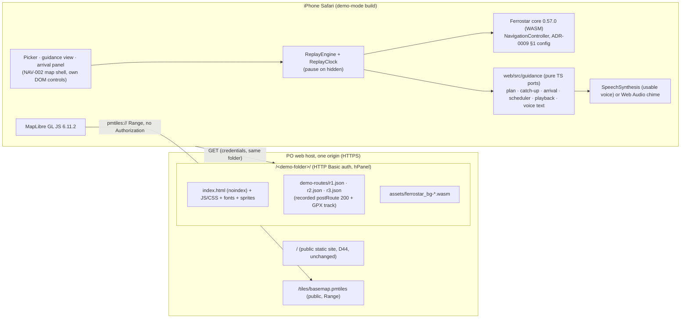

# ADR-0011: Web demo mode. Separate offline build in a password-protected sub-folder, Ferrostar core (WASM) in the browser with ported guidance rules, browser speech with the chime fallback

- **Status:** accepted (NAV-017, web demo-mode build only)
- **Date:** 2026-10-01
- **Stories:** NAV-017 (architect requests 1 and 2; AC 1–7, 12–16, 24–35, 39, 42–48). Follows ADR-0001 (stack), ADR-0004 (web client, bundled assets), ADR-0008 (client-side instruction text) and ADR-0009 (Android guidance client: the rules ported here). Related: ADR-0010 (proposed clip pack, **not** implemented here, D75), spike `mongolian-voice-tts` (§2.3 browsers).

## Context
NAV-017 lets the PO and team members the PO chooses (D74) watch simulated turn-by-turn guidance on an **iPhone in Safari** (D72). Three recorded Ulaanbaatar routes are replayed (R1 car P1→P3 / G1, R2 walk P1→P2 / G5, R3 car roundabouts / G8). The constraints:
- **No backend at all.** There are 0 `search`, `reverse` and `route` requests (D9/D47, AC 42).
- **Hosting.** The demo is served from a sub-folder of the PO's shared Hostinger web hosting, protected with HTTP Basic auth set in hPanel. There is no VPS.
- **Public site unchanged.** The public map-only site (D44) and its build stay as they are (AC 4, 7).
- **Same guidance as Android.** Banner and voice text follow ADR-0008 and navigation-ux §4. The prompt timing must equal the NAV-005 golden set (AC 26).
- **Voice.** Browser speech only with a usable voice. Otherwise the D23 minimum applies: a chime per prompt plus the A1 notice (D73). No cloud TTS and no audio clips (D75).

Today `web/` has route preview only (NAV-004). It has no guidance, replay, voice or chime code. The static build assumes the web root ("a sub-folder is not supported", `web/README.md`).

**Facts measured on 2026-10-01 in this environment.** "Reported" means public reports that were not measured here.

| # | Fact | Consequence |
|---|---|---|
| W1 | `@stadiamaps/ferrostar` **0.57.0** on npm is the Ferrostar Rust core compiled to WASM (wasm-bindgen, **BSD-3-Clause**). It is the same version as Android (ADR-0009). It ships `ferrostar_bg.wasm` (883,416 bytes; 313,854 bytes at gzip -9), `ferrostar_bg.js` and typings. The entry `ferrostar.js` uses the bundler target (`import * as wasm from "./ferrostar_bg.wasm"`). All 52 WASM imports come from the module `./ferrostar_bg.js` | The core can be instantiated by hand from `ferrostar_bg.js` plus the `.wasm` asset. No Vite WASM plugin is needed |
| W2 | Instantiated by hand in Node 22 (`WebAssembly.instantiate(bytes, {"./ferrostar_bg.js": bg})`, `__wbg_set_wasm`, `__wbindgen_start`): init **7.6 ms**. `RouteAdapter.parseResponse` accepts the recorded `p1-p3-car-mn.json`. `NavigationController` with the **ADR-0009 §1 configuration**, fed the G1 points, takes **0.2–0.8 ms per fix** | Runs on the main thread. No Worker is needed. Vitest can run the real core |
| W3 | On G1 the core advances to step 1 at t = 248 s, step 2 at 295 s and step 3 at 305 s, and reaches `Complete` at 306 s. This is consistent with the golden rows ("now" for manoeuvre 1 at 243 s, arrival at 305 s). G5 completes at 912 s. **G8 ends on its last step with 3.9 m remaining and never reaches `Complete`.** **G4 (starts 500 m before the end) stays on step 0 with `OffStepOnRoute` 577 m** | The app-level rules from ADR-0009 are needed on the web too: arrival rule (b) for G8, and the Amendment 2–4 step catch-up for G4 |
| W4 | `@stadiamaps/ferrostar-webcomponents` 0.57.0 needs `maplibre-gl ^5` and `lit`, and renders Ferrostar's (Valhalla's) instruction text | Not usable: we pin `maplibre-gl` 6.11.2, and ADR-0008 forbids Valhalla text |
| W5 | Scratch build with the pinned Vite 8.3.1: - `base: "./"` gives `./assets/…` URLs, and `new URL(asset, import.meta.url)` resolves the `.wasm` relative to its chunk. - An `if (CONSTANT) import("./demo")` branch is removed from a build where the constant is false: no demo chunk, no `.wasm`. - **Files in `web/public/` are copied into every build.** - Vite writes `crossorigin` on entry tags. Its preload helper sets `crossOrigin=""` on runtime `<link>` elements for dynamic-import dependencies | Demo data must not live in `public/`. The demo build needs explicit settings for preloads and `crossorigin` (§2) |
| W6 | The recorded responses `p1-p3-car-mn`, `p1-p2-walk-mn`, `g8-roundabout-car-mn` (and the two `en` siblings in that folder) validate against `OsrmRouteResponse` (openapi 0.5.2, JSON Schema 2020-12) | Recorded files can be used unchanged. Contract 0.5.2 records this |
| W7 | **Reported:** Safari may not send cached Basic-auth credentials for `crossorigin` script and stylesheet requests, which gives 401 loops behind password-protected folders. Sources: [vitejs/vite#6648](https://github.com/vitejs/vite/issues/6648); a project fix that strips `crossorigin` from Vite entry tags ([dhanumamidi/anvay#7](https://github.com/dhanumamidi/anvay/pull/7)); [WebKit bug 171566](https://bugs.webkit.org/show_bug.cgi?id=171566) (the cookies part was fixed in 2020) | Strip `crossorigin` in the demo build (§2). The real-iPhone check (AC 48) confirms |
| W8 | The Android golden set `tests/gpx/nav005/golden/voice-golden.tsv` has rows for **G1 mn/en, G5 mn and G8 mn/en (no G5 en)** and G9 mn. It is produced by `QaGpxReplayTest.tcR13`, which builds fixes with `Tracks.fromPoints` (`support/Replay.kt`): accuracy 5 m, bearing to the next point (from the previous point for the last), bearing accuracy 10°, speed = distance to the next point per second, time = index × 1 s. It models speech duration as **min(5,000, 300 + 55 × text length) ms** (`QaSupport.kt`) | The web parity test must build fixes and model durations the same way. G5 `en` has no golden rows (request to BA/QA) |

## Decision

### 1. Shape

- **One origin and 0 backend calls.** The page, its assets, the WASM and the route data come from the demo folder. The tiles come from the public archive at the origin root (§4). Nothing else is contacted (AC 42).
- The demo mode is an **extension of the existing static SPA** (ADR-0004 §1). It reuses the map shell, theme, language, attribution, `instructions.ts` and `format.ts`. It adds no host and no endpoint (contract 0.5.2 is documentation only).

### 2. Build: `npm run build:demo-mode` → `dist-demo-mode/`
- **Script:** `vite build --mode demo-mode --outDir dist-demo-mode`. The story names (AC 1) are kept. `.gitignore` covers `dist-demo-mode/`.
- **Mode file `.env.demo-mode`** (committed, no hostnames): `VITE_STATIC_DEMO=true`, `VITE_GATEWAY_BASE_URL=same-origin`, `VITE_DEMO_MODE=true`. The new key goes into `web/.env.example` with the default `false`. `.env.static-demo` gets an explicit `VITE_DEMO_MODE=false`, so a local `.env` can never turn demo mode on in the public build.
- **Guard (fail closed, like `staticDemoGuard`).**
  - `VITE_DEMO_MODE` accepts `true`/`1`/`false`/`0`/unset. Any other value fails the build.
  - `VITE_DEMO_MODE=true` together with a static-demo value that is not `true` also fails the build, so demo mode can never run with backend features on.
  - The build log prints one line: "demo mode build: demo mode on; search, reverse and routing are off (NAV-017)".
- **Code exclusion.** The demo code is reached only through one branch on a compile-time boolean constant (Vite `define`), for example `if (__NAVMN_DEMO_MODE__) { void import("./demo/main") }`. In every other build the branch, the demo chunk, the `.wasm` and the route data are absent (W5; AC 4 checks this).
- **Settings applied only in the demo-mode build:**
  - `base: "./"` (§3);
  - `build.modulePreload: false` and `build.cssCodeSplit: false`, so no runtime-created `<link crossorigin>` exists (W5, W7);
  - a `transformIndexHtml` post-hook that removes every `crossorigin` attribute from `index.html` and adds `<meta name="robots" content="noindex, nofollow">`. Module scripts without the attribute are still fetched same-origin with credentials;
  - a small inline guard: if `location.pathname` does not end in `/` or `.html`, it calls `location.replace(pathname + "/" + search + hash)` before any module loads. Without the trailing slash, relative URLs would resolve against the origin root;
  - the route-data emitter (§5);
  - the `fixtures/label-rule.html` input may be dropped from this build.
- **No server configuration files** in the output: no `.htaccess`, `.htpasswd` or `web.config` (AC 3). hPanel's protection is an `.htaccess` in the folder, and an upload must never overwrite it (story R12).
- **Public builds are unchanged.** `npm run build` and `npm run build:static-demo` keep `base: "/"`, their outputs and their behaviour.

### 3. Sub-folder support (amends ADR-0004 §4 for the demo-mode build only)
- All URLs in the demo build are **relative to the page**: scripts, CSS, fonts, sprites, WASM and route data. The asset base URL for glyphs and sprites becomes `new URL(import.meta.env.BASE_URL, document.baseURI).href` when `BASE_URL` is relative. `assetBaseUrl()` in `src/config.ts` keeps its current result for an absolute base, so public builds do not change. The `{fontstack}`/`{range}` tokens are still appended by string concatenation.
- **The only absolute path is the tiles archive** (§4). It is resolved from `location.origin` as today (`same-origin`).
- The same output works in any folder name and any depth without a rebuild (AC 2). The folder name is never in the build, the repo or the README (placeholder `<demo-folder>`).

### 4. Tiles under the password protection (architect request 1, story R6): read the public archive at the origin root
- The demo-mode build reads **`<page origin>/tiles/basemap.pmtiles`**, the archive the public site already serves (D44). It lies **outside** the protected folder. This is the existing `VITE_GATEWAY_BASE_URL=same-origin` behaviour, so it needs no code change.
- Why:
  - HTTP Range under Basic auth never comes into play. Browsers attach cached Basic credentials only inside the protection space (the folder path), and an unprotected path needs none.
  - The archive's Range behaviour on this host is already checked for the public site (NAV-002 AC 51–52: 206, `Content-Range`, no `Content-Encoding`).
  - No second copy of about 112 MiB has to be uploaded or kept in sync.
  - It is the same origin, so no CORS is involved.
  - The basemap is public anyway (D44), so protecting it adds nothing. What must stay non-public is the guidance text and the demo itself (D17, D74), and those are inside the folder.
- **Dependency.** The demo needs the public site's archive at `/tiles/basemap.pmtiles`. The README says so, and the after-upload checks include a Range request for it (AC 5).
- **Fallback (documented, not the default).** If the PO ever removes the public archive, a local, git-ignored `.env.demo-mode.local` with `VITE_GATEWAY_BASE_URL=/<demo-folder>` makes the build read `<demo-folder>/tiles/basemap.pmtiles` with the existing "path" rule of `resolveGatewayBaseUrl`. The folder name then lives only in that ignored file. Range under Basic auth would then become a real-iPhone check.
- Contract: `getBasemapPmtiles` 0.5.2 documents the static-host guarantees (200/206, `Content-Range`, no `Content-Encoding`). Clients do not rely on gateway-only behaviour there (416 JSON body, CORS headers, `Cache-Control`).

### 5. Demo route data: single source in the repo, emitted at build time
- **Manifest** `web/src/demo/routes.manifest.json` (written by the mobile-engineer, verified by QA). It is data, so the i18n and glossary scans skip it, as they skip `lexicon.json`. Per entry:
  - `id` (`r1`–`r3`), `mode` (`car`|`walk`);
  - `route`: repo-relative path of the recorded `postRoute` 200 response, for example `mobile/android/app/src/test/resources/routes/p1-p3-car-mn.json`;
  - `track`: path of the GPX file, for example `tests/gpx/nav005/G1.gpx`;
  - `origin` and `destination`, each with `name` and `osm` (type/id, or `null` with the name «Сонгосон цэг» per the story rule).

  G4 is listed **test-only** (`picker: false`). The Vitest suite reads it, and the build never emits it.
- **Build-time emitter** (a Vite plugin, active only in demo mode). It reads the referenced files **read-only from their original repo paths**, with no copies under `web/`. It writes one file per picker entry, **`demo-routes/<id>.json`**, at a **stable, un-hashed path** so tests can intercept it (AC 10):
  `{ "schema": 1, "id", "mode", "origin", "destination", "route": <recorded response, JSON content unchanged>, "track": { "t_ms": [...], "lonlat": [[lon, lat], ...] } }`.

  It also generates a virtual module with the picker summaries (id, mode, names, `routes[0].distance`, `routes[0].duration`, data URL). The picker can then show all three entries before any data file loads (AC 8).
- **Build validation (fails the build):**
  - `code == "Ok"`, exactly 1 route and 1 leg, at least 2 steps;
  - the track is 1 Hz and contiguous: point *i* has GPX time = first time + *i* s. Then GPX time equals the Android harness's index time (W8);
  - the first track point is ≤ 30 m from the route start, and the last is ≤ 30 m from the route end (story AC 16 condition);
  - the manifest paths exist and lie inside the repository.
- **Runtime load.** `fetch(url, { cache: "no-cache" })` relative to the page, parsed in `try/catch`. Any non-200 status, a non-JSON body or a failed shape check gives the AC 10 error state. Retry fetches again. Nothing is cached in storage.
- **Why not copy the fixtures into `web/`:** one source means a QA fixture or golden change reaches the demo and its parity test together. Story R10 needs exactly that.

### 6. Guidance core: Ferrostar core in WASM plus TypeScript ports of the ADR-0009 app rules
- **Dependency.** `@stadiamaps/ferrostar` **0.57.0**, pinned exactly (ADR-0004 §2), in `dependencies`. Android and web upgrade Ferrostar **in lockstep**, and each upgrade re-checks W2–W3 and ADR-0009 F2–F7/F13/F14. No Vite WASM plugin and no web components (W4).
- **Loader** (`web/src/guidance/ferrostarCore.ts`, or a similar name):
  - import `ferrostar_bg.js`, plus the `.wasm` as a Vite `?url` asset;
  - `fetch` → `arrayBuffer()` → `WebAssembly.instantiate(bytes, { "./ferrostar_bg.js": bg })` → `__wbg_set_wasm(exports)` → `__wbindgen_start()`. Not `instantiateStreaming`, so a host that serves `.wasm` with the wrong MIME type still works;
  - load once, when demo mode starts. A failure shows the AC 10 error for the selected entry;
  - Vitest loads the same bytes from `node_modules` with `fs`.
- **Parsing.**
  - The route-text **rewrite of ADR-0009 §3.1** comes first: every `instruction` and banner text becomes an opaque token, and `voiceInstructions` becomes `[]`. Then comes `new RouteAdapter({ Valhalla: { endpointUrl: "http://unused.invalid", profile } }).parseResponse(bytes)`.
  - The endpoint is a reserved `.invalid` name. `generateRequest` is never called, so nothing is contacted. Valhalla text therefore never enters the core (AC 18 sentinel).
  - Step *i* of the plan is step *i* of the parsed route. A count mismatch is a data error.
- **Controller.** `new NavigationController(route, config, false)` (recording off) with exactly the ADR-0009 §1 values:
  - `WaypointWithinRange(30)`;
  - `DistanceEntryExit(30, 5, 25)`;
  - arrival `DistanceToEndOfStep(30, 25)`;
  - `StaticThreshold(25, 50)`;
  - `SnapToRoute`.

  Ferrostar's `visualInstruction` and `spokenInstruction` are never read.
- **Pure TypeScript ports** (`web/src/guidance/`, platform-neutral, no DOM). These are **1:1 ports of the as-built Kotlin**, with the same constants, rule order and tie-breaks:
  - `GuidancePlan` (keys from `instructions.ts`);
  - `StepCatchUp`: ADR-0009 Amendments 2–4, branches (a) and (b), the 0.5 m along-track tolerance, the two-fix gate ≤ 3 s; calls `advanceToNextStep`;
  - the untrusted-fix rule (Amendment 3);
  - `ArrivalDetector`: §5 rules (a)/(b)/(c) with the Amendment 3/4 gating;
  - `VoiceScheduler`: §3.3 and the D2 playback-start rule of Amendment 4;
  - `PlaybackQueue`;
  - the voice text generator (navigation-ux §4.1, D67).

  The sources are `mobile/android/app/src/main/java/mn/navmn/app/` `engine/StepCatchUp.kt`, `engine/GuidanceCore.kt`, `engine/FerrostarNavigation.kt`, `arrival/ArrivalDetector.kt`, `geo/Geo.kt`, `instructions/VoiceText.kt` and the voice schedule and playback classes. A rule that does not apply to a replay is kept but never triggered (fixes are always good). **Not ported:** `ReroutePolicy`, `RouteClient`, GPS-loss and network state machines (no GPS, no reroute in a replay).
- **Fixes** are built exactly like the Android harness (W8): accuracy 5 m, course to the next point with accuracy 10°, speed = distance to the next point per second, timestamp = track time. The look-ahead is legitimate in a replay, and it keeps the timing equal to the golden set.
- **ReplayEngine and ReplayClock.**
  - The clock is injected. In production it is `performance.now()`-based, at 1× only, and accumulates time only while running and visible (AC 15).
  - A 100 ms ticker applies, **in order**, every fix whose `t` ≤ the clock (± 100 ms, AC 12). After a throttled timer (Low Power Mode) several fixes may be due; each goes through the core with its own timestamp, and the scheduler's staleness rules drop prompts for passed manoeuvres.
  - `requestAnimationFrame` only animates the puck between snapped positions along the route line, never backwards. It never drives guidance.
- **Remaining time and distance** come from the plan, as the AC 21 formula says, not from Ferrostar's `durationRemaining`. The camera bearing is the course between consecutive fixes (AC 22).
- **Parity gate.** A Vitest golden test runs G1, G5 and G8 through the real WASM core and the ports, with the W8 speech-duration model and a fake clock. Its (manoeuvre, text) sequence must equal `voice-golden.tsv` exactly, with `t_s` within ± 2 s (AC 26). The `en` runs use the `mn` recording with the English UI. QA confirms that the `en` recordings have the same manoeuvre fields (story "Demo routes").

### 7. Voice, chime and audio unlock on iOS Safari (architect request 2)
Platform behaviour below comes from public documentation and reports. It was **not measured on an iPhone** (none is available here). Every item marked (R) is in the AC 48 real-iPhone checklist.
- **Voice decision** (`isUsableVoice(voice, uiLang)`, one pure function). It runs when the picker opens and on every language change, so the decision is ready before «Эхлэх»:
  - read `speechSynthesis.getVoices()`. If the list is empty, listen for `voiceschanged` **and** poll every 250 ms, for up to 3 s. Older iOS versions do not fire `voiceschanged` reliably (R);
  - match `lang` with `^mn([-_]|$)`/i for the Mongolian UI, or `^en([-_]|$)`/i for English, preferring `en-US` (AC 28).

  **D78** (local voices only, `localService === true`) is decided but reaches AC 28 only through triage (F1, default "finish first"). Keeping the rule in this one function makes that change one line. The iPhone's system voices are local, so the PO's result is the same either way.
- **Unlock inside the «Эхлэх» handler, synchronously, before any `await`** (AC 27):
  1. create the `AudioContext` if needed, call `resume()`, and start a one-sample silent buffer;
  2. if a usable voice exists: `speechSynthesis.cancel()`, then `speak(departUtterance)`. If not: start the depart **chime** on the context;
  3. request the screen wake lock (AC 39).

  So «Эхлэх» is enabled only when the data, the WASM core and the plan are ready (AC 9, 12), and the depart prompt can be computed synchronously in the handler. Other user-activation handlers in the replay (language switch, «Дууг нээх», «Байршил руу буцах») call an idempotent `ensureAudioUnlocked()` (`resume()` if not running). Speech that iOS still refuses outside a gesture arrives as an utterance `error`, and that switches to the chime fallback (AC 29) (R).
- **Speech output.**
  - One utterance at a time, and the engine keeps a strong reference (some engines drop `end` events of collected utterances).
  - `voice`, `lang`, `rate = 1`, `pitch = 1` and `volume = 1` are set explicitly.
  - A **watchdog** treats an utterance as finished, and calls `cancel()`, if neither `end` nor `error` arrives within the modelled duration + 3 s (cap 10 s). iOS sometimes never fires `end` (R), and without the watchdog the queue would stall.
  - `error` events with `interrupted`/`canceled` caused by our own `cancel()` are ignored. Any other error triggers the chime fallback for the rest of the replay and shows A1 if it was not shown (AC 29).
- **Chime.** It is synthesised at runtime with Web Audio oscillators as navigation-ux §4.8 specifies: 880 Hz 120 ms, 20 ms gap, 1,320 Hz 180 ms, 10 ms ramps, peak −3 dBFS, about 330 ms. There is no file and no licence. The playback queue treats it as a 330 ms utterance.
- **Page hidden** (AC 15): `speechSynthesis.cancel()`, stop the chime, `audioContext.suspend()`, pause the clock. **Visible:** resume the clock and call `audioContext.resume()`. A prompt that cannot start within 3 s is dropped by the playback rule, with no extra UI (R).
- **Ring/silent switch.** iOS may mute Web Audio, and possibly speech, while the switch is on (R). This story does **not** use the WebKit Audio Session API (`navigator.audioSession`, reported for Safari 17+). It changes how the demo interacts with other audio, and that is a product choice. The README tells the PO to test with the switch off first, then on, and to record the result. A change, if wanted, comes through triage.
- **Wake lock.** `navigator.wakeLock.request("screen")` is requested in the «Эхлэх» handler, re-requested within 1 s after the page becomes visible, and released at the end. Any failure is silent (AC 39) (R).

### 8. Privacy and hygiene
- No service worker, no cache API, no IndexedDB.
- `localStorage` holds only the existing theme and language keys plus one voice-mute key, named in the README (AC 30, 43).
- Nothing is logged to the console with coordinates, voice names or route text. Voice names are never stored or sent.
- The Geolocation API is never called, and the my-location control is hidden in demo mode (AC 14).
- The public site gets **no `robots.txt` entry** for the folder, because that would reveal its name (AC 7). The `noindex` meta and the password are enough.
- Route data and tracks are the recorded or synthetic fixtures only (AC 44). The attribution shows wherever the route is drawn.

### 9. Test seams (no production behaviour change)
- **Vitest (Node):** the real WASM core, from `node_modules` bytes; injected clock, speech and audio factories; the golden test (§6); build-output checks (AC 3, 4).
- **Playwright:**
  - `page.clock` runs replays faster than real time;
  - `addInitScript` stubs for `speechSynthesis` (voice lists with and without `mn`, error injection), `AudioContext` (counts chimes) and `navigator.geolocation` (counts calls);
  - interception of `**/demo-routes/<id>.json` for AC 10 and the sentinel copy (AC 18);
  - Chromium plus WebKit with iPhone descriptors where the container runs WebKit (AC 47).
- **Basic auth locally (QA, `tests/`):** a tiny static server with Basic auth over `dist-demo-mode/` in a sub-folder, and an unprotected `/tiles/` next to it. It checks 401 without credentials, 200 with them, and that every asset loads in WebKit with `httpCredentials`. This is partial evidence only. Safari's credential caching (W7) stays a real-iPhone check.

### 10. Licences and size
- New runtime dependency: `@stadiamaps/ferrostar` 0.57.0, BSD-3-Clause. It is listed in `web/THIRD_PARTY_NOTICES.md`. No GPL component.
- Demo-mode build budget: the demo chunk plus WASM add **≤ 1.5 MB uncompressed** over the static-demo build (WASM 0.88 MB). Route data is about 0.2 MB in total. Public builds gain 0 bytes (AC 4).

## Alternatives considered
| Option | Pros | Cons |
|---|---|---|
| **Ferrostar core (WASM) + ported app rules (chosen)** | Same snapping, step advance and progress as Android (same 0.57.0 core), so the golden parity (AC 26) is realistic. Upstream used as is, which follows ADR-0001 ("Ferrostar … Web"). It is the base for real web navigation later | About 0.9 MB WASM. The app rules exist twice (Kotlin and TS) and must stay in sync |
| Pure TypeScript replay: our own projection and step advance | No WASM, smallest bundle | Re-implements Ferrostar logic (a fork by rewrite, against our principles). Parity with the Android golden set depends on matching Ferrostar's internals |
| Ferrostar web components (`ferrostar-webcomponents`) | Ready UI | Needs `maplibre-gl` 5 and `lit`, and shows Valhalla text (W4, ADR-0008) |
| Pre-computed replay: the Android harness exports the timeline (banner, prompts per second) and the web only plays it | Trivial web code, exact parity by construction | The web would gain no guidance logic. Language switch, mute, pause and arrival would be scripted rather than computed. The timeline is not reusable for real navigation, and it ties the web build to a JVM run |
| Tiles **inside** the protected folder | Everything under one protection | Re-uploads about 112 MiB and keeps it in sync. Range under Basic auth on shared hosting is unverified (R6). Protects nothing that is not already public |
| Separate repository or branch for the demo | Public code untouched | Two copies of the web client. The story requires one source and a guarded build |
| `vite-plugin-wasm` | Standard import syntax | One more dev dependency. Manual instantiation is about 10 lines (W2) |

## Consequences
- **`web/` gains a guidance core** (`src/guidance/`) that later web navigation can reuse. Only the demo build ships it for now.
- **Two implementations of the ADR-0009 app rules.** Any change to the Kotlin scheduler, catch-up, arrival or voice text needs the same change in TS. The shared golden file is the guard (story R10), and a golden change goes through the BA. Ferrostar is upgraded in lockstep on both platforms.
- **The demo depends on the public archive** at `/tiles/basemap.pmtiles`, and on the host redirecting or the inline guard adding the trailing slash.
- **ADR-0004 is amended:** sub-folder hosting is supported for the demo-mode build only. Public builds still assume the web root.
- **Contract 0.5.2** (documentation only): static-host tiles guarantees, and 0 backend requests plus the recorded-response rule for the demo build. Backend has nothing to implement.
- **Open data item:** the golden set has no G5 `en` rows (W8). AC 26 asks for them. The BA either narrows AC 26 to G5 `mn`, or QA and the mobile-engineer add G5 `en` to `tcR13` and regenerate.
- **Real-iPhone evidence** (AC 48) is needed for every item marked (R) in §7, and for W7. The README checklist lists them.

## Amendments

### Amendment 1 (2026-10-01): as-built facts and clarifications from the NAV-017 integration review
Requested by the mobile engineer in the NAV-017 handoff. Verified against `web/` at the working tree on 2026-10-01
(including the uncommitted `vite.config.ts` / `buildtools/demoMode.ts` / `voiceText.ts` changes) with `npm test`,
`npm run lint`, `npm run typecheck`, `npm run check:glossary` and the three builds. No contract change.

**§2 Build, config shape (accepted).** `web/vite.config.ts` stays a **plain object**, because
`tests/e2e/nav002/vite.alt.config.mjs` spreads it. The demo-mode settings are applied per Vite mode inside plugins
(`buildtools/demoMode.ts` › `demoModePlugins`): a `config` hook sets `base: "./"`, the `__NAVMN_DEMO_MODE__` define,
`modulePreload: false` and `cssCodeSplit: false` only in demo mode; `apply()` limits the index.html transform and the
route emitter to demo mode; `configResolved` drops the `labelRule` input there. This is equivalent to §2. Measured: the
demo build has 0 `crossorigin`, the `noindex` meta, no server files; the public builds keep `base: "/"`, and against
the pre-NAV-017 commit `f396517` their only code change is the extra `document.baseURI` argument of `assetBaseUrl`,
which is unused when the base is absolute.

**§2 Viewport (clarification).** The public `index.html` already has `viewport-fit=cover` (NAV-002). No demo-only
viewport transform is needed; the demo-only `text-size-adjust` and safe-area padding live in the demo CSS chunk, which
public builds do not contain.

**§6 Parity gate, `en` source recording (changed).** The sentence "The `en` runs use the `mn` recording with the
English UI" is replaced: **each golden row is compared against its own source recording** (the `mn` rows against the
`mn` recording, the `en` rows against the `en` recording named in `tests/gpx/nav005/manifest.json` `also_en`), because
`QaGpxReplayTest.tcR13` generated the `en` rows from the `en` recordings. The demo itself plays the `mn` recording in
both UI languages (story "Demo routes"). Measured on 2026-10-01 with the real WASM core and the ports, `mn` recording
in the English UI:
- G1: equals the G1 `en` golden rows exactly (8 rows, same times).
- G8: equals the first 26 G8 `en` golden rows; the last two differ (`16 In 100 meters, turn left` / `17 Your destination
  is on the left` instead of `16 In 100 meters, you will arrive` / `16 You have arrived`), because
  `g8-roundabout-car-en.json` has 17 steps and the `mn` recording 18. This is a **fixture difference, not a client
  defect**. Whether AC 26 is met by per-recording parity, or the G8 `en` golden rows are regenerated from the `mn`
  recording, is a BA decision (with the open G5 `en` item below).

**§7 Unlock when the voice decision is still pending (added).** If the 3 s voice decision has not finished when «Эхлэх»
is activated, the handler cannot know whether to speak. It then chimes the depart prompt (as implemented) **and also
primes speech with one empty, zero-volume utterance with no voice set** (no Mongolian text is involved), so that iOS
allows the later prompts if the decision then finds a usable voice. Without this, a fast tap on an iPhone whose voice
list loads late leads to a refused first `speak()`, which the error rule turns into the chime fallback for the whole
replay.

**§10 Size and public builds (clarification).** Measured: the demo chunk (72 KB) plus the WASM (883 KB) plus the
single CSS file add about 1.0 MB over the static-demo build, within the 1.5 MB budget. "Public builds gain 0 bytes"
means 0 bytes of demo **code, WASM and route data** (AC 4). The shared resource files (`mn.json`, `en.json`, with the
new `demo.*`, `nav.*` and `voice.*` keys) and `tokens.json` v0.5.0 are bundled into every build, as all resources are;
this is accepted.

**§10 Licence text (required).** BSD-3-Clause requires the copyright notice, the conditions and the disclaimer to be
reproduced with binary redistributions, and the demo-mode build redistributes the Ferrostar WASM binary. The npm
package ships no licence file, so `web/THIRD_PARTY_NOTICES.md` must carry the **full upstream `LICENSE` text** of
`stadiamaps/ferrostar` at the 0.57.0 tag (copyright line included), like the other entries there. A separate
`web/licenses/` copy is not required. This is fixed in the NAV-017 fix loop, before the PO uploads the build.

**Consequences, open data items (updated).** Two golden-set items are now open with the BA: G5 `en` has no rows, and
the G8 `en` rows come from a recording that differs from the one the demo plays.
