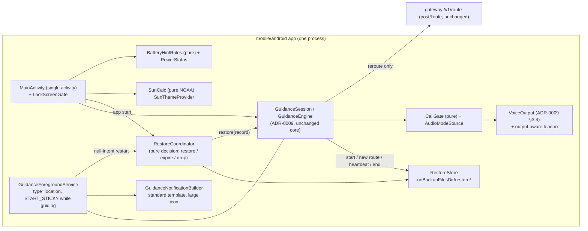

# ADR-0013: Android background guidance. Restore from an app-private record through the unchanged NAV-005 pipeline, sticky service with a per-API-level restart rule, lock-screen gate in the single activity, standard notification template, call gate, on-device NOAA sun theme

- **Status:** accepted (Phase 1, Android). Amends ADR-0009 §9 (service lifecycle, `onTaskRemoved`, notification) and §11 (on-device privacy: one stored-trip exception). Everything else in ADR-0009 stands.
- **Date:** 2026-10-03
- **Stories:** NAV-012 (AC 1–52; design questions B-A1–B-A8). Changes NAV-005 AC 20, the S8 notification content, AC 36, AC 58 and AC 67 on Android, as the NAV-012 Context table lists. Coexists with ADR-0012 (NAV-011, parallel). Informs NAV-015 (iOS).

## Context
NAV-012 makes guidance survive the situations a driver meets every day: screen off, swipe-away, the process being killed (OEM battery savers, crashes, a cold battery), phone calls and Bluetooth car audio. It also adds a richer notification, a lock-screen view and an automatic sunrise/sunset theme. There is **no contract change**: a restore that needs a route sends `postRoute` exactly like a NAV-005 reroute (openapi 0.5.2 unchanged).

Constraints that shape the decisions:
- **Permissions (AC 25, 48).** None of `ACCESS_BACKGROUND_LOCATION`, `READ_PHONE_STATE`, `READ_CALL_LOG`, `BLUETOOTH_CONNECT`, `RECEIVE_BOOT_COMPLETED`, `REQUEST_IGNORE_BATTERY_OPTIMIZATIONS`, `SYSTEM_ALERT_WINDOW`. No Play services (D62).
- **Privacy (NAV-005 AC 67, NAV-012 AC 16–17, 47).** The restore record is the only trip data ever stored, and only while it is needed.
- **Verification (light QA).** Everything that can be a pure function is one, with a fake clock, so it can be JVM-tested. Platform behaviour (keyguard, OEM killers, Bluetooth, calls) goes to the real-device list (AC 52).
- **Coordination.** NAV-011 edits `MainActivity`, `strings.xml`, settings and the guidance service area in parallel. NAV-012 code goes into its own packages, and edits to shared files are small hooks.

Facts checked on 2026-10-03 in this environment:

| # | Fact | Consequence |
|---|---|---|
| G1 | The app already builds every route as raw OSRM bytes → `GuidancePlan` → token rewrite → `createOsrmResponseParser(6u)` → `createNavigationSession(route, config, [])` (`engine/FerrostarNavigation.kt`). The input is plain bytes. ADR-0012 §5.3 feeds a single-route slice into that same path | A stored copy of the bytes that entered the pipeline can be fed back through it after process death with **0** requests (B-A1) |
| G2 | Ferrostar 0.57.0 `NavigationSession.getInitialState(location)` starts at step 0. `advanceToNextStep(state)` is public and is already used by the NAV-005-D1 step catch-up (`engine/StepCatchUp.kt`) | A restored session is placed on the right step by a restore-specific start step, then the existing catch-up, all through public API. No fork, no Ferrostar caching (ADR-0009 F6 stays: no `withCaching`) |
| G3 | The Ferrostar `core-0.57.0.aar` ships consumer R8 rules: `-keep class com.sun.jna.** { *; }`, `-keep class uniffi.ferrostar.** { *; }` and `-dontwarn java.awt.*` (with an upstream "needs validation" note, ferrostar#185) | B-A8 needs no app rules for JNA and UniFFI today. It only needs a minified smoke test before the first distributed build |
| G4 | The current manifest already has `allowBackup="false"`, data-extraction rules excluding every domain for cloud backup and device transfer, and `stopWithTask="false"` on the service. `onTaskRemoved` ends guidance and `onStartCommand` returns `START_NOT_STICKY`. The 5 s refresh re-posts the notification with `force = true` | Backup exclusion is already in place. The swipe-away and Android 14 re-post rules need service changes (§2, §4) |
| G5 | «Автомат» is resolved in `ui/NavRoot.kt` with `isSystemInDarkTheme()`. `ThemeChoice { DAY, NIGHT, AUTO }` is persisted in DataStore | The sun theme replaces one expression behind a provider. No new setting value is needed (Open question 4 (a)) |

## Decision

### 1. Shape

Package suggestions (the names are the mobile engineer's choice; the point is that they are new packages): `background/restore`, `background/battery`, `audio/calls`, `audio/output`, `theme/sun`, `service/notification`, `lockscreen`. Each has a pure part (no Android types, injected clock) and a thin platform adapter.

### 2. B-A2: service lifecycle and restart per API level
**Swipe-away (AC 13–15).** `onTaskRemoved` no longer ends guidance. It does nothing while a session is active. With no session, the service is not running anyway (it stops on end and arrival), so AC 15 holds. `stopWithTask="false"` stays. The NAV-005 test `GuidanceServiceTest.swipeAwayEndsGuidance` is **replaced** by `swipeAwayKeepsGuidance` (QA names it in the handoff, AC 49).

**Return value.** `onStartCommand` returns `START_STICKY` while a session is active and `START_NOT_STICKY` otherwise. The system may then recreate the service after a low-memory kill with a `null` intent. A force-stop, which most OEM killers and "swipe to kill" use, never recreates it. In that case restore happens when the app is opened (AC 18).

**Null-intent restart (AC 22).** On `onStartCommand(intent = null)` with no live session, the service asks `RestoreCoordinator` for a decision on the record (§3.5) and then branches on the API level:

| API level | Location FGS from a background restart | NAV-012 behaviour |
|---|---|---|
| 26–29 | Allowed. The "while-in-use" restriction for services started from the background begins in Android 11 | `startForeground(type = location)` inside `try`. On success: silent resume as AC 19, within 10 s. On any exception: the fallback below |
| 30–33 | Location access is denied to a service started from the background without `ACCESS_BACKGROUND_LOCATION`. API 31+ may also throw `ForegroundServiceStartNotAllowedException` | **Never** try a location FGS. Fallback below |
| 34–36 | `startForeground` with type `location` throws `SecurityException` without while-in-use eligibility | **Never** try. Fallback below |

**Fallback (all levels where the silent resume is not possible).**
1. No `startForeground`. **0** location requests.
2. Within 5 s, a normal notification (not FGS) in channel «Замчлал», id distinct from the ongoing one:
   - title B4 «Замчлал тасарлаа», text B5 «Үргэлжлүүлэхийн тулд дарна уу»;
   - content intent and «Үргэлжлүүлэх» are both **`PendingIntent.getActivity`** to `MainActivity` with an explicit restore action. Android 12+ blocks notification trampolines, so a service or broadcast must not start the activity;
   - «Дуусгах» is a `PendingIntent.getBroadcast` to a non-exported receiver that deletes the record (AC 17) and cancels the notification;
   - `setTimeoutAfter(windowEnd − now)`, so it disappears when the restore window ends;
   - not shown if `POST_NOTIFICATIONS` is denied (AC 7).
3. `stopSelf()`.

The decision table is a pure function `restartAction(sdkInt, recordState, permissions)`, which is unit-tested for every row. The real behaviour on Android 12, 14 and 15+ is a real-device check (AC 52).

**Why no `ACCESS_BACKGROUND_LOCATION`.** On API 30+ it would be the only way to resume silently. It costs a separate permission screen, a Play policy declaration and a privacy cost. The story's Open question 1 recommends (a), and this ADR is built for (a). If the PO chooses (b), only the API 30+ rows of the table change.

**No partial wake lock (no `WAKE_LOCK`).** The location FGS keeps 1 Hz GPS callbacks coming with the screen off, and those wake the engine. The risk is the timer-only paths with the screen off and no fixes arriving (the 10 s GPS-lost timer in a tunnel, reroute back-off). They are covered by the AC 52 "≥ 10 min with the screen off" check, which must include a GPS-loss period. If the timers drift by more than 2 s there, a partial wake lock held only during active guidance is added by an amendment that names `WAKE_LOCK`.

### 3. B-A1 and B-A3: restore record and resuming Ferrostar
**3.1 What is stored (AC 16).** Two files in `Context.noBackupFilesDir/restore/`, each written with `androidx.core.util.AtomicFile`, so a kill during a write leaves the old file or nothing, never a torn file:
- `route.bin` contains the **bytes that entered the guidance pipeline**, before the token rewrite. That is the ADR-0012 §5.3 single-route slice at «Эхлэх», or the raw reroute response body after a new route. Only present under Open question 2 (a).
- `meta.json` (kotlinx-serialization) contains:

  | Field | Content |
  |---|---|
  | `schema` | `1` |
  | `destination` | `{lat, lon, text}`. Coordinates with ≥ 5 decimals (the original destination, as ADR-0009 §4 uses for reroutes), text as shown on the arrival panel |
  | `costing`, `avoidUnpaved`, `language` | The options of the route being followed |
  | `startedAtWallMs`, `heartbeatWallMs` | Session start and heartbeat |
  | `routeSha256` | Hash of `route.bin` (absent under Open question 2 (b)) |
  | `restoresWallMs` | Wall times of earlier restores of this record (loop limit, AC 24) |
  | `routeSource` | `gateway` or `device` (Amendment 5; absent or unknown reads as `gateway`, no schema bump) |

  It holds no origin, no position, no step index, no search text and no request body.

`noBackupFilesDir` is excluded from Auto Backup by the platform. The existing data-extraction rules already exclude every domain for cloud backup and device transfer (G4). Both stay. App-private storage is not readable by other apps. There is no extra encryption: the platform's file-based encryption covers the data at rest, and Keystore-backed encryption adds a failure mode on restore (key loss after an OS update) with little gain for a record that lives at most 30 min after the last heartbeat.

**3.2 When it is written (pure `RestoreWriterPolicy` + IO adapter on `Dispatchers.IO`, never the engine thread).**
- `onStart` («Эхлэх»): `route.bin` then `meta.json`, within 2 s.
- `onNewRoute` (reroute applied, ADR-0009 §4 P11): both files rewritten within 2 s.
- **Heartbeat** every **30 s** of guidance (AC 16 needs ≤ 60 s; 30 s leaves margin for a delayed timer): `meta.json` only. The route file is not rewritten.
- **Normal end** (`GuidanceSession.end()` from «Дуусгах» anywhere, and arrival): the record directory is deleted **before** the service is stopped. The deletion is synchronous; two small file deletes are well under the 2 s of AC 17.
- Heartbeat and window use **wall-clock** time, because `elapsedRealtime` resets on reboot (the cold-battery case). A heartbeat more than 5 min in the future (clock change) is treated as expired.

**3.3 Interrupted-session detection.** A normal end always deletes the record. So **a record present at process start with no live session in this process means an interrupted session.** No extra "clean shutdown" flag is needed.

**3.4 Resuming the navigator (B-A1).** `GuidanceSession.restore(record)`:
1. Read `route.bin`, check `routeSha256`, then run it through the **unchanged** NAV-005 pipeline (G1): plan, rewrite (generation 0 of the new process), parse, `createNavigationSession`. No Ferrostar caching or recorder. A parse failure or a step-count mismatch counts as an unreadable record: silent delete (AC 24) and the map screen.
2. Wait for the **first good fix** (accuracy ≤ 25 m, age ≤ 10 s), at most 10 s. Without one, the NAV-005 GPS-lost state applies (AC 19): guidance active, 0 requests.
3. **Start step.** `RestoreStartStep.choose(fix, steps)` is pure:
   - the candidates are steps whose geometry is within **50 m** of the fix, excluding `arrive`;
   - if the fix has a usable bearing (ADR-0009 §2 gate: speed ≥ 2 m/s, bearing accuracy ≤ 45°), only steps whose local segment bearing is within 60° of it are kept. This handles out-and-back routes;
   - the **earliest** remaining candidate wins, so no manoeuvre is ever skipped by the restore itself.

   Then `getInitialState(fix)` and `advanceToNextStep` *k* times, the same public call the D1 catch-up uses. From then on, the existing `StepCatchUp` and its two-fix gate correct the step as usual.
4. **No candidate** (> 50 m from every remaining step): the session starts an off-route episode immediately, and `ReroutePolicy` sends the reroute with the stored `costing`, options and language and the original destination (NAV-005 section G, AC 19). Offline: NAV-005 AC 50 (AC 20).
5. **Voice.** The `VoiceScheduler` is created in **resume mode**: no depart and no "continue on" prompt. It emits exactly **one** catch-up prompt for the next manoeuvre with the live distance if *d* ≥ 30 m. This reuses the ADR-0009 §3.3 GPS-restore catch-up path. All other schedule rules apply unchanged.
6. `restoresWallMs` gets the current time appended and the record is rewritten. The heartbeat restarts.

Under Open question 2 (b) there is no `route.bin`. Step 3 is skipped, and step 4 always runs (one `postRoute`, network needed). The code supports both through one flag. The working assumption is (a).

**3.5 Restore decision (AC 18, 21, 23, 24). Pure `RestoreCoordinator.decide(record, nowWall, sessionAlive, permissionState)`.** The rules are checked in this order:

| Condition | Outcome |
|---|---|
| no record, or a session is alive | `None` |
| unreadable, unknown `schema`, hash mismatch | `DeleteSilently` |
| `now − heartbeat > 30 min`, or heartbeat in the future by > 5 min | `DeleteSilently` (AC 21) |
| 2 entries of `restoresWallMs` within the last 10 min | `DeleteSilently` (AC 24, third interruption) |
| location permission missing, or location services off | `NeedLocation`. The NAV-005 AC 8–12 flow runs and the record is kept until the window ends (AC 23) |
| otherwise | `Restore` |

It runs on app start (`Application`/`MainActivity` startup, off the main thread, decided within 1 s so that AC 18's 3 s holds) and on the service's null-intent restart (§2). The 30 min window and the loop limit are named constants; changes go through the BA (Open question 5).

**3.6 Privacy checks (AC 17, 47).** The JVM/Robolectric scan from NAV-005 AC 67 runs after a normal end, after expiry and after a loop-limit delete. It must find nothing under `filesDir`, `noBackupFilesDir`, `cacheDir` and DataStore. During guidance it finds data **only** under `noBackupFilesDir/restore/`. The debug log never prints the record, its path contents or its coordinates.

### 4. B-A5: notification
- **Standard `NotificationCompat` template, no custom `RemoteViews`.**
  - small icon: the monochrome arrow (unchanged);
  - **large icon**: the manoeuvre icon (AC 1 a);
  - title: the banner instruction (AC 1 c);
  - text: distance · street (AC 1 b, d);
  - sub-text: «Хүрэх цаг HH:MM» (+ «+{days} өдөр») (AC 1 e);
  - `BigTextStyle` with the same lines for the expanded view;
  - actions «Дуусгах» and the voice toggle (AC 1 f).

  Collapsed, Android shows the large icon, title and text, which covers (a)–(c). UX may reorder the lines inside the standard template in the NAV-012 screen spec. A move to custom views needs an amendment.
- **Large icon rendering.** The same vector drawable as the banner icon, rendered with `Drawable.toBitmap()` at 64 dp × density, tinted for the current theme. The bitmaps are cached in memory by (icon key, night, density), never on disk.
- **Not used now:** `DecoratedCustomViewStyle` (fragile across OEM skins, font scale and dark mode; hard to assert in Robolectric) and the Android 16 `ProgressStyle`/promoted "live update" (another permission for promotion, and no Android 16 test device). This is a follow-up once a real device can verify it.
- **Posting rules (AC 2, 4, 5).** A pure `NotificationPostPolicy(clock)` owns them:
  - post on a state change (manoeuvre, reroute start, new route, GPS lost or restored, arrival) within 1 s;
  - while the distance changes, post at least every 2 s. This replaces the NAV-005 5 s forced refresh;
  - never more than once per second;
  - channel `IMPORTANCE_LOW`, `setOnlyAlertOnce(true)`, `setSilent(true)`, so there is no sound, vibration or heads-up pop-up;
  - **Android 14+ dismissal:** `setDeleteIntent` marks the notification as dismissed. While it is dismissed, the policy posts nothing until the next **instruction change** (new manoeuvre, reroute start, GPS lost, arrival), then posts once and clears the flag. Distance-only updates never re-post a dismissed notification. On API ≤ 33 `setOngoing(true)` keeps it non-dismissable.
- **Actions** use explicit, non-exported `PendingIntent.getService` intents to the service. «Дуусгах» stays as it is. **Voice toggle** goes to `session.setMuted(!muted)` plus DataStore persistence. It does not open the activity, and the label is re-rendered within 1 s. A tap on the notification opens `MainActivity` through `getActivity` (unchanged).
- **Lock screen (AC 12).** `VISIBILITY_PRIVATE` with a `setPublicVersion` whose only text is the title «Замчлал». The system's "hide sensitive content" setting is then respected. The private content never contains the destination or coordinates.
- **Language switch (AC 4).** The channel name is updated with `createNotificationChannel` (same id; Android renames it). The notification is re-posted with the new strings within 2 s. 0 route requests.

### 5. B-A7: lock-screen view in the single activity
- **Mechanism.** `MainActivity` calls `setShowWhenLocked(true)` (API 27+; API 26: `FLAG_SHOW_WHEN_LOCKED` window flag) while guidance is active or the arrival panel is shown. It calls `setShowWhenLocked(false)` within 2 s after guidance ends or the arrival panel closes (AC 11). `setTurnScreenOn` is **never** set (AC 12). No `SYSTEM_ALERT_WINDOW`, no full-screen intent.
- **Why one activity, not a separate lock-screen activity.** AC 8 needs the guidance screen to be on top the moment the screen turns on again, within 1 s. Only the activity that is already in front can provide that without a screen-off hook or a second MapLibre instance (tile reload, memory, a second style load). The engine is application-scoped, so the state is shared either way.
- **`LockScreenGate` (package `lockscreen`) enforces AC 9.**
  - **Forced view:** on every `onStart`/`onResume` with `KeyguardManager.isKeyguardLocked` true and guidance active, the UI state is set to the guidance screen with every sheet and dialog closed, before the first frame. A settings sheet that was open when the phone locked is never shown over the lock screen.
  - **Exit guard:** every action that leaves the guidance screen (settings, back to map, search, the system back gesture through an `OnBackPressedCallback`) goes through `gate.requireUnlocked { … }`. While locked, it calls `KeyguardManager.requestDismissKeyguard(activity, callback)` (API 26+). `onDismissSucceeded` runs the action. `onDismissCancelled` and `onDismissError` do nothing, and the guidance screen stays.
  - **Allowed while locked:** «Байршил руу буцах», the orientation toggle, the voice toggle, «Дуусгах» and the arrival panel's «Хаах».
  - **«Дуусгах» or «Хаах» while locked:** the action runs, then `setShowWhenLocked(false)`, and the keyguard covers the activity again. The map screen is never shown before unlocking. This is a real-device check (AC 52). If a device still shows the map screen for a frame, the fallback is `moveTaskToBack(true)` after clearing the flag.
- **Hooks in shared files.** One call in `MainActivity.onCreate` (`LockScreenGate.attach(this, session)`) and the `requireUnlocked` wrapper around the exit callbacks in `NavRoot`/screens. Both are small, targeted edits that leave NAV-011 lines untouched.
- **Scope note.** If another app is in front when the phone locks, the phone shows its normal lock screen with our notification. The app is not brought forward: that would need a full-screen intent or turning the screen on, which AC 12 forbids.
- **Keep screen on** stays on the guidance view (NAV-005 AC 18). **Volume keys (AC 34):** `volumeControlStream = AudioManager.STREAM_MUSIC` while the guidance screen is visible. `USAGE_ASSISTANCE_NAVIGATION_GUIDANCE` plays on the music stream on Android.

### 6. B-A4: calls, audio focus and Bluetooth output
**6.1 Call detection without phone-state permissions (AC 35).** `AudioModeSource` emits the `AudioManager` mode:
- **API 31+:** `addOnModeChangedListener(executor, listener)`, plus one read at subscription.
- **API 26–30:** `audioManager.mode` is polled on the engine's existing 1 s ticker, and every **250 ms** while a prompt is playing. That meets AC 36's 500 ms.

A **call is in progress** while the mode is `MODE_IN_CALL`, `MODE_IN_COMMUNICATION`, `MODE_RINGTONE` or `MODE_CALL_SCREENING` (API 30+), or while the app's audio focus is lost transiently (`AUDIOFOCUS_LOSS_TRANSIENT`, not `…_CAN_DUCK`). The API 33 redirect modes `MODE_CALL_REDIRECT` and `MODE_COMMUNICATION_REDIRECT` count as well; they are call states by definition (BA note below). Only `NORMAL` is not a call.

**6.2 Pure `CallGate` (fake mode source, fake clock; AC 36–38).**
- **Call starts while a prompt plays:** the speaker is stopped (`TextToSpeech.stop()` / `AudioTrack.stop()`) within 500 ms, and focus is abandoned within 1 s.
- **During a call:** every voice trigger is **skipped, not queued**. If it is a manoeuvre prompt for the current next manoeuvre, the gate records `skipped = (generation, manoeuvreIndex)`. Off-route, GPS and arrival prompts are skipped without a record. Muted prompts are "handled" (ADR-0009 §3.3) and never recorded.
- **Call end** = the mode is `NORMAL` and focus is not transiently lost for **1 s** without interruption. This debounce lets two calls back to back produce one catch-up.
- **At call end:** if `skipped` matches the **current** next manoeuvre (same generation and index), there is a good fix, no off-route episode, GPS is not lost and *d* ≥ 30 m, then exactly one catch-up prompt is played through the normal playback queue, with the live distance (AC 32 text or the chime). The gate then suppresses a regular trigger for that manoeuvre for **5 s**. `skipped` is cleared in every case.
- Banner, notification, off-route detection, reroute and GPS-loss handling never consult the gate.

**6.3 Audio focus (AC 39).** Unchanged from ADR-0009 §3.4: `AUDIOFOCUS_GAIN_TRANSIENT_MAY_DUCK` per prompt and abandon within 1 s. A denied request still skips the prompt (NAV-005 AC 36). It counts as a call skip only if the mode is a call mode at that moment.

**6.4 Output routing (AC 31–33).**
- The app never selects a device. No `setCommunicationDevice`, no `startBluetoothSco`, no `BLUETOOTH_CONNECT`.
- `AudioOutputMonitor` uses `AudioManager.registerAudioDeviceCallback` and `getDevices(GET_DEVICES_OUTPUTS)` (no permission needed for device types) to know whether the current media output is Bluetooth: `TYPE_BLUETOOTH_A2DP`, and from API 31 `TYPE_BLE_HEADSET`/`TYPE_BLE_SPEAKER`. On API 33+, `getAudioDevicesForAttributes(navigationAttrs)` is preferred.
- **Lead-in (AC 33).** With a Bluetooth output, each prompt starts with **300 ms** of silence (constant, ≤ 500 ms): `TextToSpeech.playSilentUtterance` before the utterance, or prepended PCM silence for the chime. The focus request comes first, so ducking starts during the lead-in. The value is tuned on the real device (AC 52) and recorded in the README.
- **`ACTION_AUDIO_BECOMING_NOISY`** (registered only during guidance): the current prompt is stopped within 1 s and **not** re-queued. Voice keeps its mute state (AC 32). Stopping, not finishing, avoids continuing a half-spoken prompt on the phone speaker without warning. AC 32 allows either.

### 7. B-A6: sunrise/sunset theme
- **`SunCalc`** is pure Kotlin. It implements the **NOAA solar calculator algorithm**: Julian century, geometric mean longitude and anomaly, equation of centre, apparent longitude, corrected obliquity, declination, equation of time, and the hour angle for a solar zenith of 90.833° (−0.833° altitude). About 100 lines, no dependency, all in **UTC**. It provides:
  - `sunTimes(dateUtc, lat, lon): SunTimes?`. Sunrise and sunset instants for AC 40. `PolarDay`/`PolarNight` when the hour-angle cosine is outside [−1, 1]. It never throws (AC 44);
  - `elevationDeg(instant, lat, lon)`.
- **Day/night rule:** `isDay = elevationDeg(now, pos) > −0.833°`. This equals "between sunrise and sunset" and also covers polar days without special cases (AC 44).
- **`SunThemeProvider`** (fake clock, fake position source):
  - **Position** (AC 41): the latest fix of this session from memory. Otherwise `LocationManager.getLastKnownLocation` over the GPS, network and (API 31+) fused providers, only if a location permission is held and the fix is ≤ 24 h old, read and never stored. Otherwise P1;
  - **Evaluation:** at start and resume (≤ 1 s), and every **30 s** while the app is in the foreground. The next crossing time is not scheduled; polling every 30 s meets the 60 s of AC 42 with no alarm;
  - **Hysteresis:** at most one change per rolling 10 min (AC 42). A change that is due inside the hold-off is applied when the hold-off ends;
  - **Network:** 0 requests.
- **Wiring.** `NavRoot`'s `ThemeChoice.AUTO -> isSystemInDarkTheme()` becomes `ThemeChoice.AUTO -> sunTheme.isNight` (G5). DAY and NIGHT are unchanged (AC 43). The theme change follows the existing NAV-005 path (`setStyle` and re-adding layers; the engine is untouched, AC 59).
- **Rejected:** `commons-suncalc` (Apache-2.0, accurate). It is acceptable by licence, but it is a dependency to pin and audit for a function this small. If the NOAA fixture (AC 40) cannot be met within ±2 min, swapping it in is allowed without an amendment.

### 8. Battery-saver hint (AC 26–30)
- `PowerStatus` wraps `PowerManager.isIgnoringBatteryOptimizations(packageName)`. It is re-read on `ON_RESUME`, so the hint disappears within 2 s after the user returns with the exemption granted (AC 27).
- `BatteryHintRules` is pure. Inputs: restricted?, screen (route preview only), guidance active?, over the lock screen?, `dismissedAtWallMs` (30-day rule), `pendingAfterRestore` (one showing after a restore, AC 26). Both persisted values go into the existing settings DataStore. They are UI state, not trip data.
- **«Тохиргоо нээх»:** `Settings.ACTION_IGNORE_BATTERY_OPTIMIZATION_SETTINGS`. If no activity resolves it, `Settings.ACTION_APPLICATION_DETAILS_SETTINGS` with `package:` URI. **No** `REQUEST_IGNORE_BATTERY_OPTIMIZATIONS` (Open question 3 (a)).
- OEM-specific steps go only into `mobile/android/README.md` (AC 29). No OEM intents (autostart managers) are fired from code. They are undocumented, change between ROM versions and some need permissions.

### 9. Manifest delta (AC 25, 48)
- **Added:** a non-exported `<receiver>` for the B4 «Дуусгах» action. **No new `<uses-permission>`.**
- **Changed:** `onTaskRemoved` and the `START_STICKY` behaviour (code only).
- **Asserted absent:** add `tools:node="remove"` lines, as for `ACCESS_BACKGROUND_LOCATION` today, for `READ_PHONE_STATE`, `READ_CALL_LOG`, `BLUETOOTH_CONNECT`, `RECEIVE_BOOT_COMPLETED`, `REQUEST_IGNORE_BATTERY_OPTIMIZATIONS`, `SYSTEM_ALERT_WINDOW` and `WAKE_LOCK`. This stops a library from merging them in. The merged-manifest scan (AC 48) checks the result. If the §2 measurement later justifies `WAKE_LOCK`, that `remove` line goes with the amendment.

### 10. B-A8: R8 keep rules. Not tied to NAV-012
Release builds stay unminified (ADR-0009 Amendment 1). The Ferrostar AAR already ships keep rules for JNA and `uniffi.ferrostar` (G3). The app implements no UniFFI callback interface (ADR-0009 §1: no `FerrostarCore`, no location-provider callback into Rust), so it needs **no** app-level rule for them today. Turning on minification becomes a separate **tech-debt item through triage**, done before any release build is distributed (D17/D91 gate):
- `isMinifyEnabled = true` plus the AAR consumer rules;
- one instrumented smoke test on a device that runs a short replay on the minified APK, which the "needs validation" note in ferrostar#185 asks for;
- kotlinx-serialization rules for the app's `@Serializable` models if R8 reports them.

This matches the story's Open question 7 (a).

### 11. Test seams (light QA, AC 51)
Pure, JVM-tested with fake clocks:
- `RestoreCoordinator`, `RestoreWriterPolicy` (temp dir), `RestoreStartStep`, `restartAction` (every API row);
- `NotificationPostPolicy` (state, 2 s, 1/s, Android 14 dismissal);
- `CallGate` (fake mode source), `BatteryHintRules`, `SunCalc` (NOAA fixture: 4 points × 4 dates, polar cases), `SunThemeProvider` (hysteresis).

Robolectric:
- the service (`onTaskRemoved` keeps the session; a null-intent restart at SDK 28 resumes, at SDK 34 posts B4 and stops);
- notification content and actions (SDK 34 for the delete intent);
- `LockScreenGate` flags and the forced view;
- `volumeControlStream`;
- the manifest scan;
- the privacy scan after an interruption and a restore with the real host Ferrostar (ADR-0009 §10). The restore replay goes through `createOsrmResponseParser` and `createNavigationSession` from stored bytes, so B-A1 (0 requests on the route) is verified on the JVM.

Real-device only (AC 52): keyguard behaviour, OEM killers, the actual sticky restart, Bluetooth, calls, ducking, a real sunset.

## Alternatives considered
| Option | Pros | Cons |
|---|---|---|
| **Restore (chosen):** store the pipeline input bytes and re-run the NAV-005 pipeline; start step chosen from geometry | 0 requests on the route, works offline (AC 20); no Ferrostar internals; one code path with the normal start | The response is stored on the device (Open question 2); a start-step rule to test |
| Ferrostar session caching (`withCaching`) | Upstream feature | Stores trip state in Ferrostar's own format and location, outside our deletion and scan rules; ADR-0009 F6 rejected it for AC 67; its behaviour across app updates is unknown |
| Store a step index or the last position for the restart | Exact progress | Position data in storage, against AC 16 "only"; geometry from the first good fix gives the same result |
| Store only destination and options (Open question 2 (b)) | Less data on the device | Every restore needs the network, and countryside drivers often have none. Supported by a flag |
| Record in DataStore / Room | Familiar | DataStore is limited to settings (ADR-0009 §11); Room is a heavier dependency; route bytes of about 0.1–2 MB do not belong in a preferences file |
| **Restart (chosen):** `START_STICKY`, silent resume only on API 26–29, notification fallback elsewhere | No new permission; matches each platform rule | No silent resume on API 30+ |
| `ACCESS_BACKGROUND_LOCATION` for a silent restart | Resume without user action on all levels | Extra permission screen, Play declaration, privacy cost (Open question 1) |
| `RECEIVE_BOOT_COMPLETED` | Restore after a reboot | Excluded by AC 25; on API 30+ a location FGS started from boot has no while-in-use location access anyway |
| **Lock screen (chosen):** `setShowWhenLocked` on the single activity + `LockScreenGate` | Instant wake (AC 8); one map instance; small hooks | Every exit path must go through the gate (tested) |
| Separate lock-screen activity | Other screens structurally unreachable | No reliable way to be on top at wake without screen-off hooks; second MapLibre instance |
| **Notification (chosen):** standard template + large icon | Robust across OEM skins, font scale and dark mode; Robolectric-checkable | Less layout control |
| `DecoratedCustomViewStyle` / Android 16 `ProgressStyle` | Richer layout or progress bar | Fragile or new permission, unverifiable now |
| **Calls (chosen):** audio mode + transient focus loss | No phone permissions; covers VoIP | Polling on API 26–30; VoIP apps that do not set the mode are only caught through focus (real-device check, R7) |
| `READ_PHONE_STATE` + `TelephonyCallback` | Exact cellular call state | Forbidden permission; misses VoIP anyway |
| **Sun (chosen):** own NOAA port | No dependency, small | Our code to test (fixture) |
| `commons-suncalc` (Apache-2.0) | Mature | Dependency for about 100 lines; allowed as a swap-in |
| Partial wake lock during guidance | Timers exact with the screen off | Permission and battery or vitals cost without a measured need; deferred to the §2 measurement |

## Consequences
- **Easier:**
  - The restore reuses the NAV-005 pipeline and public Ferrostar API, so a Ferrostar upgrade re-checks only `getInitialState` and `advanceToNextStep` (already in ADR-0009's upgrade checklist).
  - Every timing and decision rule is pure and fake-clock tested.
  - No contract or backend work.
- **Harder:**
  - One stored-trip exception to NAV-005 AC 67, guarded by write and delete rules and a scan.
  - Silent restart only on API 26–29. Newer phones need a tap (the B4 notification, or opening the app).
  - The lock-screen gate must cover every new exit path. Future screens must use `requireUnlocked` (reviewer check).
- **Changes to ADR-0009:**
  - §9: `onTaskRemoved` no longer ends guidance; `START_STICKY` while guiding; notification refresh at 2 s; voice action.
  - §11: the restore record is the one storage exception; manifest `remove` lines extended.
- **Not verifiable in this container:** listed in NAV-012 AC 52. Additionally the timer behaviour with the screen off and no fixes (§2 wake-lock decision), and whether the system actually recreates the sticky service on each tested phone.
- **Follow-ups:**
  - the R8 tech-debt item (§10, through triage);
  - the Android 16 progress-style notification once a device exists;
  - NAV-015 (iOS) mirrors §3 (record and start step) and §6.2 (`CallGate`) with platform equivalents;
  - travelled-route trimming and manoeuvre arrows stay outside NAV-012 (story Open question 7).

## Amendments

### Amendment 1 (2026-10-03, NAV-012 integration review): as-built deviations accepted, arrival over the lock screen clarified
The integration review compared the built Android client (`mobile/android`, NAV-012 packages) with this ADR. The deviations the mobile engineer reported are **accepted**. One mechanism is added, because the build does not meet AC 10 and AC 11 yet.

**Accepted deviations**
| # | ADR text | As built | Decision |
|---|---|---|---|
| D1 | §8: the hint state goes into the existing settings DataStore | Separate DataStore file `navmn_hints` (`battery_hint_dismissed_at`, `battery_hint_after_restore`) | Accepted. It is UI state, not trip data. It lives under `files/datastore`, which `allowBackup="false"` and the data-extraction rules (domain `file`) already exclude from backup and transfer. `Settings.kt` stays untouched (NAV-005/NAV-011 shared file) |
| D2 | §6.4: `ACTION_AUDIO_BECOMING_NOISY` receiver, export state not specified | Dynamic receiver registered with `ContextCompat.RECEIVER_EXPORTED` | Accepted. `android.media.AUDIO_BECOMING_NOISY` is a protected broadcast that only the system can send. On API < 33, androidx's not-exported path adds a sender permission that blocked delivery under Robolectric. The receiver only stops the current prompt and reads nothing from the intent |
| D3 | §6.1: API 26–30 poll every 1 s, 250 ms only while a prompt plays | Listener on API 31+; on API 26–30 `AudioManager.mode` polled every 250 ms for the whole guidance session | Accepted. One cheap binder read four times a second, only while guidance runs. The AC 52 battery-per-hour measurement re-checks it. If it shows up there, go back to the §6.1 split |
| D4 | §3.5: decided within 1 s at app start | The decision and the route parse run off the main thread on every `onResume`. The map screen can show for about 0.2 s before the restored guidance screen | Accepted. AC 18's 3 s budget holds. The real-device list measures the time from opening the app to the restored screen |
| D5 | §4: title = instruction, text = distance · street | Title = distance, text = instruction, BigText adds the street, sub-text = «Хүрэх цаг» (NAV-012 screen spec N1) | Accepted. §4 allowed UX to reorder lines inside the standard template. No custom views are used |

**Clarification: arrival over the lock screen (AC 10, AC 11; B-A7).** §5 says the flag stays set "while guidance is active or the arrival panel is shown". AC 10 limits the arrival case: the panel stays over the lock screen **until «Хаах» or until the screen turns off**, and the phone's lock screen follows. Mechanism:
- `LockScreenGate` gets one more input: "arrival seen with the screen off". When `onStop` runs (the screen turned off or the app was left) while the phase is `ARRIVED` and the keyguard is locked or the display is not interactive, the gate calls `setShowWhenLocked(false)` and does not set it again for this session.
- The engine and the arrival panel stay as they are. After unlocking, the user still sees the arrival panel and «Хаах» ends the session as before. Nothing is ended automatically, there are 0 route requests, and the screen is never turned on.
- `LockScreenPolicy` stays pure: `showWhenLocked(state, arrivalScreenOffSeen)`. Robolectric test: ARRIVED, then `onStop` with the keyguard locked, means the flag is false. The rest goes to the real-device list (AC 52).

**Clarification: the stored route contains its start point (AC 16, story Open question 2).** `route.bin` is the route response as received (§3.1). Its geometry and its first waypoint begin at the position where the route was requested: the origin at «Эхлэх», or the reroute position after a reroute. This ADR does not strip it, because the geometry is needed for the offline restore (B-A1), and removing only `waypoints[0]` would not hide the start. AC 16's "no origin" is read as **no separate origin field**. The BA confirms or rewords AC 16 (non-blocking). The deletion rules (§3.2, §3.5) and the privacy scan (§3.6) are unchanged.

### Amendment 2 (2026-10-03, NAV-012 integration review, QA D1 / TC-D07): start step without a usable bearing
**Problem.** §3.4 step 3 picks the **earliest** candidate within 50 m when the first good fix has no usable bearing. On a route that passes close to itself (divided avenue with a U-turn, the normal way to turn around in Ulaanbaatar), a driver who reopens the app while standing still on the return side gets the outbound step. The restore then repeats the U-turn already made, and the session never reaches arrival: Ferrostar stays snapped to the outbound step about 22 m away, and `StepCatchUp` only moves forward from a step it already accepts. QA's TC-D07 (`QaNav012Test.tcD07_g10RestoreStandingOnTheReturnCarriageway`) reproduces this. AC 19 needs the decision within 3 s of the first good fix, so it cannot wait until the car moves.

**Decision.** §3.4 step 3 becomes:
1. Candidates: steps whose geometry is within **50 m** of the fix, excluding `arrive` (unchanged).
2. If the fix has a usable bearing (ADR-0009 §2 gate), keep only candidates with a segment within 50 m whose direction is within **60°** of it (unchanged).
3. **New: nearest with a tie margin.** Let *dmin* be the smallest distance from the fix to any remaining candidate's geometry, and *m* = max(**10 m**, fix horizontal accuracy). Keep only the candidates with distance ≤ *dmin* + *m*. The **earliest** of these wins. At a step boundary, consecutive steps tie, so the earlier one wins and no manoeuvre is skipped. Opposite carriageways or parallel streets further apart than the margin go to the nearer geometry.
4. **New: one bearing re-check.** If the start step was chosen **without** a usable bearing, the first fix with a usable bearing within **30 s** of the restore start runs `choose` again with that bearing. If the result differs from the current step, the session re-anchors to that step: forward by `advanceToNextStep`, backward by rebuilding the navigator from the stored `route.bin` through the same pipeline as step 1 (0 route requests). If the next manoeuvre changes, the resume-mode catch-up prompt plays once for the new one (only if *d* ≥ 30 m; it does not count against the AC 19 "one prompt within 3 s" window, which has passed by then). The check runs once and then stops. After that only `StepCatchUp` and the NAV-005 off-route rules apply.

The change stays inside `RestoreStartStep` (pure; signature becomes `choose(position, bearingDeg, accuracyM, steps)`) and the restore path in `GuidanceCore`/`GuidanceSession` (the re-check). No new string, no new permission, no API change. The record still stores no step index or position (AC 16).

**Accepted residual risk.** If GPS error is larger than the margin and points at a later parallel step, a manoeuvre can be skipped until step 4 corrects it. With a usable bearing, step 2 already handles opposite directions. Same-direction parallel streets within 50 m that the route uses at two different times are rare, and are left to `StepCatchUp` and the off-route rules.

**Tests (mobile-engineer; QA re-runs).**
- `QaNav012Test.tcD07_g10RestoreStandingOnTheReturnCarriageway` must pass **unchanged** (start step 1, one prompt within 3 s, no U-turn prompt, 0 requests, one arrival). `tcD08` and `Nav012ReplayTest` must stay green.
- `RestoreStartStepTest`: adapt `usableBearingSelectsTheDirectionOnOutAndBackRoutes` (no bearing on the return line → return step; no bearing at the exact midpoint between the two lines → earliest). Add: a step-boundary tie → the earlier step; accuracy 20 m widens the margin → earliest among the widened set; the bearing re-check moves forward and, in a constructed case, backward with 0 requests and at most one extra prompt.

### Amendment 3 (2026-10-03, NAV-012 integration review, round 2): Amendment 2 as built; arrival while the screen is already off (QA D3)
**Amendment 2 step 4 as built: accepted.** Two readings in `GuidanceCore.recheckRestoreDirection` replace the Amendment 2 wording:
1. The 30 s window starts at the **start-step decision** (the first good fix), not at the restore start. A slow first fix must not shorten the window.
2. The session re-anchors only when the current step is **not among the tied best candidates** (`RestoreStartStep.candidates`), not whenever `choose` returns a different index. Otherwise normal progress across a step boundary inside the window would send guidance back one step.

Everything else in Amendment 2 is unchanged (once only; dropped on window end, an off-route episode or a new route; 0 route requests; at most one catch-up prompt, only if *d* ≥ 30 m).

**Arrival while the screen is already off (AC 11, QA D3 / TC-L02).** Amendment 1 sets the latch only in `onStop` while the phase is `ARRIVED`. When the driver lets the screen turn off during guidance (the normal case, AC 13), `onStop` has already run during `NAVIGATING`, so the later `ARRIVED` never sets the latch. The arrival panel, with the destination text, then shows over the lock screen on every wake until «Хаах», and `ARRIVED` never ends by itself. AC 11 lists "arrived" as a state in which the app must never show over the lock screen. AC 10 allows it only while the panel is being shown with the screen on.

Mechanism (an addition to Amendment 1):
- `LockScreenGate.onGuidanceState`: when the state is `ARRIVED` and the arrival panel **cannot currently be seen** (the activity is not at least `STARTED`, or the display is not interactive), set the same `arrivalScreenOffSeen` latch at once and clear the show-over-lock flag. Do **not** move the task to the back: after unlocking, the user still sees the arrival panel and «Хаах» ends the session as before.
- When the activity is started and the display is interactive (locked or not), nothing changes: AC 10 keeps the panel over the lock screen until «Хаах» or the screen turns off (the `onStop` path from Amendment 1).
- `LockScreenPolicy` stays pure. Add `arrivalUnseen(state, activityStarted, interactive)` = `ARRIVED && (!activityStarted || !interactive)`. The gate reads `activityStarted` from the activity's lifecycle (`Lifecycle.State.STARTED`). No new permission, no string, nothing ended automatically, the screen is never turned on, 0 route requests.
- The latch resets as before, when the session ends or a new session starts guiding.

**Tests.** `QaNav012LockScreenTest.tcL02_arrivalWhileScreenOffIsNotShownOverLockScreenOnWake` must pass **unchanged**. `tcL01`, `Nav012AndroidTest.arrivalStopsShowingOverLockScreenAfterScreenOff`, `.arrivalScreenOffWithoutKeyguardClearsFlag` and `.lockScreenPolicyArrivalLatch` stay green. Add a pure `LockScreenPolicy.arrivalUnseen` table test. Real device (AC 52): drive with the screen off until arrival, then wake: expect the phone's own lock screen, and the arrival panel after unlocking.

### Amendment 4 (2026-10-04, D123): R8 keep rules stay an architect item (open)
The PO decided (D123, "All as recommended", item 14) that the **R8 keep rules (B-A8) stay an architect technical item, done before any release build is distributed**. This replaces the "tech-debt item through triage" wording of §10 and of the Consequences follow-up list; the content of §10 is unchanged. Travelled-route trimming and manoeuvre arrows are a separate draft item through triage (D123), not part of NAV-012 and not part of this item.

**Open item (architect), not started.** Before the first distributed release build:
- enable `isMinifyEnabled = true` with the Ferrostar AAR consumer rules (G3), plus kotlinx-serialization rules for the app's `@Serializable` models if R8 reports them;
- run the **minified smoke test**: one instrumented test on a device that runs a short replay on the minified APK (the "needs validation" note in ferrostar#185);
- record the result here as an amendment. Implementation goes to the mobile-engineer (`mobile/android`) through the architect's handoff; the gate itself (D17/D91) is unchanged. Until then release builds stay unminified (ADR-0009 Amendment 1).

### Amendment 5 (2026-10-06, NAV-012 change 7c, AC 16 / 53–55): route source in the restore record
Requested by the business-analyst and the mobile-engineer; accepted as built in `RestoreRecord.kt` / `RestoreManager.kt`.

- **§3.1 `meta.json` gains one field**, `routeSource`: `"gateway"` or `"device"`. It is `ParsedRoute.onDevice` of the route being followed, written at «Эхлэх» (`onStart`) and rewritten with every new route (`onNewRoute`, AC 54), so it always describes the bytes in `route.bin`. It is a technical flag, not trip data: §3.1's "no origin, no position, no step index, no search text, no request body" still holds, and the §3.6 privacy scan is unchanged.
- **No schema bump.** `schema` stays `1`. A record without the field (written by an earlier build) or with any value other than `"device"` reads as `"gateway"` and restores normally; it is **not** deleted. This is the only exception to "unknown content makes the record unreadable": a missing optional field is not unknown content. A record written by this build and read by an older build (downgrade) contains an unknown field and is deleted silently under the existing AC 24 rule; that is acceptable for a record that lives at most 30 min.
- **§3.4 step 1:** after the unchanged parse, a record marked `"device"` is restored as an on-device route (`asOnDevice()`), so OF24 shows again once trip progress shows (NAV-005 AC 85). The restore skeleton and the notification show no OF24 (D203).
- **Reroute after a restore** follows ADR-0017 / NAV-021 unchanged: without a validated network and with a usable routing file it is answered on the device (0 HTTP requests); with no routing file AC 20 applies as before. The route source of the restored route does not choose the reroute engine; only the network state and the installed files do.
