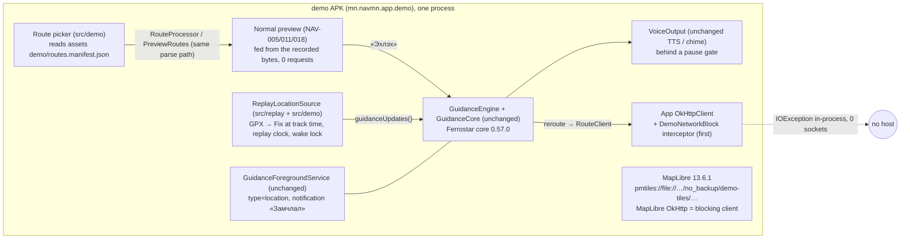

# ADR-0016: Android demo build. Separate `demo` build type, a simulated `LocationSource` that replays the recorded tracks into the unchanged guidance engine, an in-process network block, and bundled PMTiles copied to app storage and opened as `pmtiles://file://`

- **Status:** accepted for the technical design (NAV-019, Android `demo` build type only). Parts marked **[OQ n]** implement a NAV-019 proposed default (orchestrator R1–R7, **PO to confirm**, story Open questions 1–8). If the PO decides differently, the part changes by amendment. No part of this ADR is a PO decision.
- **Date:** 2026-10-04
- **Stories:** NAV-019 (design questions DM-1 to DM-6; AC 1–5, 9–17, 22–25, 26–37, 40–42). Follows ADR-0009 (Android guidance client), ADR-0013 (background guidance, restore, lock screen), ADR-0015 (preview points, turn list) and ADR-0011 (web demo mode, the reference for the route set and the golden parity). Normal `debug` and `release` builds keep their behaviour.

## Context
The PO has an Android phone, and no backend host is reachable from it (NAV-008). D154 approves a demo build of the **real** Android app. It replays the three recorded Ulaanbaatar routes of NAV-017 through the **real** NAV-005 guidance path and keeps the real TTS or chime, the foreground notification, the lock screen and the background behaviour. Only two things differ: the location source is simulated, and there is no network. The story leaves six technical questions to the architect (DM-1 to DM-6).

**Facts checked on 2026-10-04.** Sources: the repo at commit `48d70b8`, MapLibre Native sources at tag `android-v13.6.1` and `main`, the MapLibre Android changelog, Maven Central metadata through Google's mirror, and the Android developer documentation.

| # | Fact | Consequence |
|---|---|---|
| F1 | MapLibre Android **13.6.1** (on Maven Central since 2026-09-08; the top entry of the Android changelog). Its `AssetManagerFileSource` (`platform/android/MapLibreAndroid/src/cpp/asset_manager_file_source.cpp`) opens assets with `AASSET_MODE_BUFFER` and always returns the **whole file**. It ignores `Resource::dataRange`. Upstream issue #4360 ("does not support byte-range reads") documents that `pmtiles://asset://…` therefore fails. PR #4602 fixes it with `AASSET_MODE_RANDOM` and `AAsset_seek64`. It was merged on **2026-09-24**, after 13.6.1, and is in no Android release yet | `pmtiles://asset://` **does not work** with the pinned 13.6.1 |
| F2 | At the same tag, `LocalFileSource` honours `resource.dataRange` for `file://` URLs. `PMTilesFileSource` fetches through the `ResourceLoader` file source, which dispatches by scheme. PMTiles support exists since Android 11.8.0 (#2882). The issue #4360 workaround is "move the archive to device storage and use `pmtiles://file://<absolute path>`" | The demo copies the archive once to app storage and uses `pmtiles://file://` (§9) |
| F3 | At the same tag, `org.maplibre.android.module.http.HttpRequestUtil.setOkHttpClient(Call.Factory)` exists | The demo can give MapLibre an HTTP client that refuses every request (§7) |
| F4 | Android FGS type `location`, runtime prerequisites (developer.android.com, foreground service types): "The user must have **enabled location services** and the app must be granted at least one of `ACCESS_COARSE_LOCATION`, `ACCESS_FINE_LOCATION`." `GuidanceForegroundService.startForegroundNow()` passes `FOREGROUND_SERVICE_TYPE_LOCATION` explicitly on API 29+ and checks the location permission on restart | This confirms the BA finding (story R3): R6 as written ("no location permission") cannot use the production service type on Android 14+ |
| F5 | As-built seams. `LocationSource` (implemented by `PlatformLocationSource`) is bound in `di/PlatformModule`. `GuidanceEngine` hard-codes `clock = SystemClocks`, while `GuidanceCore` takes a `Clock`. «Хүрэх цаг» = `Progress.etaBaseWallMs` (set at each snapshot) + remaining duration. `RouteClient`, `SearchClient` and `ReverseClient` are concrete classes, and all three use the **one** `OkHttpClient` from `di/AppModule`. `PointRules.canStart` is false for a chosen start (D147). `GuidanceSession.start` writes the NAV-012 restore record. `PlatformLockFixSource` registers a GPS listener while the user types. `SunTheme` reads the platform last-known location | These are the places where the demo must plug in (§3) |
| F6 | `SearchClient.url` and `ReverseClient.url` call `toHttpUrl()` on `baseUrl + PATH`. An empty base URL throws `IllegalArgumentException` **before** any interceptor runs | The demo needs a syntactically valid base URL that is never used for traffic (§7) |
| F7 | With the screen off, a foreground service alone does not keep the CPU awake. In production, GNSS delivery wakes the CPU every second. A coroutine `delay` has no such wake-up, and its executor clock (monotonic, not `elapsedRealtime`) stops during suspend. The main manifest removes `WAKE_LOCK` (ADR-0013 §9) | Without a wake lock, a screen-off replay would stall (AC 16). The demo holds a partial wake lock while the replay runs (§4.5) |
| F8 | The voice golden (`tests/gpx/nav005/golden/voice-golden.tsv`) is produced by `QaRun` (virtual clock, real Ferrostar, `GuidanceCore`) from `QaGpx.fixes`. Accuracy is `nav:acc` (default 5 m), bearing is `nav:course` with 10° bearing accuracy, speed is `nav:speed`, and the time is `<time>` − first `<time>` | The demo must build **identical** `Fix` values from the same GPX bytes, so AC 14 holds by construction (§4.2) |
| F9 | Tracks G1, G5 and G8 lie within lon 106.900–106.962, lat 47.886–47.931 | Input for the recommended UB-area tile extract **[OQ3]** (§8.3) |

## Decision

### 1. Shape

Only the location source, the engine clock and the HTTP layer are replaced. Ferrostar's `NavigationSession`, the ADR-0009 snapping, catch-up and arrival rules, `VoiceScheduler`, the playback queue, `VoiceOutput`, the service, the notification and the lock-screen gate all run **unchanged**.

### 2. Build type `demo`, signing, source sets (DM-4) [OQ1]
- **A third build type `demo`, not a product flavor.** A flavor would double every variant and rename every existing task (`testFullDebugUnitTest`, …) that the README, QA and AC 42 rely on.
- Gradle (`mobile/android/app/build.gradle.kts`), as a sketch:
  ```kotlin
  create("demo") {
      initWith(getByName("release"))            // not debuggable, not minified (story R12; ADR-0013 B-A8 still open)
      applicationIdSuffix = ".demo"
      versionNameSuffix = "-demo"
      signingConfig = signingConfigs.getByName("debug") // local ~/.android/debug.keystore, nothing committed
      isDebuggable = false
      isMinifyEnabled = false
      // Syntactically valid, never used for traffic (§7, F6). Loopback is allowed by D35 / AC 41.
      buildConfigField("String", "GATEWAY_BASE_URL", quoted("https://127.0.0.1:9"))
      buildConfigField("boolean", "DEBUG_LOGS", "false")
      buildConfigField("String", "DEMO_TILES_URL", quoted(demoTilesUrl ?: ""))
  }
  ```
  `nav.gatewayBaseUrl` is **ignored** for `demo`, so a developer's local gateway URL can never be baked into the APK the PO receives. `checkReleaseGatewayUrl` stays bound to `preReleaseBuild` only.
- **Launcher and notification label (AC 1, 27).** `src/demo/res/values/strings.xml` defines `demo_mode` = «Туршилтын горим» (W1), and `values-en` defines "Demo mode". `src/demo/AndroidManifest.xml` sets `android:label="@string/demo_mode"` on `<application>` with `tools:replace="android:label"`. The in-app `app_name` is not overridden. The same key serves the badge and the picker heading (no new term).
- **Source sets.**

  | Directory | Contents | Compiled into |
  |---|---|---|
  | `src/main` | today's app, plus the small generic seam of §3 (package `mn.navmn.app.variant`, **no** demo logic and no demo names) | every variant |
  | `src/replay/java` | **pure Kotlin** replay core, package `mn.navmn.app.demo.replay`: GPX parser, `ReplayClock`, `ReplaySchedule`, `DemoNetworkBlock`, the demo manifest reader. No Android types, **no Hilt modules**, no `BuildConfig` | the `demo` source set **and** the `testDebug` source set (`android.sourceSets["demo"].java.srcDir(...)`, `android.sourceSets["testDebug"].java.srcDir(...)`) |
  | `src/demo` | Android and Hilt parts, package `mn.navmn.app.demo`: the `ReplayVariant` binding, the location source wrapper with the wake lock, the tile preparer, the picker and pause UI, resources, the manifest overlay | `demo` only |

  Because `src/replay` is also on the `testDebug` classpath, the replay, golden, pause, arrival, off-route and network-block tests run in the existing `./gradlew :app:testDebugUnitTest -Pnav.hostFerrostar=required`, as AC 42 requires. A Hilt module in `src/replay` would leak into every Robolectric test, hence the rule. `testDemoUnitTest` is **not** part of the quick check: it would need the tile property, and it would run the whole `src/test` suite against the demo bindings.
- **Exclusion from normal builds (AC 5).** Normal APKs contain 0 classes under `mn.navmn.app.demo`, 0 `demo/` assets, 0 `.gpx` and 0 `.pmtiles`. The `variant` seam package is generic and does not count as demo code. The quick check inspects this with `unzip -l` and `dexdump`/`apkanalyzer`.

### 3. The main-code seam: one optional binding `ReplayVariant`
Hilt cannot replace a module outside tests. So `src/main` declares an **optional** binding (Dagger `@BindsOptionalOf`), and only `src/demo` provides it. When it is absent (debug, release, every existing test), each call site keeps exactly today's code path.
```kotlin
package mn.navmn.app.variant
/** Present only in a replay (demo) build, ADR-0016. Absent: every call site behaves as before. */
interface ReplayVariant {
    val clock: Clock                                   // engine clock: replay time, frozen while paused; real wall clock
    val location: LocationSource                       // simulated fixes; never registers a platform listener
    fun voice(real: GuidanceVoice): GuidanceVoice      // pause gate around the real TTS / chime path
    val httpInterceptor: okhttp3.Interceptor           // first application interceptor of the app's OkHttpClient
    val tiles: StateFlow<TilesState>                   // Loading | Ready(pmtilesUrl) | Failed; retry()
    fun retryTiles()
    fun onApplicationCreate(app: Application)          // starts the tile copy; no MapLibre call (Amendment 2)
    fun onMapLibreInitialised() {}                     // MapLibre HTTP client, after MapLibre.getInstance (Amendment 2)
    @Composable fun StartScreen(host: ReplayHost)      // route picker (idle state)
    @Composable fun GuidanceControls(host: ReplayHost) // «Түр зогсоох» / «Үргэлжлүүлэх» [OQ4]
    @Composable fun Badge(modifier: Modifier)          // «Туршилтын горим»
}
```
`ReplayHost` (main) exposes only what the picker needs: `openPreview(route: RouteOutcome.Ok, origin: RoutePoint, destination: RoutePoint, mode: TravelMode)`, `openSettings()` and `endGuidance()`. The mobile engineer may adjust the signatures but must keep the shape: one optional binding, with no `if (BuildConfig…)` branches spread through `src/main`.

| Call site (main) | Variant absent (today) | Variant present (demo) |
|---|---|---|
| `PlatformModule` `LocationSource` | `PlatformLocationSource` | `variant.location`. `PlatformLocationSource` is never constructed (`Provider<>`) |
| `TypingLockModule` `LockFixSource` | `PlatformLockFixSource` | a source that never emits a fix: the lock never engages and shows nothing (AC 17) |
| `SunTheme` last-known read | platform last known ≤ 24 h | not read. The guidance puck feeds `onFix` as today, so the sun position is the simulated position, else P1 (AC 17) |
| `PlatformModule` `GuidanceVoice` | `VoiceOutput` | `variant.voice(VoiceOutput)` |
| `GuidanceSession` → `GuidanceEngine(clock = …)` | `SystemClocks` | `variant.clock`. New constructor parameter, default `SystemClocks` |
| `GuidanceSession` restore-record calls | written at «Эхлэх», on new routes, deleted at the end | **skipped** (§6) [OQ8] |
| `AppModule.okHttp()` | plain client | `addInterceptor(variant.httpInterceptor)` first |
| `PointRules.canStart` / `showStartHint` | false / O1 for a chosen start (D147) | true / no O1 (AC 10) |
| `PreviewController` | opens only from its own request | also `showRoute(ok, origin, destination, mode)`, which sets a ready `PreviewResult.Route` with **0** requests. This is a generic entry, still the single owner of the preview state (ADR-0015 §7) |
| `NavRoot` tiles URL | `AppConfig.pmtilesUrl()` | `variant.tiles`: «Ачаалж байна…» while `Loading`, «Газрын зургийг ачаалж чадсангүй» + «Дахин оролдох» on `Failed` (AC 35, 36) |
| `NavRoot` idle state | browse overlay | `variant.StartScreen` (the UX spec decides whether the search bar stays, AC 31). «Дуусгах» and arrival «Хаах» already end in the idle state, so they return to the picker with no extra code (AC 23, 24) |
| `GuidanceOverlay` | — | `variant.GuidanceControls` and `variant.Badge` in UX-specified slots that never cover the banner, the progress area or the attribution (AC 17, 37) |
| `NavApplication.onCreate` | — | `variant.onApplicationCreate(this)` |

### 4. Simulated location: `ReplayLocationSource : LocationSource` (DM-1)
**4.1 Why this seam.** `LocationSource` is the interface the production provider implements (ADR-0009 Amendment 2). The engine consumes `guidanceUpdates()`, and the preview's «Эхлэх» path calls `freshGoodFix()`. Implementing that interface keeps `GuidanceEngine`, `GuidanceCore` and Ferrostar untouched, which is the point of D154. Ferrostar's own `SimulatedLocationProvider` is not used (see Alternatives).

**4.2 Fixes.** `ReplayTrack.parse(gpxBytes)` (in `src/replay`) produces, for each `<trkpt>`, exactly the `Fix` that `QaGpx.fixes` produces (F8): lat/lon; `accuracyM` = `nav:acc` or 5.0; `bearingDeg` = `nav:course` with `bearingAccuracyDeg` 10.0; `speedMps` = `nav:speed`; and the track offset `tᵢ` = `<time>ᵢ − <time>₀` in ms. At delivery, `elapsedMs` = replay-clock anchor + `tᵢ` and `wallTimeMs` = the wall clock at delivery. A unit test asserts field-by-field equality with `QaGpx.fixes` for G1, G5 and G8 (offset-adjusted). The demo therefore feeds the engine the same inputs that produced the golden.

**4.3 Lifecycle.**
- **Arm.** Selecting a picker entry loads and parses its track and route from assets on `Dispatchers.IO`. It arms the source with the track (AC 8: a parse failure gives «Алдаа гарлаа» in the picker and arms nothing).
- **`freshGoodFix()`** returns fix 0 and sets the anchor (replay time 0 = now). `AppViewModel.startGuidanceWithFix()` then calls `session.start(route, trip, fix0)` unchanged. So "the first simulated fix is the first track point" (AC 12). `Trip.destination` is `plan.end`, as in `QaRun`.
- **`guidanceUpdates()`** emits fix *i* ≥ 1 when the replay clock reaches `tᵢ`. It waits with `delay(dueᵢ − replayNow)` and recomputes from the clock after every wake-up, so timing never drifts. The schedule (`ReplaySchedule`, pure, virtual-clock tested) delivers within ± 200 ms at 1× (AC 12).
- **Late wake-up.** If more than one fix is due at once (a suspend despite §4.5), only the **latest** due fix is delivered. That is a GPS gap, which the NAV-005 catch-up and GPS rules already handle. The count of skipped fixes goes to the debug log, never coordinates.
- **End of track.** 2 s after the last fix with no arrival, the source calls `ReplayHost.endGuidance()`. That is the «Дуусгах» path (AC 25).
- **One replay at a time.** A new collection cancels the previous one. A second «Эхлэх» goes through `session.start`, which already ends the old engine.
- **`mapUpdates()`** is an empty flow: no "my location" dot from the real GPS (AC 13).
- **`servicesEnabled()`** delegates to `LocationManagerCompat.isLocationEnabled`. That reads a setting and registers nothing. Under §5 the NAV-005 flow needs it.
- **Background (AC 16).** The flow is collected inside the application-scoped engine, which the foreground service keeps alive. Screen off, Home, app switch and swipe-away (NAV-012 `onTaskRemoved`) do not stop it. Unlike NAV-017, nothing pauses when the UI is hidden.

**4.4 Replay clock.** `ReplayClock : Clock` (in `src/replay`, time source injected). `elapsedMs()` = `elapsedRealtime − pausedTotal − (now − pausedSince if paused)`. `wallMs()` = `System.currentTimeMillis()`. A new `ReplayClock` starts at each «Эхлэх» with `pausedTotal` 0, so before the first pause it equals `SystemClock.elapsedRealtime()`. The `AppViewModel` age checks at «Эхлэх» therefore stay valid. The engine runs on this clock (§3), and `Fix.elapsedMs` uses the same time base. The clock has **no speed factor**: 1× only **[OQ4]**. A later 2×/4× would be a scale factor here, plus a new glossary label through triage.

**4.5 Keeping the CPU awake (F7).** For the demo build only, the source holds a `PARTIAL_WAKE_LOCK` (tag `navmn:demo-replay`). It is acquired when `guidanceUpdates()` collection starts or resumes, with a timeout of the remaining track time + 60 s. It is released on pause, end, arrival and cancellation (`finally`). `src/demo/AndroidManifest.xml` declares `<uses-permission android:name="android.permission.WAKE_LOCK" tools:node="replace" />` to override the main manifest's `tools:node="remove"` (ADR-0013 §9). The mobile engineer confirms that the merged demo manifest has it and the debug and release manifests do not. Doze is not expected to interfere: AOSP keeps partial wake locks of foreground-service processes. The R3 screen-off timing (787 s ± 15 s, AC 16 / checklist (e)) is the device evidence.

### 5. Foreground-service type and permissions on Android 14+ (DM-2) [OQ6, blocks the mobile build only]
- **Recommended default: story option (b).** The demo build keeps the production manifest: service type `location`, `FOREGROUND_SERVICE_LOCATION`, `ACCESS_FINE/COARSE_LOCATION`. At the first «Эхлэх» it runs the unchanged NAV-005 permission flow (rationale, OS dialog, location-services check). It **never** reads a platform fix (AC 13): `PlatformLocationSource` is never constructed, `LockFixSource` emits nothing, and `SunTheme` does not read the last-known location. Zero service changes, and the OEM battery-saver and lock-screen behaviour the PO observes is the production service's (F4). Location services must be **on** (Android 14+ prerequisite). Airplane mode does not turn them off.
- **Notification permission (AC 26):** unchanged NAV-005 AC 13 flow at the first «Эхлэх». If it is denied, the replay still runs.
- **If the PO chooses (a), "no location prompt":** the demo manifest overlay sets `android:foregroundServiceType="specialUse"` (`tools:replace`) with the `PROPERTY_SPECIAL_USE_FGS_SUBTYPE` property and `FOREGROUND_SERVICE_SPECIAL_USE`. It removes the location permissions. `ReplayVariant` gains `foregroundServiceType`, read by `startForegroundNow()` and by the restart permission check. That is one amendment and about 10 lines in main. The cost: the PO's battery-saver results then come from a service type that production never uses.

### 6. Process death in the demo build (DM-6) [OQ8]
With the variant present, `GuidanceSession` does not call `RestoreManager.onGuidanceStarted`, `onNewRoute` or `onNormalEnd`, so no restore record is ever written. Two existing paths then do the right thing unchanged:
- the service's null-intent restart finds no record, so `RestartPlan` decides stop and nothing is posted;
- `RestoreCoordinator.decide` on app start returns `None`, so the picker opens (AC 30).

Nothing about the replay is stored (AC 40).

### 7. Network isolation: 0 requests (DM-3) [OQ5]
- **App HTTP.** `DemoNetworkBlock` (in `src/replay`) is an OkHttp **application interceptor** added first to the single app `OkHttpClient` (§3). It never calls `chain.proceed()`. It throws `DemoNoNetworkException : IOException` (message without URL or query) and increments an in-memory counter. Because it runs before DNS and connect, 0 sockets are opened. The existing outcome code then produces the existing states with no new UI code:

  | Path | Existing check before sending | Interceptor result | State shown (AC 31, 32) |
  |---|---|---|---|
  | `RouteClient.start` (preview, reroute) | `!isOnline()` → `Offline`, 0 calls | `onFailure` → `Unavailable` | «Интернэт холболт алга» / «Маршрутын үйлчилгээ түр ажиллахгүй байна», reroute banner + N8 |
  | `SearchClient.search`, `ReverseClient.reverse` | `!isOnline()` → `Offline` | `photonGet.onFailure` → `Unavailable` (online) | «Интернэт холболт алга» / «Хайлт түр ажиллахгүй байна» |
  | «Дахин оролдох» | same | same | same, still 0 requests |

  A typed coordinate pair still shows «Сонгосон цэг» (NAV-011 AC 7, no request).
- **Base URL.** `https://127.0.0.1:9` makes every URL valid (F6). If the interceptor were ever bypassed, the request would target the phone's own discard port and could never leave the device. No hostname is committed (D35).
- **MapLibre.** `variant.onMapLibreInitialised()` calls `HttpRequestUtil.setOkHttpClient(...)` (F3) right after `MapLibre.getInstance` and before the first `MapView` (Amendment 2; calling it from `Application.onCreate` crashed the app). The client is built from the app client and adds an interceptor:
  - with `nav.demoTilesFile` it refuses **every** request;
  - with `nav.demoTilesUrl` it allows only `GET` to exactly that URL's scheme, host and path (HTTP Range) and refuses everything else.

  Glyphs and sprites are `asset://` and the tiles are `pmtiles://file://`, so MapLibre needs no HTTP at all in file mode.
- **`INTERNET` stays declared** in the demo manifest. One manifest serves both tile modes. Without the permission, a missed path would fail in libcore DNS with a `SecurityException`, which OkHttp does not map to `IOException`, so the app would crash instead of showing a state. The interceptor, the tests below and the airplane-mode run (AC 34) prove 0 requests.
- **Verification (AC 33).** A JVM test points the real `RouteClient`, `SearchClient` and `ReverseClient` at a `MockWebServer` URL through a client with `DemoNetworkBlock`. It runs a scripted session (preview controls, search, reverse, reroute back-off over G2). It asserts `server.requestCount == 0` and 0 `dnsStart`/`connectStart` events (OkHttp `EventListener`), with blocked attempts counted. A second test asserts that the resolved demo style JSON (both themes) contains no `http://`/`https://` in file mode, and only the configured URL in URL mode. It also checks the MapLibre interceptor's allow and deny rules. **MapLibre's own request count cannot be measured on the JVM** (its native library does not load; ADR-0009 §10), so the airplane-mode run is the device evidence (request to the BA below).

### 8. Packaging of routes, tracks and tiles (DM-4) [OQ2, OQ3]
**8.1 Properties.** `nav.demoTilesFile` (absolute path to a local `.pmtiles`) and `nav.demoTilesUrl` (`https://…` PMTiles). They are resolved like the gateway URL: Gradle property → environment (`NAV_DEMO_TILES_FILE`, `NAV_DEMO_TILES_URL`) → the git-ignored `mobile/android/gateway.local.properties`. Neither value is ever committed. The README shows placeholders only (`<path-to>.pmtiles`, `https://<host>/<path>.pmtiles`, AC 41).

**8.2 Build-time check (AC 3).** `checkDemoTiles` is a dependency of `preDemoBuild` only. It reads values captured at configuration time and fails at execution time:
- **neither set:** one message that names both properties and points to `mobile/android/README.md` section "Demo build (NAV-019)";
- **both set:** "set exactly one";
- **file:** must exist, be readable and start with the PMTiles v3 magic (`PMTiles` + version byte 3);
- **URL:** must be `https://`.

`assembleDebug`, `assembleRelease` and `testDebugUnitTest` never depend on it.

**8.3 Copy tasks** (Gradle `Sync`, declared inputs, registered with `androidComponents.onVariants(selector().withBuildType("demo")) { it.sources.assets?.addGeneratedSourceDirectory(...) }`, so normal variants never see them):
- `demo/routes.manifest.json`: `web/src/demo/routes.manifest.json`, **byte for byte**.
- `demo/files/<repo-relative path>`: for every `picker: true` entry, its `route` and `track` file, byte for byte, under its original repo path. The app resolves `"demo/files/" + entry.route`. Today that is 3 route JSON files and 3 GPX files (AC 4); G4 (`picker: false`) is not copied.
- `demo/basemap.pmtiles`: the `nav.demoTilesFile` archive (file mode only).
- **Validation (fails the demo build, as ADR-0011 §5):** the manifest parses, ≥ 1 picker entry, every referenced file exists, each route parses with `code == "Ok"` and ≥ 1 route, and each track has ≥ 2 timed `<trkpt>`.
- `androidResources.noCompress += "pmtiles"`. Tiles are already compressed, the copy (§9) then streams without inflating, and a later `pmtiles://asset://` needs uncompressed assets.
- Nothing is copied into `mobile/`. The route JSON files stay in `src/test/resources/routes/`, where they already live.
- **Recommended archive [OQ3]:** a UB-area extract made with the `pmtiles` CLI (go-pmtiles, BSD-3-Clause) from the Mongolia archive, for example `pmtiles extract <mongolia>.pmtiles <ub-demo>.pmtiles --bbox=106.80,47.83,107.05,47.98`. That covers R1–R3 (F9) with about 6 km of margin. The mobile engineer records the measured size in the README. The full Mongolia archive (about 112 MiB, z0–14) also works but doubles on the phone (§9).

### 9. Tiles at runtime: the URL form for MapLibre Native 13.6.1 (DM-5)
- **URL form: `pmtiles://file://<absolute path>`**, for example `pmtiles://file:///data/user/0/mn.navmn.app.demo/no_backup/demo-tiles/basemap-<n>.pmtiles`. `pmtiles://asset://…` is **not** used, because 13.6.1 cannot range-read assets (F1).
- **One-time copy.** At app start (`onApplicationCreate`, `Dispatchers.IO`), `DemoTiles` copies `demo/basemap.pmtiles` from the assets to `noBackupFilesDir/demo-tiles/basemap-<lastUpdateTime>.pmtiles`:
  - it streams to a `.tmp` file, then renames it, and deletes any other file in that folder (older installs);
  - it skips the copy when the target exists with the asset's length (`AssetFileDescriptor.length`, available because of `noCompress`);
  - it checks the 8-byte PMTiles v3 header before publishing `Ready`. A bad header, a short copy or an I/O error gives `Failed` (AC 36). Pre-checking the header also avoids the native crash on invalid headers reported upstream (#3304).

  `tiles` stays `Loading` meanwhile («Ачаалж байна…», AC 35, target ≤ 30 s). «Дахин оролдох» re-runs it. The picker lists R1–R3 in every state.
- **URL mode:** `tiles` is `Ready("pmtiles://" + BuildConfig.DEMO_TILES_URL)` at once, with no copy.
- `MapStyle.resolve` substitutes the URL into the bundled style as today. Glyphs, sprites, the label rule and attribution are unchanged (AC 35, 37).
- **Follow-up:** once a MapLibre Android release contains #4602, an ADR-0009 amendment (a minor bump) can switch to `pmtiles://asset://demo/basemap.pmtiles` and drop the copy and the doubled storage.

### 10. Off-route during a replay (AC 32) [OQ5]
- **Prevention.** G2 and every other off-route track stay out of the picker (manifest `picker: false`, or absent).
- **If the engine still detects a deviation,** the normal ADR-0009 §4 path runs unchanged: the debounce, then `ReroutePolicy` calls `RouteClient`. The interceptor turns every attempt into `Unavailable` (or `Offline` without a validated network), with the P5 back-off 5, 10, 20, 30 s. The banner shows «Маршрутыг дахин тооцоолж байна» with N8 or «Интернэт холболт алга».
- The replay keeps following the track. Episode rule (a) (2 good on-route fixes) ends the episode, and guidance resumes.
- **0 requests** leave the app (§7).
- **Test:** G2 replayed through `ReplaySchedule` + `GuidanceCore` (real Ferrostar) + the real `RouteClient` behind `DemoNetworkBlock` against `MockWebServer`. It asserts 0 server requests, the banner sequence and resumption within 2 s after the position is back within 50 m.

### 11. Pause and resume (AC 22) [OQ4]
`ReplayHost`/`ReplayVariant` pause:
1. `ReplayClock` freezes and fix emission stops at the current index;
2. the voice gate closes and calls the real `stop()`. While paused, any `play()` is answered with an immediate `onDone` without sound, so the playback queue drains and nothing plays;
3. the wake lock is released.

Because the engine runs on the frozen clock:
- the 10 s GPS-loss timer never fires (0 «GPS дохио тасарлаа»);
- the queue's 3 s timeout does not run;
- no snapshot arrives, so remaining distance and «Хүрэх цаг» (`etaBaseWallMs` of the last snapshot) freeze;
- the scheduler sees no new distance, so it produces 0 prompts.

Resume reverses the three steps. The next fix continues the track with no time gap on the engine clock. The scheduler's once-per-(generation, manoeuvre, kind) rule and "depart only at start" mean 0 repeated prompts and no depart prompt. **No engine change.** «Дуусгах» while paused ends normally and resets the pause state.

### 12. Picker, preview and strings (AC 6–11, 38, 39)
- The picker reads `demo/routes.manifest.json`, keeps the `picker: true` entries, and shows each entry's distance and duration from `OsrmPlanParser` (no Ferrostar parse, within 2 s). On selection it parses with the normal preview path (`PreviewRoutes.process` → `RouteProcessor`, Ferrostar parser; within 1 s) and calls `ReplayHost.openPreview`:
  - origin and destination are chosen points with the manifest names (data, `name:mn` rule, Cyrillic in both UI languages);
  - the mode is `car` → «Машин», `walk` → «Явган».

  The turn list «Маршрутын заавар» is built by NAV-018 from the same plan.
- **Preview controls that would need a new route** (mode tab, swap, field edit, long-press actions) go through `PreviewController`. They meet the interceptor and show the existing states (AC 11). The UX spec may disable any of them instead. Selecting the picker entry again restores the recorded route.
- **Strings.** New demo-only keys live in `src/demo/res/values{,-en}/strings.xml`: `demo_mode` (W1) and, if OQ4 keeps the pause, `demo_pause` = «Түр зогсоох» (W2, `needs native review`). «Үргэлжлүүлэх» (A7) reuses the main key. The Android glossary check and the mn/en key-set check also read the `src/demo/res` files (AC 38). Lint `MissingTranslation` applies to the demo variant as well.

### 13. Test map (light QA, D155)
| AC | Where | How |
|---|---|---|
| 1, 4, 5 | quick check | `assembleDemo` with a local test archive; `aapt2 dump badging` (application ID, label, not debuggable), `unzip -l` (assets, byte compare against the repo files), class scan of the debug and release APKs |
| 3 | quick check | `assembleDemo` with neither property set: the expected message; `assembleDebug` unaffected |
| 12, 22, 25 | `testDebugUnitTest` (`src/replay` on the classpath) | `ReplaySchedule` / `ReplayClock` on a virtual clock: ± 200 ms, pause freeze, resume, end of track |
| 14, 24 | `testDebugUnitTest`, host Ferrostar | `ReplayTrack.parse` ≡ `QaGpx.fixes`; G1/G5/G8 (`mn`, `en`) through `ReplaySchedule` → `GuidanceCore` equal `voice-golden.tsv` (± 2 s) and the NAV-005 banner sequence; exactly 1 arrival for G1, G5, G8, G4 |
| 13, 40 | `testDebugUnitTest`, Robolectric | a demo-configured `TestPlatformModule` variant (replay source, no platform source): 0 `ShadowLocationManager` requests; AC 67 regex scan of logs and storage |
| 31–33 | `testDebugUnitTest` | §7 MockWebServer and `EventListener` test; G2 test (§10); style URL audit |
| 38 | `testDebugUnitTest` | glossary check extended to `src/demo/res` |
| 16, 18–21, 26–30, 34–37 | PO phone checklist (AC 43) | not verifiable in this container |

### 14. Contract
**No `openapi.yaml` change.** The contract stays at **0.5.5**. The demo build calls no operation: `postRoute`, `search`, `reverse` and `getBasemapPmtiles` are never reached in file mode. In URL mode the only traffic is HTTP Range to the PO's own static archive, which is not a gateway operation. No backend task.

## Alternatives considered
| Option | Pros | Cons |
|---|---|---|
| **Build type `demo` (chosen)** | One extra variant; existing task names unchanged; its own source set and manifest overlay | Variant-specific code needs the optional-binding seam (§3) |
| Product flavor `mode {full, demo}` | Idiomatic source-set split for bindings | Doubles all variants and renames every existing task (`testFullDebugUnitTest`), breaking README, QA scripts and AC 42 |
| **`ReplayLocationSource` behind `LocationSource` (chosen)** | Engine, Ferrostar session and rules unchanged; same fixes as the golden (F8); no platform location API touched | A wake lock is needed in the demo (F7) |
| Ferrostar `SimulatedLocationProvider` | Upstream code | Implements Ferrostar's `LocationProvider` for `FerrostarCore`, which the app does not use (ADR-0009 §1). It simulates along the route geometry instead of the recorded tracks, so the golden parity is lost. Its wall-clock timing cannot pause cleanly |
| Android mock location provider (`addTestProvider`) feeding the real `PlatformLocationSource` | Tests even the platform provider path | The PO must enable Developer options and pick the demo as mock-location app. **Every app on the phone** would see the fake UB position. It registers platform location requests (contradicts AC 13) |
| **Optional binding `ReplayVariant` (chosen)** | Additive; normal builds and every existing test keep today's path; one place lists all differences | About a dozen small call-site branches in shared files (coordinate with NAV-018) |
| Move platform bindings into per-build-type source sets (`src/standard` vs `src/demo`) | No branches at call sites | Moves existing bindings and rewrites `TestPlatformModule` replacements across ~430 tests in shared files while NAV-018 is active |
| **In-process interceptor + MapLibre client (chosen)** | Reuses the existing outcome classes, so the existing states appear with no UI code; 0 sockets; JVM-testable | Relies on every HTTP path using the app or MapLibre client (true today: no other HTTP library) |
| Stub `RouteRequester` / fake search clients | Explicit | `RouteClient`, `SearchClient` and `ReverseClient` are concrete classes injected into `AppViewModel`. Stubbing them means interfaces and edits in three clients, and the stubs must re-create the outcome rules |
| Remove `INTERNET` from the demo manifest | OS-level guarantee | Needs two manifests (file vs URL mode). A missed path crashes with `SecurityException` instead of showing a state |
| **`pmtiles://file://` after a one-time copy (chosen)** | Works with the pinned 13.6.1 (F2) | The archive exists twice on the phone (APK + copy); first launch waits for the copy |
| `pmtiles://asset://` | No copy | Broken in 13.6.1 (F1); fixed only on MapLibre `main` |
| Pre-release `13.6.1-pre…` snapshot with #4602 | No copy | Pre-release dependency; ADR-0009 §11 pins exact releases |
| **FGS type `location` + the normal permission flow (chosen default, OQ6 (b))** | Zero service change; PO's battery and lock-screen findings transfer to production | One rationale and one OS dialog for the PO; location services must be on |
| FGS type `specialUse` (OQ6 (a)) | No location prompt | A service type production never uses; small main change (§5) |
| Partial wake lock in the demo (chosen) | Screen-off replay keeps time (F7) | Screen-off battery drain differs from production (the GNSS wake-up is replaced by a wake lock) |

## Consequences
- **Easier.**
  - The PO can test guidance, voice, notification, lock screen, Bluetooth, calls and OEM battery savers on a real phone with no backend.
  - The demo runs the same engine inputs as the golden, so a regression shows up in `testDebugUnitTest`, not only on the phone.
  - The `variant` seam and `PreviewController.showRoute` can serve a later iOS demo (NAV-015) as a pattern.
- **Harder.**
  - About a dozen small edits in shared Android files (`NavRoot`, `AppViewModel`, `PreviewController`/`PointRules`, `GuidanceSession`, `GuidanceEngine`, `AppModule`, `PlatformModule`, `TypingLockModule`, `SunTheme`, `NavApplication`, `build.gradle.kts`), with the NAV-018 coordination of story R9 / Open question 10.
  - The demo APK is large if the full archive is bundled, and the archive is stored twice on the phone.
- **What the PO's results do and do not show.**
  - Lock-screen, notification, call, Bluetooth and OEM-killer behaviour transfer to production under OQ6 (b).
  - **Screen-off battery drain does not**: the demo keeps the CPU awake with a wake lock, while production relies on GNSS wake-ups. Doze timing may also differ.
  - Real GPS behaviour stays with NAV-005 AC 73.
- **Not verifiable in this container:**
  - MapLibre rendering of `pmtiles://file://` on a device;
  - the copy time;
  - wake-lock behaviour under Doze and OEM savers;
  - real TTS and the Mongolian voice;
  - the Android 14+ FGS prerequisites;
  - the merged-manifest `WAKE_LOCK` override (checkable with `aapt2` in the quick check, but its runtime effect is device-only).
- **Follow-ups.**
  - When a MapLibre release with #4602 exists: an ADR-0009 amendment, `pmtiles://asset://`, drop the copy (§9).
  - The R8 keep rules stay an open architect item (ADR-0013 Amendment 4). The demo is unminified.
  - If OQ6 → (a): amend §5.

## Task breakdown

### Backend
None. No service, gateway, data or `openapi.yaml` change (§14).

### Mobile (mobile-engineer; `mobile/android/**` only)
Start after Open question 6 is answered (§5). Follow the NAV-018 order (story Open question 10): read the latest shared files first and make small targeted edits.

| # | Task | Acceptance checks (→ story AC) |
|---|---|---|
| M1 | `demo` build type (§2): signing with the debug config, `.demo` suffix, not debuggable, not minified, placeholder gateway, `DEBUG_LOGS=false`, `src/demo` manifest overlay (label `@string/demo_mode`, `WAKE_LOCK` replace), `src/replay` added to `demo` + `testDebug` | `assembleDemo` produces `mn.navmn.app.demo`, label «Туршилтын горим», `debuggable` absent; installs next to debug (AC 1, 2); merged demo manifest has `WAKE_LOCK`, debug and release do not |
| M2 | Properties and `checkDemoTiles` on `preDemoBuild` (§8.1–8.2) | neither set → one message naming both and the README; both set → error; non-PMTiles file → error; `assembleDebug`, `assembleRelease`, `testDebugUnitTest` unaffected (AC 3) |
| M3 | `syncDemoAssets` for the demo variant only; validation; `noCompress "pmtiles"` (§8.3) | demo APK has `demo/routes.manifest.json`, exactly 3 route + 3 GPX files byte-identical to the repo, `demo/basemap.pmtiles` in file mode; debug and release APKs have 0 `demo/`, `.gpx`, `.pmtiles` and 0 `mn.navmn.app.demo` classes (AC 4, 5) |
| M4 | Main seam `ReplayVariant` + `ReplayHost` (§3) and the call-site branches in the table; `GuidanceEngine` clock parameter; `PreviewController.showRoute` | with the variant absent the existing suite passes **unchanged** (AC 42); no `BuildConfig` demo branches in `src/main` |
| M5 | `src/replay`: `ReplayTrack`, `ReplayClock`, `ReplaySchedule`, manifest reader (§4.2–4.4) | `ReplayTrack.parse` ≡ `QaGpx.fixes` for G1, G5, G8; delivery ± 200 ms on a virtual clock (AC 12); late wake-up delivers only the latest due fix |
| M6 | `src/demo`: `ReplayLocationSource` (arm, `freshGoodFix` = fix 0, `guidanceUpdates`, empty `mapUpdates`, `servicesEnabled` delegate, end-of-track → `endGuidance`), wake lock (§4.5) | 0 `LocationManager` requests in a Robolectric demo session (AC 13); golden G1/G5/G8 `mn`+`en` exact, ± 2 s, banner sequence equal (AC 14); 1 arrival each for G1, G5, G8, G4 (AC 24); track end without arrival → picker within 2 s (AC 25) |
| M7 | Pause gate and controls (§11) [OQ4] | paused 60 s on a virtual clock: 0 prompts, 0 GPS-lost, frozen remaining distance and «Хүрэх цаг», utterance stopped; resume: 0 repeats, no depart prompt (AC 22) |
| M8 | Restore skip (§6) | demo session leaves no file in `noBackupFilesDir/restore/`; null-intent restart stops with nothing posted; relaunch shows the picker (AC 30, 40) |
| M9 | `DemoNetworkBlock`, app client wiring, MapLibre `HttpRequestUtil.setOkHttpClient` (§7) | MockWebServer test: 0 requests and 0 `connectStart` across the scripted session incl. G2 reroute back-off; correct state per connectivity (AC 31–33); style URL audit for both tile modes |
| M10 | `DemoTiles` copy and `tiles` state, URL mode (§9) | header check rejects a corrupt asset → «Газрын зургийг ачаалж чадсангүй» + «Дахин оролдох» within 5 s, picker still lists R1–R3 (AC 36); copy skipped on second launch; README names the URL form `pmtiles://file://` (AC 35) |
| M11 | Picker, badge, start-screen and guidance slots per the UX spec (§12); `canStart`/O1 exception; settings reachable in ≤ 2 taps | picker within 2 s with R1–R3, names, mode, distance, duration (AC 6); settings (AC 7); corrupted asset → «Алдаа гарлаа» (AC 8); preview with turn list and 0 requests (AC 9); «Эхлэх» enabled, no O1 (AC 10); controls per UX (AC 11); badge never covers banner, progress or attribution (AC 17); attribution on every map screen (AC 37); TalkBack names and 48 dp (AC 39) |
| M12 | Strings in `src/demo/res` (W1, W2 if OQ4 keeps the pause); glossary and key-set checks extended to `src/demo/res` | AC 38 check passes; 0 hard-coded literals |
| M13 | README section "Demo build (NAV-019)": build command, properties with placeholders, extract command (§8.3) with the measured size, install steps, D17 statement, PO checklist (a)–(l) | AC 41 repository scan (no APK, `.pmtiles`, keystore, property values, hostnames); AC 43 content |

## Amendment 1 (2026-10-04): as-built notes from the NAV-019 integration review

The architect reviewed the mobile implementation (light process, D155) and recorded where it differs from the text above. None of these changes the decision.

1. **Gradle guard.** `checkDemoTiles` runs `navmn.buildlogic.DemoTilesGuard` (plain Java, no dependencies, in `mobile/android/buildSrc`). The same source file is also on the `testDebug` source set, so `DemoBuildTest` tests the rule the build runs (M2).
2. **`ReplayLocationSource` lives in `src/replay`, not `src/demo` (M6).** It is pure Kotlin behind a `ReplayWakeLock` interface, so it is unit-tested in `testDebugUnitTest`. `src/demo` holds only the Android wake lock, the tiles copy wrapper, the picker and the UI.
3. **`canStart` / O1 exception (§3, M4, M11).** A `PreviewState.startFromChosenPoint` flag is set only by `PreviewController.showRoute`. `PointRules` is unchanged, so NAV-018 AC 15 / D147 hold everywhere else.
4. **Tokens.** The Kotlin token generator now includes the `tokens.json` `demo` colour group for every variant. These are colours only, with no demo behaviour.
5. **URL mode.** `DEMO_TILES_URL` is a `BuildConfig` field of the `demo` build type only. Main code never reads it.
6. **Wake lock (§4.5).** The wake lock is acquired with a timeout equal to the remaining track time plus 60 s. It is released on pause, arrival, end of track and cancellation.
7. **Restart.** No restore record is ever written (§6). The existing null-intent restart path therefore stops the service and posts nothing. This is checked by construction only, not by a demo Robolectric test.
8. **Known gap: aggregate Gradle tasks.** The `demo` build type gets a `testDemoUnitTest` task. That task does not compile, because `DemoBuildTest` needs the `buildSrc` sources, which only `testDebug` has. In file mode, every demo task also needs a tiles property. So `./gradlew test`, `check` and `build` fail. The documented commands still work: `testDebugUnitTest`, `assembleDebug`, `assembleRelease` and `assembleDemo`. Fix: turn off unit tests for the `demo` build type (`androidComponents.beforeVariants(selector().withBuildType("demo")) { enableUnitTest = false }`), because the replay code is already tested through `testDebug`.
   *As built (2026-10-04, NAV-005 section N integration review; NAV-005 test plan §8 Q9 option a):* the fix is conditional, so that the NAV-019 bug-lane regression test `src/testDemo/.../QaNav019DemoStartupTest.kt` stays runnable. Without `-Pnav.demoTilesFile` the `demo` build type has no unit-test variant, so `./gradlew test`, `check` and `build` need no demo property. With `-Pnav.demoTilesFile` (file mode, which TC-B19-02 asserts), `testDemoUnitTest` exists, compiles because `buildSrc/src/main/java` is also on the `testDemo` source set, and runs only the classes in `src/testDemo` (a test filter built from that folder; the task is disabled if the folder is empty, so it never runs the whole `src/test` suite against the demo bindings). URL mode (`nav.demoTilesUrl` only) does not enable it. Command: `./gradlew :app:testDemoUnitTest -Pnav.demoTilesFile=<path>.pmtiles`.
9. **R3 English and the voice golden (AC 14).** The manifest has one route per entry, which is the Mongolian request. QA generated the `G8 en` golden rows from a separate English request (`tests/gpx/nav005/routes/g8-roundabout-car-en.json`), whose last manoeuvres differ. In English, the demo matches the QA replay harness given the same inputs (path parity holds), but its last 2 prompts differ from those golden rows. `DemoReplayGoldenTest` prints this as a FINDING and does not hide it. This is a route-data difference, not a defect in the guidance path. Whether to accept it or to add per-language routes to the manifest is a PO/BA decision (NAV-019 open question).

## Amendment 2 (2026-10-04): MapLibre HTTP client set after `MapLibre.getInstance` (bug B-NAV019-01)

The demo build crashed on open on every device (PO report, Xiaomi Redmi Note 8 Pro). `onApplicationCreate` called `HttpRequestUtil.setOkHttpClient(...)` (F3) from `NavApplication.onCreate`, before anything had called `MapLibre.getInstance`. In MapLibre Android 13.6.1 that call runs the static initialiser of `HttpRequestImpl`, which reads `MapLibre.getApplicationContext()` and throws `MapLibreConfigurationException`. The process died with `ExceptionInInitializerError` before the first Activity. F3 checked that the method exists; it did not check when it may be called. This amendment changes *where* the client is set, not *what* it allows. The decision in §7 still holds.

1. **§3 interface.** `onApplicationCreate(app)` starts the tile copy and loads the picker catalogue only (§9). It **must not touch any MapLibre class**. A new method with a no-op default, `onMapLibreInitialised()`, is called by `MapLibreSurface`/`NavMap` right after `MapLibre.getInstance(context)` and before the first `MapView` is constructed. The call happens on every map creation, so implementations make it idempotent. The `NavApplication.onCreate` row in the §3 table now reads "tile copy, picker"; the `NavMap` creation path is a new call site.
2. **§7 MapLibre.** The demo sets MapLibre's client in `onMapLibreInitialised()`, once per process. The guarantee is unchanged: MapLibre issues no request before a `MapView` and its style exist, so no MapLibre request can precede the client. The allow and deny rules (file mode refuses everything; URL mode allows `GET` to the one archive URL) are unchanged.
3. **Rule for future MapLibre entry points.** Any later code path that initialises MapLibre outside `NavMap` must call `onMapLibreInitialised()` right after `MapLibre.getInstance` and before it issues any MapLibre work. That includes the ADR-0017 offline pack (`OfflineManager`/`OfflineRegion`, file sources, a second map surface). The cleaner shape is a single `MapLibreInit.ensure(context)` helper in main that every entry point uses. The mobile engineer adds it when a second entry point appears.
4. **Crash diagnostic (debug and demo builds only).** `BuildConfig.CRASH_DIAGNOSTICS` (true for `debug` and `demo`, false for `release`) installs a default uncaught-exception handler first in `NavApplication.onCreate`, before Hilt injection. It writes one report to app-private `filesDir/crash/last-crash.txt`, then hands over to the previous handler, so the process still dies as before. `MainActivity` shows the report on the next launch, with copy, share and «Хаах», until it is closed. Constraints:
   - **Privacy:** NAV-005 AC 67 and NAV-019 AC 40. The report holds the exception chain, stack frames, app version, Android version, manufacturer, model and ABI. It holds no IDs, no account and no location. Every coordinate-like number (`-?\d{1,3}\.\d{3,}`) is redacted before the file is written, and the size is capped at 64 KiB. Backup is already off (`allowBackup=false`).
   - **NFR-M1 is unchanged:** nothing is sent automatically and no crash SDK is added. The report leaves the phone only through a share that the user starts.
   - **Not in release:** the release build must not enable the flag without a new decision, because that would be a product and privacy decision.
   - **Known limits:** a crash in a `ContentProvider` (for example androidx.startup) runs before `Application.onCreate` and is not recorded. A crash in `MainActivity.onCreate`/`onResume` before the first frame (the restore check, permission and theme collectors) is recorded, but those paths still run while the report is shown, so the same crash can keep the report screen from appearing.
5. **Test gap closed.** Every earlier demo test ran with `HiltTestApplication` or a fake map, so the real demo `NavApplication.onCreate` never ran. `QaNav019DemoStartupTest` (`src/testDemo`, sdk 28/29/30, production Hilt graph) and the APK call-graph check TC-B19-10 (`tests/android/nav019/demo_apk_startup_checks.py`) now guard this path. Neither replaces a run on a real device or emulator. No Android build of this project has run on one yet.
