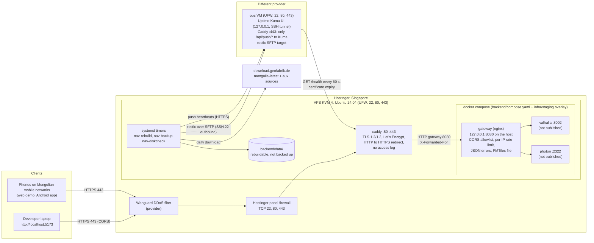

# Staging deployment architecture (owner: architect)

- **Story:** NAV-008 (AC 6–24). **Decision:** [ADR-0005](adr/0005-backend-hosting-staging.md) (accepted for staging, 2026-09-30)
- **Host:** Hostinger VPS KVM 4, Singapore. 4 vCPU, 16 GB RAM, 200 GB NVMe, Ubuntu 24.04 LTS
- **Contract:** [`api/openapi.yaml`](api/openapi.yaml) 0.4.0 (staging `servers` entry, `429 RateLimited`)
- **Implements:** backend-engineer, under `infra/staging/` plus a runbook. **Operates:** the named PO-side operator (D7). **Verifies:** qa-engineer
- **Status of this document:** normative for staging. Values marked *proposed* may be tuned by backend when a measurement shows the need. The change is then recorded in the runbook and reported in the handoff.

Placeholders used below: `staging.<domain>` for the API host (a subdomain of the PO's company domain, D6), `demo-staging.<domain>` for the web demo host if the PO agrees (open question), and `ops` for the ops VM. None of these names is final.

---

## 1. Scope
In scope: one staging host running the NAV-001 stack behind TLS, reachable from Mongolian phones, with rate limits, privacy-safe logs, external monitoring, off-host configuration backups and a daily data rebuild.

Out of scope (NAV-008 Out of scope): production, high availability, CDN, authentication, blue/green switching (NAV-006), own Nominatim.

## 2. Topology



Only Caddy is reachable from the internet. Caddy is the only container that publishes ports. The gateway keeps its NAV-001 binding (`GATEWAY_BIND=127.0.0.1`), so operators can still run `curl http://127.0.0.1:8080/health` on the host. Valhalla and Photon publish nothing.

## 3. Host baseline (Ubuntu 24.04 LTS)
Delivered as one idempotent script (or Ansible playbook) under `infra/staging/`. A second run changes nothing.

| Item | Setting | AC |
|---|---|---|
| Time zone | Host clock in UTC. Schedules below are written in UTC with the Asia/Ulaanbaatar time next to them (UB and Singapore are both UTC+8) | — |
| Admin account | One non-root sudo account with the role name `nav-ops`, SSH key only. The key belongs to the named PO-side operator (not recorded in the repo) | AC 12, AC 21 |
| SSH | `PasswordAuthentication no`, `KbdInteractiveAuthentication no`, `PermitRootLogin no`, `PubkeyAuthentication yes`, `AllowUsers nav-ops` (plus the backup user if one is added). Put these in **`/etc/ssh/sshd_config.d/00-nav-hardening.conf`**. sshd keeps the **first** value it reads, and Ubuntu cloud images may ship `50-cloud-init.conf` with `PasswordAuthentication yes`, so the file must sort first. Check the effective values with `sshd -T` | AC 12 |
| Break-glass access | A provider path that does **not** depend on sshd: an out-of-band (VNC/serial) console, or a rescue/recovery boot that mounts the disk. **On Hostinger, the hPanel "Browser terminal" is an SSH client** (Hostinger's help page says it works "exactly like a standard SSH connection" and asks for the SSH user and password), so after hardening it refuses root and passwords. It is not break-glass. Hostinger's break-glass is **Settings → Emergency mode** (rescue system, the VPS disk mounted under `/mnt`) and, as a last resort, the panel's SSH-configuration reset (this undoes the hardening, so re-run bootstrap afterwards). Before closing the first SSH session, confirm that the break-glass path is offered for this VPS. Don't trigger it on a live host. See §17.4 | AC 20 |
| Security updates | `unattended-upgrades` on for the security pocket. Automatic reboot allowed at 21:30 UTC (05:30 Asia/Ulaanbaatar), after the nightly rebuild window | AC 12 |
| Docker | Docker Engine and the Compose plugin from Docker's apt repository (not the snap). `/etc/docker/daemon.json`: `log-driver: local`, `log-opts: {max-size: 10m, max-file: 5}` | AC 12, AC 14 |
| journald | `SystemMaxUse=1G`, `MaxRetentionSec=14day` | AC 14 |
| Swap | 4 GB swap file, `vm.swappiness=10`. A safety margin against the OOM killer during a build. AC 16 is still judged on RAM | AC 16 |
| Host metrics | `sysstat` enabled, `HISTORY=28` (CPU, RAM, disk I/O kept 28 days; `sar` to read). License GPL-2.0: used unmodified as an OS package, not distributed, so acceptable (flagged per ADR-0001 policy). Prometheus `node_exporter` (Apache-2.0) bound to `127.0.0.1` is an acceptable alternative if the operator wants dashboards over an SSH tunnel | AC 18 |
| Repository | The git repository checked out at a **pinned tag** in `/opt/nav/` (path proposed), owned by `nav-ops` | AC 21 |

## 4. Network exposure and firewall
Three layers, because Docker's published ports bypass UFW's `INPUT` rules:

1. **Hostinger panel firewall** (hPanel VPS firewall): allow inbound TCP 22, 80 and 443, drop everything else. This layer also covers anything Docker publishes by mistake.
2. **UFW** on the host: `default deny incoming`, `allow 22/tcp` (as `limit 22/tcp`, which throttles repeated connection attempts), `allow 80/tcp`, `allow 443/tcp`, for IPv4 **and** IPv6 (`IPV6=yes`). `ufw logging off`, because blocked-packet logs contain source IPs (§8).
3. **Compose publishing rules:** only the Caddy service publishes `80:80` and `443:443` (TCP only). The gateway stays on `127.0.0.1:8080`. No other service has `ports:`.

HTTP/3 (UDP 443) is **off** on staging (Caddy `protocols h1 h2`), so the firewall stays TCP-only and the AC 12 scan result is simple. Enable it later with an ADR amendment if measurements show a benefit on mobile.

IPv6: if Hostinger assigns an IPv6 address, add an AAAA record and apply the same rules. The NAV-008 IPv6/NAT64 edge case is tested on each operator.

AC 12 is verified from outside with a full TCP port scan (IPv4 and IPv6 if present). Expected open: 22, 80, 443 only.

## 5. TLS termination: Caddy (decision)
**Chosen: Caddy 2 (official `caddy` Docker image, Apache-2.0, pinned by digest) as a separate container in front of the unchanged nginx gateway, with automatic Let's Encrypt certificates.**

| Criterion | Caddy (chosen) | certbot + TLS in the nginx gateway |
|---|---|---|
| Certificate issuance and renewal | Built in and automatic (ACME HTTP-01 or TLS-ALPN-01). No cron job, no reload hook | certbot on the host (snap), a systemd timer, a webroot or standalone challenge on port 80, and a deploy hook that reloads nginx in the container |
| Change to the NAV-001 gateway | None except real-IP trust and rate limits (§7), which are needed in any case | A second server block for TLS and ports 80/443 in the gateway templates, certificate mounts, and a different config in dev and staging |
| TLS defaults | TLS 1.2 and 1.3 only, modern ciphers, OCSP stapling, HTTP to HTTPS redirect by default (AC 7) | Must be written and maintained by hand |
| Renewal dry run (AC 7) | No built-in `--dry-run`. Procedure below | `certbot renew --dry-run` built in |
| Log privacy (AC 14) | Access log is **off** unless a `log` directive is added. The runtime log needs an include-list (below) | nginx formats already privacy-safe; certbot logs contain no client data |
| Portability to production | Same container on any host | Same, with more moving parts |
| License | Apache-2.0 | certbot Apache-2.0, nginx BSD-2 |

**Why Caddy:** fewer moving parts (one container, no host timer or reload hook), the NAV-001 gateway stays the same in dev and staging, and the AC 7 TLS rules hold by default. The one weaker point, the missing renewal dry run, is covered by a short documented procedure.

**Caddyfile (reference; backend owns the final file under `infra/staging/`):**

```caddyfile
{
	email {$ACME_EMAIL}
	servers {
		protocols h1 h2
	}
	# Runtime log: certificate management only. No access log, no per-request error log.
	# Backend verifies the logger names against the pinned Caddy version.
	log default {
		output stdout
		format json
		level INFO
		include tls http.acme_client admin
	}
}

{$STAGING_HOST} {
	tls {
		protocols tls1.2 tls1.3
	}
	# No `encode`: PMTiles range responses must pass through unchanged.
	# No `log` directive: access logging stays off (AC 14).
	reverse_proxy gateway:8080
	# Backstop when the gateway container itself is down (contract shape, no CORS headers):
	handle_errors 502 503 504 {
		header Content-Type application/json
		header Cache-Control no-store
		respond `{"code":"UpstreamUnavailable","message":"gateway unavailable"}` {err.status_code}
	}
}
```

Notes:
- Caddy replaces any incoming `X-Forwarded-For` from clients with the real peer address (untrusted clients cannot spoof it), and the gateway trusts that header only from the Caddy container's network (§7).
- The `handle_errors` backstop answers only when the gateway container is down. It carries no `Access-Control-*` headers (CORS stays owned by the gateway, ADR-0002 §3), so a browser sees a network error. Both are the client's retryable "service unavailable" state. The main case (upstream down, gateway up) keeps the gateway's JSON with CORS headers.
- HSTS is optional on staging. If used: `max-age=86400`, **without** `includeSubDomains` or `preload`, so the company's other subdomains are not affected.
- **Renewal dry run (AC 7):** stop the Caddy container, start a temporary Caddy container with the same Caddyfile, a **fresh empty data volume** and `acme_ca https://acme-staging-v02.api.letsencrypt.org/directory`, confirm that it obtains a (Let's Encrypt staging) certificate for `staging.<domain>` on the real host, then remove it and start the normal Caddy again. The ACME order is the same flow as a renewal. Downtime is about one minute. Run it outside tester hours and record the output in the runbook log.
- Certificate expiry is also watched from outside (§9, ≤ 14-day alert).

## 6. DNS and hostnames
- `staging.<domain>`: A record to the VPS IPv4 (and AAAA if IPv6 is assigned). TTL ≤ 300 s during setup (NAV-008 edge case). The operator creates it in the company DNS (D6, D7).
- `demo-staging.<domain>` (only if the PO agrees that Caddy on the same host serves the NAV-002 static build): a second A/AAAA record and a second Caddy site block with `root` and `file_server`. The web build then uses `VITE_GATEWAY_BASE_URL=https://staging.<domain>` (ADR-0004). This keeps the API host's unknown paths as the contract's `404 GatewayError` instead of an SPA page.
- The domain placeholders are replaced in `openapi.yaml` (`servers`) and `backend/README.md` once the PO provides the domain (AC 23).

## 7. Gateway configuration on staging
The gateway image and templates are NAV-001's. Staging changes only `.env` values and adds two gateway features that are off or loose in dev at backend's choice.

| Setting | Staging value | Why |
|---|---|---|
| `GATEWAY_BIND` / `GATEWAY_PORT` | `127.0.0.1` / `8080` (unchanged) | Only Caddy talks to the gateway, over the Compose network |
| `CORS_ALLOWED_ORIGINS` | `https://demo-staging.<domain>,http://localhost:5173` (the first entry is a placeholder; see open question). **Never `*`** | AC 11 |
| Real client IP | nginx `real_ip`: `set_real_ip_from <Compose network CIDR of Caddy>`, `real_ip_header X-Forwarded-For`, `real_ip_recursive off`. The CIDR is pinned by giving the Compose network a fixed subnet in the overlay | Needed for per-IP rate limits. `$remote_addr` is still **not** in the access log format |
| Rate limits | §7.1 | AC 13 |
| `GATEWAY_ERROR_LOG_LEVEL` | `crit` (unchanged) | nginx's "limiting requests" lines are `error` level and contain the client IP. They must stay suppressed (keep `limit_req_log_level` at its default `error` or lower) |
| `OSM_PBF_URL` | `https://download.geofabrik.de/asia/mongolia-latest.osm.pbf` | AC 15 (dev default is a mirror because Geofabrik is blocked only in the dev container) |

### 7.1 Rate limits (proposed values)
Enforced by the gateway with nginx `limit_req`, keyed on the client IP (`$binary_remote_addr` after `real_ip`). The key is held in memory only and never logged.

| Path group | Operations | Rate per client IP | Burst | Notes |
|---|---|---|---|---|
| Routing | `postRoute`, `getRoute` | 30 requests/s | 60, `nodelay` | One zone for `/v1/route` |
| Search | `search`, `reverse` | 30 requests/s | 60, `nodelay` | One shared zone for `/v1/search` and `/v1/reverse` |
| Not limited | `/health`, `/tiles/basemap.pmtiles` (any method), every `OPTIONS` preflight | — | — | AC 13: tile range requests at any rate are never limited. The uptime checker must never be limited |

- **Check against AC 13:** 100 requests/s for 10 s from one IP gives about 60 + 30 × 10 = 360 accepted and the rest `429`, so at least one `429` is guaranteed. A normal session (≤ 10 requests/s) stays far below 30/s. The generous per-IP rate leaves room for several testers behind one carrier-grade NAT address (NAV-008 edge case). If testers report `429` during normal use, raise the rate and log the change in the NAV-008 Change log.
- **429 response (contract, `openapi.yaml` 0.4.0):** status 429, `Content-Type: application/json`, body `{"code":"RateLimited","message":"Too many requests"}`, `Retry-After: <integer seconds ≥ 1>` (staging: `1`), `Cache-Control: no-store`, and each `Access-Control-*` header exactly once (NFR-C3). `Access-Control-Expose-Headers` now also lists `Retry-After`, so browser clients can read it.
- Values are `.env` keys (names are backend's choice, for example `GATEWAY_RATE_ROUTE=30r/s`, `GATEWAY_BURST_ROUTE=60`), each documented in `.env.example`.
- Volumetric attacks are Hostinger Wanguard's job, in front of the host. The gateway limit protects the VM's CPU from one abusive client. Authentication remains out of scope (D8).

## 8. Logs and privacy
Rule (NAV-001 privacy rules, NFR-P1, NAV-008 AC 14): **no client IP address, query string, request body or coordinate** in any log on the request path.

| Component | What it logs on staging | How it stays clean |
|---|---|---|
| Caddy | ACME and certificate events, startup and config errors | No `log` directive in the site block (access log off). Global logger is an **include-list** of certificate-related loggers, so per-request error logs (which contain the request URI and remote address) are dropped. Backend checks the logger names on the pinned version |
| Gateway (nginx) | Unchanged NAV-001 JSON access line: method, path without query string, status, bytes, timings. `429` lines appear with status only, which gives a count for tuning | Format has no `$remote_addr`, `$request_uri`, `$args`, body, Origin or User-Agent. `error_log` at `crit` |
| Valhalla | Request lines with the query string replaced by `?<redacted>` | NAV-001 `valhalla-serve.sh` filter (unchanged) |
| Photon | No queries at INFO | Unchanged |
| Rebuild, backup and check units | URLs of public sources, file sizes, durations, exit codes | No request data exists in these jobs |
| Docker container logs | The above, rotated (`local` driver, 5 × 10 MB per container) | Bounded retention |
| Host security logs | sshd authentication events (source IPs of SSH connections: the operator and internet scanners) in journald, ≤ 14 days | These are not app-user logs. They are needed for security. Listed for the counsel's review (ADR-0005 §3). `ufw logging off` |
| Provider (Hostinger, Wanguard) | Network-level data outside our control | Listed for the counsel's review |

QA verifies with a day of normal use, then searches every log source above for IPv4 and IPv6 addresses, `lat=`/`lon=`, `json=`, coordinate-like number pairs, and search text used during the test (AC 14).

## 9. Monitoring and alerting
The alert receiver is the named PO-side operator (D7). The channel (email, Telegram or similar) is configured on the ops VM, not in the repo.

| Check | Where it runs | Rule | AC |
|---|---|---|---|
| Liveness | Uptime Kuma (MIT) on the ops VM, **different provider** | `GET https://staging.<domain>/health` every 60 s, expect 200 and `"status":"ok"`. Alert after 2 failures, which is within 5 minutes. Recovery notice on the first success | AC 17 |
| Certificate expiry | Same Uptime Kuma monitor | Certificate expiry notification at ≤ 14 days | AC 18 |
| Disk usage | `nav-diskcheck.timer` on the host, every 5 min | Pushes a heartbeat to an Uptime Kuma **push monitor** only while `/` usage is < 85 %. No push for 15 min (disk ≥ 85 %, or host down) raises the alert | AC 18 |
| Daily rebuild | `nav-rebuild.service` | Pushes a heartbeat only after a successful rebuild **and** smoke run. Push monitor interval 26 h | AC 15 |
| Host metrics history | `sysstat` on the host (§3) | CPU, RAM and disk kept 28 days | AC 18 |
| Maintenance window | Uptime Kuma | Daily window around the rebuild (§11) so the planned stop does not page the operator. The rebuild heartbeat still catches a failed rebuild | AC 17 |

~~The ops VM exposes no extra ports.~~ *(Corrected in review round 2, §17.4: this contradicted the push heartbeats above, which the staging host must be able to reach.)* The Uptime Kuma **UI** binds to `127.0.0.1`, and the operator reaches it through an SSH tunnel. The ops VM also runs a small Caddy (same pinned image and log include-list as staging) on TCP 80/443 that forwards **only** `/api/push/*` to Uptime Kuma. Every other path gets `404`. There is no access log, because push tokens are in the path. The ops VM gets the same SSH hardening as the staging host. It holds no personal data (only `/health` results, heartbeat times and encrypted configuration backups).

Alternative if the PO does not want an ops VM: a hosted monitor with a ≤ 60 s interval and certificate alerts, plus S3-compatible object storage at another provider for restic. Free tiers of common hosted monitors check only every 5 minutes, which fails AC 17.

## 10. Backups and snapshots
- **Off-host configuration backup (AC 19):** `restic` (BSD-2-Clause), daily at 20:30 UTC (04:30 Asia/Ulaanbaatar) from `nav-backup.timer`, to a restic repository on the ops VM over SFTP (a dedicated key-only account there). restic encrypts every backup, so secrets are encrypted at rest.
  - **Included:** `backend/.env` and any `infra/staging/.env`, the Caddy data volume (ACME account key and certificates), the rendered Caddyfile, `/etc/ufw/`, `/etc/ssh/sshd_config.d/00-nav-hardening.conf`, `/etc/systemd/system/nav-*.{service,timer}`, `/etc/docker/daemon.json`, `/etc/default/sysstat` and the unattended-upgrades config.
  - **Excluded:** `backend/data/` (rebuildable from OSM, AC 15; the runbook says so), container logs, the git checkout (it is in git).
  - **Retention:** `restic forget --keep-daily 7 --keep-weekly 4 --prune`, then a weekly `restic check`.
  - **Repository password:** held by the operator in the company password manager. A copy readable only by root on the host is needed for unattended runs. It is never in git or in the backup itself.
- **Provider backups and snapshots:** keep Hostinger's weekly automatic backup on. Take a manual snapshot (the plan's snapshot slot) before risky changes: OS release upgrade, Docker major upgrade, data layout change. These are on-provider copies and **complement** the off-host backup. They do not replace it.
- **Restore drill (AC 20):** a new empty VM of the same plan, then bootstrap script, git checkout of the pinned tag, `restic restore` of the latest snapshot, `docker compose up`, a first data build (about 8 minutes on 4 vCPU, NAV-001 measurement) and the smoke suite. Target ≤ 2 hours; the measured time goes in the runbook. Because the ACME account and certificates are restored, no extra Let's Encrypt issuance is needed if DNS still points to the old IP. After a DNS change, Caddy obtains a new certificate on its own.

## 11. Daily data rebuild (interim until NAV-006)
- **Schedule:** `nav-rebuild.timer`, `OnCalendar=*-*-* 19:30:00 UTC` (03:30 Asia/Ulaanbaatar), `Persistent=true`, `RandomizedDelaySec=15min`. The service holds a `flock` so two runs never overlap.
- **Steps (proposed):**
  1. Preflight: `HEAD` on the Geofabrik URL returns 200; free disk ≥ 50 GB; stack healthy. If a preflight fails, skip the run and do **not** stop the stack (the old data keeps serving). No heartbeat is sent, so the operator is alerted.
  2. Optional: compare Geofabrik's `mongolia-latest.osm.pbf.md5` with the value in `data/build-info.json` and skip the rebuild if unchanged (Geofabrik publishes once a day; this avoids needless downloads).
  3. `make rebuild-data` (NAV-001). Today it stops `gateway`, `valhalla` and `photon`, rebuilds and restarts them. The measured rebuild time on 4 CPU is 336 s with cached auxiliary files.
  4. `tests/smoke/run.sh` against the staging URL, then check that `build-info.json` records a Geofabrik replication timestamp ≤ 48 h old.
  5. On success, push the rebuild heartbeat (§9).
- **Downtime:** the API is down for the length of the rebuild (a few minutes at night). Staging accepts this (AC 15 records the measured value). Zero-downtime blue/green is NAV-006.
- **As implemented (§17):** step 3 is `infra/staging/bin/nav-rebuild.sh`, not `make rebuild-data`. The gateway and tiles stay up; only Valhalla restarts, and Photon stops only when the search dump changed. **On staging, AC 15's "`make rebuild-data`" is executed as `nav-rebuild.sh --force` after the auxiliary cache has been emptied** (§17.2). The `backend/Makefile` targets that start, stop or rebuild services must not be run on the staging host.
- **Requested improvement (backend, recommended, not blocking):** keep the gateway running during `rebuild-data` and stop only the services whose data is replaced, so clients get the contract's JSON `502/503/404` with CORS headers instead of Caddy's backstop. Also keep the previous data set (about 3 GB, cheap on 200 GB) so a failed rebuild can be rolled back with one command.
- **Auxiliary sources** (Natural Earth, water and land polygons, landcover, QRank; about 2.5 GB) stay cached. Refreshing them (for example monthly) is part of NAV-006. Only the OSM extract changes daily.
- **Source etiquette:** one download of the Geofabrik extract per day at most, with a descriptive `User-Agent`.

## 12. Deploy and update
- A deploy script under `infra/staging/` takes a **git tag**: fetch, check out the tag, `docker compose pull` (images pinned by digest), `up -d --wait`, then the smoke suite. A rollback is the same script with the previous tag.
- The Compose project directory stays `backend/`, with the overlay passed as a second `-f` file, so NAV-001 relative paths keep working.
- OS updates come from unattended-upgrades (§3). Docker Engine and Caddy upgrades are deliberate: snapshot first, then pin the new digest, deploy and smoke-test.

## 13. Configuration keys (proposed; backend names them in `.env.example`, each with a one-line comment)
| Key (proposed name) | Purpose | Secret? |
|---|---|---|
| `STAGING_HOST` | Public API hostname for Caddy and the smoke `BASE_URL` | no |
| `DEMO_HOST` | Web demo hostname, if the demo is served from this host | no |
| `ACME_EMAIL` | Let's Encrypt contact: a **role mailbox** of the company, not a personal address | no |
| `CADDY_IMAGE` | Caddy image pinned by digest | no |
| `CORS_ALLOWED_ORIGINS` | Existing key, staging value in §7 | no |
| `OSM_PBF_URL` | Existing key, Geofabrik on staging | no |
| rate-limit keys | §7.1 | no |
| trusted proxy CIDR | Subnet of the Compose network that Caddy uses (§7) | no |
| `UPTIME_PUSH_URL_REBUILD`, `UPTIME_PUSH_URL_DISK` | Uptime Kuma push URLs (they contain tokens) | **yes**, only in `.env` on the host |
| `RESTIC_REPOSITORY`, `RESTIC_PASSWORD_FILE` | Backup target and the path to the password file | repository no; the password file is a secret outside git |

## 14. Access roles (role names only, no personal data; AC 21)
| Role | Holds | Held by |
|---|---|---|
| Provider account owner | Hostinger company account, billing, panel firewall, snapshots | named PO-side operator (D7) |
| `nav-ops` | SSH (key only) and sudo on the staging host | named PO-side operator |
| DNS editor | Company DNS zone records for the staging names | named PO-side operator or company IT |
| Alert receiver | Uptime Kuma notifications | named PO-side operator |
| Backup account (ops VM) | SFTP-only, key-only account that receives restic data | technical account, no person |

## 15. Acceptance mapping (NAV-008)
| AC | Where it is designed | How QA verifies |
|---|---|---|
| 6 | §5, §6 | Phone browser on ≥ 2 operators, `/health` 200, no certificate warning |
| 7 | §5 | `testssl.sh` or `openssl s_client`, TLS 1.2/1.3 only, `http://` answers 308 (Caddy's default redirect), renewal dry-run record |
| 8 | ADR-0005 §2 | c1 script, 20 samples per operator, threshold = accepted exception |
| 9 | ADR-0005 §2 | Tethered laptop, 20 kept-alive `postRoute`, p95 ≤ 500 ms |
| 10 | §11 | `BASE_URL=https://staging.<domain> tests/smoke/run.sh` from outside and tethered |
| 11 | §7 | Preflights with the allowed origins and `http://evil.example` |
| 12 | §3, §4 | External full port scan, SSH password refusal, `sshd -T`, unattended-upgrades status |
| 13 | §7.1 | 100 requests/s for 10 s, ≥ 1 `429` with the contract shape; a 10 requests/s session never limited; tiles never limited |
| 14 | §8 | Log search after a day of use |
| 15, 16 | §11 | Rebuild record, `make stats`, downtime measured |
| 17, 18 | §9 | Alert drill (stop the gateway), config review, disk and certificate rules |
| 19, 20 | §10 | Backup review, timed restore drill |
| 21 | §12–§14 | Repository inspection, secret scan |
| 22 | ADR-0005 cost table | Invoice |
| 23 | §6 | `openapi.yaml` `servers` and `backend/README.md` list the real URL |
| 24 | ADR-0005 §3 | Dated counsel record exists before the first outside invitation |

## 16. Risks
| Risk | Effect | Mitigation |
|---|---|---|
| International link from Mongolia degrades | Testers lose service (C10) | Accepted for staging. Record incidents. Production in Mongolia (ADR-0005 §4) |
| RTT above the accepted 100 ms on some operator | AC 8 fails on that operator | Report to the PO with the measured value. It does not affect production selection |
| Docker bypasses UFW for published ports | A service published by mistake is reachable | Panel firewall layer, only Caddy publishes, external port scan in QA |
| Caddy logger names change between versions | Request data could reach the runtime log | Include-list (default deny), pinned digest, log search in QA on every Caddy upgrade |
| Rebuild fails after the stack was stopped | API down until the next good run or a manual restart | Preflight before stopping, heartbeat alert, requested rollback copy (§11) |
| Let's Encrypt rate limits during repeated restores | Certificate issuance blocked for a while | ACME account and certificates are in the backup. Use the Let's Encrypt staging CA for dry runs |
| Ops VM down | No external alerts | Accepted for staging. The operator sees a silent monitor on the next login |
| Staging-only security shortcuts: non-chrooted SFTP backup account, restic repository not append-only, `deploy.sh` runs the tag's own script as root without a signature check, `NOPASSWD` sudo plus `docker` group, push tokens in the URL path | A compromised staging host or a pushed malicious tag has more reach than necessary | Accepted for staging (configuration-only data, no personal data, one operator). Listed with the production fix in RUNBOOK §18; each one is a NAV-009 input |

## 17. Implementation record (NAV-008 B1–B9, reviewed 2026-09-30)
Backend delivered the design under `infra/staging/` and `backend/gateway/`. The deviations and refinements below are **accepted** and are normative from now on. Where this section and §3–§13 disagree, this section wins.

### 17.1 Accepted refinements
| Topic | Design said | Implemented (accepted) | Why accepted |
|---|---|---|---|
| Gateway rate limits | `.env` keys, names by backend | New entrypoint `backend/gateway/entrypoint/16-rate-limits.sh` writes `conf.d/01-rate-limits.conf`. Keys: `GATEWAY_RATE_LIMIT` (`off` in dev, forced `on` by the staging overlay), `GATEWAY_RATE_ROUTE`, `GATEWAY_BURST_ROUTE`, `GATEWAY_RATE_SEARCH`, `GATEWAY_BURST_SEARCH` (rates `<n>r/s` only), `GATEWAY_REAL_IP_FROM`. Invalid values stop the gateway instead of running unlimited. `limit_req_log_level info` (below `crit`) | Dev stays unlimited; staging cannot start without limits (`deploy.sh` also checks) |
| Trusted proxy | Compose network CIDR of Caddy | Dedicated `edge` network (Caddy and gateway only) with a fixed subnet and an `ip_range` that excludes Caddy's fixed address. `set_real_ip_from` is Caddy's **/32** (and **/128** when IPv6 is on), not the subnet | Stricter: no other container can become the trusted peer |
| IPv6 | Same rules as IPv4 | Optional overlay `compose.staging.ipv6.yaml`, added automatically when the host kernel has IPv6 (`EDGE_IPV6=auto`). Without it, Docker's userland proxy would give every IPv6 client the same rate-limit key | Keeps per-client keys for IPv6 clients. Keys are per /128; an IPv6 client could rotate addresses inside its /64. Accepted for staging (Wanguard in front; limits protect CPU, not access) |
| `Retry-After` | Integer ≥ 1 (staging 1) | Fixed at `1`. Rates are restricted to `r/s` so that 1 s is always enough | Matches openapi 0.4.0 |
| Caddy logger include-list | `tls http.acme_client admin` | `tls http.acme_client http.auto_https`. `admin` dropped: `admin.api` logs every healthcheck request | Checked against the pinned Caddy 2.11.4 |
| Daily rebuild (§11) | `make rebuild-data` (full stop) | `nav-rebuild.sh`: `.md5` skip, rollback copy, builds while serving, Valhalla restart only, Photon stop only on a dump change, automatic data rollback on a failed build or smoke, heartbeat only after smoke **and** the 48 h age check | This is the §11 "requested improvement". Measured in a sandbox: tiles and `/health` 0 s down, routing about 13 s, search about 54 s |
| Maintenance window (§9) | Daily window around the rebuild | Not needed for the rebuild (the gateway stays up). Manual windows for deploys and drills | Follows from the rebuild change |
| Docker daemon | `log-driver local`, rotation | Also `live-restore: true`. Docker packages are `apt-mark hold`; Engine upgrades follow RUNBOOK "Upgrades" (snapshot first) | Deliberate Engine upgrades (§12) |
| `nav-ops` sudo | Sudo account, key only | `NOPASSWD` sudo; the account has no password at all. `nav-ops` is also in the `docker` group | Accepted for staging: with key-only SSH there is no password to ask for, and `docker` group membership is root-equivalent anyway. The protection is the operator's passphrase-protected key. Revisit for production (NAV-009) |
| Backup monitoring | Not specified | Optional third push monitor `nav-staging backup` (26 h) | Catches a silent backup failure (AC 19 has no alert rule) |

### 17.2 AC 15/16 on staging (execution mapping)
AC 15 names `make rebuild-data`, which is the **dev** command. On the staging host it would use `backend/.env` (created from the dev `.env.example`: CORS `*`, dev mirror OSM URL) and the base compose file without the overlay, under the same project name `navmn`. It would recreate the gateway without rate limits and off the `edge` network, and would delete the live data. Therefore, on staging:
1. Empty the auxiliary cache so that every C9 download happens from the host: move the Planetiler auxiliary files out of `backend/data/sources/` (or run the measurement on the very first deploy of an empty host).
2. Start the memory sampler (every ≤ 3 s, the `make stats` equivalent through `nav-compose`) as described in the runbook.
3. Run `sudo infra/staging/bin/nav-rebuild.sh --force`. Its `last-rebuild.json` gives the build time and the downtime per service. Free disk comes from `df -h /` afterwards.
The runbook must give these commands explicitly (review issue to backend-engineer). *Resolved in review round 2: RUNBOOK.md section 7 gives the single command `nav-stats-sampler.sh -- nav-rebuild.sh --empty-aux-cache` and the record steps.*

### 17.3 Still open (not decided here)
- The staging host itself (a KVM VPS, not shared web hosting), the domain, the ops VM, and whether the repository is private. `openapi.yaml` `servers` keeps its placeholder until the domain is known (AC 23).
- The ops VM's public name for the push endpoint (§17.4), for example `ops-staging.<domain>` in the company zone. It is a DNS record, not a product decision. The operator creates it together with `staging.<domain>`.

### 17.4 Review round 2 (2026-09-30): corrections to this design
| Topic | Problem | Correction (normative) | Implements |
|---|---|---|---|
| Push heartbeats (§9) | §9 had the staging host push heartbeats (disk, rebuild, backup) to Uptime Kuma, but it also said the ops VM exposes no ports and Kuma binds to `127.0.0.1`. The push URLs could not be reached, so the disk, rebuild and backup monitors would always be DOWN, and the AC 18 disk alert would be meaningless | The ops VM runs Caddy (pinned `caddy` image, `protocols h1 h2`, TLS 1.2/1.3, the same log include-list `tls http.acme_client http.auto_https`, **no** access log) for `{$OPS_HOST}`: `handle /api/push/* { reverse_proxy uptime-kuma:3001 }`, `handle { respond 404 }`. UFW on the ops VM allows 22, 80 (ACME HTTP-01 and redirect) and 443. Kuma's own port stays `127.0.0.1:3001`. The push URLs in `infra/staging/.env` use `https://{$OPS_HOST}/api/push/<token>`. When the monitor is created, the Kuma UI shows `http://localhost:3001/...` (the tunnel URL), so the runbook tells the operator to replace the origin | backend-engineer: `monitoring/ops-vm/compose.yaml` + ops `Caddyfile`, `bootstrap.sh --role ops` opens 80/443 (or a flag), RUNBOOK section 10 incl. a push test from the staging host (`nav-diskcheck.sh` → green) |
| Break-glass (§3) | The runbook and QA O-1.5 used the hPanel browser terminal with the root password as break-glass. That terminal is SSH-based, so after hardening it refuses root and password logins | Break-glass = Hostinger **Emergency mode** (rescue boot, disk under `/mnt`, fix `00-nav-hardening.conf` / `authorized_keys`). The panel's SSH-configuration reset is the last resort, and it requires re-running bootstrap. The first-session check confirms that these options are offered for the VPS. It does not trigger them. Other providers: their VNC/serial console or rescue mode | backend-engineer (RUNBOOK section 4 C step 2 and the "Locked out of SSH" incident row); qa-engineer (checklist O-1.5) |

### 17.5 Review round 3 (2026-09-30): §17.4 implemented, refinements accepted
Both §17.4 corrections are implemented (`infra/staging/monitoring/ops-vm/`, `bootstrap.sh --role ops`, RUNBOOK sections 4 C, 10, 11) and checked locally with `infra/ci/staging-ops-push-test.sh` (own compose project). The refinements below are **accepted** and normative.

| Topic | Implemented (accepted) | Why accepted |
|---|---|---|
| Ops VM firewall | `bootstrap.sh --role ops` opens UFW 22/80/443. New flag `--no-web` (ops role only) keeps SSH only and removes 80/443 again | `--no-web` fits the §9 hosted-monitor alternative; refused for the staging role, so staging cannot lose 80/443 by mistake |
| Uptime Kuma database | `UPTIME_KUMA_DB_TYPE=sqlite` in the ops compose file | Skips Kuma 2.x's first-run database wizard; embedded SQLite is enough for four monitors |
| Push URL checks | `nav_heartbeat` refuses `localhost`/IP origins, plain `http`, and hosts other than `OPS_HOST`; a push counts only on HTTP 200 with `"ok":true`; curl is limited to `https` with no redirects; the URL is never logged. New `bin/nav-push-test.sh` | Catches the tunnel-origin mistake from §17.4 and false successes (Caddy's 308 or 404) at the first run, not after a silent monitor |
| Ops Caddy path handling | Only `/api/push/*` is proxied; dot-segment and encoded-slash variants (`/api/push/../metrics`, `..%2f`, `%2e%2e`) get Caddy's empty 404 | Checked in the architect review with the pinned Caddy 2.11.4 and Kuma 2.5.5 images |
| Rebuild abort recovery | `nav-rebuild.sh` renames the Photon/Valhalla readiness markers to `.complete.prev` instead of deleting them. On an interrupted run the EXIT trap stops the background builders, restores the aux cache and the markers, and starts Photon and Valhalla again (rollback copy if they do not come up). `nav-rebuild.service` has `TimeoutStopSec=5min` | The builders swap whole directories, so until the swap the old data and its marker are intact. SIGKILL or power loss still skip the trap (RUNBOOK section 11) |
| Backup excludes | `aux-cache.aside`, `stats/`, `ac15-*.log` excluded; `nav-backup.sh unlock` for stale locks | All rebuildable or already copied into the runbook log |
| Accepted risks | RUNBOOK section 18 lists the staging-only security shortcuts with their production fix | Summarised in §16; NAV-009 inputs |
