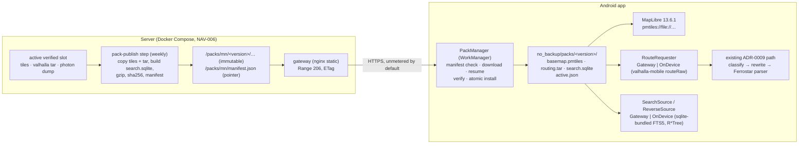

# Spike: Offline use of the real Android app. Whole-Mongolia map, on-device routing and reroute, offline search and reverse geocoding, downloaded in the app

- **Requested by:** the PO. Triage row 2026-10-04 "Offline use" (`docs/triage/log.md`), spike lane, owner architect, timebox one run, no production code.
- **PO scoping answers (2026-10-04, "All as recommended" to the orchestrator's 7 questions).** These are inputs to this spike, not choices made here:
  1. the **real** app (the NAV-019 demo is already offline)
  2. all four capabilities work without internet: map display, guidance on the current route (already works), **new route and reroute**, **search and reverse geocoding**
  3. coverage is **all of Mongolia** (consistent with D131)
  4. required **at launch** (answers backlog owed decision 3 with "yes")
  5. data is **downloaded in the app** on demand, over **Wi-Fi by default** ("Download Mongolia map"), and is **not bundled** in the APK
  6. offline data is **refreshed weekly over Wi-Fi**; the server keeps the NAV-006 daily rebuild
  7. **Android first** (D24); iOS later
- **Related:** ADR-0001 (Consequences: "offline navigation is a later phase … revisit if offline becomes a launch requirement"; this spike is that revisit), ADR-0006 and ADR-0012 (query assistance), ADR-0008 (client-side instruction text), ADR-0009 (app-owned `RouteClient`, reroute policy, keyed text), ADR-0014 (NAV-006 slots and pointer switch), ADR-0016 (`pmtiles://file://` with MapLibre 13.6.1), NAV-003, NAV-005, NAV-006, NAV-011, NAV-012, NAV-019.
- **Companion ADR:** [ADR-0017](../adr/0017-offline-mongolia-pack-android.md), status **accepted** (PO 2026-10-04). Where this spike and ADR-0017 differ, ADR-0017 wins.
- **Owner:** architect. **Date:** 2026-10-04.
- **Status:** **decided by the PO, 2026-10-04** ("All as recommended" to eight questions: the seven in §10 plus a per-file cadence question). Applied in ADR-0017 (accepted) and openapi 0.6.0. Changes from this spike's recommendation: **reroute is online first** with on-device fallback within about 3 s, like preview and search (§4.2 and §10 Q1 had reroute on-device first); **map tiles are refreshed monthly**, routing and search weekly, so the manifest versions each file (amends scoping answer 6 for the map file); a **mobile-data update of routing + search only** (about 33 MB gzip) is offered when they are older than 14 days and there is no Wi-Fi. Skeptic mitigations adopted in ADR-0017: the parity gate runs the shipped `valhalla-mobile` library, the engine runs in a separate process, and the schedule is 6–9 calendar weeks. The body below is the original recommendation, kept as the record.
- **Scope rule followed.** All measurements ran on **copies** of the dev-stack artefacts in a scratch directory, in throwaway containers without published ports. The shared dev stack (gateway on the loopback port 8080) was **not queried, restarted or modified**. No code or configuration outside `docs/architecture/` was changed. No account, key or paid service was used.
- **Evidence labels:**
  - **M:** measured by us in this container on 2026-10-04 (Intel Xeon 2.8 GHz, 4 vCPU, Linux x86-64). §11 has the commands.
  - **D:** stated in upstream documentation or a published artefact (cited, or read from the published binary)
  - **I:** inferred by the architect (an estimate, not a fact)
  - **U:** unknown. The follow-up item that answers it is named.

---

## 1. Question and short answer

**Question.** What architecture do we recommend for an offline map, on-device routing (new route and reroute) and offline search on Android, what does it cost, and which stories follow?

**Short answer.**
1. **It is feasible with upstream components as they are, and smaller than expected.** A complete offline **Mongolia pack** is three files built from the same NAV-006 slot as the server data:

   | File | Content | On the phone | Download (gzip) | Label |
   |---|---|---|---|---|
   | `basemap.pmtiles` | Protomaps vector tiles z0–14, the same archive the server serves | **117.5 MB** (112.1 MiB) | 86.4 MB | M |
   | `routing.tar` | Valhalla graph tile extract, the same tar the server routes on | **63.7 MB** | 25.9 MB | M |
   | `search.sqlite` | SQLite FTS5 and R*Tree index built from the Photon dump (prototype) | **20.4 MB** | 7.0 MB | M |
   | **Total** | | **≈ 202 MB** (192 MiB) | **≈ 119 MB** | M |

2. **On-device routing gives the same routes as the server when the phone uses the server's own graph file.** `valhalla-mobile` 0.6.3 (MIT, Maven Central) bundles **Valhalla 3.6.3** and exposes `routeRaw(json): String`. That is exactly the shape of our ADR-0009 pipeline: our exact request body goes in, OSRM JSON comes out, and the existing rewrite and Ferrostar parser run unchanged. Measured with the Valhalla 3.6.3 engine on the server's 3.9.0-built tar: **12 of 12 test routes were identical** to the server engine (same distance, duration, manoeuvre sequence, geometry and street names). This covered car, walk, bicycle, `exclude_unpaved`, a reroute with `heading` and `alternates: 2`. When the graph was **rebuilt** with 3.6.3 from the same PBF, only 7 of 12 were identical. P1→P6 by car took a different road (6,243 m against 5,568 m), and three more routes had small distance or duration differences. So the pack must ship the **server's graph file**, not a separately built one.
3. **Routing cost is small (measured on x86, phone figures are estimates).** A cold one-shot route on one core takes 97–144 ms in total (process start, config, tile index, route, OSRM serialisation), with a peak process RSS of 58–76 MiB. That ranges from a 4 km UB trip to a 2,445 km Choibalsan→Ölgii route (M). A warm engine takes 10–45 ms per route (M). On a mid-range phone we estimate **0.3–0.6 s cold and 30–180 ms warm** (I, device benchmark needed).
4. **Offline search can follow NAV-003 behaviour well enough to gate on the golden set.** An untuned prototype (FTS5 `unicode61` with prefix indexes, one Latin "skeleton" key per name so that Cyrillic and Latin input and Russian-layout у/о meet in one column, ADR-0006 abbreviation expansion, per-token edit-distance fuzziness, distance and importance ranking) passes **29 of 30** applicable NAV-003 tier A and B rows, measured on name and distance only (M). The one failure is a category query, «Галт тэрэгний буудал» (B13). A pure FTS5 match takes p50 0.31 ms and p95 1.25 ms (M). Reverse geocoding through the R*Tree takes 0.1 ms per point and gives the same nearest objects as Photon for P1 and P6 (M).
5. **Download and update are plain static files.** One versioned pack per country is cut **weekly** from an already verified NAV-006 slot. It is published as immutable files plus one small manifest (`/packs/mn/manifest.json`), served by the gateway or any static host. Every file has SHA-256 checks and HTTP Range resume, and the app installs it atomically as a new version next to the old one. This needs **two new contract paths** (draft in ADR-0017 §6), added only after the PO approves.

**Recommendation (for the PO).** Adopt the **single weekly Mongolia pack** with the components below, Android first:
- **Map:** the pack's PMTiles through MapLibre 13.6.1 `pmtiles://file://` (proven in ADR-0016)
- **Routing and reroute:** `valhalla-mobile` behind the existing `RouteRequester` seam, reading the server's own `valhalla_tiles.tar`
- **Search and reverse:** an SQLite FTS5 + R*Tree database built by the NAV-006 pipeline from the Photon dump, read with `androidx.sqlite:sqlite-bundled` (FTS5, R*Tree and the trigram tokenizer are compiled in, checked in the published binary). The existing ADR-0012 query assistance is reused.
- **Delivery:** WorkManager download over unmetered networks, HTTP Range resume, SHA-256 checks, atomic install, a weekly check, full-file updates (deltas only after measurement)

**Effort:** about **45–67 person-days** in total (§8). With backend and mobile working in parallel, that is about 5–7 calendar weeks (ADR-0017 replans this as 6–9 calendar weeks, including the skeptic mitigations). It is on the launch critical path because the PO made offline a launch requirement. There are seven product questions for the PO (§10), each with a recommendation.

---

## 2. Measurements (this container, copies only)

### 2.1 Map: Mongolia PMTiles (MapLibre Native 13.6.1)
Source: a copy of `backend/data/tiles/basemap.pmtiles`. Planetiler 0.10.2 with Protomaps basemap 4.15.2 (commit `42ffaaa`), OSM extract sha256 `8d0a2325…`, bounds 81.93,39.02 – 120.27,53.04 (the extract's bbox), tile compression gzip.

| Zoom | Unique tiles | Bytes | Cumulative | Label |
|---|---|---|---|---|
| z0–z8 | 384 | 1.39 MB | 1.3 MiB | M |
| z9 | 743 | 1.63 MB | 2.9 MiB | M |
| z10 | 2,657 | 3.06 MB | 5.8 MiB | M |
| z11 | 8,368 | 5.68 MB | 11.2 MiB | M |
| z12 | 27,804 | 15.25 MB | 25.8 MiB | M |
| z13 | 74,649 | 30.05 MB | 54.4 MiB | M |
| z14 | 183,925 | 59.49 MB (51 % of the archive) | 111.1 MiB | M |

- **Archive sizes:** z0–14 **117,536,866 bytes** (M; the same as in openapi `getBasemapPmtiles`). A z0–13 extract (`pmtiles extract --maxzoom=13`) is 57,411,337 bytes (M). **z0–15** was measured at **243,254,233 bytes** on 2026-09-30 (openapi 0.5.x, D1). A z15 build was not repeated here. MapLibre overzooms z14 vector tiles for street-level zooms, so z15 roughly doubles the size for little visible gain (I).
- **Ulaanbaatar only** (bbox 106.55,47.75 – 107.30,48.05): 5,856,501 bytes (M). Most of the size is countryside detail, so a "UB first" pack would not save the users who need offline most: intercity drivers in areas with weak coverage (I).
- **Transport compression** of the whole file works despite gzip-compressed tiles: gzip -6 gives 86.4 MB (−26 %) and zstd -19 gives 81.0 MB (M). gzip is built into Android (`java.util.zip`). zstd needs a library.
- **Local file access** is solved for the pinned MapLibre: `pmtiles://file://<absolute path>` reads byte ranges through `LocalFileSource`, and `pmtiles://asset://` does not work in 13.6.1 (ADR-0016 F1, F2, D). A downloaded pack lives in app storage anyway, so the asset limitation does not matter here.
- **Switching sources** is a style change: `MapStyle.resolve` already substitutes the tiles URL into the bundled style (ADR-0016 §9). A pack version has its own file name, so a switch never reuses a cached PMTiles header for a different archive. This avoids the open ADR-0014 R6 question (does MapLibre Native re-read the header on an `ETag` change?).
- **Not measured:** clipping the archive to the Mongolia boundary instead of the bbox (the neighbouring countries appear only as land, water and Natural Earth at low zoom; the expected saving is small, I). Rendering performance on a device (U, story 4).

### 2.2 Routing: Valhalla graph and on-device engine
Source: a copy of `backend/data/valhalla/valhalla_tiles.tar` (Valhalla 3.9.0 build of the same extract, no elevation, no admin or timezone DB, hierarchy and shortcuts on). The engine ran in throwaway `ghcr.io/valhalla/valhalla:{3.9.0,3.6.3}` containers limited to **1 CPU** (`--cpus=1`). The config was the server config with `mjolnir.max_cache_size` = **64 MiB** (a phone-like cache) and `tile_extract` pointing to the copied tar.

| Item | Value | Label |
|---|---|---|
| Tar size | **63,713,280 bytes**: `index.bin` 50 KB, level 0: 24 tiles / 2.5 MB, level 1: 217 / 5.9 MB, level 2: 2,916 / 49.7 MB | M |
| Tar compressed | gzip -6 25.9 MB, zstd -19 21.8 MB, xz -6 18.5 MB. On the phone the tar must be **uncompressed**, because Valhalla memory-maps it | M |
| Build time on the server | 18–22 s (3.9.0 in NAV-001, 3.6.3 here) | M |

**Cold one-shot** (`valhalla_service <config> route <json>`, a new process per request: start, config, tar index, route, OSRM serialisation), 1 CPU, two passes, same results:

| Route (`language=mn-MN`, OSRM, banners and voice on) | Distance | Wall time | Peak RSS | Label |
|---|---|---|---|---|
| P1 → P3 car (UB) | 4.3 km | 104–106 ms | 59 MiB | M |
| P1 → P6 walk (UB) | 5.3 km | 107–108 ms | 58 MiB | M |
| UB → Darkhan car | 227 km | 122–130 ms | 68 MiB | M |
| UB → Erdenet car | 373 km | 133–134 ms | 70 MiB | M |
| UB → Zamyn-Üüd car | 657 km | 121–140 ms | 69 MiB | M |
| UB → Khovd car | 1,462 km | 140–144 ms | 74 MiB | M |
| Choibalsan → Ölgii car (worst case, east to west) | 2,445 km | 136–141 ms | 76 MiB | M |

**Warm engine** (one long-running process, 15 requests per route): p50 **9.8–44.5 ms**, max 52 ms after the first request. One outlier of 368 ms was the very first cross-country request. The process RSS grew from 49 MiB idle to **117 MiB** after all routes (64 MiB tile cache plus mapped tar pages) (M).

**Phone estimate (I).** A 2023–2025 mid-range phone core (Cortex-A76/A78 class) is roughly 2–4× slower than this Xeon core for this kind of graph search. Expected: **0.3–0.6 s for the first route after app start, 30–180 ms after that**. The cache can be set to 32 MiB to keep the process at about 80–100 MiB. A device benchmark is an acceptance check of story 5 (§9).

### 2.3 Output parity with the server (same request body, same costing, `language=mn-MN`)
`valhalla-mobile` 0.6.3 is built from Valhalla **3.6.3** (README badge and `bumping-valhalla.md`, D; the native library contains the `mn_MN` locale and Mongolian narrative strings, M). Our server runs **3.9.0**. Each of the 12 requests ran three ways:

| Engine / graph | Result against the server (3.9.0 engine on the 3.9.0 graph) | Label |
|---|---|---|
| **3.6.3 engine on the server's 3.9.0 graph** | **12/12 identical**: distance, duration, manoeuvre type, modifier and exit sequence, geometry and street names. Also the `alternates: 2` set (5,568 / 6,240 / 8,004 m), bicycle, `exclude_unpaved`, reroute with `heading: 90`. Banners and voice instructions had the same counts (57 steps, 57 banners, 113 voice items on UB→Darkhan). The 3.6.3 reader accepted the 3.9.0 tiles without an error | M |
| 3.6.3 engine on a graph **rebuilt with 3.6.3** from the same PBF | **7/12 identical.** **P1→P6 car takes a different road** (6,243 m / 441 s against 5,568 m / 401 s), and with `alternates: 2` the whole set changes (2 requests). Three more have the same manoeuvres but small differences: walk P1→P6 +1 m with a slightly different geometry, bicycle P1→P6 +12 s, Choibalsan→Ölgii −1 m | M |
| Out of coverage (UB → Beijing) | The same OSRM error body as the server path: `{"code":"NoSegment", …}`. The ADR-0009 classification maps it to `OutOfCoverage` unchanged | M |

**Reading.** Route differences come from the **graph build** (data processing), not from the engine version. Shipping the server's graph file gives parity by construction, provided the phone's engine can read it. The opposite direction (an older reader on a newer tile format) is **not guaranteed** by Valhalla across releases (I). A pack therefore records the graph builder version, and the app accepts only builder versions that CI has verified with the shipped engine (ADR-0017 §4). ADR-0008 and ADR-0009 text comes from manoeuvre fields on the client, and Valhalla's narrative is replaced before parsing, so the engine version does not change any user-visible text (D, ADR-0009 §3.1).

### 2.4 Search: SQLite FTS5 prototype from the Photon dump
Source: a copy of the Photon dump `photon-dump-mongolia-1.0-latest.jsonl.zst` (data 2026-09-26, 8.1 MB). 44,249 places, 44,270 records: buildings 14.6k, highways 6.7k, amenities 6.7k, shops 6.0k, tourism 2.6k and others. Names: `name` 38.9k, `name:mn` 11.6k, `name:en` 7.1k, `name:ru` 1.0k. The address has `city`, `street`, `state`, `suburb` and `county`; the düüreg is not a field (ADR-0006 F7). The prototype ran on Python's sqlite3 3.45.1. It is throwaway code in the scratch directory, not committed.

**Schema (prototype).**
- `place(id, osm, cls, name, name_en, ctx, lat, lon, imp)`. The display name follows the label rule. `cls` is `osm_key=osm_value`. `ctx` is the context line (street, neighbourhood, suburb, city, county, state).
- `fts` (FTS5, contentless, `unicode61 remove_diacritics 2`, `prefix='1 2 3'`) has three columns:
  - `names`: Cyrillic folded (lower case, ү→у, ө→о, ё→е), so that Russian-layout input matches (the ADR-0006 rule C effect without a second request)
  - `lat`: a Latin skeleton of every name variant. Cyrillic is mapped to Latin, then kh→h, ts→c, y→i and similar, and doubled letters are collapsed. «Сүхбаатар», "Sukhbaatar", "Sükhbaatar" and «Сухбаатар» all become `suhbatar`. Joined adjacent words are added, so «Энх тайваны» also matches «Энхтайвны».
  - `ctx`
- `geo` (R*Tree on centroids) for reverse geocoding
- Traditional Mongolian script (U+1800–U+18AF) is stripped from indexed and displayed text, as NAV-003 AC 18 requires.

**Query (prototype).**
- ADR-0006 abbreviation expansion («БЗД» → «Баянзүрх дүүрэг») runs first, and the expanded query gets a ranking bonus.
- The query is turned into the Latin skeleton and matched as an AND of tokens, with a prefix match on the last token.
- If there are 0 hits, tokens are expanded to vocabulary terms within edit distance 1 (length 5–8) or 2 (length ≥ 9).
- If there are still 0 hits, a trigram fallback runs.
- Ranking combines exact or prefix name match, Photon `importance`, distance to the bias point and bm25.

| Measure | Value | Label |
|---|---|---|
| DB size | **20,447,232 bytes** with trigram table and joined-word keys. 17.1 MB without trigram. Largest parts: `fts_data` 7.1 MiB, `place` 6.4 MiB, `tri` 2.1 MiB, R*Tree 2.3 MiB | M |
| Compressed | gzip -6 **7.0 MB** | M |
| Build time | 7.6 s (single thread, Python) | M |
| NAV-003 golden set, tier A + B rows with a name or distance expectation (30 of 31; A15 is the coordinate row, which needs no index) | **29/30 pass**. A1–A14, A16, B1–B12, B14, B15 pass. **B13 «Галт тэрэгний буудал» fails**: it is a category query ("railway station") with no matching name. Type-label conditions (A9–A13, B9–B11, B14, B15) were checked only by name, because the label rules need Photon fields that the DB can carry (`cls`) but the prototype did not evaluate | M |
| Latency, pure FTS5 match + rank (top 300) | p50 **0.31 ms**, p95 1.25 ms (50 queries) | M |
| Latency, whole prototype query in Python incl. fuzzy expansion | p50 2.4 ms, p95 220 ms. The p95 comes from a **pure-Python** edit-distance scan over 40,835 vocabulary terms. Kotlin with a precomputed deletion index (SymSpell style) or a BK-tree is expected to stay under 20 ms on a phone (I) | M / I |
| Reverse (R*Tree, expanding box, nearest named object) | P1 «Сүхбаатарын хөшөө», P6 «102-р цэцэрлэг» (the same as Photon in ADR-0006 F11), P2 the building "77" (Photon: an unnamed building), 6 points in 0.6 ms in total | M |
| Android SQLite | The framework SQLite has no FTS5 (D, secondary sources). `androidx.sqlite:sqlite-bundled` (latest stable 2.7.1; checked 2.8.0-alpha01) ships its own SQLite 3.50.1, compiled with `ENABLE_FTS5`, `ENABLE_RTREE`, `ENABLE_FTS4/FTS3`, and contains the trigram tokenizer. arm64 `.so` is 1.49 MB (0.70 MB compressed), 16 KB-aligned | M (published binary) |

**Reading.** A server-built SQLite database is a realistic offline search engine for 44k places. The quality gaps are category words (B13) and ranking finesse. Both are measurable with the existing golden set, so story 2 can gate on it. The query plan, coordinate parser, type labels and Traditional-script stripping already exist in Kotlin (ADR-0012). The offline engine returns the same `PhotonFeature` model that `SearchOutcome.Ok` carries, so the UI does not change.

### 2.5 APK impact (published binaries, arm64-v8a)

| Library | Licence | `.so` uncompressed | Compressed | 16 KB pages | Label |
|---|---|---|---|---|---|
| `io.github.rallista:valhalla-mobile:0.6.3` | MIT (POM) | 8.59 MB | 2.54 MB | yes (`LOAD` align 0x4000) | M |
| `androidx.sqlite:sqlite-bundled-android` | Apache-2.0 | 1.49 MB | 0.70 MB | yes | M |

- `valhalla-mobile` links only system `liblog`, `libz`, `libm`, `libdl` and `libc`. It contains protobuf, Boost and lz4 code and **no** SQLite, SpatiaLite, GEOS, curl or ZeroMQ (M, string scan). Its own deps are Moshi 1.15.1, core-ktx and the model artifacts (POM, D).
- Expected growth per ABI: about **+10 MB installed and +3.3 MB download** (I). An AAB or ABI split keeps it to the device's ABI.
- No data goes into the APK (PO decision 5).

### 2.6 Battery and data volume (estimates)
- A route costs 0.1–0.6 s of one CPU core (§2.2), and a search costs milliseconds. Next to GPS, screen and TTS during guidance this is negligible (I).
- A weekly update moves **≈ 119 MB** (gzip) over Wi-Fi, about 0.5 GB per user per month. At 10,000 active users that is ≈ 5 TB per month of egress for the pack host (I). NAV-008 staging has 16 TB per month (D25). The cost of production hosting in Mongolia is a NAV-009 question (§10 Q4).
- Offline routing and search also send **fewer coordinates to the server**. That matters for D9 (personal data and hosting abroad) if the PO chooses local-first (§10 Q1).

---

## 3. Options compared

### 3.1 Map

| Option | Pros | Cons | Verdict |
|---|---|---|---|
| **A. One PMTiles file for Mongolia, z0–14, the same archive the server serves (recommended)** | Measured 117.5 MB. Works with MapLibre 13.6.1 `pmtiles://file://` (ADR-0016). One file, so one checksum. Same look online and offline | 117 MB on the phone | Recommended |
| B. z0–13 | 57.4 MB | Loses the content Protomaps emits only at z14 (detail at street zoom). Visual check needed (U) | Fallback only if storage becomes a product issue |
| C. z0–15 | Native street zoom | 243 MB (D1 measurement), about 2× for overzoom-level gain | No |
| D. MapLibre `OfflineManager` regions downloaded from the online source | Built-in API | Per-tile HTTP fetches (442k tile entries for z0–14), no file-level integrity or atomic version switch, cache-eviction semantics, slow | No |
| E. Per-aimag packs | Users can keep only one region | The PO chose all of Mongolia. Cross-region routing needs every graph anyway. N versions to keep consistent | No (revisit only if storage becomes a complaint) |

### 3.2 On-device routing and reroute

| Option | Pros | Cons | Verdict |
|---|---|---|---|
| **A. `valhalla-mobile` (Rallista), MIT, Maven Central, `routeRaw` (recommended)** | The same engine family as the server. 12/12 parity on the server graph (M). OSRM output feeds the existing ADR-0009 path. Published 16 KB-aligned binaries. Also offers `trace_route` (map matching) for later | Third-party wrapper built from **Rallista's Valhalla fork** (README, D), currently 3.6.3, behind the server (3.9.0). Small maintainer group | Recommended, pinned. Risk R1/R2 mitigations |
| B. Our own JNI build of upstream Valhalla (NDK + vcpkg, as `valhalla-mobile` does) | No third-party wrapper. Engine version equal to the server's | We own a C++ cross-build (NDK, vcpkg, 4 ABIs, 16 KB alignment, CI), about +10–15 person-days, plus upkeep (I) | Fallback if A stalls |
| C. GraphHopper on Android (Apache-2.0) | Pure Java, used offline in other apps | A different engine and graph: no route parity with the server, different manoeuvre semantics. ADR-0008 rules and NAV-005 fixtures are tuned to Valhalla | No |
| D. OSRM on device | BSD-2 | No maintained mobile build, large memory for a contraction-hierarchy graph, different engine | No |
| E. Status quo: guidance on the current route only | No work | Fails PO decision 2 | No |

**Ferrostar.** Ferrostar offers a `CustomRouteProvider` (a single `getRoutes(userLocation, waypoints)` method) "most commonly used for local route generation" (D, Ferrostar guide). We do **not** use `FerrostarCore` (ADR-0009 F2). Our seam is the app's own `RouteRequester` interface (`mobile/android/.../route/RouteClient.kt`): add an `OnDeviceRouteRequester` that sends the **same** ADR-0009 §2 body to `routeRaw` and returns the bytes to the same classification, rewrite and `createOsrmResponseParser(6u)` path. Reroute pacing (`ReroutePolicy`, at most 1 in flight) is unchanged. Only the transport differs.

### 3.3 Offline search and reverse geocoding

| Option | Pros | Cons | Verdict |
|---|---|---|---|
| **A. SQLite FTS5 + R*Tree DB built server-side from the Photon dump, read with `sqlite-bundled` (recommended)** | 20 MB, sub-ms matching, 29/30 golden rows untuned (M). One file, one checksum. Fully permissive. Reuses the ADR-0012 query assistance and the `PhotonFeature` model | Our own ranking code (Kotlin) must be kept close to Photon. Category queries need a small synonym table | Recommended |
| B. Embedded Photon or OpenSearch on the phone | Same ranking as the server | A JVM server (98 MB jar) with OpenSearch. Not feasible on Android | No |
| C. Lucene on Android | Strong fuzzy matching | Heavy, an old Android story, an index format tied to the Lucene version | No |
| D. Custom binary trie / SymSpell file | Fastest | A new file format plus code that we own completely. No reverse index for free | No (A already meets latency) |
| E. Nominatim offline | Structured addresses | PostgreSQL, GPL, server-side only | No |

### 3.4 Packaging and update

| Option | Pros | Cons | Verdict |
|---|---|---|---|
| **A. One versioned pack (3 files) per country, cut weekly from a verified NAV-006 slot, full-file download, transport gzip, per-file skip when unchanged (recommended)** | Simple, robust, and every file is identical to what the server verified that day. ≈ 119 MB per week | Re-downloads unchanged tiles | Recommended for launch |
| B. Binary deltas (zstd `--patch-from`, bsdiff, per-tile diffs) | Likely much smaller weekly transfers (U) | Patch chains, a full-file fallback path, more server and client code. **Not measured:** no week-old build exists in this container, and the Geofabrik dated extracts were unreachable from here | Measure later (follow-up 9) |
| C. Bundled in the APK | No download | Rejected by PO decision 5. Play base-size limits. Updates would need app releases | No |
| D. Play Asset Delivery | Play-hosted | Phones without Google Play are supported (D62). Weekly data would need weekly app releases | No |

---

## 4. Recommended architecture

### 4.1 Shape

### 4.2 Fallback order (technical default; the product choice is §10 Q1)

| Capability | Pack installed, validated network | Pack installed, no network | No pack |
|---|---|---|---|
| Map | **Local pack** (recommended: 0 data, same look, no source flapping) | Local pack | Online PMTiles (today) |
| Preview route | Gateway first. On `Offline`, `Unavailable` or a 4 s time-to-first-byte timeout: **on-device**, 0 extra user action | On-device, 0 requests | Today's states («Интернэт холболт алга» …) |
| Reroute during guidance | **On-device first** (deterministic, < 1 s, no network dependence). Same `ReroutePolicy` pacing | On-device | Today's back-off |
| Search / reverse | Gateway first (Photon ranking, daily data). On failure or offline: on-device | On-device | Today's states |

- **A route always uses the graph of one pack version.** A pack switch during guidance is deferred until guidance ends (ADR-0017 §5).
- **NAV-012 restore** keeps using the stored route. A reroute after restore goes to the on-device engine when there is no network.
- **D. Out of coverage** behaves as today: `NoSegment` → `OutOfCoverage`.

### 4.3 Download, install and update (Android)
- **Trigger:** the PO's "Download Mongolia map" action (UX places it). It shows the download size from the manifest (`total_download_bytes`) and the space needed on the phone.
- **Network:** WorkManager with `NetworkType.UNMETERED` by default. Mobile data is allowed only after an explicit per-download confirmation showing the size (product question §10 Q2). A long-running worker with a foreground notification shows progress and cancel (glossary terms from the BA).
- **Resume:** files are **immutable at versioned URLs**, so an interrupted download resumes with `Range: bytes=<have>-` and `If-Range: <ETag>`. A 200 instead of 206, or a changed ETag, restarts that file. The server keeps the previous 2 pack versions so that a resume survives a weekly switch.
- **Integrity:** check `download_sha256` of each compressed file, then decompress (gzip, streaming) and check `sha256` of the installed file. Then **self-tests** run before activation:
  - PMTiles v3 magic and header bounds
  - Valhalla opens the tar and routes the manifest's `self_test.route`
  - SQLite `PRAGMA quick_check` and the manifest's `self_test.search` query returns ≥ 1 row

  Any failure deletes the partial version, keeps the old pack and reports the failure.
- **Storage:** `StorageManager.getAllocatableBytes` before start. First install needs pack size + largest compressed file + 50 MB margin (≈ 340 MB). An update needs old pack + new pack + largest compressed file + margin (≈ 540 MB), because the old pack stays usable until the new one is verified. If space is short, show a message and do not start (UX). Files go in `noBackupFilesDir/packs/` (excluded from cloud backup, no permission needed).
- **Atomic install:** write into `packs/<version>.partial/`, verify, rename to `packs/<version>/`, then write `packs/active.json` (temp + rename). Consumers switch at safe points: search immediately; map at the next style load, or at once when not navigating; routing after the current guidance session. The old version is deleted after the switch.
- **Weekly refresh:** a periodic worker (24 h, unmetered, battery not low, storage not low) fetches the manifest with `If-None-Match`. If `pack_version` is newer, it downloads in the background (§10 Q3: automatic or ask). Files whose `sha256` is unchanged are not downloaded again.
- **Compatibility:** the manifest states `pack_schema` and the graph builder version. The app has a compiled-in allow-list. An incompatible pack is not offered, and the user keeps the installed one. The app also shows the pack's data date (glossary term from the BA).

### 4.4 Server side (NAV-006 extension, backend)
- **When:** a `pack-publish` step runs **after** a successful switch (ADR-0014), when the last published pack is ≥ 7 days old (configurable weekday). It reads only the **now-active, verified** slot, so the pack is exactly what the public server verified, and parity with the server holds for that day's graph.
- **What:**
  - hard-link or copy `tiles/basemap.pmtiles` and `valhalla/valhalla_tiles.tar` from the slot
  - build `search.sqlite` from the slot's Photon dump with a pinned builder (Python stdlib `sqlite3` and `zstandard`, or a small JVM tool next to the existing `aircompressor`; backend's choice)
  - gzip each file and compute both checksums
  - write `manifest.json`
- **Where:** `$NAV_DATA_ROOT/packs/mn/<packVersion>/` with `packVersion` = the slot ID (for example `20261004T193412Z`). The public manifest is `packs/mn/manifest.json`, replaced by `rename(2)`, like the ADR-0014 pointer. Retention is the last 3 versions. Disk: about 0.32 GB per version (raw and gzip kept together).
- **Serving:** the public gateway serves `/packs/` as static files with `Accept-Ranges`, strong `ETag`, **no** `Content-Encoding` (the `.gz` files are bytes, not HTTP encoding), and `Cache-Control: public, max-age=31536000, immutable` on version paths and `no-cache` on the manifest. A per-IP rate or connection limit on `/packs/` protects bandwidth. A plain static host or CDN can serve the same tree (the D44 pattern). There is no auth and no personal data: the requests carry no coordinates.
- **Verification:** the existing verify gateway step adds a pack check (manifest schema, checksums, the self-tests with the pinned Valhalla image of the mobile engine version) before the manifest is published.

### 4.5 Contract impact (`openapi.yaml`, draft only, applied after PO approval)
Two operations are added (draft schema in ADR-0017 §6). Nothing else changes:
- `GET /packs/{region}/manifest.json` (`getOfflinePackManifest`): 200 JSON `OfflinePackManifest`, `ETag`, 304 on `If-None-Match`, 404 when no pack is published.
- `GET /packs/{region}/{packVersion}/{file}` (`getOfflinePackFile`): 200 / 206 with `Content-Range`, 304, 404, 416 (same shape as `getBasemapPmtiles`).

This would be a minor version bump (0.6.0), and backend extends `contract_check.py`.

---

## 5. Licences

| Component / data | Licence | Obligation for us | Label |
|---|---|---|---|
| `valhalla-mobile` | MIT | Notice in the app's licences screen | D (POM) |
| Valhalla (in it), protobuf, Boost, lz4 | MIT, BSD-3, BSL-1.0, BSD-2 | Notices. The full list is generated from the dependency at build time; this spike did not collect it (U) | D / M (string scan) |
| `androidx.sqlite:sqlite-bundled` | Apache-2.0; SQLite public domain | Notice | D |
| MapLibre Native, Ferrostar | BSD-2, BSD-3 | Already in the app | D |
| **OSM data in all three files** | **ODbL 1.0** | The routing graph and the search DB are **Derivative Databases**, and we "Publicly Use" them by distributing them. We treat the PMTiles conservatively the same way, because the OSMF FAQ does not settle vector tiles. So: **(1) attribution** «© OpenStreetMap contributors» on every map screen (already rule 8) and in the pack screen and licences screen. **(2) ODbL §4.4:** the packs are offered under ODbL, with no extra restrictions. **(3) ODbL §4.6:** offer the database or "the method of making" it, free of charge over the internet. Our pipeline is in the public repository (D35), and the packs are downloadable without login, so both are met. The manifest and the licences screen link to the ODbL. **(4) No DRM / encryption** of the packs (§4.7 would require offering an unrestricted copy in parallel) | D (ODbL text, OSMF FAQ) |
| Photon dump (GraphHopper) | ODbL (OSM-derived) | As above | D |
| Natural Earth (low-zoom tiles) | Public domain | None | D |
| Daylight landcover in the tiles | Not verified here | **Check the attribution** this source needs. It applies to the online map today as well, so it is not specific to offline (follow-up 8) | U |
| eSpeak, Nominatim and other GPL parts | Not shipped | Nominatim stays server-side. Nothing GPL goes into the APK | D |

---

## 6. Memory, CPU and battery on a mid-range phone (summary)
- **Valhalla:** 60–120 MiB RSS with a 64 MiB cache (M on x86). Recommended mobile setting is `max_cache_size` = 32 MiB. Open the engine lazily on first offline route, keep it while the app is in the foreground or guiding, and close it on `onTrimMemory(RUNNING_CRITICAL)` when not guiding (I).
- **SQLite:** a few MiB of page cache.
- **MapLibre:** unchanged from today (local file reads replace HTTP).
- **CPU:** per route 0.3–0.6 s cold / 30–180 ms warm (I). Per search < 20 ms (I).
- **Battery:** negligible next to GPS and screen (I). Weekly downloads run on unmetered networks only, with battery not low.

---

## 7. Risks

| # | Risk | Likelihood / impact | Mitigation |
|---|---|---|---|
| R1 | **Engine version lag.** `valhalla-mobile` 3.6.3 reads the 3.9.0 graph today (12/12 identical, M), but a future server upgrade can change the tile format | Medium / high (offline routing stops for a pack) | Pin both. The manifest records the builder version and the app has an allow-list. CI parity job: the pinned mobile engine version (Valhalla Docker image of the same version) routes the golden set on the candidate pack before publication. Server Valhalla upgrades go through an ADR that checks the mobile reader first |
| R2 | Third-party wrapper on a **fork** (Rallista/valhalla), small maintainer group | Medium / medium | Use the published MIT binary unmodified (no fork by us). Keep option 3.2 B (own JNI build of upstream) as the fallback. Upgrades through an ADR |
| R3 | **Storage:** 202 MB installed, ≈ 540 MB free needed during an update | Medium on 32 GB phones | Pre-flight check, clear messages, the old pack keeps working. Delete the pack from settings. z13 as a later storage-saver option |
| R4 | **Freshness gap:** an offline result is up to 7 days older than online (the server rebuilds daily) | Certain / low | Show the pack date. Online-first for preview and search (§4.2) |
| R5 | **Offline search quality** below Photon (category words, ranking) | Medium / medium | Gate on the NAV-003 golden set (story 2 AC). Small synonym table for categories |
| R6 | **Low-memory kills** with Valhalla + MapLibre + TTS on 3–4 GB phones | Low–medium / high during guidance | 32 MiB cache. The foreground service (NAV-005/012) protects the process. Device benchmark on a low-end phone |
| R7 | **ODbL compliance** for distributed databases | Low / high | Notices, ODbL link, no DRM, public method (§5) |
| R8 | **Bandwidth cost** at production hosting (≈ 0.5 GB per user per month) | Medium / medium | Per-file skip, deltas after measurement (follow-up 9), CDN or static host. NAV-009 input |
| R9 | **Interrupted downloads** on unstable Wi-Fi | High / low | Range resume at immutable URLs, checksums, retained previous versions |
| R10 | **Pack and app incompatibility** after app or pack changes | Low / medium | `pack_schema` and allow-list. The old pack is kept until a compatible one verifies |
| R11 | Launch timeline: +45–67 person-days on the critical path | Certain / high | Parallel backend and mobile lanes (§8). Stories are sliced so that map + routing can ship before search polish if the PO accepts that order |

---

## 8. Effort estimate (Android only; I)

| Work package | Owner | Person-days |
|---|---|---|
| Pack publish step in the NAV-006 pipeline (copy, search DB builder, gzip, checksums, manifest, retention, verify step with a mobile-engine parity check), gateway `/packs/` static location and limits, contract check | backend | 8–12 |
| Contract (openapi 0.6.0), ADR-0017 acceptance, integration review | architect | 2–3 |
| Story writing (4–5 stories), glossary terms | BA | 3–4 |
| Download, storage and update screens, offline indicators, pack settings | UX | 3–5 |
| `PackManager`: WorkManager, Range resume, checksums, decompression, self-tests, atomic install, weekly worker, settings | mobile | 10–14 |
| Offline map source (pack-first style URL, safe switch) | mobile | 2–3 |
| On-device routing: `valhalla-mobile`, `OnDeviceRouteRequester`, config, error mapping, fallback policy, lifecycle | mobile | 5–8 |
| Offline search and reverse: Kotlin ranking, fuzzy index, `PhotonFeature` mapping, fallback | mobile | 6–9 |
| QA: airplane-mode E2E, GPX offline reroute (NAV-005 fixtures), golden-set gate, parity job, device benchmark matrix (mid- and low-end) | QA | 6–9 |
| **Total** | | **45–67** |

With backend ∥ mobile and UX ∥ architect, this is about **5–7 calendar weeks** (I). The largest uncertainty is device behaviour (memory, download robustness on OEM battery savers), so the device benchmark goes first in the routing story.

---

## 9. Follow-up items (each goes back through triage)
1. **Feature (backend):** offline pack build and publication. A weekly pack cut from the active verified NAV-006 slot: tiles, routing tar, search DB, gzip, checksums, manifest, retention, `/packs/` static serving with limits, verify step with mobile-engine parity. Contract 0.6.0.
2. **Feature (backend + mobile):** offline search and reverse geocoding. The search DB builder spec (schema, Latin skeleton, folding, joined words, trigram, categories) and the Android on-device engine reusing ADR-0012. Gate: NAV-003 tier A/B golden rows offline ≥ the PO's threshold (§10 Q5); reverse within 50 m of Photon for P1–P6.
3. **Feature (mobile + UX):** Android offline pack download and update ("Download Mongolia map"): size and storage checks, Wi-Fi default, mobile-data confirmation, progress, resume, integrity, weekly update, delete, pack date, licences screen entries.
4. **Feature (mobile):** Android offline map from the pack (pack-first tiles URL, safe switch, OSM attribution unchanged). Can merge into 3.
5. **Feature (mobile):** Android on-device routing and reroute with `valhalla-mobile` behind `RouteRequester`, the fallback order (§4.2), lifecycle and memory settings, and a **device benchmark** (mid- and low-end phone: cold and warm route time, RSS) as acceptance.
6. **ADR:** ADR-0017 (proposed with this spike) is accepted after the PO decision. An ADR-0001 amendment: "offline navigation is now a launch requirement" (Consequences line).
7. **Change requests:**
   - NAV-005: Out of scope "offline regions", and the offline route and reroute states
   - NAV-011: search and reverse offline states
   - NAV-012: reroute after restore without network
   - NAV-006: the pack-publish step and retention
   - backlog: owed decision 3 is answered

   Each is triaged separately (story owners decide).
8. **Change (licence / attribution):** confirm the attribution needed for the Daylight landcover and other tile sources, and add an ODbL notice to an in-app licences screen (applies online too).
9. **Spike (later, after two weekly packs exist on staging):** measure binary deltas (zstd `--patch-from`, per-file and per-tile) against full downloads, and decide whether deltas are worth the code.
10. **Backlog note (not now):** iOS offline (NAV-015 line) with `valhalla-mobile` Swift and the same packs.
11. **Glossary request (BA):** terms for "offline map", "Download Mongolia map", "update map", "Wi-Fi only", "map data date", storage-full messages. None exist, apart from «Интернэт холболт алга».

---

## 10. Open questions for the PO (product decisions; recommendations only)
1. **Source when online and a pack is installed.** (a) Map from the pack always; preview and search online first with on-device fallback; reroute on-device first *(recommended)*. (b) Online first for everything, pack only without network. (c) Pack first for everything (least data, most privacy, weekly freshness).
2. **Download over mobile data.** (a) Wi-Fi by default, with mobile data allowed after a per-download confirmation that shows the size *(recommended)*. (b) Wi-Fi only, no override.
3. **Weekly update.** (a) Automatic in the background on Wi-Fi with battery not low; the user sees the new date *(recommended)*. (b) Ask each time.
4. **Hosting and bandwidth.** Is about 0.5 GB per active user per month of pack downloads acceptable for production hosting (NAV-009), or should deltas (follow-up 9) be required before launch? Recommended: full files at launch, deltas measured after.
5. **Offline search quality bar at launch.** (a) ≥ 90 % of the applicable NAV-003 tier A + B rows offline, category queries such as «Галт тэрэгний буудал» allowed to fail *(recommended; the prototype is at 29/30)*. (b) The same thresholds as online NAV-003.
6. **First-launch prompt.** (a) Offer "Download Mongolia map" once on first launch when on Wi-Fi, and always in settings *(recommended)*. (b) Settings only.
7. **Map detail.** (a) z0–14, the same as online, 117 MB *(recommended)*. (b) z0–13, 57 MB, less street-level detail.

---

## 11. Verification log (what ran, what did not)
**Ran (2026-10-04, scratch copies, throwaway containers without published ports):**
- `pmtiles show` and `pmtiles extract` (go-pmtiles v1.31.2) on a copy of the archive: header; UB bbox extract 5,856,501 bytes; `--maxzoom=13` 57,411,337 bytes. A Python PMTiles v3 directory walker gave the per-zoom table (unique contents per zoom).
- gzip, zstd (Python `zstandard`) and xz on the PMTiles, the tar and the search DB.
- `tar tvf` per-level tile stats for the Valhalla tar.
- Valhalla 3.9.0 and 3.6.3 (`ghcr.io/valhalla/valhalla`) with `--cpus=1`:
  - one-shot `valhalla_service <cfg> route <json>`, 7 routes × 2 passes, wall time and `ru_maxrss`
  - warm `valhalla_service <cfg> 1` with 15 requests per route over loopback inside the container
  - a 3.6.3 graph build (`valhalla_build_tiles` + `valhalla_build_extract`, 18 s, 62,300,160 bytes)
  - the parity comparison over 12 requests
- Downloaded and inspected `valhalla-mobile-0.6.3.aar` (Maven Central mirror) and `sqlite-bundled-android-2.8.0-alpha01.aar` (Google Maven): `.so` sizes, `readelf` alignment and NEEDED entries, compile options, locale and dependency string scans, `javap` of the public API (`routeRaw(String): String`).
- The FTS5 prototype build (3 variants) and the golden-set evaluation against `tests/e2e/nav003/fixtures/golden-set.json` (read only).

**Not verified:**
- Anything on a real phone or emulator (none in this container): MapLibre rendering of the pack, `valhalla-mobile` on ARM, memory and CPU, battery, download robustness under OEM battery savers. → stories 3–5 device checks.
- Weekly delta sizes (no week-old build here; Geofabrik dated extracts were unreachable from this container: connection reset). → follow-up 9.
- The licence notice list inside `valhalla-mobile` (only string scans). → story 5.
- Type-label conditions of the golden set offline, and tier C baselines. → story 2.
- Whether `valhalla-mobile`'s Kotlin layer adds overhead beyond the native route call (not measured; the native work dominates, I).
- The Daylight landcover attribution requirement. → follow-up 8.

## 12. Sources
- valhalla-mobile README (actions, `routeRaw`, Valhalla 3.6.3 badge, Rallista fork): https://github.com/Rallista/valhalla-mobile and https://raw.githubusercontent.com/Rallista/valhalla-mobile/main/README.md
- valhalla-mobile "Upgrading Valhalla": https://raw.githubusercontent.com/Rallista/valhalla-mobile/main/docs/src/bumping-valhalla.md
- valhalla-mobile on Maven Central (versions 0.5.1–0.6.3, POM licence MIT): https://central.sonatype.com/artifact/io.github.rallista/valhalla-mobile (read through `maven-central.storage-download.googleapis.com`)
- Valhalla discussions on mobile builds: https://github.com/valhalla/valhalla/discussions/4509, https://github.com/valhalla/valhalla/discussions/4746
- Ferrostar custom route providers: https://stadiamaps.github.io/ferrostar/route-providers.html
- androidx SQLite (KMP) and `BundledSQLiteDriver`: https://developer.android.com/kotlin/multiplatform/sqlite. Artefact: https://dl.google.com/android/maven2/androidx/sqlite/sqlite-bundled-android/
- FTS5 on Android framework SQLite (secondary): https://www.b4x.com/android/forum/threads/sqlite3-fts5.110369/, https://wsoh.released.at/blog/bundledsqlitedriver/
- ODbL 1.0 (§4.3, §4.4, §4.6): https://opendatacommons.org/licenses/odbl/1-0/
- OSMF Licence and Legal FAQ (Derivative Database, Produced Work, "means of creating"): https://osmfoundation.org/wiki/Licence/Licence_and_Legal_FAQ
- In-repo: ADR-0009 (F2, F4, §2, §3.1), ADR-0014 (slots, pointer, R6), ADR-0016 (F1, F2, §9), ADR-0006 (F7, F11, §2.3), openapi 0.5.5 `getBasemapPmtiles` (z14/z15 sizes), `backend/data/build-info.json` (versions, fingerprints)
