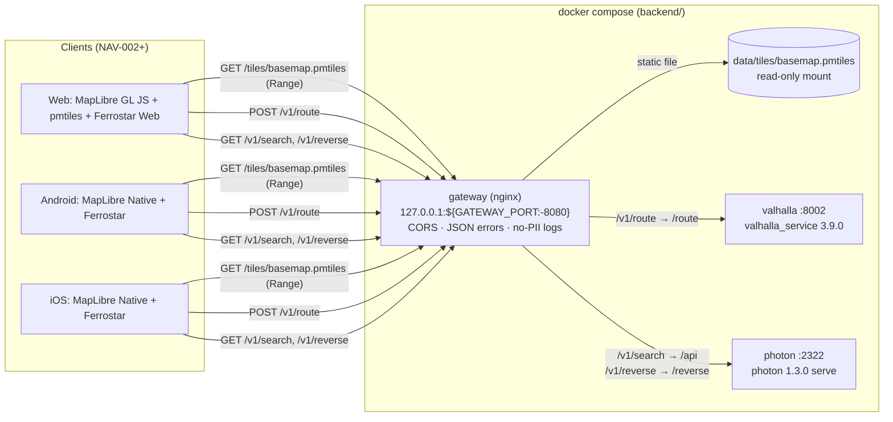
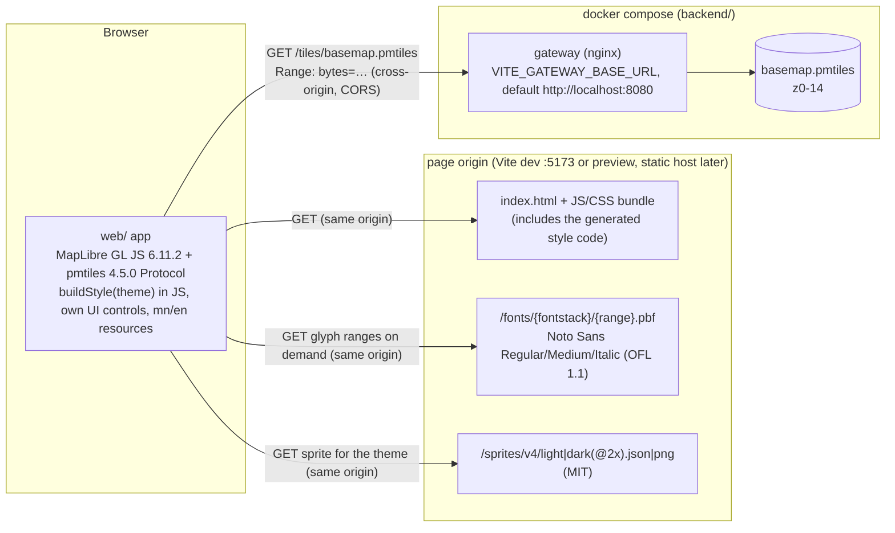
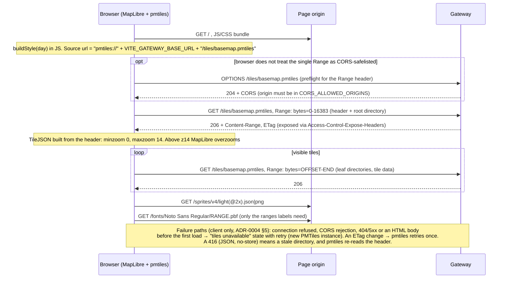
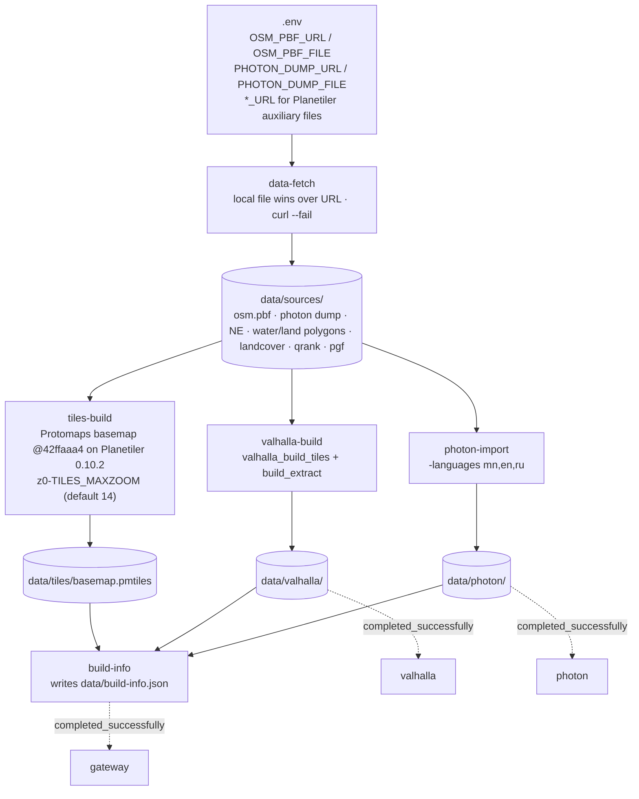
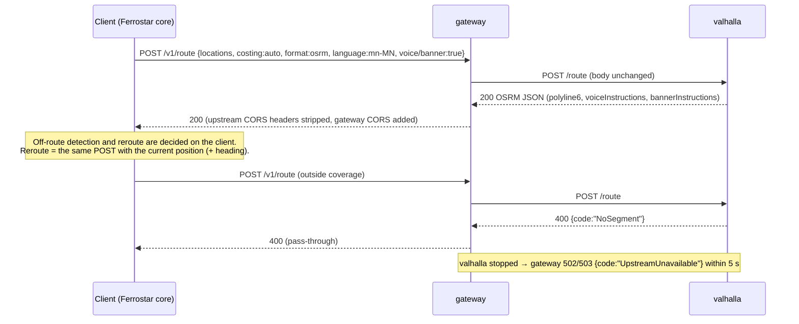

# System overview (owner: architect)

Current scope: **Phase 0**: NAV-001 local dev stack and NAV-002 web demo map. Decisions: ADR-0001 (stack), ADR-0002 (gateway, paths, data build, tile zoom range), ADR-0003 (Photon index source), ADR-0004 (web demo client). Staging hosting is ADR-0005 (proposed, NAV-008). HTTP contract: `api/openapi.yaml` 0.3.0.

## 1. Runtime components (local, one `backend/compose.yaml`)

Only the gateway publishes a port. Valhalla and Photon are reachable only on the compose network.

## 1a. Web client flow (NAV-002, ADR-0004)

The web demo is a static single-page app. It talks to exactly **two hosts** at runtime (NAV-002 AC 46): the **page origin**, which serves the app bundle and the bundled glyphs and sprites, and the **gateway**, which serves only the PMTiles archive. There is no style file on either host: the style is generated in the browser from the pinned `@protomaps/basemaps` package, with the label rule `name:mn` → `name` → `name:en` applied as an override (ADR-0004 §3). No font CDN and no `protomaps.github.io`.

Notes:
- **CORS.** The page origin is a different origin from the gateway, so every tile request is a CORS request with a `Range` header. The gateway allows the `Range` request header and exposes `Content-Range`, `Content-Length`, `ETag` and `Accept-Ranges` (ADR-0002 §3). In dev `CORS_ALLOWED_ORIGINS=*`. Any shared deployment (NAV-008 staging) must list the web origin explicitly.
- **Attribution.** «© OpenStreetMap contributors» (and the ESA WorldCover credit at zoom < 8) is rendered by the app from its resource files, not from the PMTiles metadata (`metadata: false`, ADR-0004 §5-6).
- **Caching.** Bundle, fonts and sprites follow the page origin's static caching. The archive follows the gateway's `Cache-Control: public, max-age=300` with ETag revalidation. The 416 is `no-store`.
- **Later.** Serving style, glyphs and sprites from the gateway is deferred until a second client needs them (ADR-0004 Consequences). Android and iOS bundle their own assets and use the same `getBasemapPmtiles` operation.

## 2. Path map (symbolic names from NAV-001)

| Symbol | Gateway | Upstream | Notes |
|---|---|---|---|
| HEALTH | `GET /health` | nginx itself | `{"status":"ok"}`, < 1 s |
| TILES | `GET/HEAD /tiles/basemap.pmtiles` | static file | 200/206/304, Range + ETag, `Cache-Control: public, max-age=300`. Archive z0-14 by default (`TILES_MAXZOOM=14`, PO decision D1); clients overzoom. 416 has a JSON `GatewayError` body, single CORS headers (AC 43) and `Cache-Control: no-store` (0.3.0, ADR-0002 Amendment 3) |
| ROUTE | `POST /v1/route` (`GET ?json=`) | `valhalla:8002/route` | pass-through, OSRM format |
| SEARCH | `GET /v1/search` | `photon:2322/api` | pass-through GeoJSON |
| REVERSE | `GET /v1/reverse` | `photon:2322/reverse` | pass-through GeoJSON |
| (any) | `OPTIONS *` | gateway | CORS preflight, 204 |

## 3. Data build (one-shot containers, first `up` or `make rebuild-data`)

- Each builder writes to a staging path (`*.tmp` or `*.staging`), validates, renames, and writes a `.complete` marker last. If the marker exists the builder skips the work and logs `reused`. Partial output is deleted and rebuilt (ADR-0002 §4).
- Dev inputs (default, PO decision 2026-09-29, ADR-0002 Amendment 1): the **full Mongolia PBF** from the dev-only mirror `https://geo2day.com/asia/mongolia.pbf` (about 70 MB) and the GraphHopper Mongolia Photon dump (about 8 MB). Optional small/fast alternative: BBBike UlanBator PBF (about 4.4 MB), which excludes P3 and P6. Production inputs: Geofabrik `mongolia-latest` and, from NAV-006, our own Nominatim. `OSM_PBF_URL` / `OSM_PBF_FILE` in `.env` select the source.
- Tile zoom range: z0 to `TILES_MAXZOOM`, default **14** (PO decision D1 of 2026-09-30, ADR-0002 Amendment 3). The z15 figures below are kept for comparison.
- Measured on 2026-09-29, tiles re-measured at z14 on 2026-09-30 (backend README):

  | Step | BBBike UB | Mongolia (default) |
  |---|---|---|
  | Valhalla graph | 3 s, 3.9 MB | 22 s |
  | Photon import | 34 s, 27 MB | 33 s (same dump) |
  | Planetiler | 164 s, PMTiles 2.6 MB (z15, not rebuilt) | z15: 229 s, PMTiles 243,254,233 bytes. **z14 (default since D1): PMTiles 117,536,866 bytes (112.1 MiB)**; tiles-only rebuild 382 s on a shared CPU (upper bound) |
  | Cold first run (empty `data/`, includes about 2.5 GB auxiliary downloads) | 530 s | **462 s** measured 2026-09-29 (AC 1, ≤ 30 min; images already pulled). Downloads 149 s, graph 22 s, Photon 33 s, Maven 101 s + Planetiler 208 s; peak build memory 5.5 GB |
  | Source switch (`make rebuild-data`, auxiliaries cached) | - | 336 s |

## 4. Request flow: route with Mongolian guidance (NAV-004/005 preview)

## 5. Non-functional requirements

| ID | Requirement | Target (Phase 0, reference machine 4 CPU / 15 GB) | Source | Verified by |
|---|---|---|---|---|
| NFR-L1 | Route latency via gateway, UB | p95 ≤ 500 ms (20 sequential, warm) | Project NFR, NAV-001 AC 35 | QA smoke/perf |
| NFR-L2 | Search / reverse latency | p95 ≤ 300 ms | NAV-001 AC 36-37 | QA |
| NFR-L3 | Tile range request latency | p95 ≤ 100 ms | NAV-001 AC 38 | QA |
| NFR-L4 | Error latency | malformed route 400 ≤ 1 s; out-of-coverage 4xx ≤ 3 s; upstream down 502/503 ≤ 5 s | NAV-001 AC 32-34 | QA |
| NFR-A1 | Fault isolation | one upstream down does not affect the other endpoints or the gateway | NAV-001 AC 34 | QA |
| NFR-A2 | Restart from existing data | all services healthy ≤ 120 s, nothing rebuilt | NAV-001 AC 2 | QA |
| NFR-A3 | Clean first run | all services healthy ≤ 30 min, including downloads, on the default Mongolia source | NAV-001 AC 1 | QA |
| NFR-R1 | Resources | steady-state memory ≤ 6 GB total; build peak ≤ 12 GB; `data/` ≤ 10 GB; PMTiles max zoom exactly 14 on the default build and ≤ 200 MB, with a ≤ 400 MB fallback for the Mongolia dev extract (PO decision D1). Measured z14: 117,536,866 bytes, so the primary limit holds | NAV-001 AC 12, 39 | QA |
| NFR-P1 | **No PII in logs.** Coordinates, search text and route bodies are location data | Gateway logs path without query string. No request bodies are logged by gateway, Valhalla or Photon | Project NFR | Architect review |
| NFR-P2 | GPS traces anonymised | N/A in NAV-001 (the backend stores no traces). Applies from the traffic phase | Project NFR | - |
| NFR-N1 | Reroute on client | the backend is stateless per request. Ferrostar decides off-route and calls `/v1/route` again | Project NFR, ADR-0001 | Architect review (NAV-005) |
| NFR-S1 | Exposure | gateway binds `127.0.0.1` by default (`GATEWAY_BIND`). No auth (local dev only). Upstream ports not published | NAV-001 decision | Backend README |
| NFR-C1 | Licensing | all runtime components MIT/BSD/Apache. No GPL service in NAV-001 (Nominatim deferred, ADR-0003). OpenJDK is GPLv2+CE (runtime only) | ADR-0001 | Architect review |
| NFR-C2 | OSM attribution | PMTiles metadata contains "OpenStreetMap". Clients show "© OpenStreetMap contributors" from resources on every map screen | CLAUDE.md rule 8 | NAV-002 review |
| NFR-C3 | Browser-safe errors | every response, including 416 and other gateway errors, carries each `Access-Control-*` header at most once. The tiles 416 also carries `Cache-Control: no-store`, so no cache stores the error under the archive URL | NAV-001 AC 43, `openapi.yaml` 0.2.0 / 0.3.0 | QA e2e |
| NFR-W1 | Web client hosts | at runtime the web demo contacts only the page origin and the gateway. No font, sprite or style CDN | NAV-002 AC 46, ADR-0004 | QA e2e |

These targets are BA-proposed Phase 0 baselines (NAV-001 Open question 3), not production SLAs.

## 6. Known data limitations (dev extract)
- Coverage on the default build is all of Mongolia for tiles, routing and search. On the optional BBBike UB build, tiles and routing cover only the 13 × 4 km box (without P3 and P6), so search can return places that routing cannot reach.
- The default dev PBF comes from a third-party mirror (geo2day.com) because `download.geofabrik.de` is blocked from the dev container. Its data date and integrity are recorded in `data/build-info.json` (`sha256`, HTTP `Last-Modified`; the header has no replication timestamp) but are not guaranteed. Never use it in production.
- The Protomaps tiles have no `name:mn`, so clients label with `name` (ADR-0002).
- Durations use road-class defaults because `maxspeed` is sparse. There is no traffic until Phase 3.
- The Valhalla `mn-MN` narrative is present (for example "Д.Сүхбаатарын гудамж дээр өмнөд жолоодоорой…"). Quality review by a native speaker is out of scope. Observed: some pedestrian strings contain zero-width spaces (U+200B), for example "явган хүний ​​зам", which matters for TTS in NAV-005.
