# System overview (owner: architect)

Current scope: **Phase 0** (NAV-001 local dev stack, NAV-002 to NAV-004 web demo) and the first **Phase 1** client, NAV-005 Android guidance (in design). Decisions:
- ADR-0001: stack
- ADR-0002: gateway, paths, data build, tile zoom range
- ADR-0003: Photon index source
- ADR-0004: web demo client
- ADR-0005: staging hosting (accepted for staging on 2026-09-30; production path still proposed, NAV-008/NAV-009), deployed as in `deployment-staging.md`
- ADR-0006: web search
- ADR-0008: client-side instruction text
- ADR-0009: Android guidance client
- ADR-0010: Mongolian voice clip pack (proposed)
- ADR-0011: web demo mode (offline replay)
- ADR-0012: Android route preview and search parity (NAV-011)
- ADR-0013: Android background guidance, restore and lock screen (NAV-012)
- ADR-0014: daily rebuild slots and pointer switch (NAV-006)
- ADR-0015: Android route preview points (chosen start, swap) and turn list (NAV-018)
- ADR-0016: Android demo build (offline replay through the real guidance engine, NAV-019)
- ADR-0017: offline Mongolia pack for Android (PMTiles monthly, Valhalla graph + SQLite search DB weekly, per-file versioned; online first with on-device routing and search as fallback; engine in a separate process). **Accepted** (PO 2026-10-04); openapi 0.6.0 `packs` operations

HTTP contract: `api/openapi.yaml` 0.6.1 (0.6.0 added the `packs` operations; 0.6.1 is documentation only). Task breakdowns per story: `tasks/` (NAV-020 to NAV-023).

## 1. Runtime components (local, one `backend/compose.yaml`)

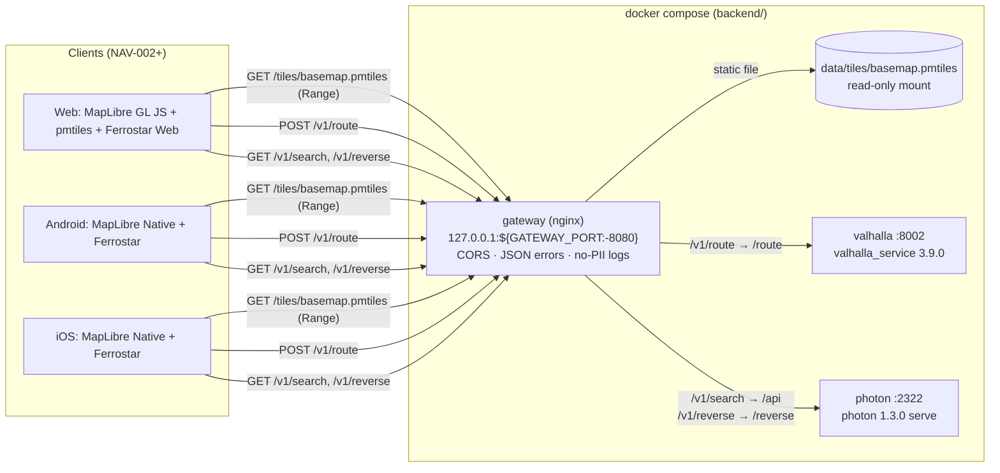

Only the gateway publishes a port. Valhalla and Photon are reachable only on the compose network.

## 1a. Web client flow (NAV-002, ADR-0004)

The web demo is a static single-page app. It talks to exactly **two hosts** at runtime (NAV-002 AC 46): the **page origin**, which serves the app bundle and the bundled glyphs and sprites, and the **gateway**, which serves only the PMTiles archive. There is no style file on either host: the style is generated in the browser from the pinned `@protomaps/basemaps` package, with the label rule `name:mn` → `name` → `name:en` applied as an override (ADR-0004 §3). No font CDN and no `protomaps.github.io`.

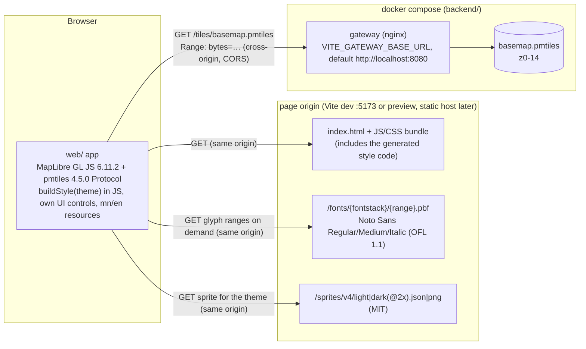

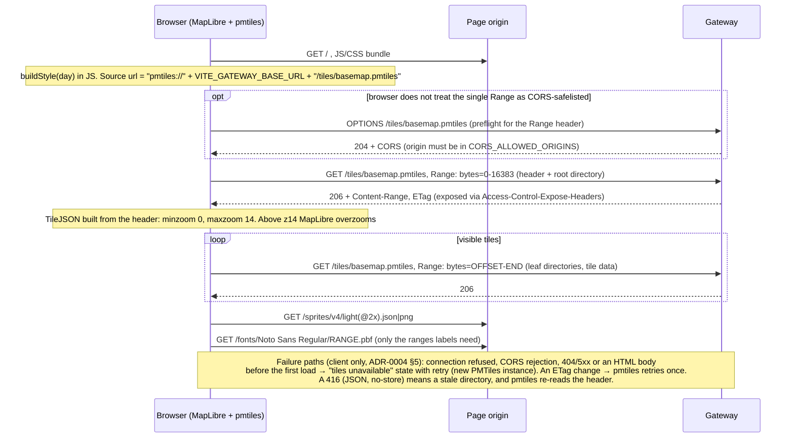

Notes:
- **CORS.** The page origin is a different origin from the gateway, so every tile request is a CORS request with a `Range` header. The gateway allows the `Range` request header and exposes `Content-Range`, `Content-Length`, `ETag`, `Accept-Ranges` and, since openapi 0.4.0, `Retry-After` (ADR-0002 §3). In dev `CORS_ALLOWED_ORIGINS=*`. Any shared deployment (NAV-008 staging) must list the web origin explicitly.
- **Attribution.** «© OpenStreetMap contributors» (and the ESA WorldCover credit at zoom < 8) is rendered by the app from its resource files, not from the PMTiles metadata (`metadata: false`, ADR-0004 §5-6).
- **Caching.** Bundle, fonts and sprites follow the page origin's static caching. The archive follows the gateway's `Cache-Control: public, max-age=300` with ETag revalidation. The 416 is `no-store`.
- **Later.** Serving style, glyphs and sprites from the gateway is deferred until a second client needs them (ADR-0004 Consequences). Android and iOS bundle their own assets and use the same `getBasemapPmtiles` operation.

## 1b. Web search flow (NAV-003, ADR-0006)

Search adds no host and no endpoint: the web demo calls the existing `search` and `reverse` pass-through operations on the gateway (NAV-002 AC 46 still holds: page origin + gateway only). Query assistance and request control are pure client code in `web/src/search/` (ADR-0006 §2-3).

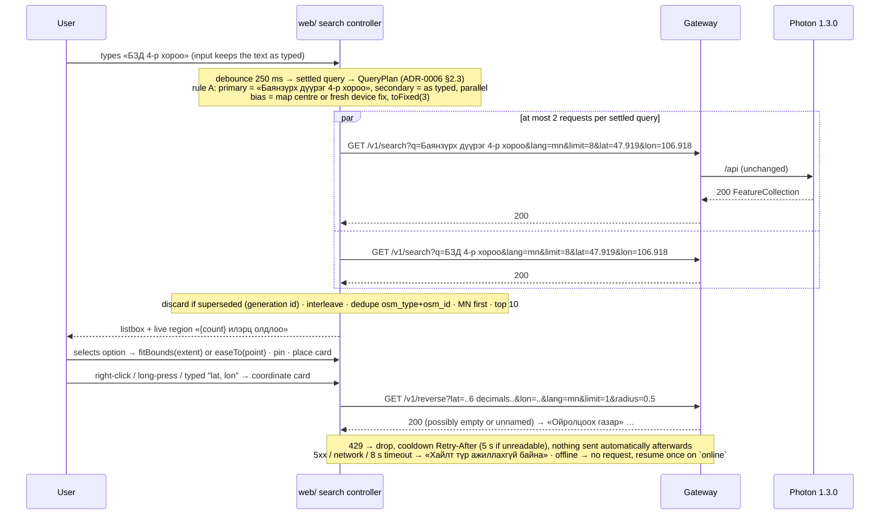

## 1c. Android guidance client (NAV-005, ADR-0009)

The Android app adds **no host and no endpoint**. At runtime it talks only to the configured gateway (NAV-005 AC 65): `pmtiles://` Range reads of the basemap, `GET /v1/search`, and `POST /v1/route` for the preview and for reroutes. Style JSON, glyphs and sprites are bundled in the APK; the glyphs and sprites are synced at build time from the vendored copy under `web/public/`. Ferrostar's Rust core navigates on the device. The app owns the route client, the text and the reroute policy.

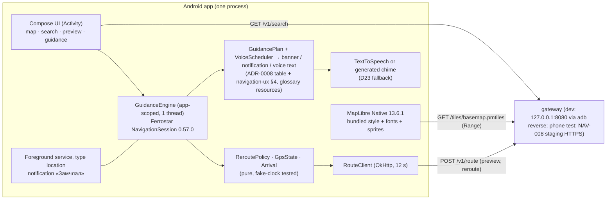

```mermaid
sequenceDiagram
  participant U as Driver
  participant A as App (GuidanceEngine)
  participant F as Ferrostar NavigationSession
  participant G as Gateway → Valhalla
  U->>A: destination (search / long-press), preview
  A->>G: POST /v1/route {alternates:0, voice+banner, language mn-MN}
  G-->>A: 200 OSRM
  Note over A: build GuidancePlan, replace Valhalla text with tokens, parse with Ferrostar's OSRM parser
  U->>A: «Эхлэх» (0 extra requests), foreground service starts
  loop every fix (1 Hz, GPS_PROVIDER)
    A->>F: updateUserLocation
    F-->>A: TripState (step, distances, deviation, spoken trigger)
    Note over A: banner from plan · voice schedule (navigation-ux §4) · GPS-loss and arrival checks
  end
  Note over A: 3 good fixes > 50 m off route → off-route episode<br/>banner «Маршрутыг дахин тооцоолж байна», «Та маршрутаас гарлаа»
  A->>G: POST /v1/route {locations[0]=current (+heading), same costing/options/language}
  alt 200
    G-->>A: new route → new session (generation + 1)
  else 429 Retry-After n
    G-->>A: 429 → wait n s (5 if unreadable), then exactly 1 retry
  else 5xx / network / 12 s timeout
    Note over A: back-off 5, 10, 20, 30 s; ≤ 1 in flight, ≥ 5 s apart, ≤ 6 per 60 s
  end
  Note over A: arrival (≤ 30 m) → once, service and location stop
```

## 1c-bis. Android route preview and search parity (NAV-011, ADR-0012)

Still **no new host and no new endpoint**. Compared with NAV-005, the app now also calls `GET /v1/reverse` (one per coordinate card), sends up to 2 assisted `search` requests per settled query (ADR-0006 rules ported to Kotlin, tested against the shared fixture `web/src/search/queryPlan.vectors.json`), and asks for `alternates: 2` (and `bicycle`) in preview requests. Reroutes are unchanged (`alternates: 0`). The typing lock reads foreground-only GPS fixes on the device and sends nothing.

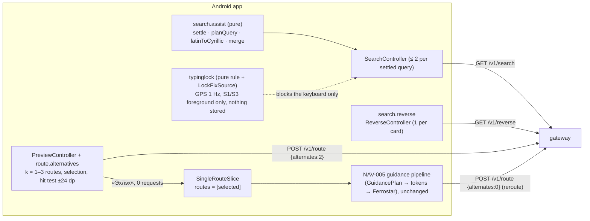

## 1c-ter. Android route preview points and turn list (NAV-018, ADR-0015)

There is **no new host, endpoint or field**. The start of a preview route may now be a chosen point (a search result, a long-press map point, or a typed coordinate, NAV-011 D140), and the user can swap start and destination. Each point change or swap sends one `POST /v1/route` with the NAV-011 body.

The turn list «Маршрутын заавар» is built on the phone from the steps of the selected route. That route was already parsed when the response arrived, and the text comes from the ADR-0008 rules, so the list sends 0 requests. «Эхлэх» is enabled only when the start is «Миний байршил» (NAV-018 Open question 1, default (a)). Guidance and reroute are therefore unchanged.

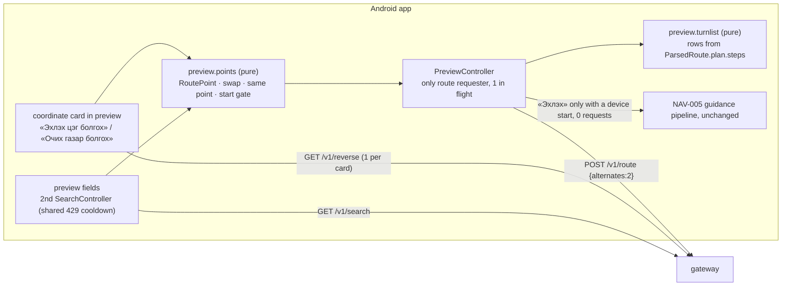

## 1d. Web demo mode (NAV-017, ADR-0011)

A **separate build** of the web client (`npm run build:demo-mode` → `dist-demo-mode/`) that the PO uploads by hand into a **public sub-folder** of the shared web hosting, with no password (D107, 2026-10-03, supersedes the password part of D74; the page keeps `noindex`; folder and host names are never in the repo, D35). It replays three recorded UB routes (R1–R3) with simulated turn-by-turn guidance. It sends **0** requests to `search`, `reverse` or `route` and has no backend. The public static site (D44) and its build are unchanged.

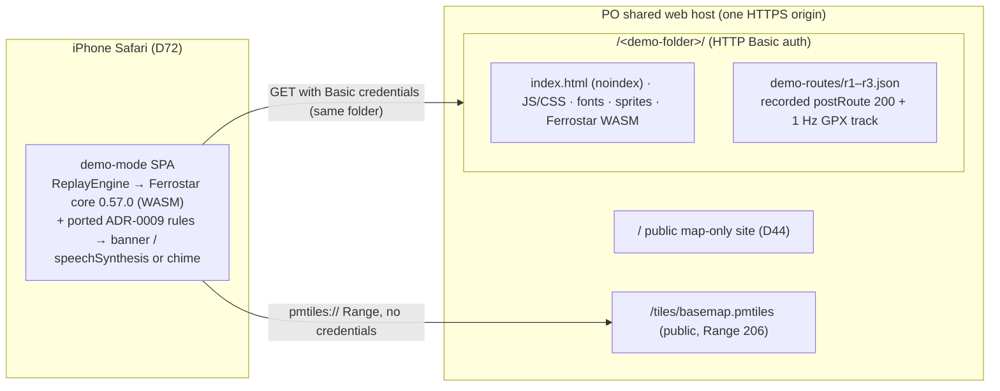

- **Build inputs (read-only):** the recorded responses under `mobile/android/app/src/test/resources/routes/`, the GPX tracks under `tests/gpx/nav005/`, and the manifest `web/src/demo/routes.manifest.json`. The cross-platform guard is `tests/gpx/nav005/golden/voice-golden.tsv`, the same file the Android client is tested against.
- **Hosts at runtime:** the page origin only. The demo folder serves the app and data, and the origin root serves the public tile archive. No other host is contacted, and there is no service worker.
- **Deployment:** manual upload of the build output's contents. After every upload, three checks: 401 without credentials, 200 with them, and 206 for the archive Range request (NAV-017 AC 5). Re-uploading the public site must not delete the demo folder.

## 1e. Android demo build (NAV-019, ADR-0016)

A third Android build type, `demo` (`mn.navmn.app.demo`, launcher label «Туршилтын горим», signed with the local debug key, not debuggable). It is installed next to the debug app and given to the PO by direct file transfer only (D17). It replays the three NAV-017 routes (R1–R3) through the **unchanged** NAV-005 guidance engine, service, notification and lock-screen path. Only three things are replaced: the location source (recorded GPX at track time), the engine clock (replay time, frozen while paused) and the HTTP layer (blocked in-process). It has **no backend** and contacts no host.

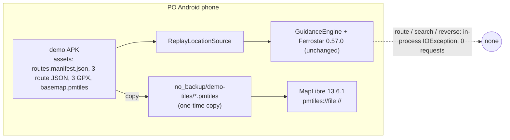

- **Build inputs (read-only, copied at build time):** `web/src/demo/routes.manifest.json`, the recorded responses under `mobile/android/app/src/test/resources/routes/`, the GPX tracks under `tests/gpx/nav005/`, and a local tile archive named by `nav.demoTilesFile` (or an `https` archive URL in `nav.demoTilesUrl`). The property values are never committed.
- **Hosts at runtime:** none with `nav.demoTilesFile`. With `nav.demoTilesUrl`, only HTTP Range requests to that archive.
- **Contract:** none used; `openapi.yaml` unchanged.

## 2. Path map (symbolic names from NAV-001)

| Symbol | Gateway | Upstream | Notes |
|---|---|---|---|
| HEALTH | `GET /health` | nginx itself | `{"status":"ok"}`, < 1 s |
| TILES | `GET/HEAD /tiles/basemap.pmtiles` | static file | 200/206/304, Range + ETag, `Cache-Control: public, max-age=300`. Archive z0-14 by default (`TILES_MAXZOOM=14`, PO decision D1); clients overzoom. 416 has a JSON `GatewayError` body, single CORS headers (AC 43) and `Cache-Control: no-store` (0.3.0, ADR-0002 Amendment 3) |
| ROUTE | `POST /v1/route` (`GET ?json=`) | `valhalla:8002/route` | pass-through, OSRM format |
| SEARCH | `GET /v1/search` | `photon:2322/api` | pass-through GeoJSON |
| REVERSE | `GET /v1/reverse` | `photon:2322/reverse` | pass-through GeoJSON |
| (any) | `OPTIONS *` | gateway | CORS preflight, 204 |

## 3. Data build (one-shot containers, first `up` or `make rebuild-data`)

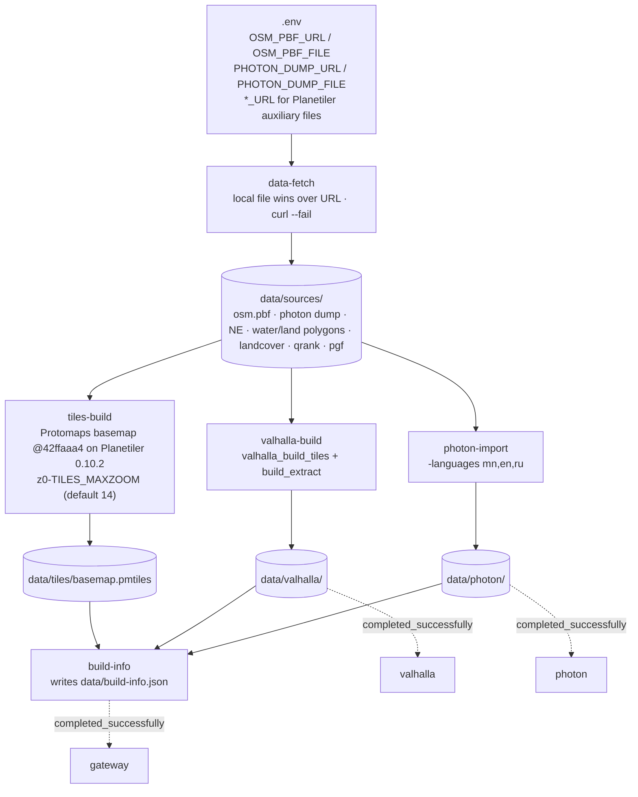

- Each builder writes to a staging path (`*.tmp` or `*.staging`), validates, renames, and writes a `.complete` marker last. If the marker exists the builder skips the work and logs `reused`. Partial output is deleted and rebuilt (ADR-0002 §4).
- Dev inputs (default, PO decision 2026-09-29, ADR-0002 Amendment 1): the **full Mongolia PBF** from the dev-only mirror `https://geo2day.com/asia/mongolia.pbf` (about 70 MB) and the GraphHopper Mongolia Photon dump (about 8 MB). Optional small/fast alternative: BBBike UlanBator PBF (about 4.4 MB), which excludes P3 and P6. Production inputs: Geofabrik `mongolia-latest` and, from NAV-006, our own Nominatim. `OSM_PBF_URL` / `OSM_PBF_FILE` in `.env` select the source.
- Tile zoom range: z0 to `TILES_MAXZOOM`, default **14** (PO decision D1 of 2026-09-30, ADR-0002 Amendment 3). The z15 figures below are kept for comparison.
- Measured on 2026-09-29, tiles re-measured at z14 on 2026-09-30 (backend README):

  | Step | BBBike UB | Mongolia (default) |
  |---|---|---|
  | Valhalla graph | 3 s, 3.9 MB | 22 s |
  | Photon import | 34 s, 27 MB | 33 s (same dump) |
  | Planetiler | 164 s, PMTiles 2.6 MB (z15, not rebuilt) | z15: 229 s, PMTiles 243,254,233 bytes. **z14 (default since D1): PMTiles 117,536,866 bytes (112.1 MiB)**; tiles-only rebuild 382 s on a shared CPU (upper bound) |
  | Cold first run (empty `data/`, includes about 2.5 GB auxiliary downloads) | 530 s | **462 s** measured 2026-09-29 (AC 1, ≤ 30 min; images already pulled). Downloads 149 s, graph 22 s, Photon 33 s, Maven 101 s + Planetiler 208 s; peak build memory 5.5 GB |
  | Source switch (`make rebuild-data`, auxiliaries cached) | - | 336 s |

## 3a. Daily rebuild with slots and a pointer switch (NAV-006, ADR-0014)
Slot mode (`backend/compose.slots.yaml`; staging, and the NAV-006 test project) replaces the one-shot flow of §3 for serving hosts. The dev stack in §3 is unchanged.

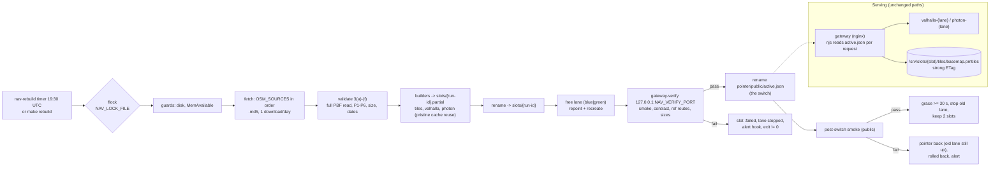

- The switch is one atomic `rename(2)`: each request reads either the old or the new pointer completely. No nginx reload, no container change, no closed keep-alive connection (spike in ADR-0014).
- Web PMTiles clients (`pmtiles` 4.5.0) detect the `ETag` change, reload the header and retry once (AC 16). MapLibre Native: not verified yet (NAV-006 R6).
- Status is local only (`make status`). There is no HTTP data-version field (ADR-0014 §9); `openapi.yaml` is unchanged.

## 4. Request flow: route with Mongolian guidance (NAV-004/005 preview)

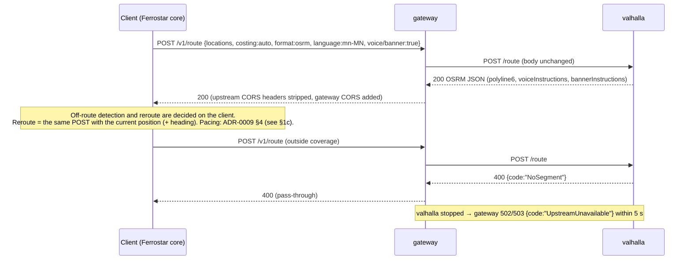

## 5. Non-functional requirements

| ID | Requirement | Target (Phase 0, reference machine 4 CPU / 15 GB) | Source | Verified by |
|---|---|---|---|---|
| NFR-L1 | Route latency via gateway, UB | p95 ≤ 500 ms (20 sequential, warm) | Project NFR, NAV-001 AC 35 | QA smoke/perf |
| NFR-L2 | Search / reverse latency | p95 ≤ 300 ms | NAV-001 AC 36-37 | QA |
| NFR-L3 | Tile range request latency | p95 ≤ 100 ms | NAV-001 AC 38 | QA |
| NFR-L4 | Error latency | malformed route 400 ≤ 1 s; out-of-coverage 4xx ≤ 3 s; upstream down 502/503 ≤ 5 s | NAV-001 AC 32-34 | QA |
| NFR-A1 | Fault isolation | one upstream down does not affect the other endpoints or the gateway | NAV-001 AC 34 | QA |
| NFR-A2 | Restart from existing data | all services healthy ≤ 120 s, nothing rebuilt | NAV-001 AC 2 | QA |
| NFR-A3 | Clean first run | all services healthy ≤ 30 min, including downloads, on the default Mongolia source | NAV-001 AC 1 | QA |
| NFR-A4 | Data replacement without failures | daily rebuild switch and `make rollback`: **0** failed requests in a ≥ 10 requests/s mixed loop (keep-alive and new connections); p95 in the switch window ≤ 2 × the p95 before it; a failed build never switches | NAV-006 AC 14–18, 33; ADR-0014 | QA light set |
| NFR-D1 | Data freshness | active OSM data ≤ 48 h old, otherwise `stale: true` + alert; run start to end of switch ≤ 30 min on staging | NAV-006 AC 3(f), 10, 29; NAV-008 AC 15 | QA (dev: recorded only), staging |
| NFR-R1 | Resources | steady-state memory ≤ 6 GB total; build peak ≤ 12 GB; `data/` ≤ 10 GB; PMTiles max zoom exactly 14 on the default build and ≤ 200 MB, with a ≤ 400 MB fallback for the Mongolia dev extract (PO decision D1). Measured z14: 117,536,866 bytes, so the primary limit holds | NAV-001 AC 12, 39 | QA |
| NFR-P1 | **No PII in logs.** Coordinates, search text and route bodies are location data | Gateway logs path without query string. No request bodies are logged by gateway, Valhalla or Photon | Project NFR | Architect review |
| NFR-P2 | GPS traces anonymised | N/A in NAV-001 (the backend stores no traces). Applies from the traffic phase | Project NFR | - |
| NFR-N1 | Reroute on client | the backend is stateless per request. The client decides off-route (Ferrostar deviation + app debounce) and calls `/v1/route` again. Per device: ≤ 1 in flight, starts ≥ 5 s apart, ≤ 6 per 60 s, `Retry-After` honoured, back-off after failures | Project NFR, ADR-0001, ADR-0009 §4 | Architect review; NAV-005 AC 44 fake-clock test |
| NFR-N2 | Guidance without network | banners, voice, progress and arrival keep working on the downloaded route; 0 route requests while on the route | NAV-005 AC 54 | QA replay (network off) |
| NFR-M1 | Android client hosts | at runtime the app contacts only the configured gateway base URL. No analytics, crash reporting, map telemetry, style, font or sprite CDN | NAV-005 AC 65, ADR-0009 §6, §11 | QA interceptor + dependency review |
| NFR-P4 | On-device privacy | no coordinates, route bodies or search text in Logcat, files or preferences; no Ferrostar recorder or cache; after guidance only the settings remain; `allowBackup=false` | NAV-005 AC 67, ADR-0009 §11 | Robolectric log/storage scan |
| NFR-S1 | Exposure | gateway binds `127.0.0.1` by default (`GATEWAY_BIND`). No auth (local dev only). Upstream ports not published | NAV-001 decision | Backend README |
| NFR-C1 | Licensing | all runtime components MIT/BSD/Apache. No GPL service in NAV-001 (Nominatim deferred, ADR-0003). OpenJDK is GPLv2+CE (runtime only) | ADR-0001 | Architect review |
| NFR-C2 | OSM attribution | PMTiles metadata contains "OpenStreetMap". Clients show "© OpenStreetMap contributors" from resources on every map screen | CLAUDE.md rule 8 | NAV-002 review |
| NFR-C3 | Browser-safe errors | every response, including 416 and other gateway errors, carries each `Access-Control-*` header at most once. The tiles 416 also carries `Cache-Control: no-store`, so no cache stores the error under the archive URL | NAV-001 AC 43, `openapi.yaml` 0.2.0 / 0.3.0 | QA e2e |
| NFR-W1 | Web client hosts | at runtime the web demo contacts only the page origin and the gateway. No font, sprite or style CDN | NAV-002 AC 46, ADR-0004 | QA e2e |
| NFR-L5 | Search-as-you-type in the web demo | results or «Илэрц олдсонгүй» rendered ≤ 1,000 ms after the last keystroke for ≥ 19 of 20 samples; debounce 250 ms; loading shown after 300 ms; unavailable state within 8 s, never an endless spinner | NAV-003 AC 3, 12, 13, 33 | QA e2e |
| NFR-P3 | Search bias privacy | bias `lat`/`lon` at most 3 decimals; only `search` (bias) and `reverse` (user-chosen point) carry coordinates; no query text or coordinates in storage or the console | NAV-003 AC 9, 46; ADR-0006 §3 | QA e2e, architect review |
| NFR-W2 | Web demo-mode hosts and backend calls | the demo-mode build contacts only its page origin (demo folder plus `/tiles/basemap.pmtiles`); **0** `search`/`reverse`/`route` requests; no service worker; public builds contain 0 bytes of demo code | NAV-017 AC 4, 42; ADR-0011 §1, §2 | QA e2e request log, build-output scan |
| NFR-P5 | Web demo-mode privacy | Geolocation never called; storage holds only theme, language and voice-mute; 0 coordinates in storage, console or URL; voice names never stored or sent; password, `.htpasswd`, host names and IPs never in the repo | NAV-017 AC 6, 14, 43; D35, D74 | QA storage/console scan, repo scan |
| NFR-L6 | Web demo-mode replay timing | simulated fix applied ± 100 ms of its track time at 1×; prompts within ± 2 s of the shared golden set; core cost ≤ 1 ms per fix on the main thread (measured 0.2–0.8 ms in Node, ADR-0011 W2) | NAV-017 AC 12, 26 | Vitest fake clock + golden test |
| NFR-R2 | Search request budget (web and, from NAV-011, Android) | ≤ 2 `search` requests per settled query, 1 `reverse` per coordinate card, no automatic retry except one resume when the network returns; 429 honoured per operation | NAV-003 AC 3, 15, 35, 36; NAV-011 AC 2–4, 7, 11, 12; openapi 0.4.0 rate-limit rules | QA e2e (web); JVM/Robolectric request capture (Android) |
| NFR-P6 | Typing-lock privacy (Android) | lock fixes only while the map or route preview is in the foreground; 0 network requests and 0 stored values from the lock; passenger override in process memory only (never restored after a restart) | NAV-011 AC 27, 28, 34; ADR-0012 §7 | Robolectric log/storage scan, process-recreation test |
| NFR-P7 | Route-preview points privacy (Android) | start and destination (a chosen start may be a customer's pickup) live in ViewModel memory only: never logged, stored or restored after process death; the device position is sent only in a route body whose point is «Миний байршил» (and as the D30 bias), never as a `reverse` point | NAV-018 AC 31–33; ADR-0015 §10 | Robolectric log/storage scan, request capture |

These targets are BA-proposed Phase 0 baselines (NAV-001 Open question 3), not production SLAs.

## 6. Known data limitations (dev extract)
- Coverage on the default build is all of Mongolia for tiles, routing and search. On the optional BBBike UB build, tiles and routing cover only the 13 × 4 km box (without P3 and P6), so search can return places that routing cannot reach.
- The default dev PBF comes from a third-party mirror (geo2day.com) because `download.geofabrik.de` is blocked from the dev container. Its data date and integrity are recorded in `data/build-info.json` (`sha256`, HTTP `Last-Modified`; the header has no replication timestamp) but are not guaranteed. Never use it in production.
- The Protomaps tiles have no `name:mn`, so clients label with `name` (ADR-0002).
- Search index (measured 2026-09-30, ADR-0006 Context): no Cyrillic/Latin transliteration and no ү/у, ө/о folding in Photon; `district` in UB is the neighbourhood (`place=suburb`), and **no field carries the düüreg** (NAV-003 R1); khoroo boundaries are missing, and only khoroo offices are found (R4); `reverse` can return an unnamed building. Fixes are backend/data follow-ups via triage (ADR-0006 Consequences).
- Durations use road-class defaults because `maxspeed` is sparse. There is no traffic until Phase 3.
- The Valhalla `mn-MN` narrative is present (for example "Д.Сүхбаатарын гудамж дээр өмнөд жолоодоорой…"). Quality review by a native speaker is out of scope. Observed: some pedestrian strings contain zero-width spaces (U+200B), for example "явган хүний ​​зам", which matters for TTS in NAV-005.
