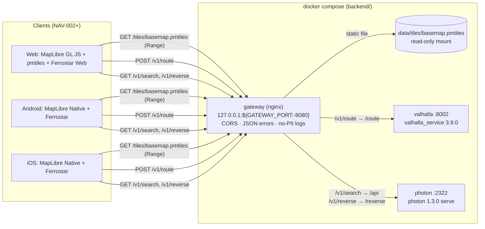
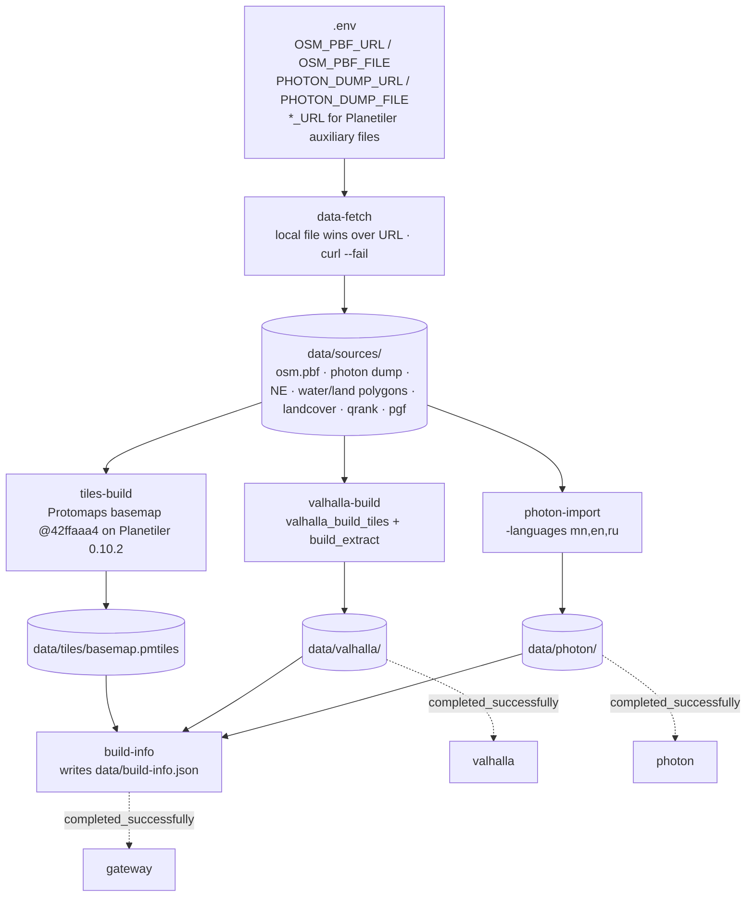
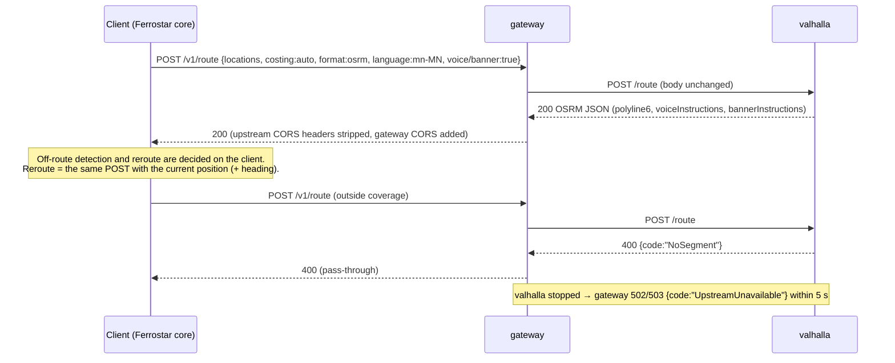

# System overview (owner: architect)

Current scope: **Phase 0 / NAV-001 local dev stack**. Decisions: ADR-0001 (stack), ADR-0002 (gateway, paths, data build), ADR-0003 (Photon index source). HTTP contract: `api/openapi.yaml`.

## 1. Runtime components (local, one `backend/compose.yaml`)

Only the gateway publishes a port. Valhalla and Photon are reachable only on the compose network.

## 2. Path map (symbolic names from NAV-001)

| Symbol | Gateway | Upstream | Notes |
|---|---|---|---|
| HEALTH | `GET /health` | nginx itself | `{"status":"ok"}`, < 1 s |
| TILES | `GET/HEAD /tiles/basemap.pmtiles` | static file | 200/206/304/416, Range + ETag |
| ROUTE | `POST /v1/route` (`GET ?json=`) | `valhalla:8002/route` | pass-through, OSRM format |
| SEARCH | `GET /v1/search` | `photon:2322/api` | pass-through GeoJSON |
| REVERSE | `GET /v1/reverse` | `photon:2322/reverse` | pass-through GeoJSON |
| (any) | `OPTIONS *` | gateway | CORS preflight, 204 |

## 3. Data build (one-shot containers, first `up` or `make rebuild-data`)

- Each builder writes to a staging path (`*.tmp` or `*.staging`), validates, renames, and writes a `.complete` marker last. If the marker exists the builder skips the work and logs `reused`. Partial output is deleted and rebuilt (ADR-0002 §4).
- Dev inputs: BBBike UlanBator PBF (about 4.4 MB) and the GraphHopper Mongolia Photon dump (about 8 MB). Production inputs: Geofabrik `mongolia-latest` and, from NAV-006, our own Nominatim.
- Measured on 2026-09-29 (UB extract):
  - Valhalla graph: about 2 s, 3.9 MB
  - Photon import: 31 s, 27 MB
  - Planetiler: not yet measured; dominated by about 2.5 GB of auxiliary downloads cached in `data/sources/`

## 4. Request flow: route with Mongolian guidance (NAV-004/005 preview)

## 5. Non-functional requirements

| ID | Requirement | Target (Phase 0, reference machine 4 CPU / 15 GB) | Source | Verified by |
|---|---|---|---|---|
| NFR-L1 | Route latency via gateway, UB | p95 ≤ 500 ms (20 sequential, warm) | Project NFR, NAV-001 AC 35 | QA smoke/perf |
| NFR-L2 | Search / reverse latency | p95 ≤ 300 ms | NAV-001 AC 36-37 | QA |
| NFR-L3 | Tile range request latency | p95 ≤ 100 ms | NAV-001 AC 38 | QA |
| NFR-L4 | Error latency | malformed route 400 ≤ 1 s; out-of-coverage 4xx ≤ 3 s; upstream down 502/503 ≤ 5 s | NAV-001 AC 32-34 | QA |
| NFR-A1 | Fault isolation | one upstream down does not affect the other endpoints or the gateway | NAV-001 AC 34 | QA |
| NFR-A2 | Restart from existing data | all services healthy ≤ 120 s, nothing rebuilt | NAV-001 AC 2 | QA |
| NFR-A3 | Clean first run | all services healthy ≤ 30 min | NAV-001 AC 1 | QA |
| NFR-R1 | Resources | steady-state memory ≤ 6 GB total; build peak ≤ 12 GB; `data/` ≤ 10 GB; PMTiles ≤ 200 MB | NAV-001 AC 12, 39 | QA |
| NFR-P1 | **No PII in logs.** Coordinates, search text and route bodies are location data | Gateway logs path without query string. No request bodies are logged by gateway, Valhalla or Photon | Project NFR | Architect review |
| NFR-P2 | GPS traces anonymised | N/A in NAV-001 (the backend stores no traces). Applies from the traffic phase | Project NFR | - |
| NFR-N1 | Reroute on client | the backend is stateless per request. Ferrostar decides off-route and calls `/v1/route` again | Project NFR, ADR-0001 | Architect review (NAV-005) |
| NFR-S1 | Exposure | gateway binds `127.0.0.1` by default (`GATEWAY_BIND`). No auth (local dev only). Upstream ports not published | NAV-001 decision | Backend README |
| NFR-C1 | Licensing | all runtime components MIT/BSD/Apache. No GPL service in NAV-001 (Nominatim deferred, ADR-0003). OpenJDK is GPLv2+CE (runtime only) | ADR-0001 | Architect review |
| NFR-C2 | OSM attribution | PMTiles metadata contains "OpenStreetMap". Clients show "© OpenStreetMap contributors" from resources on every map screen | CLAUDE.md rule 8 | NAV-002 review |

These targets are BA-proposed Phase 0 baselines (NAV-001 Open question 3), not production SLAs.

## 6. Known data limitations (dev extract)
- Coverage is the UB bounding box for tiles and routing, and all of Mongolia for search (ADR-0003). Search can return places that dev routing cannot reach.
- The Protomaps tiles have no `name:mn`, so clients label with `name` (ADR-0002).
- Durations use road-class defaults because `maxspeed` is sparse. There is no traffic until Phase 3.
- The Valhalla `mn-MN` narrative is present (for example "Д.Сүхбаатарын гудамж дээр өмнөд жолоодоорой…"). Quality review by a native speaker is out of scope. Observed: some pedestrian strings contain zero-width spaces (U+200B), for example "явган хүний ​​зам", which matters for TTS in NAV-005.
