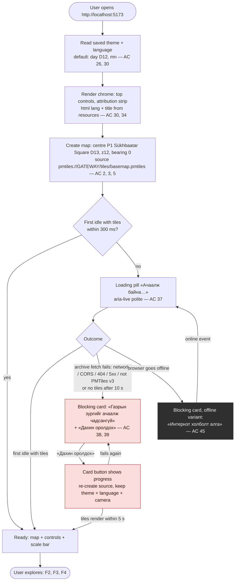
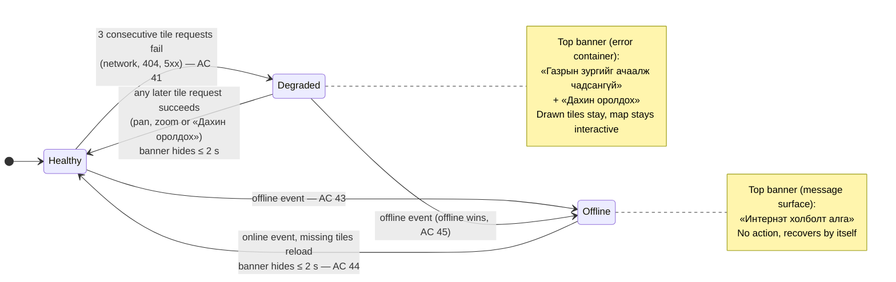
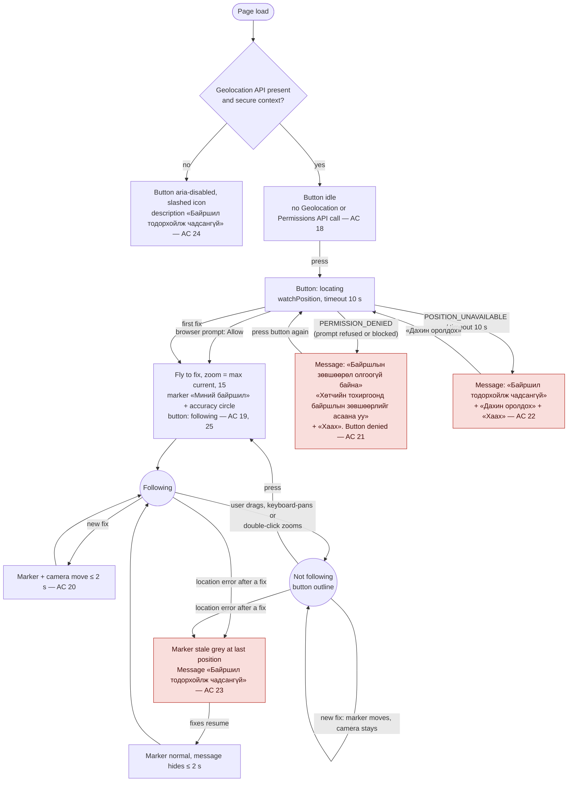
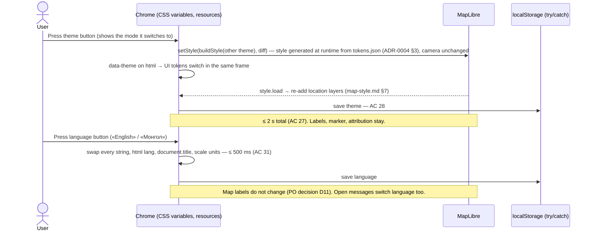
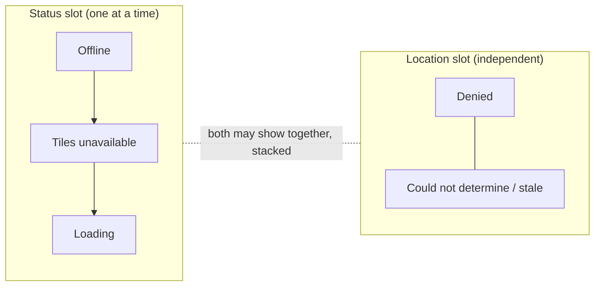

# Flow NAV-002: Web demo map

- **Story:** [NAV-002](../../requirements/stories/NAV-002-web-demo-map.md) (AC referenced per step)
- **Screen:** [`screens/NAV-002-web-map.md`](../screens/NAV-002-web-map.md) (one screen with overlays; no navigation between screens)
- **Style / tokens:** [`map-style.md`](../map-style.md), [`tokens.json`](../tokens.json)
- **Prototype:** [`prototypes/NAV-002-web-map.html`](../prototypes/NAV-002-web-map.html) (static wireframe, every state, day/night, mn/en)

Copy in the diagrams is quoted by resource key (see the screen spec, §Copy). Mongolian strings in brackets are the `mn` values.

## F1. Open the page (happy path and tile errors)

Notes
- The loading pill never shows before 300 ms, so a fast load has no flash (AC 37). It hides within 500 ms of the first `idle`.
- There is no endless spinner: the 10 s watchdog always ends in Ready or the blocking card (AC 38).
- Opening view P1 = Sükhbaatar Square (PO decision D13). Supported browsers: current desktop Chrome, Edge, Firefox and Android Chrome; Safari/iOS later (D14, AC 50).
- WebGL unavailable or an unexpected start-up exception (not in the AC, generic error row in the glossary): blocking card with «Алдаа гарлаа» + «Дахин оролдох» (reloads the page). The attribution stays visible.

## F2. Tile errors and connectivity while the map is shown

- Archive replaced on the gateway mid-session (new ETag after a NAV-001 rebuild, AC 42): the failing requests count toward Degraded. «Дахин оролдох» clears the PMTiles header/directory cache and re-requests the visible tiles, so it picks up the new archive. The map is never blank without a message for more than 10 s.
- Empty areas (countryside, outside the extract such as X2 Beijing) are **not** errors: requests succeed with empty tiles, so the state stays Healthy (AC 10). Missing glyph ranges are not tile errors either.

## F3. My location

Rules
- No Geolocation **and no Permissions API** call and no permission prompt until the first press (AC 18; ADR-0004 §6, confirmed as normative by ADR-0004 Amendment 1). The page does **not** call `navigator.permissions.query` at load, so an already-blocked permission is not pre-styled: the button starts `idle`, and the `denied` state appears only after the first press returns `PERMISSION_DENIED` (within 1 s, AC 21). The only check at load is support: `window.isSecureContext && "geolocation" in navigator` (AC 24).
- From `denied`, a press starts a new request (`REQ`). If the user has meanwhile allowed location in the browser settings, it succeeds and goes to the first fix; otherwise the browser returns `PERMISSION_DENIED` again at once and the message shows again (AC 21).
- Zooming with the wheel or pinch while following zooms **around the centre** (the marker), so following continues (Google Maps pattern). Double-click zooms at the pointer, so it ends following. Rotation and the zoom buttons keep following.
- Position outside Mongolia (X2): same as any fix, no message (AC 25).
- Coordinates never leave the browser (AC 47).

## F4. Theme and language

- If storage is unavailable (private mode, blocked), the toggles still work for the session and the next visit starts at day + mn.
- PO decisions of 2026-09-30 (`docs/requirements/decisions.md`): **D11** the English UI keeps the Cyrillic map labels (`name:mn` → `name` → `name:en` in both languages); **D12** day is the default theme, the manual choice is remembered (no automatic switching in NAV-002); **D15** the page title is «Газрын зураг» / "Map" until a product name exists.

## F5. Message precedence (AC 45)

- Status slot: offline > tiles unavailable > loading. Only the highest is shown. Before any tile has rendered it uses the blocking card, afterwards the top banner.
- Location slot: one location message at a time (the newest replaces the older). It never covers the attribution or the scale bar (screen spec §Layout rules).

## Error-path checklist (design principle: offline, GPS-lost, no-result on every screen)
| Path | Where handled |
|---|---|
| Offline | F1 (blocking, before first tiles), F2 (banner) |
| Gateway down / rebuilding / CORS / bad archive | F1 blocking card, F2 Degraded banner |
| GPS / location lost after a fix | F3 stale |
| Permission denied / unsupported / insecure origin | F3 |
| No result | Not applicable (no search in NAV-002). An empty map area is normal content, not an error (F2 note) |
| Unexpected failure / no WebGL | F1 note, «Алдаа гарлаа» |
