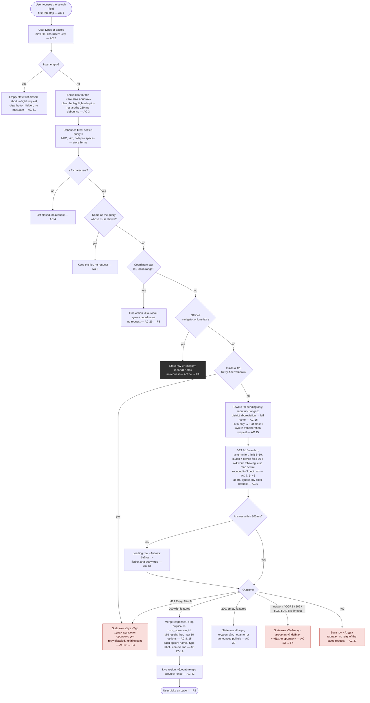
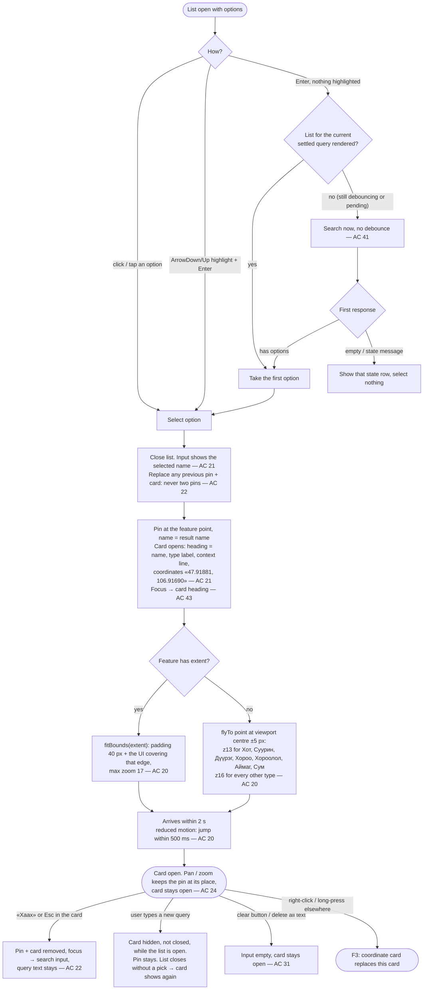
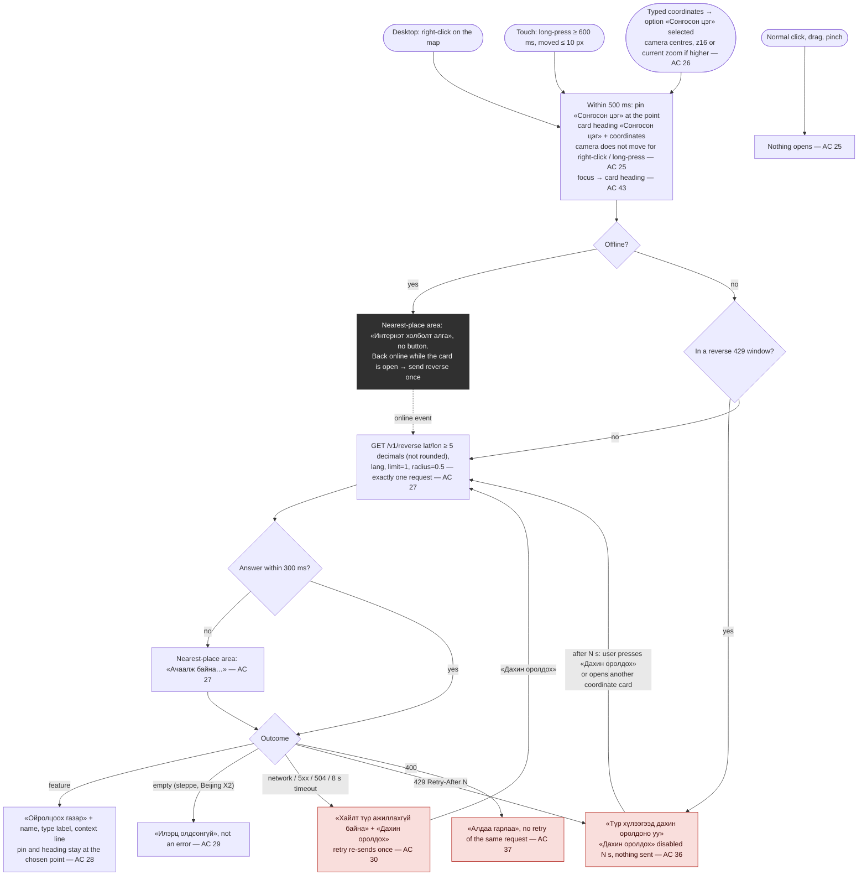
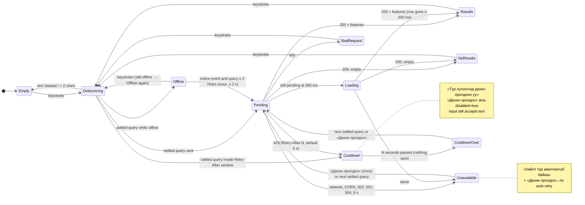
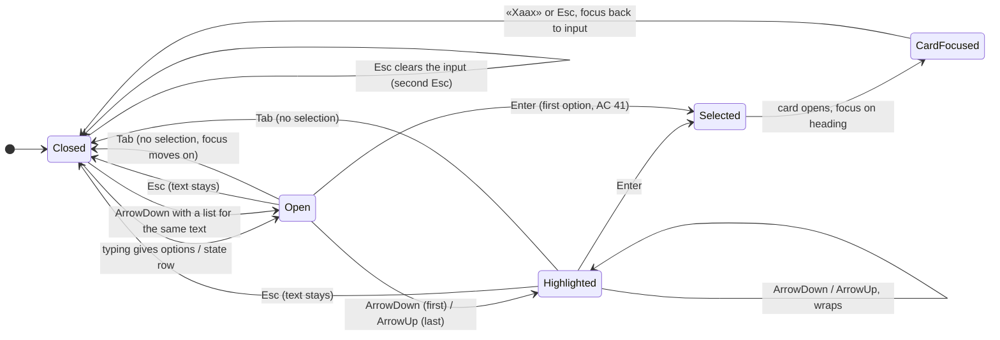
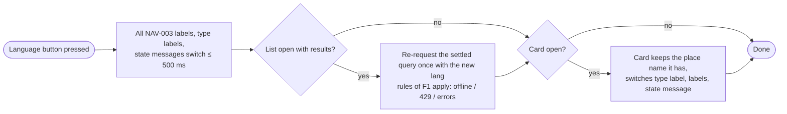

# Flow NAV-003: Search a place (Cyrillic / Latin, autocomplete, place card, coordinate card)

- **Story:** [NAV-003](../../requirements/stories/NAV-003-search-cyrillic-latin-autocomplete.md) (AC referenced per step)
- **Screen:** [`screens/NAV-003-search.md`](../screens/NAV-003-search.md). It adds a search field, results list, pin and place card to the NAV-002 map screen ([`screens/NAV-002-web-map.md`](../screens/NAV-002-web-map.md)). Nothing here is a separate page.
- **Prototype:** [`prototypes/NAV-003-search.html`](../prototypes/NAV-003-search.html) (static wireframe of every state, day/night, mn/en, and every width)
- **API:** `docs/architecture/api/openapi.yaml` 0.4.0, `GET /v1/search` and `GET /v1/reverse`. No contract change.

The diagrams quote copy by resource key (screen spec, §Copy). The `mn` value is in «» where it helps. Every string is a glossary term (T1–T31 and existing rows).

## F1. Type a query (happy path, request rules)

Notes
- The input always shows exactly what the user typed. Abbreviation expansion and transliteration change only what is sent (AC 16).
- When the first of two requests (as typed + transliteration) answers, its options may render at once. The second response merges in without reordering options the user may already be looking at: new options are added below, `MN` first (AC 8, 15). The live region announces once, when both have answered or after 1 s, whichever is first (AC 42).
- While a new query is pending, the previous options stay on screen, but no option is highlighted, until the response or the 300 ms loading row replaces them. This avoids flicker when typing fast. A response for an older query never replaces a newer list (AC 5).
- Focus alone never opens the list and never sends a request. Only typing, pasting, ArrowDown (reopens the last list for the same text) or Enter does (AC 1, 41).
- GPS lost, stale fix (> 60 s), or location permission denied: the bias quietly falls back to the map centre. No message, and search never fails because of location (story edge cases). Search never calls the Geolocation API itself (AC 9).

## F2. Select a result: fly-to, pin, place card

## F3. Coordinate card (reverse geocoding)

Notes
- The heading, coordinates and pin never change with the `reverse` outcome. Only the nearest-place area changes (AC 28–30). The card never calls the result an address (story R5, glossary "Nearest place").
- Right-click is taken over only on the map canvas (the browser menu is suppressed there, and nowhere else). On Android Chrome a long-press also fires `contextmenu`: one gesture opens one card and sends one `reverse` request.

## F4. Search request states (error and recovery paths)

Precedence inside the list area, highest first: Offline > Cooldown (429) > Unavailable > BadRequest > Loading > NoResults / Results. Only one state row shows at a time. NAV-002 banners keep their own precedence (offline > tiles unavailable > loading, NAV-002 AC 45) and are never covered by the list (AC 39).

## F5. Keyboard and screen reader (combobox)

- Focus stays in the input while the highlight moves (`aria-activedescendant`, AC 41).
- The live region announces once per settled query: count, «Илэрц олдсонгүй», or the state message (AC 42).

## F6. Language switch while search is open (AC 38)

