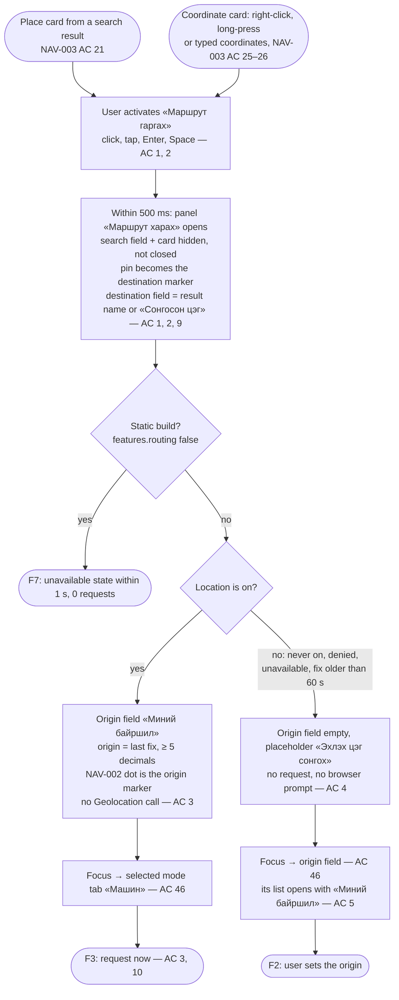
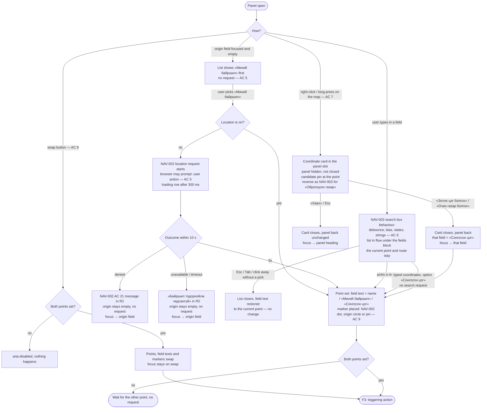
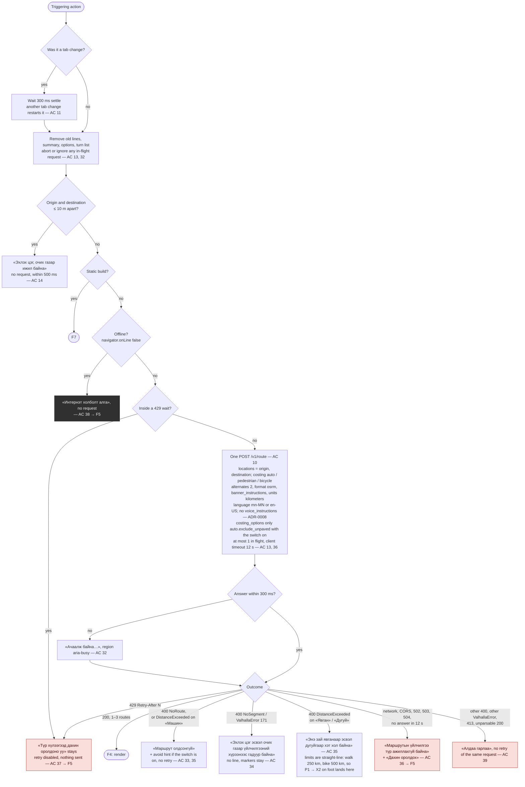
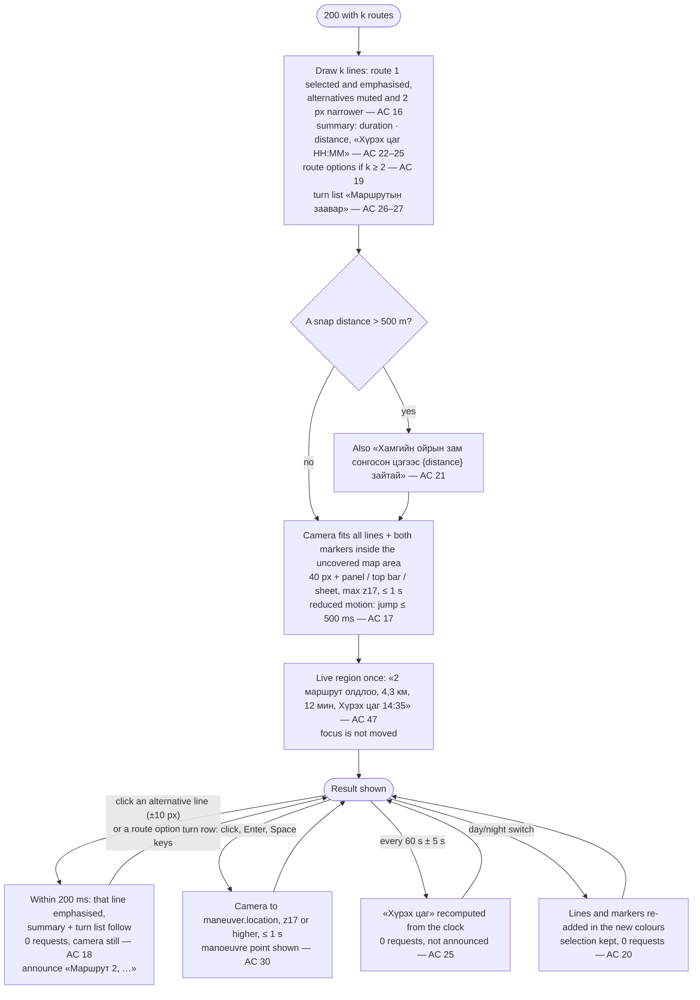
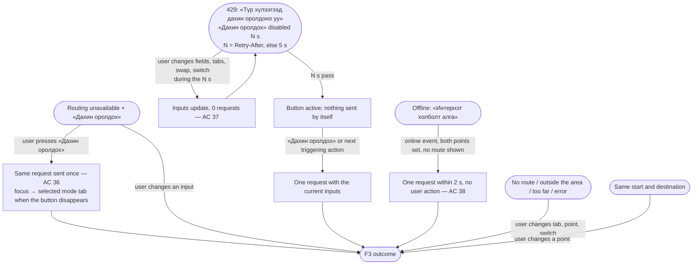
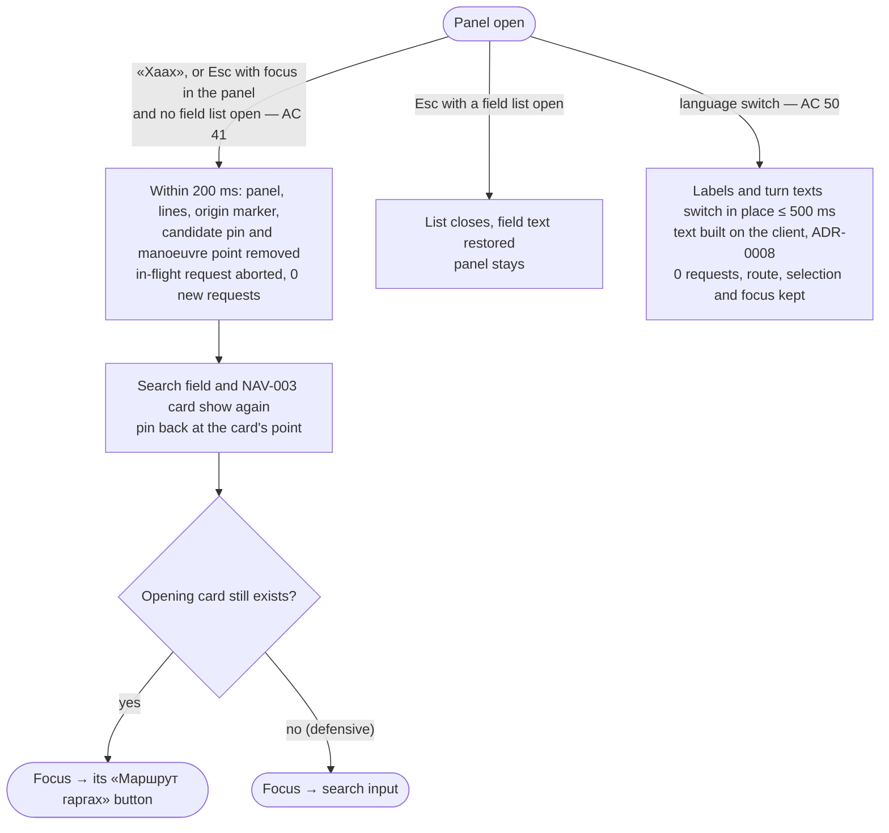
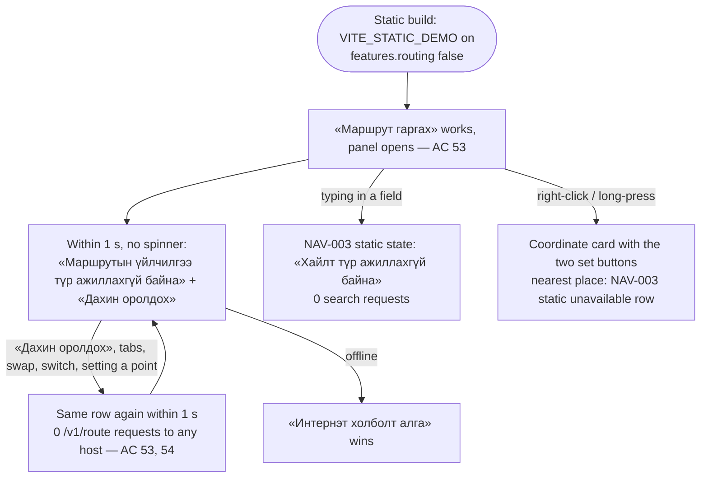

# Flow NAV-004: Route preview A→B (alternatives, mode tabs, «Хүрэх цаг», turn list)

- **Story:** [NAV-004](../../requirements/stories/NAV-004-route-preview-web.md) (AC referenced per step)
- **Screen:** [`screens/NAV-004-route-preview.md`](../screens/NAV-004-route-preview.md). The route panel is part of the NAV-002 map screen; it replaces the NAV-003 search UI while it is open. Nothing here is a separate page.
- **Prototype:** [`prototypes/NAV-004-route-preview.html`](../prototypes/NAV-004-route-preview.html) (every state, day/night, mn/en, five widths)
- **Map layers and markers:** [`map-style.md` §7.2–7.3](../map-style.md)
- **API:** `openapi.yaml` 0.5.0 `postRoute` (`POST /v1/route`, Valhalla pass-through; web preview client profile and `bicycle` contracted, ADR-0008 §4). Field search uses NAV-003 `search`; the coordinate card uses `reverse`.
- **Instruction text:** ADR-0008 option (b): built on the client from `maneuver.type` / `modifier` / `exit` / `bearing_after` in both UI languages; Valhalla's narrative is never shown.

The diagrams quote copy by its `mn` value in «»; the resource keys are in the screen spec › Copy. Every string is a glossary term. "Location is on" = NAV-002 my location activated and the last fix ≤ 60 s old (story Terms).

## F1. Open the preview (entry points, origin, focus)

Notes
- The camera does not move on opening. It moves when the first route renders (F4).
- The destination is the card's point (coordinates shown on the card), not the location of a `reverse` result (AC 2).

## F2. Set and change points

Notes
- A point is never cleared by the user (no clear button). Emptying the origin field while focused shows «Миний байршил»; leaving the field without a pick restores the current point's text.
- The preview-time coordinate card does not replace the NAV-003 card that opened the panel, so closing the preview later returns to it (F6).

## F3. Route request lifecycle (every triggering action)

Triggering actions (story Terms): a point set or changed, a mode tab settled, swap, the avoid switch, «Дахин оролдох», or the online resume. A language switch is **not** one: with ADR-0008 the text is rebuilt on the client (AC 50, 0 requests).

Notes
- A response for an older request never replaces a newer result, even if it arrives later (AC 13). The client keeps a request counter or an `AbortController` per request.
- The state precedence in the result region is: same point > offline > rate-limited > unavailable/static > outside the area / too far / no route / error > loading > route (screen spec › States).
- The origin is fixed when the request is sent. Location updates while the panel is open never trigger a request (story edge case: no request storms).

## F4. Result: lines, camera, alternatives, turn list, ETA

## F5. Error and recovery paths

## F6. Close the preview, language switch, coexistence

Notes
- While the panel has never been opened, NAV-002 and NAV-003 behave exactly as before: the search input is the first Tab stop and no route request is sent (AC 42).
- While the panel is open the NAV-003 search field is hidden, so the NAV-003 AC 1 rule "search input is the first Tab stop" applies only with the panel closed (screen spec › Accessibility › Tab order).

## F7. Static public build (routing off; D44, PO decision Q1 2026-09-30)

## Keyboard walk-through (location on, RS1 P1 → P3, car)
1. Search «Зайсан», Enter → place card, focus on the card heading (NAV-003).
2. Tab to «Маршрут гаргах», Enter → panel opens, focus on the «Машин» tab, route requested (AC 3, 46).
3. The live region announces «3 маршрут олдлоо, 4,6 км, 13 мин, Хүрэх цаг 14:03» (AC 47).
4. ArrowRight → «Явган» selected; after 300 ms one request (AC 11). ArrowLeft → back to «Машин».
5. Tab → avoid switch; Tab → «Маршрут 1» radio; ArrowDown → «Маршрут 2» selected, announced, 0 requests (AC 18, 45).
6. Tab → turn list (first row); ArrowDown to row 3; Enter → camera to that turn (AC 30).
7. Tab → map canvas → … (NAV-002 order). Shift+Tab back into the panel.
8. Esc → panel closes, focus on «Маршрут гаргах», the card is back (AC 41).
