# Flow NAV-005: Android active navigation (map → destination → preview → guidance → arrival)

- **Story:** [NAV-005](../../requirements/stories/NAV-005-active-navigation-android.md) (first slice, Android only, D24). AC referenced per step.
- **Screens:** [`screens/NAV-005-android-navigation.md`](../screens/NAV-005-android-navigation.md) (S1 map, S2 search and coordinate card, S3 route preview, S4 location messages and permission rationale, S5 guidance, S6 arrival, S7 settings sheet, S8 notification).
- **Rules:** [`navigation-ux.md`](../navigation-ux.md) (banner, voice schedule, off-route, GPS loss, camera). Map layers: [`map-style.md` §7.4](../map-style.md).
- **Prototype:** [`prototypes/NAV-005-guidance.html`](../prototypes/NAV-005-guidance.html) (guidance, arrival, preview and message states).
- **API and architecture:** `openapi.yaml` 0.5.0 `search` (GET `/v1/search`), `postRoute` (POST `/v1/route`); [ADR-0009](../../architecture/adr/0009-android-guidance-client.md) (app-owned route client and reroute policy, off-route = 3 consecutive good fixes > 50 m, on-device voice schedule). The flows show the user-visible outcome.

Copy is quoted by its `mn` value in «»; every string is a glossary term; keys are in the screen spec › Copy. "Good fix" = accuracy ≤ 25 m; "fresh" = ≤ 10 s old (≤ 60 s for the preview origin).

## F1. Launch and map screen

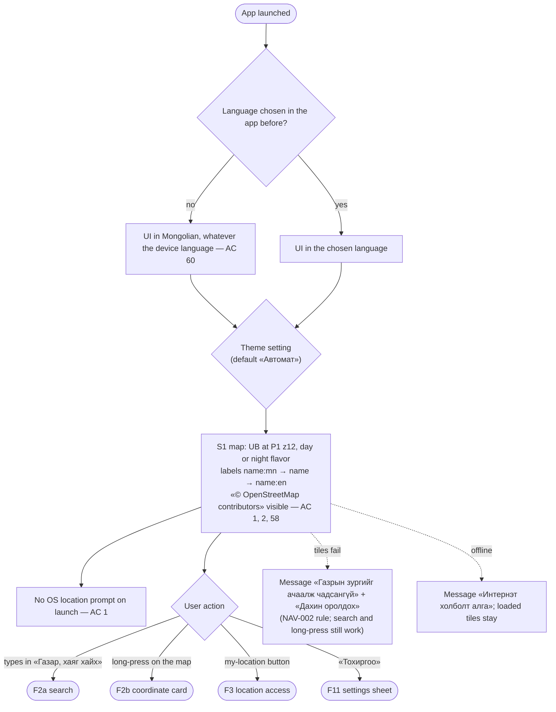

## F2. Choose a destination

### F2a. Search (AC 3)
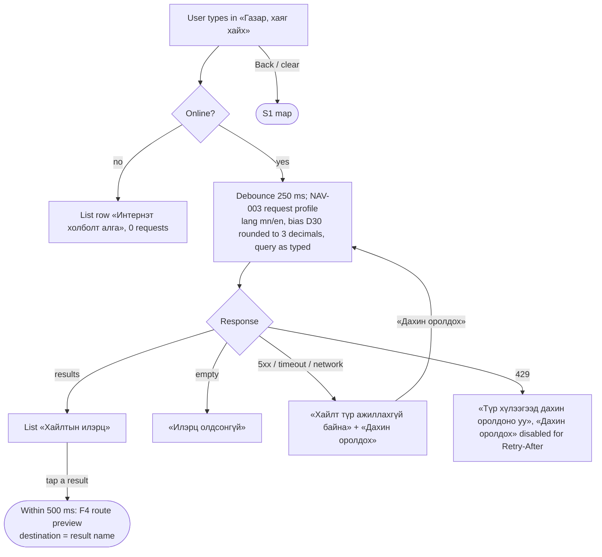

### F2b. Long-press (AC 4)
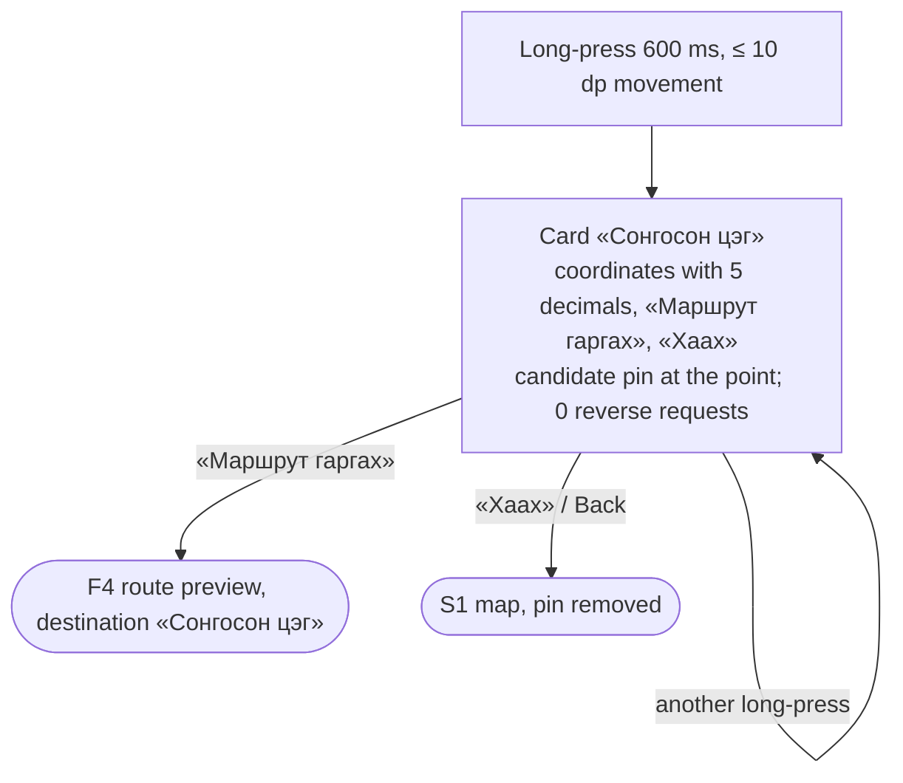

## F3. Location access (permission, precision, services, first fix) — AC 8–14

Entered from «Маршрут гаргах» (F2b), a search result (F2a → F4), or the my-location button (F1). The **pending action** is remembered and continues by itself when the problem is fixed.

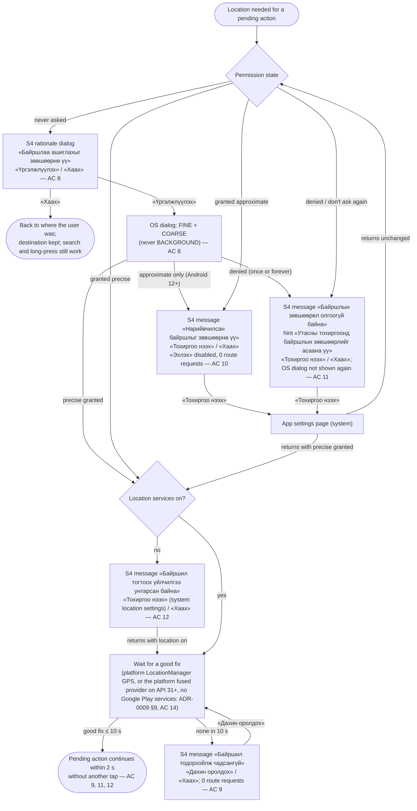

## F4. Route preview and start — AC 5–7, 13, 15, 35, 38

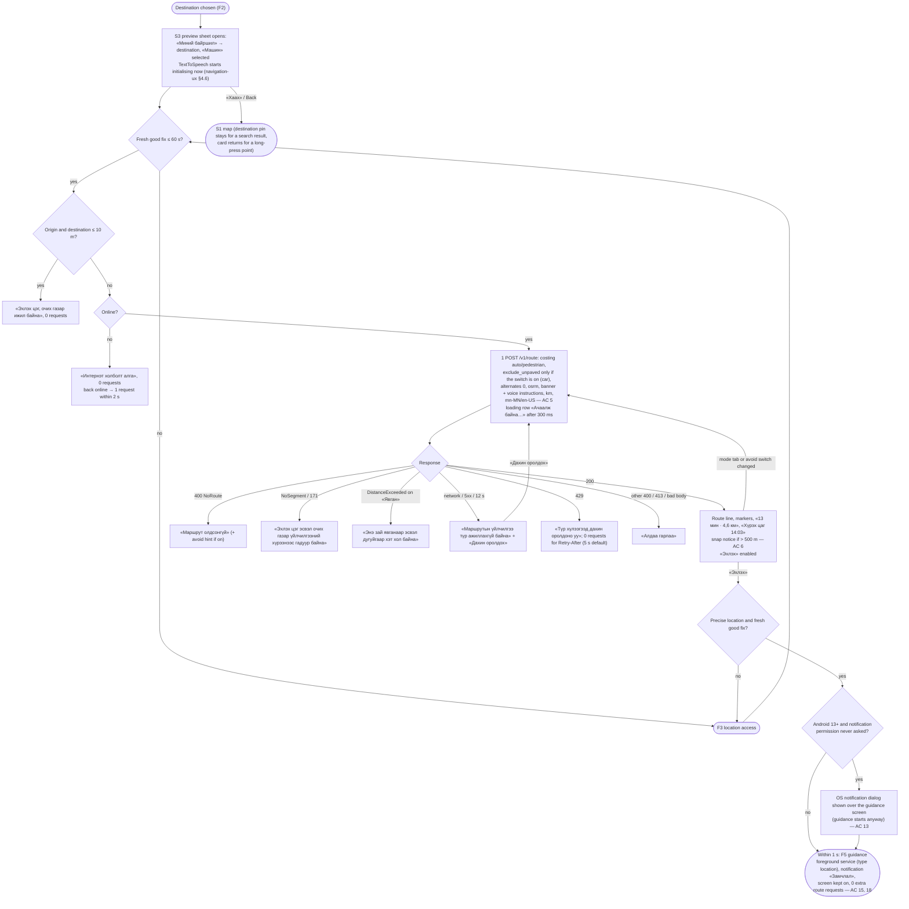
«Эхлэх» is disabled in every state without a route (AC 7).

## F5. Guidance: top-level states — AC 15–25, 31, 41–57

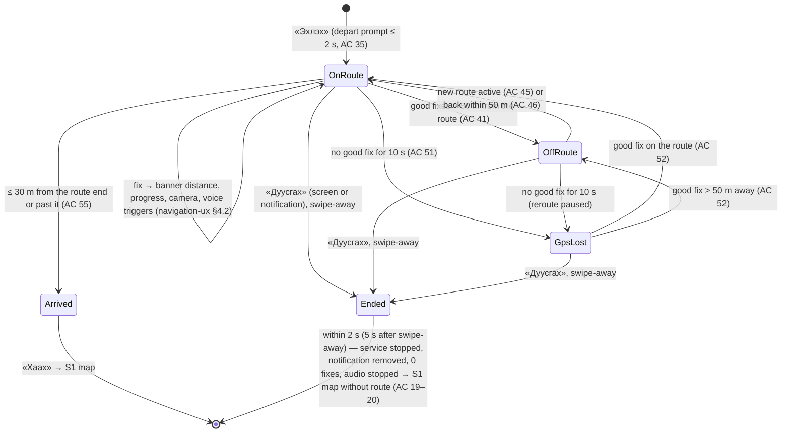

Independent of these states and allowed in all of them: mute / unmute (AC 37), orientation toggle (AC 24), map gestures and recenter (AC 25), theme / language / rotation (AC 59, 60, 64), network loss on the route (F8), Home / screen off (guidance continues, AC 17), Back (= Home: the task moves to the background, guidance continues; nothing destructive on Back).

## F6. Off-route episode and reroute pacing — AC 41–50

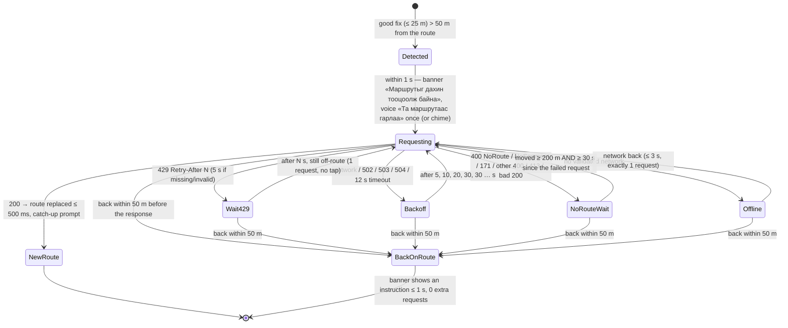

Secondary line under «Маршрутыг дахин тооцоолж байна»: Wait429 → none; Backoff → «Маршрутын үйлчилгээ түр ажиллахгүй байна»; NoRouteWait → «Маршрут олдсонгүй» (or «Алдаа гарлаа» for other 400 / 413 / bad 200); Offline → «Интернэт холболт алга». **Global pacer (all states, AC 44):** at most 1 request in flight, consecutive requests ≥ 5 s apart, ≤ 6 per rolling 60 s; a state's own wait is extended to meet the pacer. Reroute body (AC 43): current position, `heading` = course over ground when speed ≥ 2 m/s, original destination, same costing, options, language and units, `alternates: 0`.

## F7. GPS loss and tunnel — AC 51–53

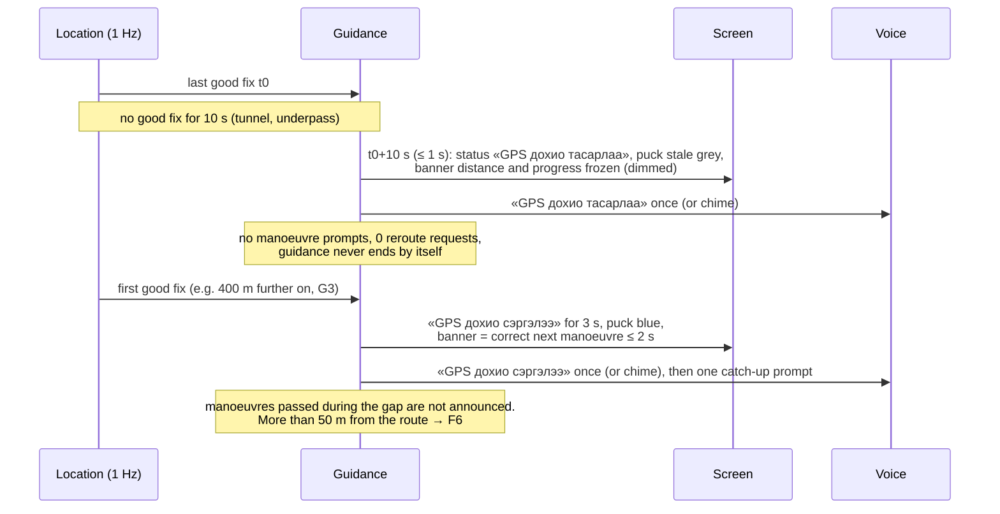

## F8. Network loss on the route — AC 54

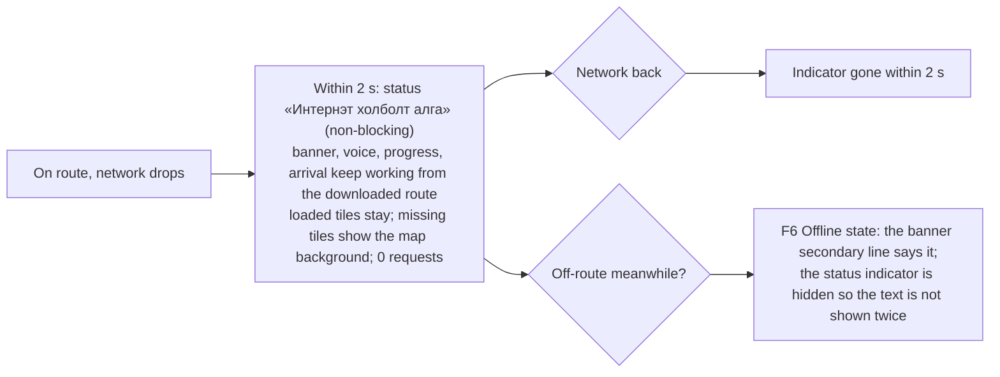

## F9. Voice decision and the D23 fallback — AC 36–39

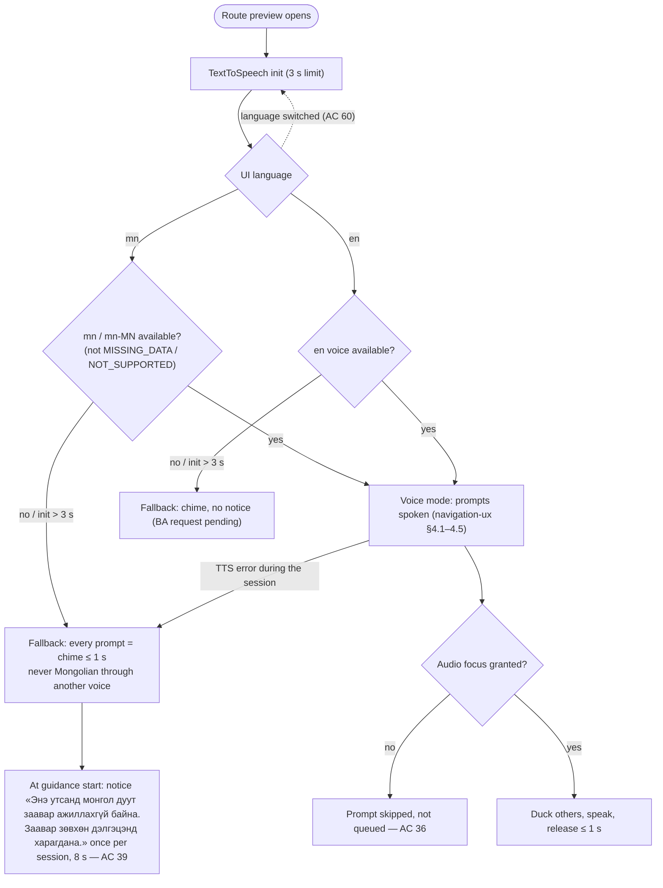

## F10. Arrival — AC 55–57

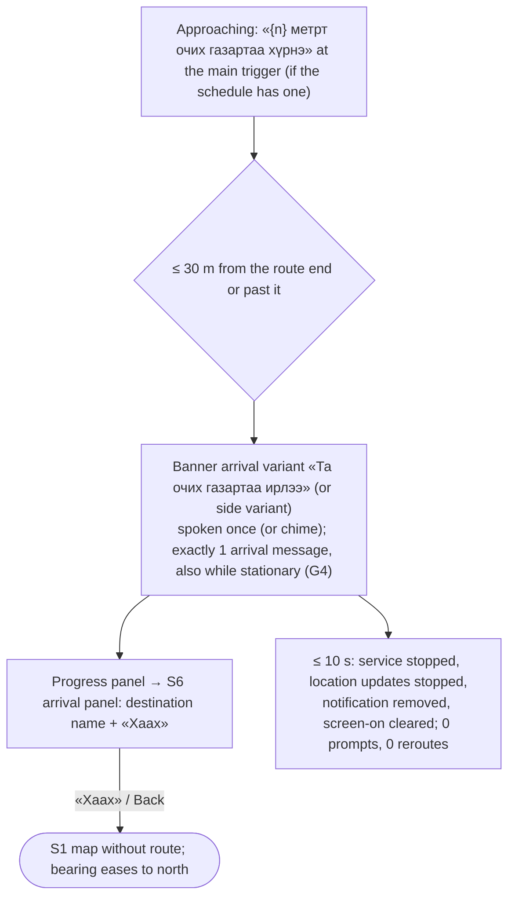

## F11. Settings, theme, language and configuration changes — AC 58–64

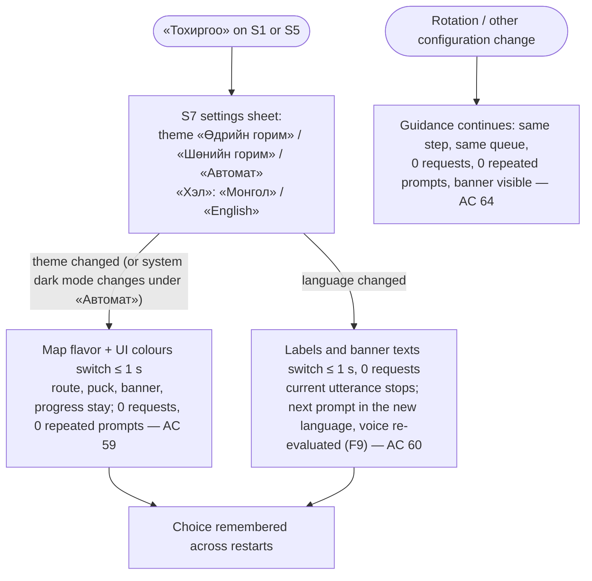

## Error-path summary (every screen has offline, GPS-lost and no-result states)
| Screen | Offline | GPS lost / no location | No result |
|---|---|---|---|
| S1 map | Message «Интернэт холболт алга»; loaded tiles stay | My-location button → F3 messages | — |
| S2 search / card | List row «Интернэт холболт алга», 0 requests | not needed (search works without location; bias falls back to the map centre, D30) | «Илэрц олдсонгүй» |
| S3 preview | «Интернэт холболт алга», 0 requests, auto-request when back | F3 messages in the result region; «Эхлэх» disabled | «Маршрут олдсонгүй», N9, N11 |
| S5 guidance | Status indicator (F8); off-route → banner secondary line (F6) | F7 | reroute «Маршрут олдсонгүй» (F6) |
| S6 arrival | nothing needed (no network use) | nothing needed (guidance has ended) | — |
