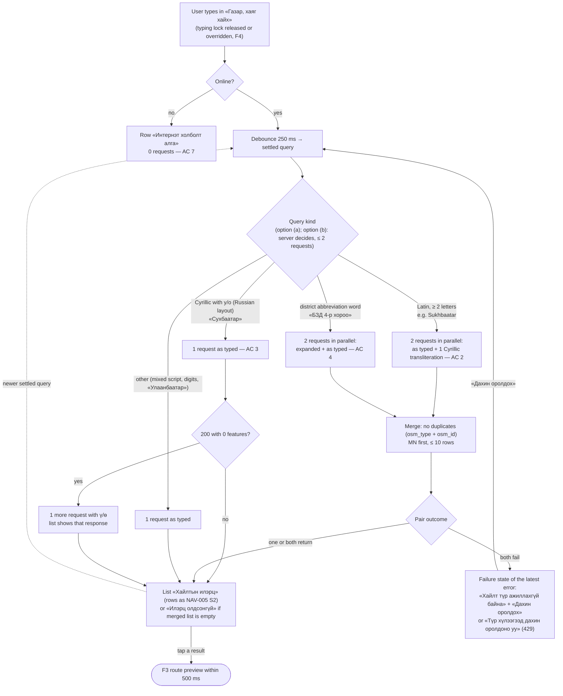
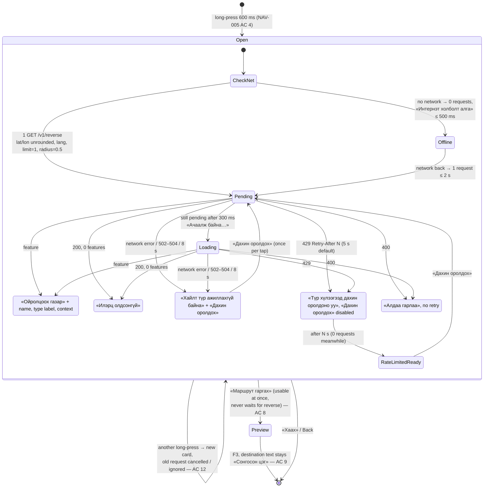
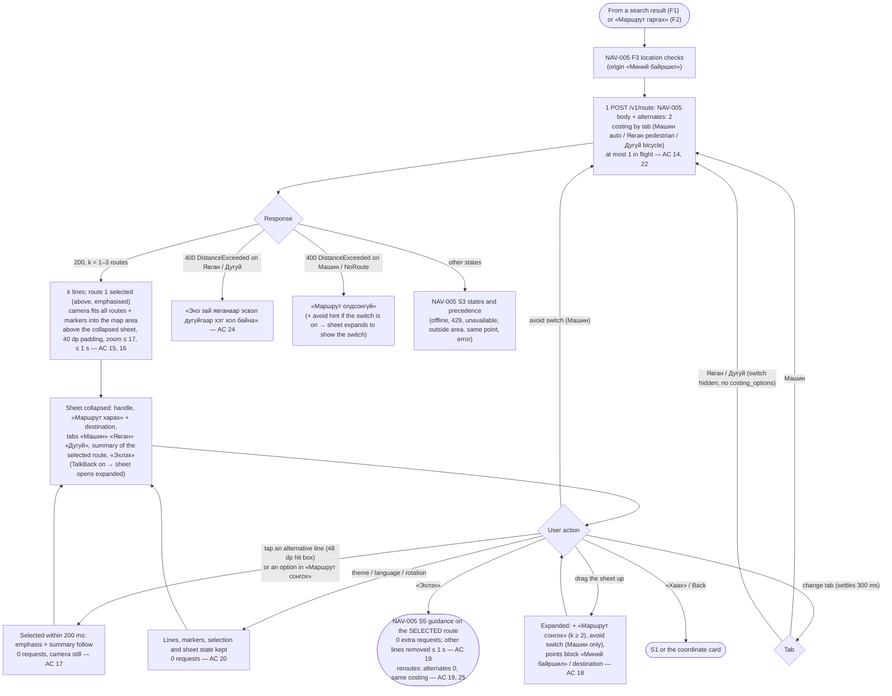
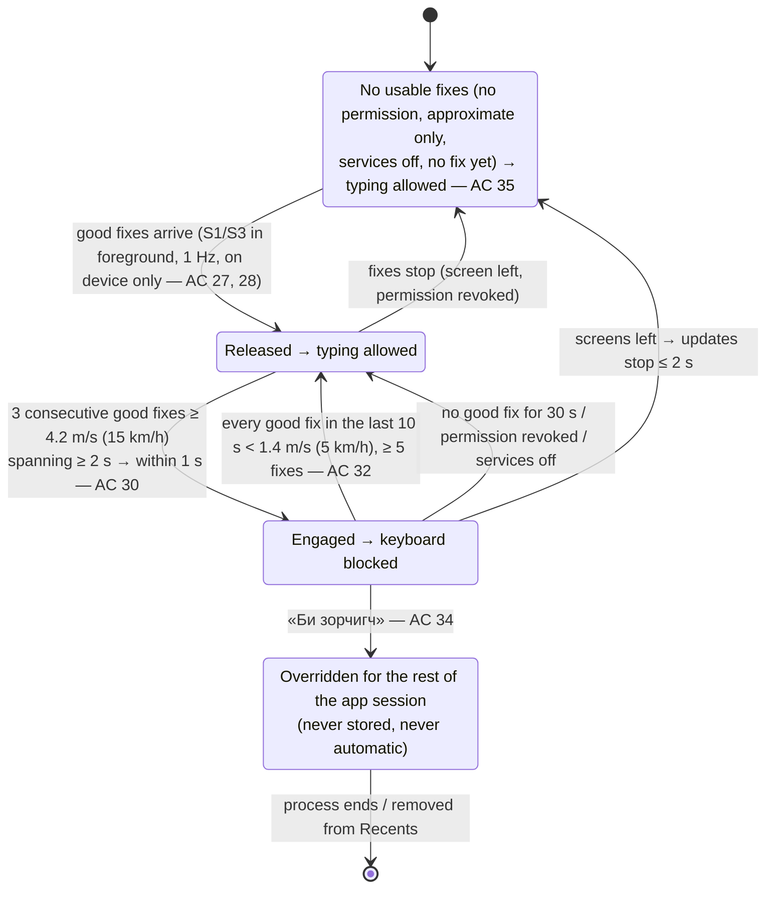
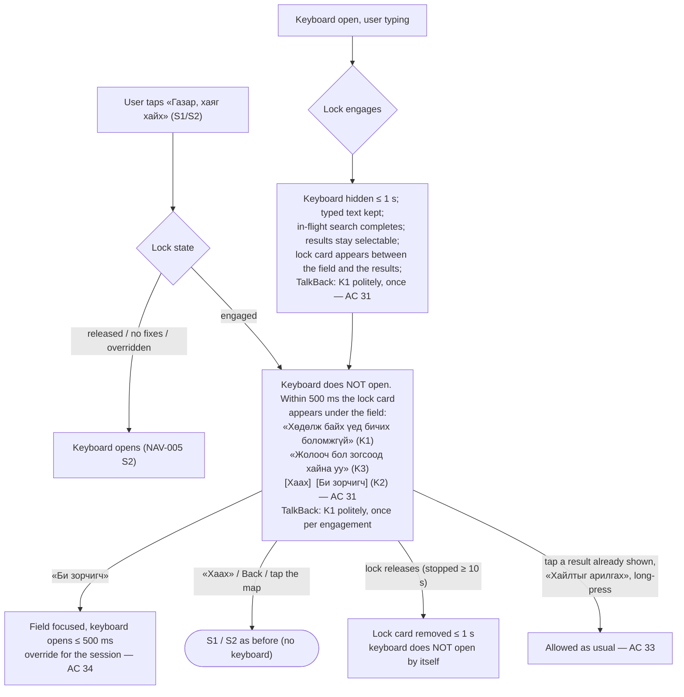
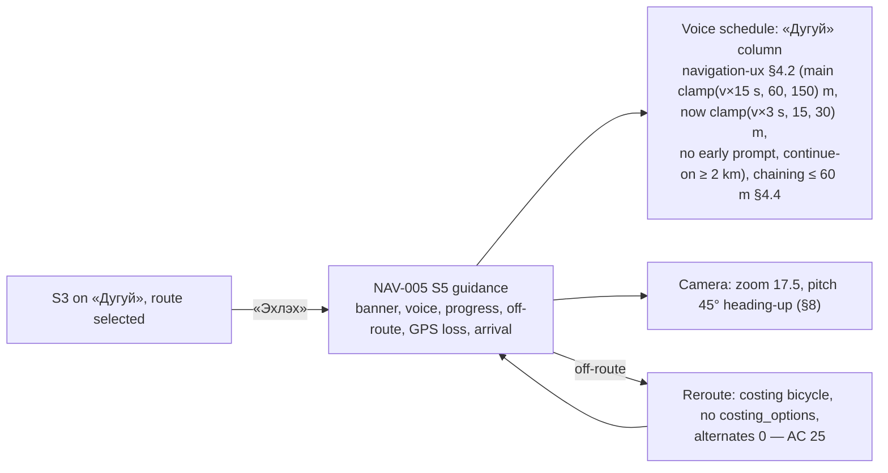

# Flow NAV-011: Android route preview and search parity (assisted search, reverse on the card, alternatives, «Дугуй», typing lock)

- **Story:** [NAV-011](../../requirements/stories/NAV-011-android-route-preview-search-parity.md) (Phase 1 beta, priority must, D106). AC referenced per step.
- **Screens:** [`screens/NAV-011-android-route-preview-search-parity.md`](../screens/NAV-011-android-route-preview-search-parity.md). It is a **delta** on [`screens/NAV-005-android-navigation.md`](../screens/NAV-005-android-navigation.md) (S1 map, S2 search and coordinate card, S3 route preview, S5 guidance). Everything not named here stays as NAV-005.
- **Base flows:** [`flows/NAV-005-android-navigation.md`](NAV-005-android-navigation.md) F2a, F2b and F4 are **replaced on Android** by F1, F2 and F3 below. F3 (location access) and F5–F11 of NAV-005 are unchanged.
- **Rules:** [`navigation-ux.md`](../navigation-ux.md) §4.2, §4.4 and §8 (the new «Дугуй» column, AC 26). Map layers: [`map-style.md` §7.6](../map-style.md) (Android alternatives).
- **Prototype:** [`prototypes/NAV-011-android-preview.html`](../prototypes/NAV-011-android-preview.html).
- **API:** `openapi.yaml` 0.5.2 `search`, `reverse`, `postRoute` (`alternates` 0–2, `costing` `bicycle`). No contract change for the design. Query assistance (A) is the same on screen for either ADR option (Kotlin port or server-side).

Copy is quoted by its `mn` value in «»; every string is a glossary term (K1–K3 are `needs native review`); keys are in the screen spec › Copy.

## F1. Assisted search (AC 1–7)

Nothing new is visible. The assistance happens behind the field (Tesler's law: the system absorbs the script and keyboard-layout problem). The field always shows what the user typed (AC 4). There is no "Did you mean" line and no "Showing results for" line.

- An older response never replaces the list of a newer settled query (AC 7). Loading row «Ачаалж байна…» only after 300 ms (NAV-005 S2).

## F2. Coordinate card with the nearest place (AC 8–13)

The card is bottom-anchored and «Маршрут гаргах» is its last row, so the nearest-place area can grow upwards without moving the button under the user's finger.

- In **every** state the heading «Сонгосон цэг», the coordinates, the pin and «Маршрут гаргах» stay; the camera never moves (AC 9, 11).
- Language switch with a place shown: labels switch ≤ 1 s, name kept, 0 new requests (AC 13).
- 0 `reverse` requests for pans, zooms, the device position or search results (AC 12).

## F3. Route preview with alternatives and three modes (AC 14–24)

- A new response (mode, avoid or destination change) always selects its route 1 (AC 21).
- With *k* = 1 there is no «Маршрут сонгох» group (AC 18); with *k* < 3 nothing tells the user that fewer routes came back (R4: no promise of alternatives).
- Tab memory: the chosen tab is kept for the app session; a fresh start opens on «Машин» (AC 22).

## F4. Typing lock with the passenger override (AC 27–37)

The lock only decides whether the **keyboard** may open. Everything else on S1/S2/S3 stays usable (AC 33).

Between 5 and 15 km/h the state does not change (hysteresis). The lock never asks for a permission and never reads location in the background (AC 27).

### F4a. What the user sees

- The search bar does **not** change before the user taps it (no lock icon, no changed placeholder): a driver is not drawn to a screen change they did not ask for (Von Restorff, safety). Design notes 4 in the screen spec.
- S3 has no text field (NAV-005), so the lock is invisible there; S5 guidance has no text input (AC 37). After «Дуусгах», the rule applies from the current fixes.

## F5. «Дугуй» guidance (AC 25–26)

QA's G10 replay (P4 → P5 at 4.5 m/s) checks the column with the NAV-005 AC 34 rules: every manoeuvre except `depart` (and the D68 `arrive` exemption) gets at least one prompt that starts while it is **15–150 m** ahead.

## AC coverage
| AC | Flow step |
|---|---|
| 1–7 | F1 |
| 8–13 | F2 |
| 14–24 | F3 |
| 25–26 | F5 (rules: navigation-ux §4.2, §4.4, §8) |
| 27–37 | F4, F4a |
| 38–47 | No flow (strings, privacy, regression, verification); screen spec › Copy and Evidence |
