# Flow NAV-012: Android background and lock-screen navigation (notification, lock screen, swipe-away, restore, battery saver, audio, calls, automatic theme)

- **Story:** [NAV-012](../../requirements/stories/NAV-012-android-background-lock-screen.md) (Phase 1 beta, priority must, Android only). AC referenced per step.
- **Screens:** [`screens/NAV-012-android-background-lock-screen.md`](../screens/NAV-012-android-background-lock-screen.md). It is a **delta** on [`screens/NAV-005-android-navigation.md`](../screens/NAV-005-android-navigation.md) (S3 preview, S5 guidance, S6 arrival, S7 settings, S8 notification) and on the NAV-011 collapsed preview sheet. Everything not named here stays as NAV-005 / NAV-011.
- **Base flows:** [`flows/NAV-005-android-navigation.md`](NAV-005-android-navigation.md). On Android, NAV-012 **replaces** the NAV-005 swipe-away outcome (NAV-005 AC 20, flow F5) with F3 below and **extends** F5 (background), F9 (voice) and F11 (theme).
- **Rules:** [`navigation-ux.md` §12](../navigation-ux.md) (timing and voice rules for this story), §9 (theme). Map style: [`map-style.md` §8](../map-style.md).
- **Prototype:** [`prototypes/NAV-012-background.html`](../prototypes/NAV-012-background.html), checked by `prototypes/check-layout-nav012.mjs`.
- **API:** no new operation. A restore that needs a new route sends `postRoute` exactly as a NAV-005 reroute.

Copy is quoted by its `mn` value in «»; every string is a glossary term (B1–B5 are `needs native review`); keys are in the screen spec › Copy. "Good fix" = accuracy ≤ 25 m, "fresh" = ≤ 10 s old (NAV-005). "Restore window" = 30 min after the last heartbeat (story working assumption, Open question 5).

## F1. Rich ongoing notification (AC 1–7)

The notification is a second view of the banner. It never has its own state: it copies the banner within 1 s.

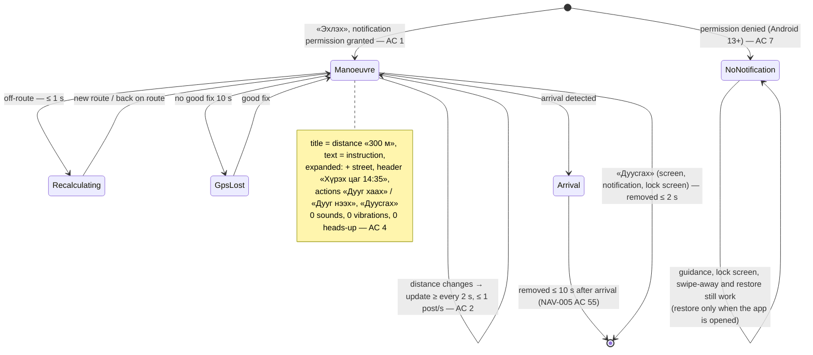

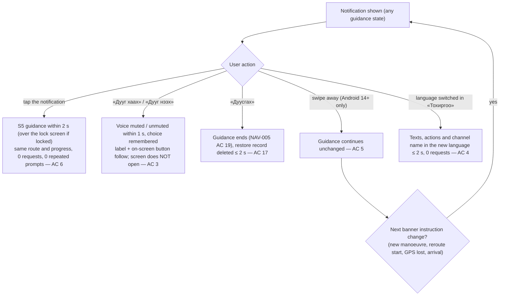

## F2. Lock-screen view (AC 8–12)

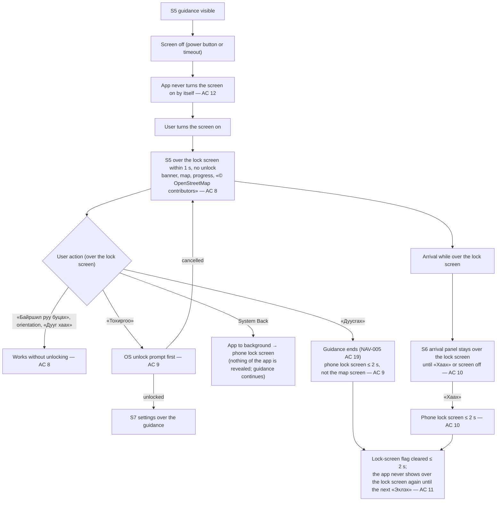

- An open S7 sheet or any other non-guidance surface **closes when the screen turns off**, so waking the phone shows only S5 (AC 9). Settings already applied stay applied.
- The lock-screen **notification** shows the AC 1 content (never the destination name or coordinates). If the user has hidden sensitive notification content on the lock screen, the public version «Замчлал» shows instead (AC 12).

## F3. Continue after swipe-away (AC 13–15) — replaces NAV-005 F5 swipe-away on Android

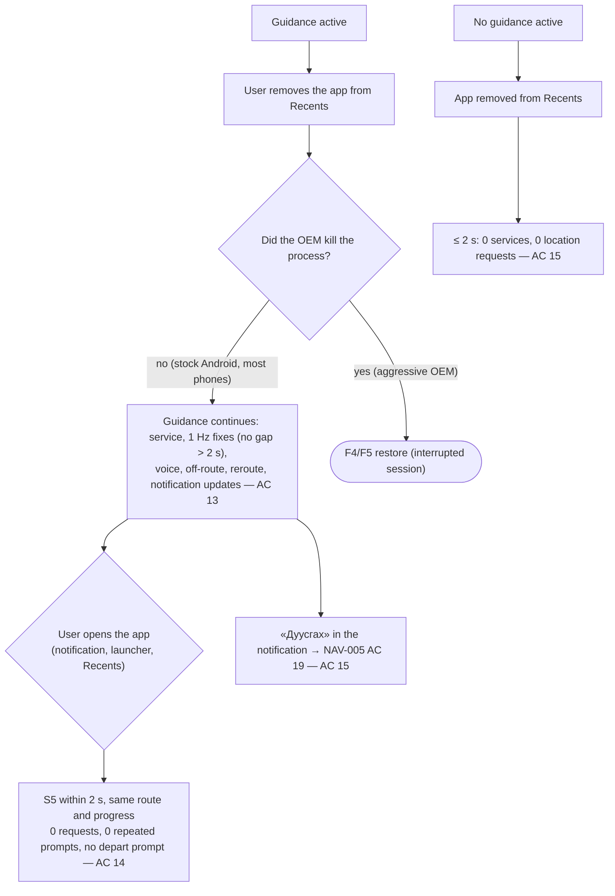

## F4. Restore record lifecycle (AC 16–17, 21, 24)

The record is invisible to the user; this machine explains why the app sometimes opens straight into guidance.

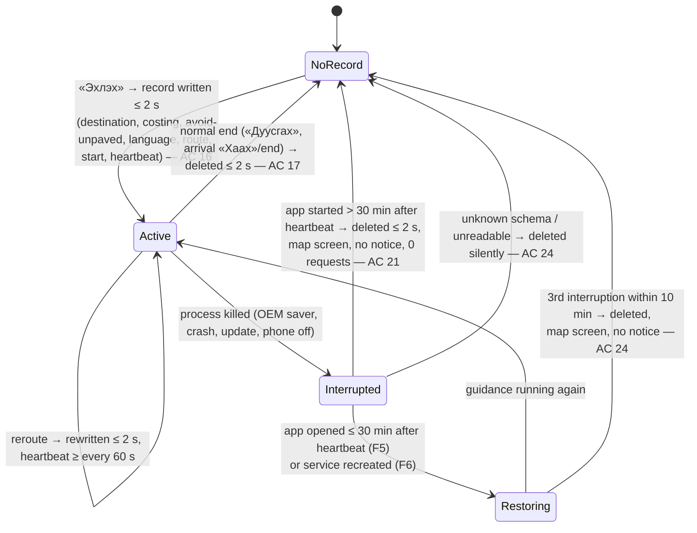

## F5. Opening the app with a valid record (AC 18–20, 23)

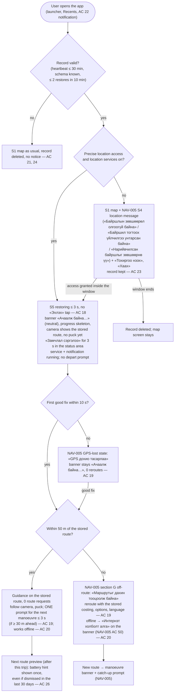

## F6. Service recreated by the system without the app (AC 22, 25)

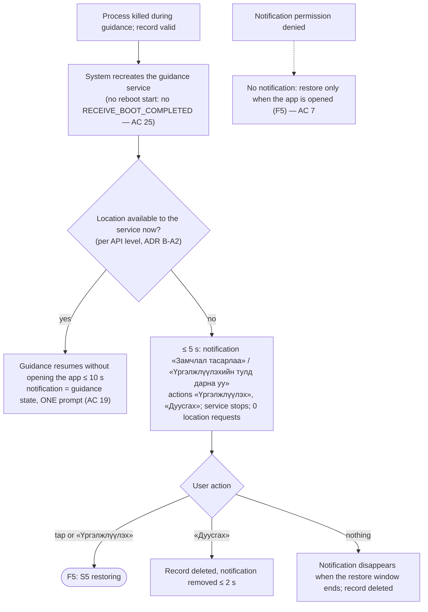

## F7. Battery-saver hint (AC 26–30)

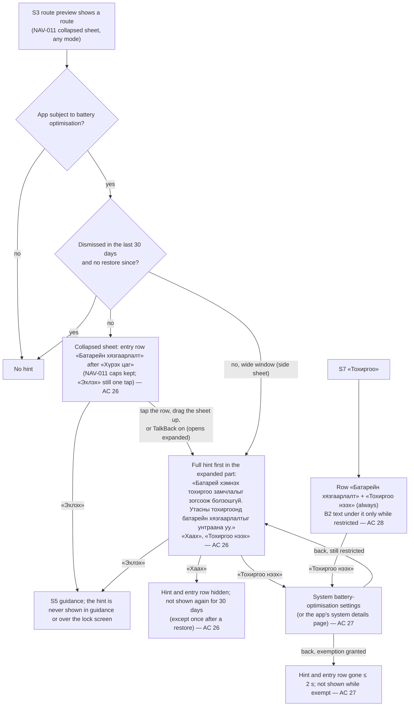

OEM names and settings paths are only in `mobile/android/README.md` (AC 29–30), never in the app.

## F8. Audio output changes and volume keys (AC 31–34)

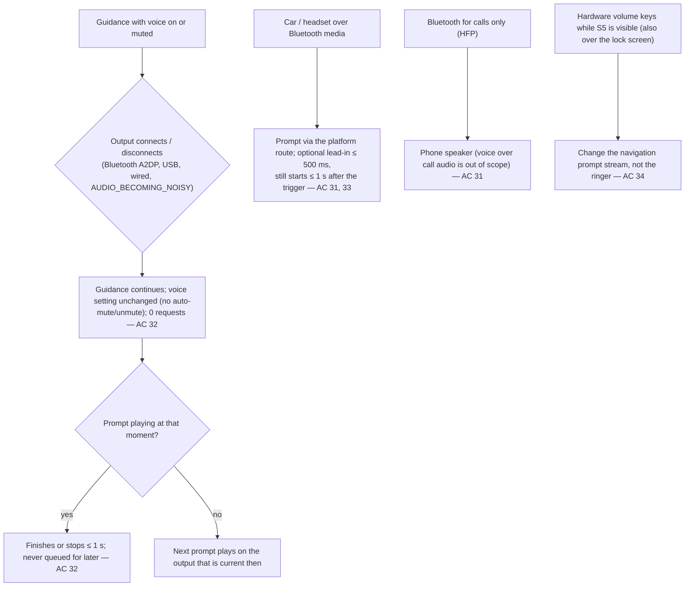

## F9. Phone calls: stop, skip and one catch-up (AC 35–39)

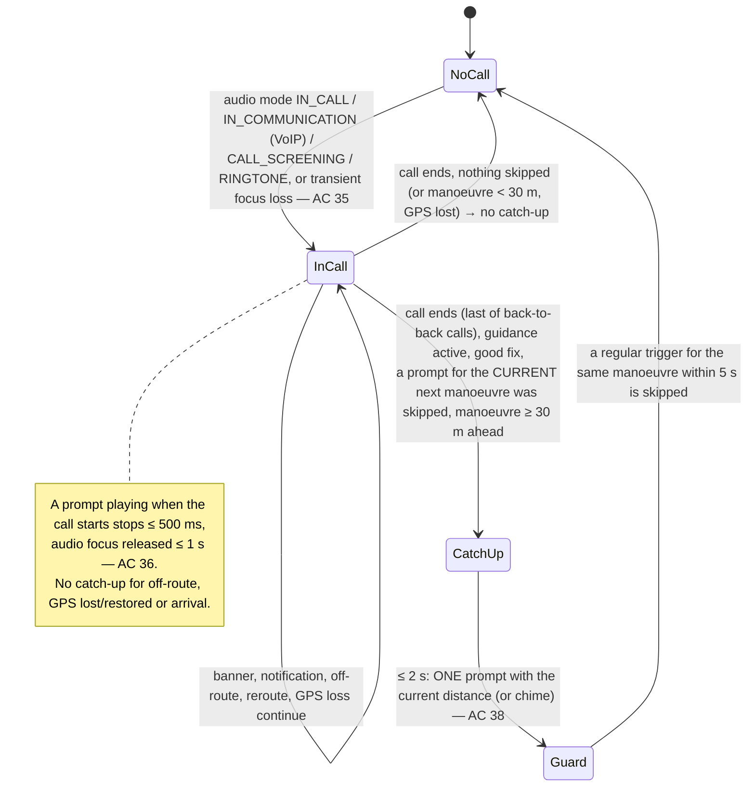

Music and other audio: every prompt requests transient focus with ducking; music returns to its level ≤ 1 s after the prompt; podcasts that pause resume (platform behaviour) (AC 39).

## F10. «Автомат» theme by sunrise and sunset (AC 40–44) — extends NAV-005 F11

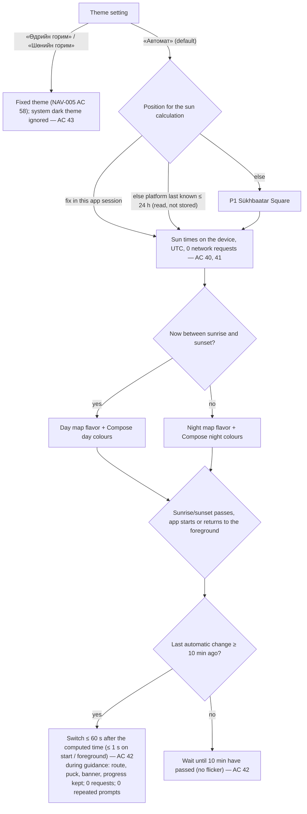

## Error and edge paths covered (cross-reference)

| Situation | Where |
|---|---|
| Offline during a restore | F5 (on the stored route: full offline guidance; off it: NAV-005 AC 50) |
| GPS lost during a restore or a call | F5 (GPS-lost state, banner stays «Ачаалж байна…» until a good fix), F9 (no catch-up while GPS is lost) |
| Permission revoked while the app was dead | F5 (S4 message, record kept until the window ends) |
| Notification permission denied | F1, F6 (no notification; restore on open) |
| Crash loop / app update | F4 (≤ 2 restores in 10 min; unknown schema deleted silently) |
| No route at a restore reroute | F5 → NAV-005 AC 49 «Маршрут олдсонгүй» (200 m / 30 s rule) |
| Reboot inside the window | F4/F5: restores only when the app is opened (no boot start) |
| Two calls back to back, ringing without answering | F9 (one catch-up after the last call ends) |
| Western aimags (UTC+7), wrong device clock | F10 (UTC calculation; a wrong clock shifts the switch by the same amount) |
