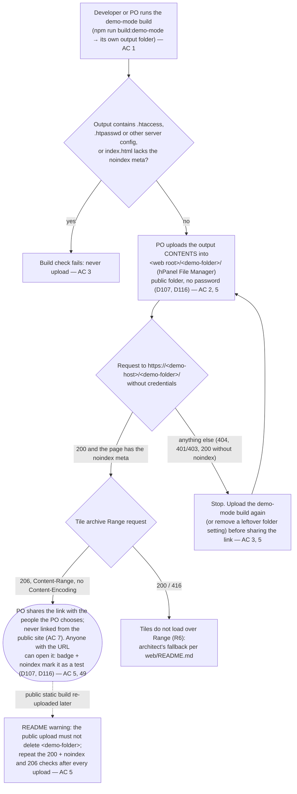
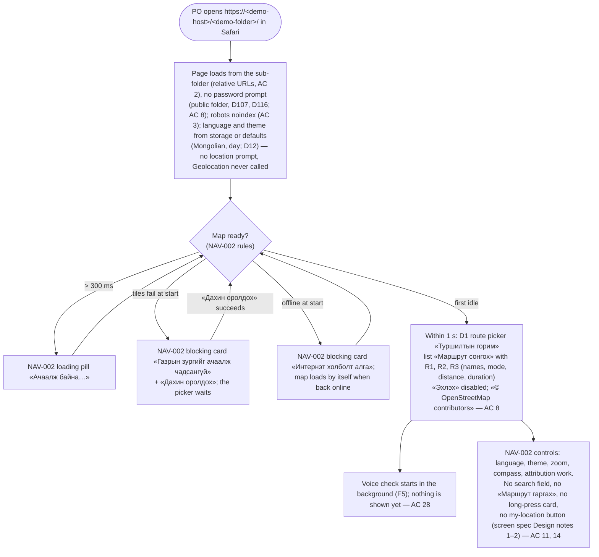
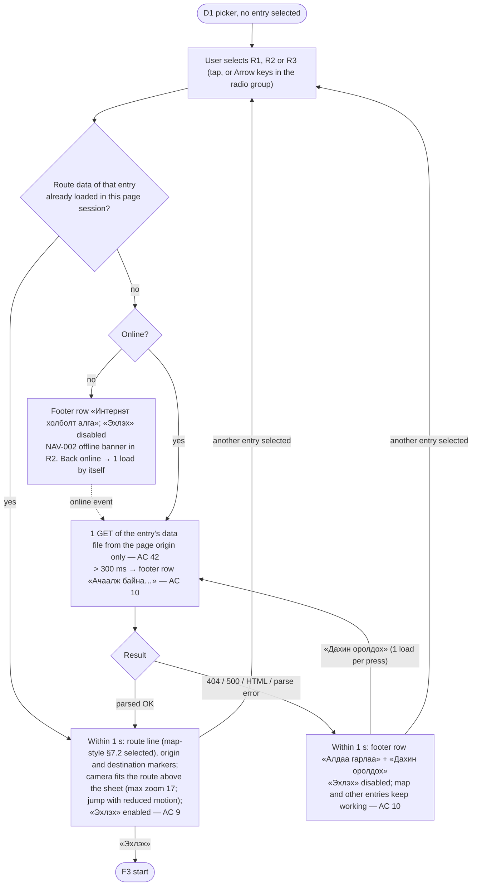
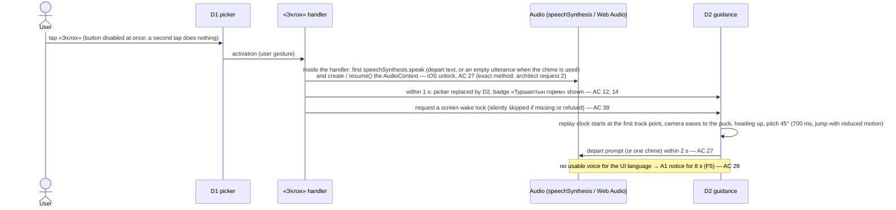
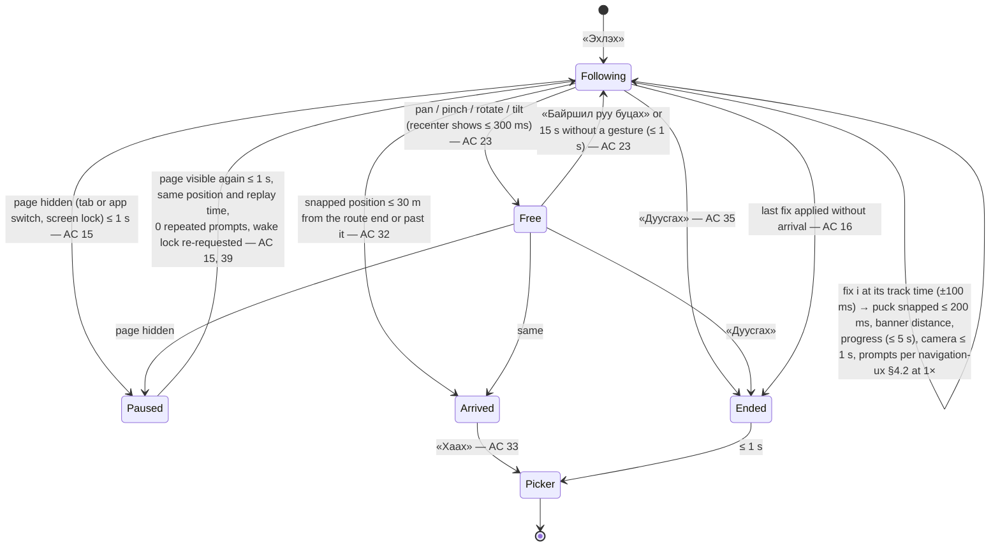
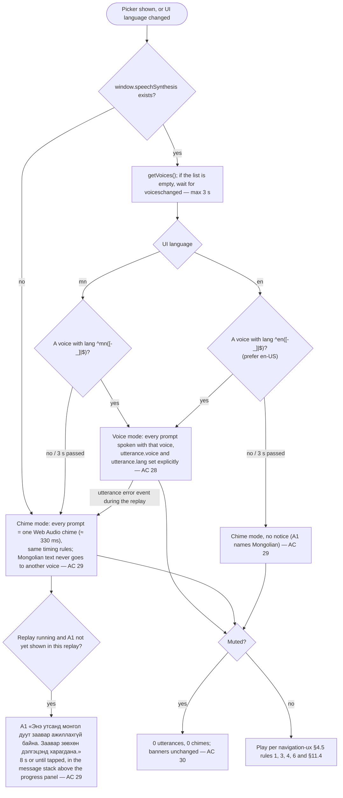
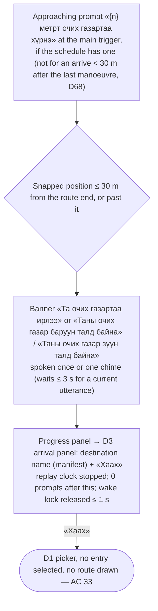
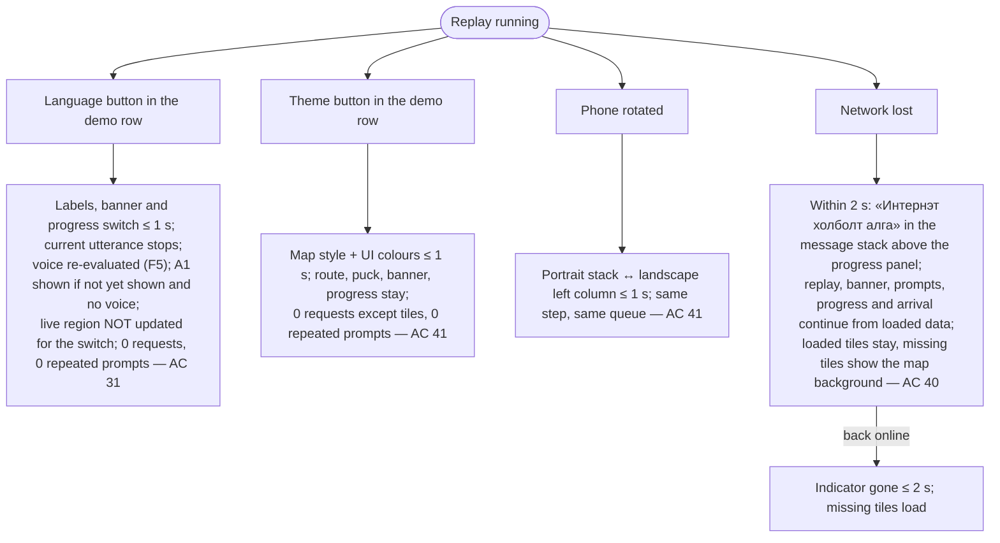

# Flow NAV-017: web demo mode (public demo folder with noindex → route picker → simulated guidance → arrival)

- **Story:** [NAV-017](../../requirements/stories/NAV-017-web-demo-mode-replay.md). AC referenced per step. PO decisions D71–D75 (2026-10-01); the demo folder is **public without a password** since D107 (2026-10-03), and D17 does not cover this demo (D116, 2026-10-04), so F0 and F1 have no password step.
- **Screens:** [`screens/NAV-017-web-demo-mode.md`](../screens/NAV-017-web-demo-mode.md) (D1 route picker, D2 guidance, D3 arrival; the NAV-002 states that still apply).
- **Rules:** [`navigation-ux.md`](../navigation-ux.md) §2–4, §7–8 and **§11 (web demo-mode replay, new in v0.5)**. Map layers: [`map-style.md` §7.5](../map-style.md).
- **Prototype:** [`prototypes/NAV-017-demo-mode.html`](../prototypes/NAV-017-demo-mode.html), checked by `prototypes/check-layout-nav017.mjs`.
- **Architecture:** no API operation except the basemap archive (`getBasemapPmtiles`). The architect decides how the demo-mode build, the sub-folder base, where the tiles are read from and HTTP Range on the host (story R6, request 1; no Basic auth since D107) and the iOS speech unlock (request 2) work. The flows show what the user sees and hears.

Copy is quoted by its `mn` value in «»; every string is a glossary term; keys are in the screen spec › Copy. "Replay clock" = time since «Эхлэх» without paused time (story › Terms). Place names (P1 …) are manifest data, not UI strings.

## F0. Getting the build onto the PO's host (people and files, no app UI)

The hostname is **never** written in the repo, an issue or a document, and the repo holds no password or `.htpasswd` file (D35; the D74 rule kept by D107; AC 6). Placeholders: `<demo-host>`, `<demo-folder>`.

## F1. Open the demo on the iPhone — AC 8, 11, 14, 36

## F2. Pick a route — AC 8–10, 42

A selection made while a load is still running wins: the older load is aborted and never draws (no flash of the previous route).

## F3. Start the replay — AC 12, 14, 27, 39

## F4. Replay states — AC 12–23, 32–35, 40–41

- **Paused** is invisible: the page is hidden. The replay clock, the progress values and any utterance or chime stop; nothing is produced while hidden; on return nothing has been passed, so nothing is announced late (AC 15). Paused from **Free** returns to **Free**; the 15 s recenter timer restarts.
- **Ended** (AC 35): utterance or chime stopped, route and puck removed, wake lock released ≤ 1 s, picker with **no** entry selected, camera eases to bearing 0 and pitch 0 (300 ms) at the same centre and zoom. Focus moves to the picker heading.
- **Arrived** (AC 32–34): banner arrival variant; arrival prompt once (it waits ≤ 3 s for a current utterance); replay clock stopped; arrival panel with the destination name and «Хаах»; 0 further prompts or chimes, also while the G4 test track stands 10 m before the end for 30 s. The camera keeps following the puck (which no longer moves) until «Хаах».
- **Allowed in every replay state** (no state change): mute / unmute (AC 30), language switch (AC 31), theme switch and rotation (AC 41), network loss (F7). Not offered: off-route, reroute, GPS loss (story › Out of scope).
- **Browser Back or reload during a replay** leaves or reloads the page; the replay is not resumable and the next load shows the picker (no state in the URL, AC 43).

## F5. Voice decision and the D23 fallback — AC 24–31

The voice found is never stored or sent (AC 28). Pending (not in the AC yet, D78 via triage F1): only voices with `localService === true` would count; on the PO's iPhone this changes nothing.

## F6. Arrival and back to the picker — AC 32–35

## F7. Language, theme, rotation and network during the replay — AC 31, 40, 41

## Error-path summary (every screen has offline, GPS-lost and no-result states)
| Screen | Offline | GPS lost / no location | No result / data error |
|---|---|---|---|
| Before the picker (NAV-002 start) | NAV-002 blocking card «Интернэт холболт алга»; loads by itself when back | not applicable: Geolocation is never called in the demo-mode build | tiles fail: NAV-002 card «Газрын зургийг ачаалж чадсангүй» + «Дахин оролдох» |
| D1 picker | NAV-002 offline banner in R2; selecting an entry whose data are not loaded yet shows the footer row «Интернэт холболт алга» and loads by itself when back online | not applicable (no location; the route origin is recorded data) | the list always has R1–R3 (bundled manifest); a data file that fails or does not parse shows «Алдаа гарлаа» + «Дахин оролдох» (AC 10) |
| D2 guidance | «Интернэт холболт алга» in the message stack; replay continues (AC 40) | not applicable: the position is simulated (AC 14); there is no GPS-lost state | not applicable: the replay data are loaded before «Эхлэх» is enabled; a track that ends early behaves as «Дуусгах» (AC 16) |
| D3 arrival | nothing needed (no network use) | not applicable | — |
| Host / demo folder | Safari's own error page (accepted) | — | missing or wrong upload: the host's own error page (not our UI); the after-upload 200 + `noindex` check catches it (AC 5, F0) |
