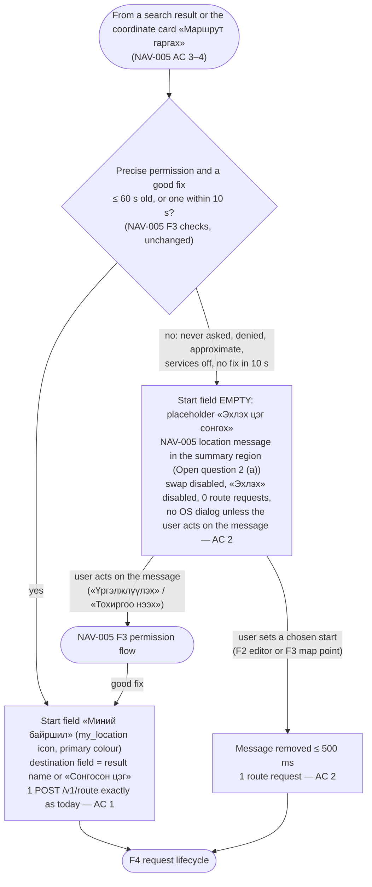
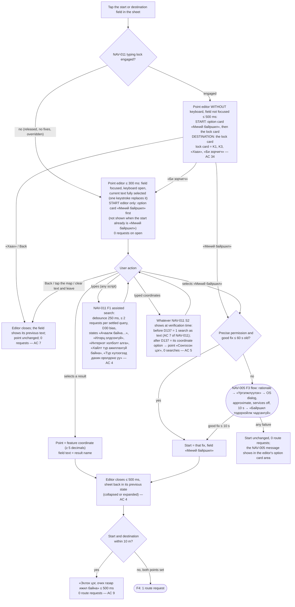
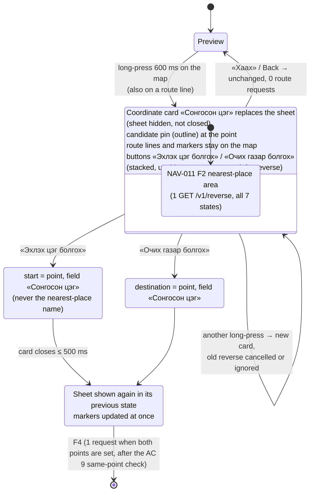
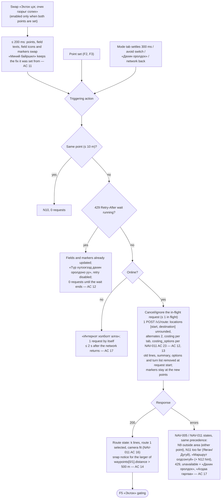
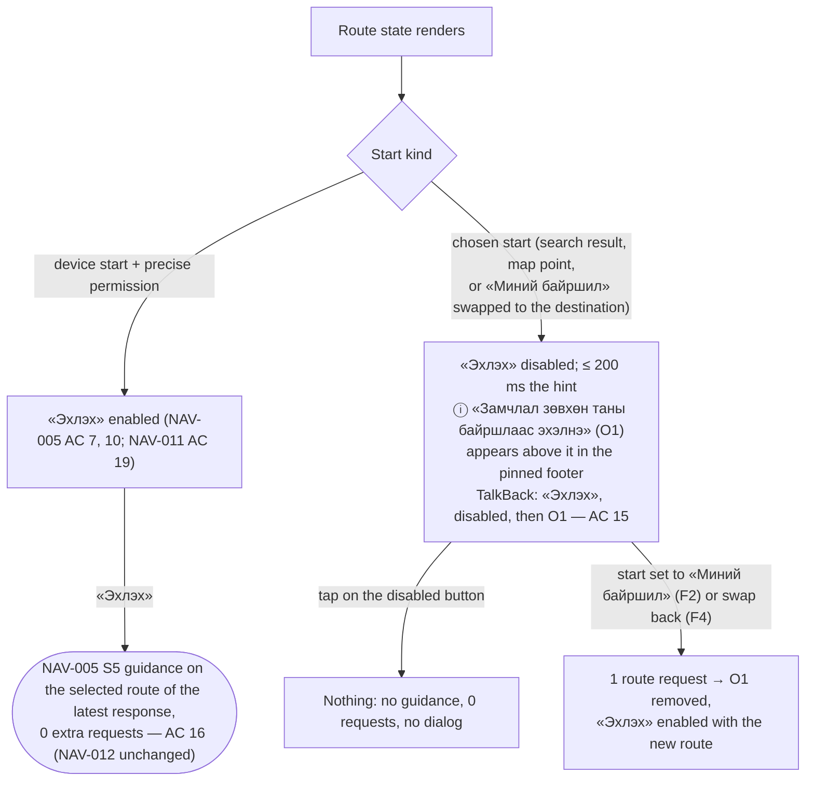
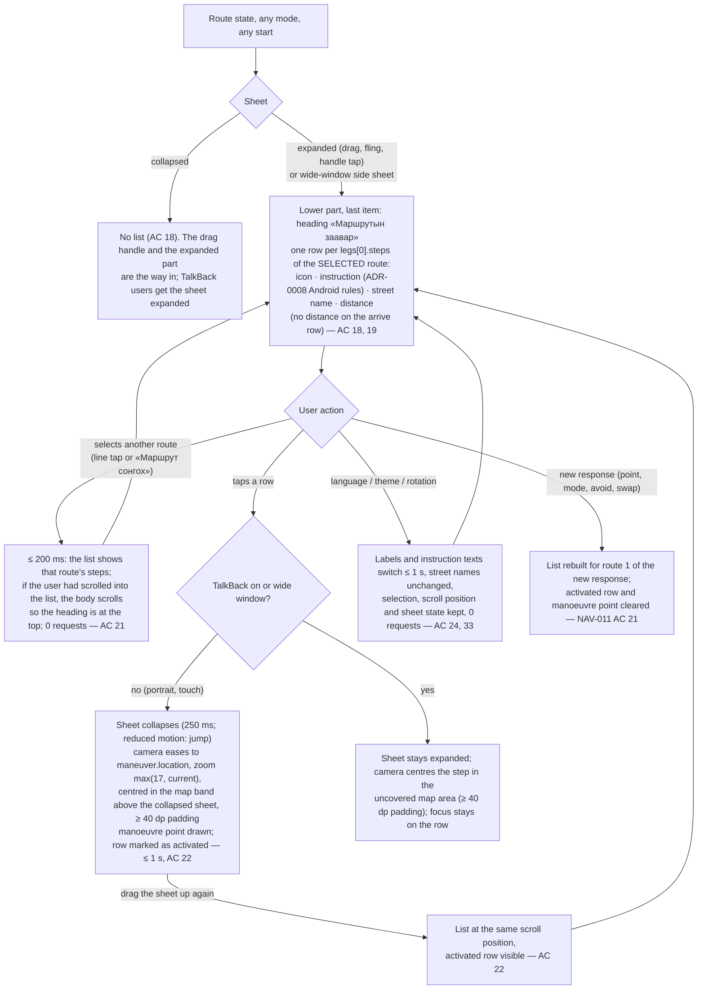
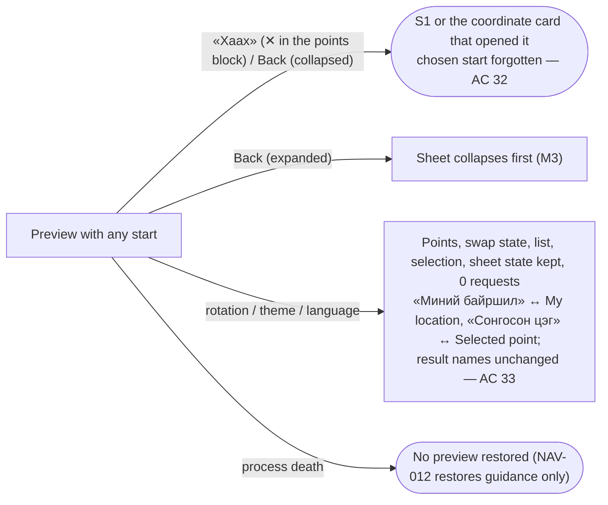

# Flow NAV-018: Android route preview, choosing the start point (search, map point, swap) and the turn list «Маршрутын заавар»

- **Story:** [NAV-018](../../requirements/stories/NAV-018-android-origin-choice-turn-list.md) (Phase 1 follow-up of NAV-011, priority should / P2, D136). AC referenced per step.
- **Screens:** [`screens/NAV-018-android-origin-turn-list.md`](../screens/NAV-018-android-origin-turn-list.md). It is a **delta** on [`screens/NAV-011-android-route-preview-search-parity.md`](../screens/NAV-011-android-route-preview-search-parity.md) (S3 sheet, coordinate card, typing lock), which is itself a delta on NAV-005.
- **Base flows:** [`flows/NAV-011-android-route-preview-search-parity.md`](NAV-011-android-route-preview-search-parity.md) F3 (preview) is **extended** by F1–F6 below: the start is no longer always «Миний байршил». NAV-011 F1 (assisted search), F2 (coordinate card) and F4 (typing lock) are **reused** inside the point editor and the preview-time card. NAV-005 F3 (location access) is reused unchanged. Guidance (NAV-005 S5, NAV-012) is unchanged.
- **Web reference:** [`flows/NAV-004-route-preview.md`](NAV-004-route-preview.md) F2 (set and change points) and F4 (turn list). Android differences are named in the screen spec (Alternatives considered).
- **Prototype:** [`prototypes/NAV-018-android-points.html`](../prototypes/NAV-018-android-points.html).
- **API:** `openapi.yaml` `search`, `reverse`, `postRoute`. No contract change for the design.

Copy is quoted by its `mn` value in «»; every string is a glossary term (O1, K1–K3 and B2 are `needs native review`). Keys are in the screen spec › Copy.

## F1. Opening the preview: which start? (AC 1, 2, 10, 32)

- The start is fixed when it is set: later fixes, GPS loss or permission changes never change it and send **0** requests (AC 10). They only affect «Эхлэх» (F5).
- A chosen start is **never kept**: every new preview starts with F1 again (AC 32, Open question 3 (a)). Nothing is stored.

## F2. Changing a point in the point editor (AC 3–5, 7, 9, 34)

The field in the sheet is a read-only "button field". A tap opens the **point editor**: the sheet is hidden (not closed, state kept) and the field opens at the top of the screen in the S1 search-bar position, with the NAV-011 search underneath (same code, same states, same strings). One field is edited at a time.

- The keyboard is never opened by the lock releasing (NAV-011 Design note 6). A response for a query that is no longer the editor's text is ignored (NAV-011 AC 7 rule; only one editor exists at a time, so it can never fill the other field's list — AC 4).
- «Хайлтыг арилгах» (clear) empties the text only. Leaving after clearing restores the previous text; the point is never cleared by the user (AC 7).

## F3. A map point as start or destination (AC 6)

- A long-press that lands on the device position or on the other point leads to F2's same-point rule (N10, 0 requests) once a button is chosen.
- In wide windows the card takes the side sheet's place (same column).

## F4. Swap and the route request lifecycle (AC 11–14, 17)

- Swapping twice restores the original points and sends 2 requests in total (AC 11). An older response never replaces a newer one (NAV-011 AC 14).
- The camera moves only on the first render of a new response, never on a swap or a point change by itself (NAV-011 P3).

## F5. «Эхлэх»: only from the device position (AC 15, 16; Open question 1 (a))

- O1 appears only together with a route. In states without a route «Эхлэх» is disabled anyway (NAV-005 S3) and O1 is not shown.
- With the NAV-012 battery hint as well: collapsed = summary → battery entry row → O1 → «Эхлэх»; expanded = the full battery hint first in the lower part, O1 stays pinned above «Эхлэх» (AC 30).

## F6. Turn list «Маршрутын заавар» (AC 18–26)

- The list is lazy: only visible rows plus a small buffer are composed (AC 25). The expanded body (fields, tabs, summary, options, switch, list) is **one** lazy scroll above the pinned «Эхлэх», so a 500-step list never nests a scroll inside a scroll.

## F7. Close, rotation, language, process death (AC 24, 32, 33)

- System Back order: point editor → closes the editor (restores the field); coordinate card → back to the preview; expanded sheet → collapses; collapsed sheet → closes the preview (NAV-011 Interactions).

## AC coverage
| AC | Flow step |
|---|---|
| 1, 2 | F1 |
| 3–5, 7 | F2 |
| 6 | F3 |
| 8 | Screen spec › Map markers; map-style §7.7 |
| 9 | F2, F4 (same point) |
| 10 | F1 (start fixed when set) |
| 11–14, 17 | F4 |
| 15, 16 | F5 |
| 18–26 | F6 |
| 27–30 | No flow (layout, accessibility, strings); screen spec › Layout rules Q1–Q8, Accessibility, Copy |
| 31 | No UI (privacy); F1 note (nothing stored) |
| 32, 33 | F1 note, F7 |
| 34 | F2 (locked branch) |
| 35–38 | No UI (regression, coordination, verification) |
