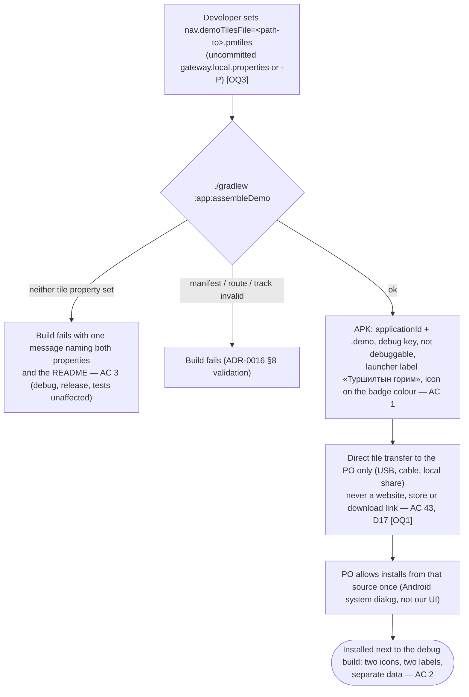
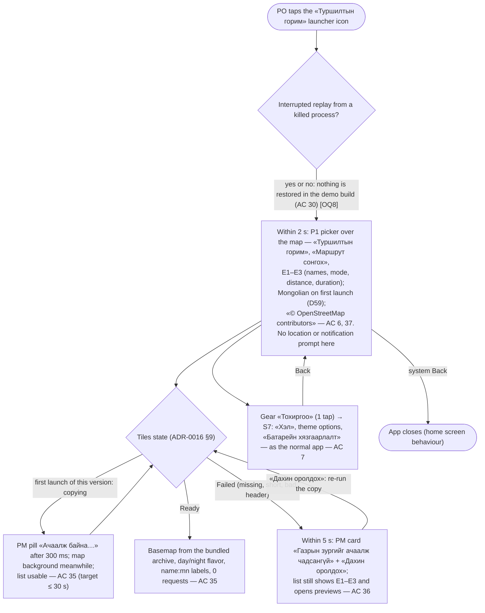
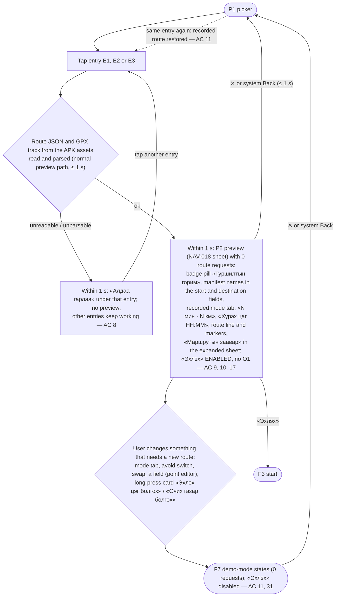
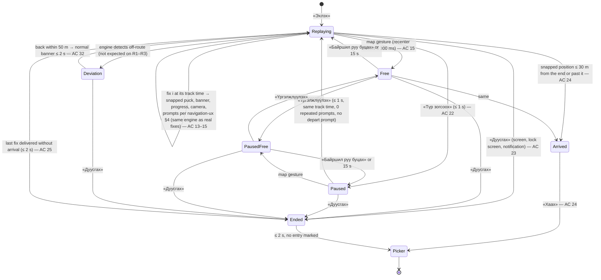
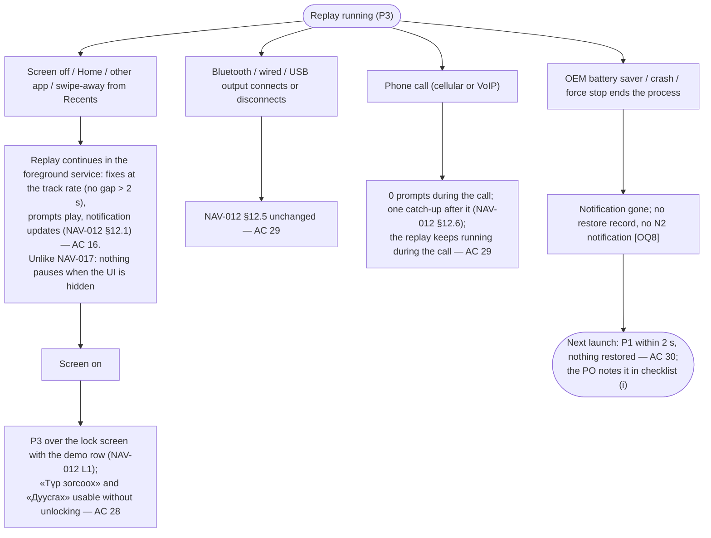
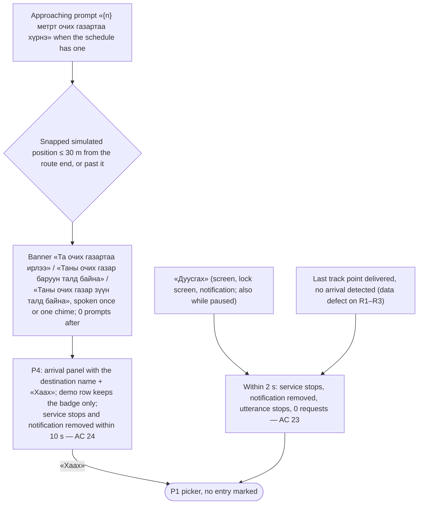
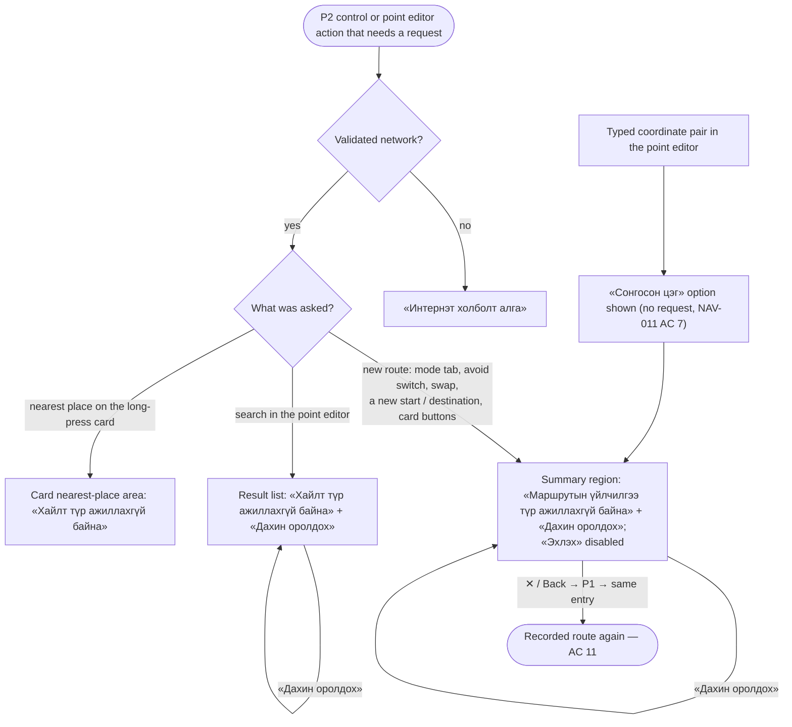

# Flow NAV-019: Android demo build (install → route picker → real preview → simulated replay through the real guidance → arrival → picker)

- **Story:** [NAV-019](../../requirements/stories/NAV-019-android-demo-mode.md). AC referenced per step. PO decisions D154 (option B) and D155 (light process). The orchestrator defaults **R1–R7 are proposed defaults, PO to confirm** (story Open questions 1–7); branches that depend on an open answer are marked **[OQ n]**.
- **Screens:** [`screens/android-demo-picker.md`](../screens/android-demo-picker.md) (P1 picker, P2 preview delta, P3 guidance delta with the demo row, P4 arrival). It is a **delta** on the NAV-005, NAV-011, NAV-012 and NAV-018 screen specs; everything not named here behaves as there.
- **Base flows (reused unchanged):** [`NAV-005-android-navigation.md`](NAV-005-android-navigation.md) (guidance, voice, arrival), [`NAV-011-android-route-preview-search-parity.md`](NAV-011-android-route-preview-search-parity.md) (preview sheet, typed coordinates), [`NAV-012-android-background-lock-screen.md`](NAV-012-android-background-lock-screen.md) (notification, lock screen, swipe-away, audio output, calls, «Автомат»), [`NAV-018-android-origin-turn-list.md`](NAV-018-android-origin-turn-list.md) (points block, point editor, turn list). Web counterpart: [`NAV-017-web-demo-mode.md`](NAV-017-web-demo-mode.md).
- **Rules:** [`navigation-ux.md`](../navigation-ux.md) §1–§10, §12 and **§13 (demo replay on Android, new)**.
- **Architecture:** [ADR-0016](../../architecture/adr/0016-android-demo-mode.md): `ReplayVariant`, `ReplayLocationSource`, `ReplayClock`, `DemoNetworkBlock`, `DemoTiles` (one-time copy, `pmtiles://file://`). No API operation (0 requests, AC 33).
- **Prototype:** [`prototypes/NAV-019-android-demo.html`](../prototypes/NAV-019-android-demo.html), checked by `prototypes/check-layout-nav019.mjs`.

Copy is quoted by its `mn` value in «»; every string is a glossary term (W1 and W2 are `needs native review`). Place names (R1–R3 ends) are manifest data, not UI strings. "Replay clock" = time since «Эхлэх» without paused time (story › Terms).

## F0. Getting the demo build onto the PO's phone (people and files, no app UI) — AC 1–5, 41, 43

No APK, tile archive, keystore, hostname or property value is ever committed or published (D17, D35). Placeholders only: `<path-to>.pmtiles`.



## F1. Open the demo build — AC 6, 7, 30, 35, 36



## F2. Pick a route and check the preview — AC 8–11, 17, 31



## F3. Start the replay: permissions, service, first prompt — AC 12, 13, 18, 19, 26

```mermaid
sequenceDiagram
    actor U as PO
    participant P as P2 preview
    participant OS as Android dialogs
    participant S as Guidance service (NAV-005, unchanged)
    participant R as ReplayLocationSource
    participant G as P3 guidance
    U->>P: «Эхлэх» (disabled at once: a double tap starts one replay)
    alt OQ6 (b), recommended: location permission missing
        P->>OS: NAV-005 S4 rationale «Байршлаа ашиглахыг зөвшөөрнө үү» → OS location dialog
        OS-->>P: granted → continue
        OS-->>P: denied → NAV-005 denied message in the summary region with «Тохиргоо нээх»; no replay
    else OQ6 (a): no location prompt (specialUse service type in the demo build)
        Note over P,OS: nothing is asked
    end
    P->>S: start the foreground service, channel «Замчлал», header «Туршилтын горим» — AC 12, 27
    S->>G: within 1 s P3: banner, demo row (badge + «Түр зогсоох»), progress panel — AC 12, 17
    R->>S: fix 0 = first track point, then fix i at its track time (± 200 ms); 0 platform location requests — AC 12, 13
    S->>G: depart prompt or one chime within 2 s; A1 for 8 s if no Mongolian voice — AC 18, 19
    opt Android 13+, first «Эхлэх» in the demo build
        S->>OS: notification permission dialog over P3 (once) — AC 26
        OS-->>S: denied → the replay continues without the notification
    end
```

## F4. Replay states, including pause — AC 12–17, 20–22, 24, 25, 32


- **Paused** (navigation-ux §13.2): replay clock frozen, puck still, utterance or chime stopped, 0 prompts, remaining distance and «Хүрэх цаг» frozen, **no «GPS дохио тасарлаа»** however long; the button reads «Үргэлжлүүлэх» (filled). Map gestures, recenter, voice button, settings, language and theme switches work. The notification keeps its last content; the foreground service and the lock-screen view stay. A call during a pause changes nothing.
- **Deviation** (AC 32): recalculating banner with «Маршрутын үйлчилгээ түр ажиллахгүй байна» (or «Интернэт холболт алга» without a validated network); the replay keeps following the track; reroute attempts are blocked (0 requests, ADR-0016 §10).
- **Allowed in every replay state without a state change:** mute (AC 20), language switch (AC 21), theme switch and rotation (NAV-005 AC 59, 64), screen off and on (F5).
- **Not offered:** speed choice (1× only), seek, GPS loss **[OQ4]**.

## F5. Background, lock screen and interruptions — AC 16, 27–30



## F6. End and arrival — AC 23–25



## F7. Demo-mode states for anything that would need the network — AC 11, 31–34

Every request is blocked inside the app before DNS (ADR-0016 §7); the existing outcome code shows the existing states. **0 requests**, also for «Дахин оролдох».


- **Not reachable in the demo build** (hidden, screen spec › Hidden or changed): the S1 search bar and S1 long-press card (P1 replaces S1), the my-location button, the «Миний байршил» option in the start editor.
- **During the replay:** a detected deviation shows the reroute banner of F4 (AC 32). The S5 offline status «Интернэт холболт алга» is **not** shown when the tiles are bundled (screen spec Design note 4, Open question U1); with `nav.demoTilesUrl` it shows as NAV-005 AC 54.
- **Airplane mode** (AC 34): F1–F6 work unchanged with bundled tiles; only F7 answers «Интернэт холболт алга».

## Error-path summary (every screen has offline, GPS-lost and no-result states)
| Screen | Offline | GPS lost / no location | No result / data error |
|---|---|---|---|
| P1 picker | nothing to show with bundled tiles; with `nav.demoTilesUrl` the NAV-002 offline message in PM | not applicable: P1 never uses location | the list is the packaged manifest (always R1–R3); a broken entry shows «Алдаа гарлаа» under it (AC 8); tiles failing show «Газрын зургийг ачаалж чадсангүй» + «Дахин оролдох» (AC 36) |
| P2 preview | requests that would need the network show «Интернэт холболт алга» (F7) | the preview needs no device fix; [OQ6 (b)] location permission denied at «Эхлэх» shows the NAV-005 denied message | changed inputs show «Маршрутын үйлчилгээ түр ажиллахгүй байна» (F7); search shows «Хайлт түр ажиллахгүй байна» |
| P3 guidance | no offline status with bundled tiles; replay, voice, notification and arrival work in airplane mode (AC 34) | does not occur: the position is simulated; pause never produces «GPS дохио тасарлаа» (AC 22) | does not occur: a track that ends without arrival behaves as «Дуусгах» (AC 25); a deviation shows the reroute-unavailable banner (AC 32) |
| P4 arrival | nothing needed | not applicable | — |
| Build / install | — | — | missing tile property: the demo build fails with one clear message (AC 3); install problems are the system's own dialogs |
