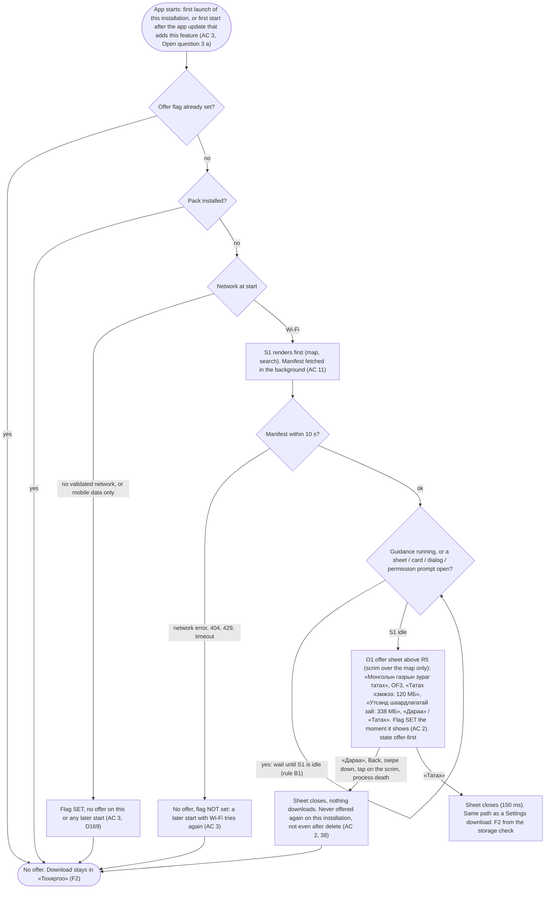
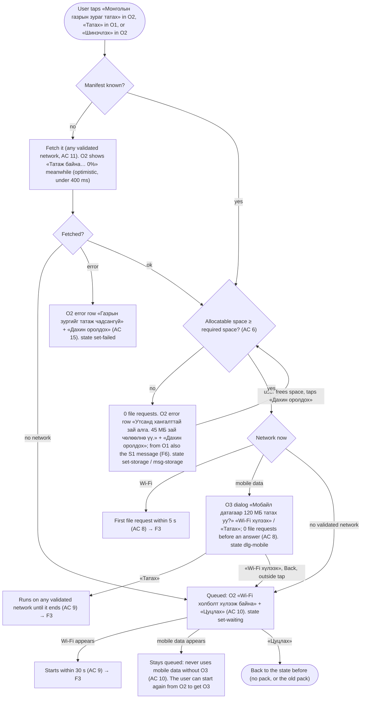
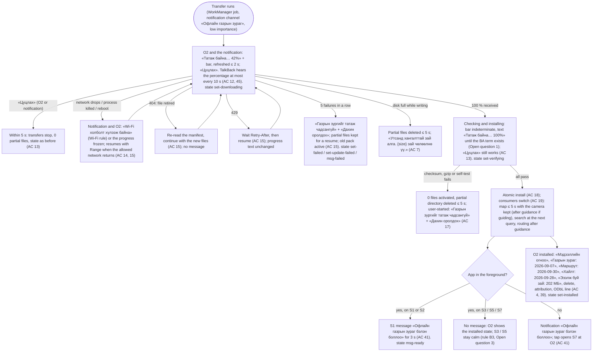
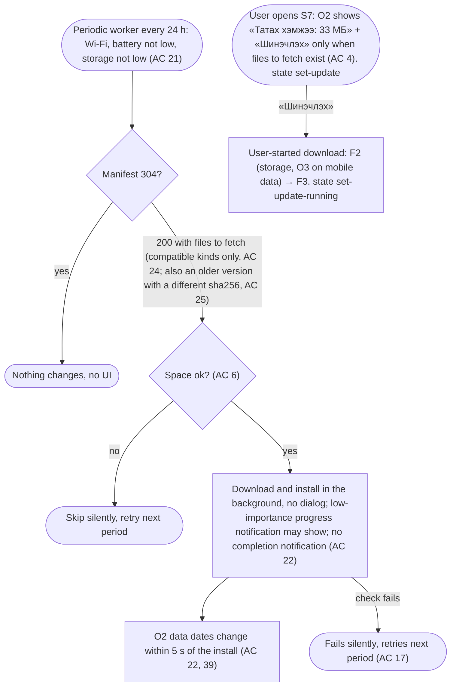
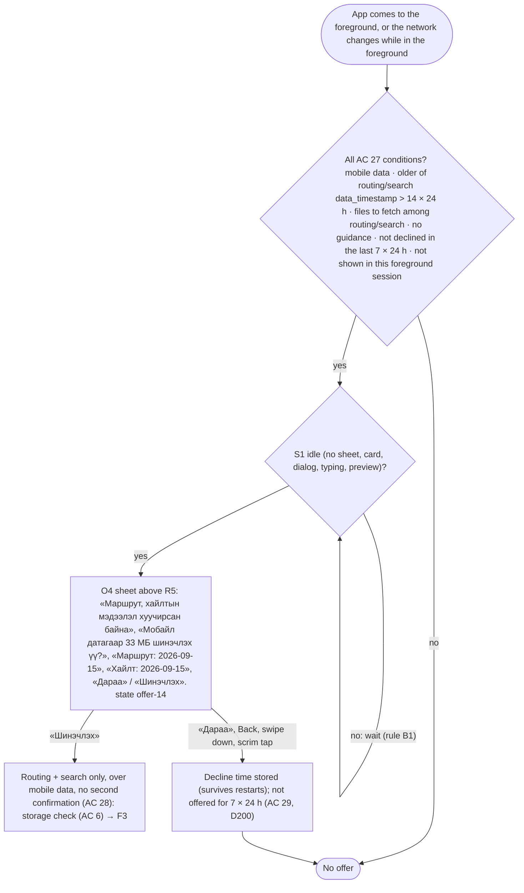
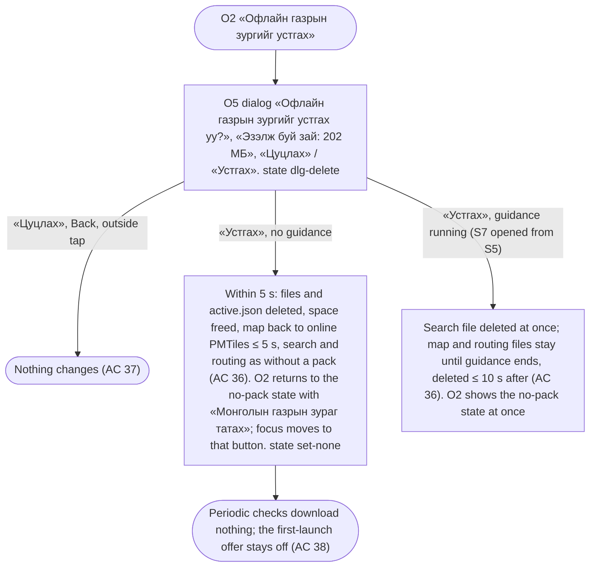
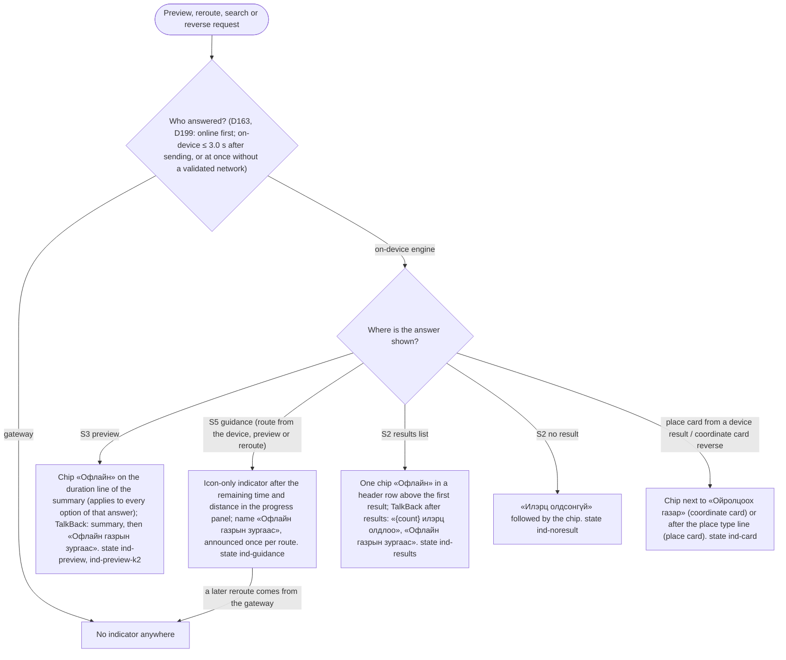

# Flow NAV-022: Android "Download Mongolia map" (first-launch offer, Settings section, network and storage rules, progress and resume, automatic updates, 14-day offer, delete) and the "offline" indicator

- **Story:** [NAV-022](../../requirements/stories/NAV-022-android-offline-pack-download-update-map.md) (AC referenced per step). The indicator part serves [NAV-021](../../requirements/stories/NAV-021-android-on-device-routing-reroute.md) AC 27–28 and [NAV-023](../../requirements/stories/NAV-023-offline-search-reverse.md) AC 21–24. PO decisions D160, D163–D166, D169, D199–D201 ([decisions.md](../../requirements/decisions.md)).
- **Screen spec:** [`screens/android-offline-pack.md`](../screens/android-offline-pack.md) (O1 first-launch offer, O2 Settings section, O3 mobile-data dialog, O4 14-day offer, O5 delete dialog, O6 messages and notifications, O7 the indicator). Base screens: NAV-005 S1/S2/S5/S7, NAV-011 S2 and coordinate card, NAV-012 notification and S7 battery row, NAV-018 S3 sheet. Everything not named here behaves as there.
- **Architecture:** [ADR-0017](../../architecture/adr/0017-offline-mongolia-pack-android.md) §5 (PackManager on WorkManager, atomic install, consumers switch), §6 (openapi 0.6.0 `getOfflinePackManifest`, `getOfflinePackFile`).
- **Prototype:** [`prototypes/NAV-022-offline-pack.html`](../prototypes/NAV-022-offline-pack.html), checked by `prototypes/check-layout-nav022.mjs` (state ids in `code` below).

Copy is quoted by its `mn` value in «»; every string is a glossary term (section 2.7 OF1–OF29, all `needs native review`, plus reused rows). `{size}` follows the story's size display rule with a no-break space before the unit («120 МБ»). **Wi-Fi** and **mobile data** mean what the story's Terms table says (validated + not metered / validated + metered). A captive-portal Wi-Fi is not Wi-Fi.

## F1. First launch: the one-time offer (D169) — AC 1–3

Notes:
- The offer appears at most once per installation and never interrupts guidance or a task the user started (rule B1). If the user starts a search or a preview before the 10 s manifest window ends, the offer waits until they return to S1 within the same app session; if the session ends first, the flag stays unset only when the offer never showed (AC 2 sets it on show), so it can appear on the next start with Wi-Fi.
- **Demo build (NAV-019, `demo` build type):** no offer, no manifest request, no O2 section (0 network requests, D184). See the spec, Known limitations 5.

## F2. A user-started download (O2 «Татах», the O1 offer, «Шинэчлэх») — AC 4–11, 26

The O3 answer is **never remembered** (AC 9): every user-started download over mobile data asks again. «Шинэчлэх» over mobile data shows O3 with the update size (for example «Мобайл датагаар 33 МБ татах уу?»).

## F3. Download lifecycle: progress, cancel, resume, failure, check and install — AC 12–20, 41

- **Where failures show:** in O2 when S7 is open (inline status row, rule B2); as an S1 message when the user is on S1 or S2 (F6); as a notification when the app is in the background. Never as a dialog, never during guidance (S5 shows nothing; the notification channel is not the guidance channel).
- **Notification permission denied (Android 13+):** the download still runs; O2 shows the progress; no new permission is asked (AC 41).

## F4. Automatic updates and «Шинэчлэх» — AC 21–26

## F5. The 14-day routing + search offer over mobile data (D165, D200) — AC 27–30

`tiles` is never part of O4 (AC 27). A fresh update on Wi-Fi ends the offers (AC 30). If the phone is moving faster than the NAV-011 typing-lock speed, O4 waits until it is still (Open question 2, recommendation; not in the AC yet).

## F6. Delete — AC 36–38

A download that is running when the user confirms «Устгах» is cancelled first (AC 13), then the pack is deleted (Open question 4).

## F7. The "offline" indicator OF24 on routes and search results (D201) — NAV-021 AC 27–28, NAV-023 AC 21–24

The indicator says where the **data** came from, not whether the phone is online. It is never shown on the map itself (NAV-022 AC 40) and is visually different from the NAV-005 network message «Интернэт холболт алга» (a message card), which keeps its own rules.

## F8. Error and edge paths (summary)

| Path | What the user sees | AC |
|---|---|---|
| No network at first launch | Nothing; O2 in «Тохиргоо» later | 3 |
| Captive-portal Wi-Fi | Treated as no Wi-Fi: queued «Wi-Fi холболт хүлээж байна» | 9, 10 |
| Metered hotspot | O3 asks | 8 |
| Manifest fails in O2 | Error row «Газрын зургийг татаж чадсангүй» + «Дахин оролдох» | 15 |
| Storage full before start / while writing | «Утсанд хангалттай зай алга. {size} зай чөлөөлнө үү.» + «Дахин оролдох» | 6, 7 |
| Corrupted file | «Газрын зургийг татаж чадсангүй» + «Дахин оролдох»; old pack active | 17 |
| Pack too new for the app | Nothing offered; installed pack and its dates stay; «Шинэчлэх» absent | 24 |
| GPS lost / location permission denied | No effect on this feature (no location is used); NAV-005 rules for the map | — |
| Slow network | Percentage moves slowly; nothing blocks the app; «Цуцлах» always available | 12, 13 |
| App killed during download | On return: O2 shows the resumed progress or «Wi-Fi холболт хүлээж байна»; no restart from 0 | 14, 18 |
