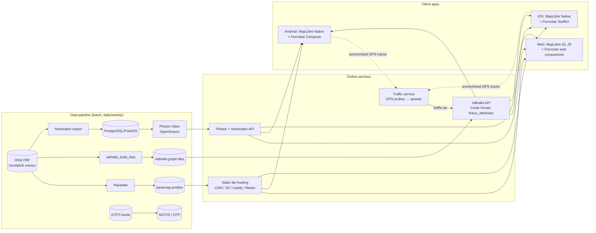

# OSM-Based Open-Source Navigation System — Research Report

*Research date: 29 September 2026. Goal: build a navigation system on OpenStreetMap (OSM) data, using only open-source parts, that works like Google Maps navigation.*

---

## 1. Executive summary

You can build a Google-Maps-style navigation product entirely from open-source parts and OSM data in 2026. Every core layer has a mature, actively maintained project: map data, vector tiles, map rendering, search (geocoding), routing, turn-by-turn guidance, voice and rerouting. The work is mostly **integration and operations**. You won't need to invent algorithms.

**Recommended stack**

| Layer | Recommended | Why |
|---|---|---|
| Map data | **OpenStreetMap** (Geofabrik extract → planet later) | Free, global, editable, ODbL |
| Vector tiles | **Planetiler → PMTiles** (Protomaps basemap) | One static file, cheap to host, fast to build |
| Map rendering | **MapLibre** (GL JS for web, Native for Android/iOS) | Industry-standard open-source renderer (Mapbox GL fork) |
| Routing engine | **Valhalla** | Dynamic costing, multimodal, traffic hooks, built-in turn-by-turn narrative **including Mongolian (mn-MN)** |
| Navigation SDK | **Ferrostar** (Stadia Maps, BSD) | Rust core + SwiftUI / Jetpack Compose / Web UI; built for Valhalla and MapLibre |
| Geocoding / search | **Photon** (search-as-you-type) + **Nominatim** (reverse / structured) | OSM-native, multilingual |
| Public transport (optional) | **MOTIS** (or OpenTripPlanner) + GTFS | Powers Transitous |
| Traffic (optional) | Own GPS probe data → Valhalla live/predicted traffic | OSM has no traffic data. Build it yourself or license it |

The biggest gaps compared with Google Maps are **real-time traffic, POI richness (hours, reviews, photos), address completeness, and street-level imagery**. None of these come from a routing engine. They are data problems, and section 8 covers mitigations.

---

## 2. What "works like Google Maps navigation" means

Breaking Google Maps navigation into features, and mapping each one to open-source parts:

| # | Feature | Open-source component | Maturity |
|---|---|---|---|
| 1 | Smooth vector map, zoom/rotate/tilt, night mode | MapLibre GL JS / MapLibre Native + custom style | ✅ Mature |
| 2 | Search places & addresses, autocomplete | Photon, Nominatim, Pelias | ✅ Mature (quality depends on OSM data) |
| 3 | Reverse geocoding ("what is here?") | Nominatim, Photon `/reverse` | ✅ Mature |
| 4 | Route A→B for car / walk / bike / motorcycle / truck | Valhalla, GraphHopper, OSRM | ✅ Mature |
| 5 | Alternative routes | Valhalla `alternates`, OSRM, GraphHopper | ✅ |
| 6 | Multi-stop routes / waypoints | All engines | ✅ |
| 7 | Avoid tolls / highways / ferries / unpaved | Valhalla costing options, GraphHopper custom models | ✅ |
| 8 | Turn-by-turn instructions with street names | Valhalla narrative, OSRM + osrm-text-instructions, GraphHopper | ✅ |
| 9 | **Voice guidance** (localised) | Valhalla `voice_instructions` / SSML + device TTS (Android TextToSpeech / iOS AVSpeechSynthesizer) | ✅ (quality depends on device TTS voice) |
| 10 | Live GPS tracking, snap to road | Ferrostar / MapLibre Navigation (route snapping); Valhalla map-matching for server side | ✅ |
| 11 | **Off-route detection & automatic rerouting** | Ferrostar core (customisable), MapLibre Navigation | ✅ |
| 12 | Lane guidance, highway signs, exit numbers | Valhalla (lanes, `sign` data, from OSM `turn:lanes`, `destination=*`) | ⚠️ Works. Depends on OSM tagging density |
| 13 | Speed limit display, speeding warning | Valhalla `annotations` (speed limit from OSM `maxspeed`) | ⚠️ Depends on OSM `maxspeed` coverage |
| 14 | ETA & remaining distance | Engine + SDK trip progress | ✅ (accuracy depends on speed model / traffic) |
| 15 | **Real-time traffic, traffic-aware ETA** | Valhalla live traffic (`traffic.tar`) + predicted speeds | ⚠️ Engine supports it. **You must supply the data** |
| 16 | Incidents / road closures | Valhalla incidents, custom closure feed; OSM `access`/`conditional` tags | ⚠️ Needs your own reporting pipeline |
| 17 | Offline maps and offline routing | Organic Maps / CoMaps / OsmAnd (full apps); Valhalla tiles on device; PMTiles offline | ✅ Possible, more engineering |
| 18 | Public transport directions | MOTIS, OpenTripPlanner + GTFS feeds | ⚠️ Needs GTFS data for your city |
| 19 | Android Auto / Apple CarPlay | Ferrostar (CarPlay work in progress/available), MapLibre Native | ⚠️ Newer, check current status |
| 20 | Street View | Panoramax, Mapillary (imagery APIs) | ⚠️ Coverage is sparse |
| 21 | Satellite imagery | Sentinel-2 cloudless (EOX, CC-BY-NC-SA for some versions), Esri (license terms), own imagery | ⚠️ Licensing needs care |
| 22 | POI details (hours, phone, reviews, photos) | OSM tags (`opening_hours`, `phone`, `website`) + your own DB | ⚠️ Reviews/photos you must build |

---

## 3. Reference architecture

**Navigation loop on the device (what Ferrostar or MapLibre Navigation does):**

1. User picks a destination (Photon autocomplete) → app calls Valhalla `/route` with `voice_instructions=true`, `banner_instructions=true` (OSRM-compatible format).
2. SDK draws the route on MapLibre and starts a **trip state machine**.
3. Each GPS fix is snapped to the route line. The SDK updates the current step, distance to the next manoeuvre and ETA.
4. At trigger distances it shows banners and speaks voice prompts ("In 300 metres, turn left onto Peace Avenue").
5. If the user is off the route beyond a threshold (distance + time), the SDK fires **off-route**. The app requests a new route from the current position and heading, and the trip continues.
6. On arrival → waypoint advance or trip end.

---

## 4. Component-by-component analysis

### 4.1 Map data — OpenStreetMap

- **Source:** planet file (~80+ GB PBF) or country extracts from [Geofabrik](https://download.geofabrik.de/asia/mongolia.html) (Mongolia is small, fast to process).
- **Updates:** minutely/hourly/daily replication diffs. For navigation, rebuilding daily or weekly is typical.
- **License:** ODbL 1.0. You must show "© OpenStreetMap contributors". If you publicly distribute a *derived database* (e.g., OSM data you improved), it must be share-alike. Rendered maps and routes ("produced works") can use any license.
- **Quality:** varies by country. Roads are usually good. House numbers, `maxspeed`, `turn:lanes` and `opening_hours` vary a lot. **The best way to beat Google locally is to invest in OSM mapping yourself.**

### 4.2 Vector tiles (the basemap)

| Option | Tool | Output | Notes |
|---|---|---|---|
| **Protomaps basemap** ⭐ | Planetiler profile | Single `.pmtiles` file | Planet in ~2–3 h on a modest machine. Serve as a static file over HTTP range requests (S3/R2/any CDN). Daily builds downloadable. |
| OpenMapTiles schema | Planetiler / OpenMapTiles tools | MBTiles / PMTiles | Big style ecosystem (OSM Bright, Positron, Dark Matter); styles are BSD/CC-BY |
| Shortbread schema | Tilemaker / Planetiler | MBTiles / PMTiles | Lean, CC0 schema from Geofabrik |
| Dynamic tiles | Martin (Rust), pg_tileserv | Tiles from PostGIS | For custom live layers (traffic, incidents) |

**Recommendation:** Protomaps PMTiles for the basemap plus a small dynamic layer (Martin or GeoJSON) for traffic and incidents.

### 4.3 Map rendering — MapLibre

- **MapLibre GL JS** (web), **MapLibre Native** (Android, iOS, desktop), **MapLibre Compose** (Kotlin Multiplatform). All BSD-licensed.
- GPU-rendered vector maps, 3D tilt, rotation, custom styles and a navigation camera. This is the open replacement for Mapbox GL and matches Google Maps visually.
- Ferrostar 0.50 (2026) moved its Android UI to the official MapLibre Compose API.

### 4.4 Routing engines (the core decision)

| | **Valhalla** ⭐ | **GraphHopper** | **OSRM** | **openrouteservice** |
|---|---|---|---|---|
| Language | C++ | Java | C++ | Java (on GraphHopper) |
| License | MIT | Apache 2.0 | BSD-2 | GPL-3.0 |
| Latest (2026) | 3.7.0 (Apr 2026), active | 11.x (11.0 Oct 2025) | v26.x (new year-based versioning, 26.9 latest) | active |
| Algorithm | Tiled graph, bidirectional A*, dynamic costing | CH + LM + flexible mode | Contraction Hierarchies / MLD | GraphHopper-based |
| Speed | Fast (ms–100 ms) | Very fast | **Fastest** | Fast |
| Change profile at request time | ✅ Full (costing options per request) | ✅ Custom models (JSON) | ❌ Needs re-preprocessing (Lua profiles) | Partial |
| Modes | car, bike, foot, motorcycle, truck, bus, taxi, motor_scooter, multimodal | car, bike, foot, truck (+custom) | one profile per instance | many |
| Turn-by-turn narrative | ✅ Built-in, **35 languages incl. mn-MN** | ✅ (many languages) | via osrm-text-instructions (client) | ✅ |
| Navigation-ready output | ✅ OSRM-compatible `voiceInstructions` / `bannerInstructions` | ✅ `/navigate` endpoint (since v11) for MapLibre Nav / Ferrostar | ✅ Mapbox-style steps | ⚠️ |
| Traffic | ✅ Live (`traffic.tar`) + predicted (weekly speed profiles) | ⚠️ Custom model / commercial | ⚠️ Via `--segment-speed-file` re-customise (MLD) | ❌ |
| Map matching | ✅ `trace_route` / `trace_attributes` | ✅ | ✅ `/match` | ❌ |
| Isochrones / matrix / TSP | ✅ / ✅ / ✅ | ✅ / ✅ / (commercial) | ❌ / ✅ / ✅ trip | ✅ |
| Elevation | ✅ | ✅ | ❌ | ✅ |
| On-device (offline) | ✅ (used in mobile apps) | ✅ (Android) | ⚠️ | ❌ |
| RAM for planet | Moderate (tiles memory-mapped) | High (CH per profile) | **Very high** (~tens of GB per profile) | High |

**Why Valhalla:**
1. Per-request costing: avoid tolls, avoid unpaved, truck height/weight, "use highways 0.3". No rebuild needed.
2. Native live and predicted traffic support, which is essential if you want Google-like ETAs later.
3. Built-in voice and banner instructions in **Mongolian** (`mn-MN` locale exists in the Valhalla repo), plus Russian and English.
4. First-class support in Ferrostar. Stadia Maps runs Valhalla commercially, so the integration is production-tested.
5. MIT license, the most permissive option.

**When to choose others:** OSRM if you need extreme throughput for one car profile (e.g., fleet ETAs or big distance matrices). GraphHopper if your team is Java-centric or you want its custom-model JSON.

### 4.5 Navigation SDK (turn-by-turn on the device)

| | **Ferrostar** ⭐ | MapLibre Navigation Android | MapLibre Navigation iOS | Mapbox Navigation SDK |
|---|---|---|---|---|
| License | BSD-3 | MIT (Mapbox v0.19 fork) | ISC/BSD (fork) | ❌ Proprietary |
| Architecture | Rust core + Swift/Kotlin/Web UI | Java/Kotlin (moving to KMP) | Swift | — |
| Platforms | iOS, Android (beta, production use); Web components (beta); React Native (pre-alpha); Flutter via platform views | Android | iOS | — |
| Backends | Valhalla, OSRM-compatible, GraphHopper `/navigate`, custom adapters | OSRM/Mapbox format (Valhalla via OSRM output) | same | Mapbox only |
| Off-route + reroute | ✅ customisable logic | ✅ | ✅ | — |
| Voice | ✅ spoken instruction observer → platform TTS | ✅ | ✅ | — |
| Simulation (testing) | ✅ location simulation | ✅ | ✅ | — |
| Momentum 2026 | High: FOSS4G 2026 talk, frequent releases (0.50/0.51) | Maintained, slower | Maintained | — |

**Recommendation:** Ferrostar. A single Rust core gives the same navigation logic on Android, iOS and web, and its UI components are composable, so you can build your own look.

### 4.6 Geocoding / search

| | **Photon** ⭐ | **Nominatim** | **Pelias** |
|---|---|---|---|
| Strength | Search-as-you-type, typo tolerance, location bias, multilingual | Official OSM geocoder, precise structured and reverse search | Combines OSM + OpenAddresses + WhosOnFirst + custom |
| Backend | OpenSearch (v1.0 released Feb 2026) | PostgreSQL/PostGIS | Elasticsearch |
| License | Apache 2.0 | GPL | MIT |
| Planet size | ~95 GB | ~1 TB with full import | large |
| Country-scale | Small | Small | Medium effort |

**Recommendation:** Photon for the search box (fed from a Nominatim database) and Nominatim for reverse geocoding and admin lookups. Add Pelias only if you need to merge non-OSM address datasets.

### 4.7 Voice guidance

- Valhalla returns `verbal_pre_transition_instruction`, `verbal_post_transition_instruction`, and OSRM-style `voiceInstructions` with SSML. Ferrostar triggers them at the right distance.
- Speech is produced on the device by the OS TTS engine (Android `TextToSpeech`, iOS `AVSpeechSynthesizer`, Web Speech API). **Mongolian TTS voice availability varies by device.** Test it. Fallbacks:
  - Pre-recorded audio prompts (OsmAnd-style voice packs), or
  - An open-source neural TTS (e.g., Piper) with a Mongolian model, running on your server or the device.

### 4.8 Traffic (the hardest part)

OSM contains **no traffic data**. Options, from cheapest to most expensive:

1. **Static speeds only:** OSM `maxspeed` + road class defaults. ETAs are roughly OK outside rush hour.
2. **Predicted (historic) traffic:** aggregate your own users' anonymised GPS traces → map-match with Valhalla → per-edge speed profile for each 15-minute slot of the week → Valhalla predicted speeds.
3. **Live traffic:** the same pipeline in near-real-time (e.g., every 1–2 min) → write Valhalla `traffic.tar` (memory-mapped, hot-reloaded). Partner data: taxi/delivery fleets, bus GPS (city AVL), ride-hailing companies.
4. **Commercial feed:** TomTom / HERE / INRIX traffic APIs (paid; check license terms for mixing with OSM and for storage).

For a single city like Ulaanbaatar, a **fleet partnership** (taxis, buses, delivery) is the realistic path to useful live traffic.

### 4.9 Public transport (optional)

- **MOTIS** (MIT): intermodal real-time routing, powers **Transitous** (60+ countries). Includes geocoding and tiles ("batteries included").
- **OpenTripPlanner** (LGPL): the long-standing standard, used by many agencies.
- Both need **GTFS** (static) and ideally **GTFS-Realtime** feeds. For Ulaanbaatar, a GTFS feed would have to be created or obtained from the city bus operator.

### 4.10 Reference: complete open-source OSM navigation apps

Study or fork these before building from scratch:

| App | License | Platforms | Notes |
|---|---|---|---|
| **OsmAnd** | GPLv3 | Android, iOS | Most feature-rich (v5.4, Sep 2026). Offline, many profiles. Own routing engine. Heavy UI. Now adding MOTIS/Transitous transit. |
| **Organic Maps** | Apache 2.0 | Android, iOS | Clean, fast, offline, privacy-focused. Maps.ME heritage (C++ core). |
| **CoMaps** | Apache 2.0 | Android, iOS | Community fork of Organic Maps (2025). Stable 2026.08.31. Default maps app in CalyxOS since May 2026. |
| **Headway / maps.earth** | Apache 2.0 | Web (self-hosted) | "Maps stack in a box": Planetiler + MapLibre + Pelias + Valhalla + OTP. **Closest to our target server architecture.** |
| **Vialix, NavMaster** (GitHub) | open source | Android | Small 2026 projects combining MapLibre + Valhalla + Ferrostar. Good examples of the recommended stack. |
| Navit | GPL | Desktop/embedded | Older, niche |

**Build vs fork decision:**
- **Offline-first consumer app, fastest to market:** fork **CoMaps/Organic Maps** (Apache 2.0, allows commercial and rebranding). The trade-off is a large C++ codebase and its own map format.
- **Online-first, Google-Maps-like UX with traffic, full control, web + mobile:** **custom build on Valhalla + Ferrostar + MapLibre** (recommended below).

---

## 5. Recommended solution in detail

### 5.1 Server side

| Service | Software | Container | Notes |
|---|---|---|---|
| Tiles | Protomaps `basemap.pmtiles` built by Planetiler | static file behind Caddy/Nginx or S3/R2 + CDN | Custom MapLibre style (day/night, Mongolian labels via `name:mn`) |
| Routing | Valhalla (`ghcr.io/valhalla/valhalla` or the community docker image) | 1–N instances behind a load balancer | Tiles built from the same OSM extract |
| Search | Photon + Nominatim | 2 containers + PostgreSQL | Language bias `mn`, bounding box bias to Mongolia |
| Traffic (phase 3) | Custom service (Python/Go/Rust) + Kafka/Redis + Valhalla map-matching | — | Writes `traffic.tar` |
| API gateway | Nginx/Kong/Caddy | — | Rate limits, API keys, caching |
| Rebuild pipeline | Cron / GitHub Actions / Airflow | — | Daily: download diff → rebuild tiles, Valhalla graph, Photon index → blue/green switch |

### 5.2 Client side

- **Android:** Kotlin + Jetpack Compose + MapLibre Native (Compose) + Ferrostar Android.
- **iOS:** Swift + SwiftUI + MapLibre Native + Ferrostar iOS.
- **Web:** MapLibre GL JS + Ferrostar web components (beta), or a custom Vue/React UI. The web version is mainly for route planning; real turn-by-turn is a mobile use case.
- Screens: map + search → place card → route preview (alternatives, mode tabs, avoid options) → active navigation (banner, lane view, speed limit, ETA bar, recenter, mute, report incident) → arrival.

### 5.3 Sizing (rough estimates)

| Scope | Valhalla build | Valhalla serving | Photon/Nominatim | Tiles |
|---|---|---|---|---|
| **Mongolia only** | minutes, 4 vCPU / 8 GB RAM | 2 vCPU / 2–4 GB | 2 vCPU / 4 GB, a few GB disk | <1 GB PMTiles |
| Region (e.g., Central Asia) | ~1 h, 8 vCPU / 16–32 GB | 4 vCPU / 8 GB | 4 vCPU / 16 GB | a few GB |
| Planet | several hours, 16+ vCPU / 64+ GB, ~200 GB+ disk | 8 vCPU / 16–32 GB per node | Photon ~95 GB disk; Nominatim ~1 TB | ~120 GB PMTiles |

A single-country deployment fits on **one mid-size VM** (roughly 8 vCPU / 16–32 GB), so hosting costs are low. At higher traffic you scale routing horizontally.

---

## 6. Mongolia-specific considerations

*(Included because the likely target market is Mongolia. Ignore if that's not the case.)*

1. **Language:** Valhalla ships an **mn-MN** narrative locale, so turn-by-turn text in Mongolian works out of the box. Review the translation quality and contribute fixes upstream. Map labels should prefer `name:mn` → `name` → `name:en`.
2. **Data quality:** Ulaanbaatar has been mapped with HOT / World Bank / MUST support, but coverage of house numbers, `maxspeed`, `turn:lanes`, one-way streets and new developments will need local validation. **Plan a mapping team or community programme** (and a feedback button in the app that files OSM notes).
3. **Addresses:** Mongolian addressing (district → khoroo → building/apartment numbers, ger-district plots) is irregular. Expect a custom address layer (OSM `addr:*` + city cadastral data if licensable) and landmark-based search ("near State Department Store").
4. **Road network realities:** many unpaved and seasonal roads and tracks outside cities. Use Valhalla `use_tracks`, `exclude_unpaved`, surface-based speeds. Winter conditions may call for custom speed factors.
5. **Traffic:** Ulaanbaatar congestion is severe, so traffic-aware ETA is a key selling point. Partner with taxi, delivery and bus fleets for GPS probe data (phase 3).
6. **Transit:** a GTFS feed for UB city buses would enable transit directions via MOTIS/OTP.
7. **TTS:** check Mongolian voice availability on Android/iOS. Plan a fallback (recorded prompts or a server-side neural TTS voice).

---

## 7. Implementation roadmap

| Phase | Duration (small team, estimate) | Deliverables |
|---|---|---|
| **0. PoC** | 1–2 weeks | Docker-compose on one VM: PMTiles + Valhalla + Photon for Mongolia; web demo (MapLibre GL JS) with search, route A→B, alternatives, turn-by-turn list |
| **1. MVP mobile nav** | 6–10 weeks | Android app (Ferrostar + MapLibre): search, route preview, active navigation, Mongolian voice, off-route rerouting, night mode; daily data rebuild pipeline |
| **2. Parity features** | 2–3 months | iOS app, lane guidance, speed limits, multi-stop, avoid options, favourites/history, share ETA, OSM-note feedback, CarPlay/Android Auto evaluation |
| **3. Traffic** | 2–4 months | GPS probe ingestion, map-matching, predicted speeds → live `traffic.tar`, traffic layer on map, traffic-aware ETA, incident reporting |
| **4. Extras** | ongoing | Transit (MOTIS + GTFS), offline regions (on-device Valhalla + PMTiles), POI enrichment, business listings |

---

## 8. Gaps vs Google Maps and how to close them

| Gap | Severity | Mitigation |
|---|---|---|
| Real-time traffic | 🔴 High | Fleet GPS partnerships, own-user probes (opt-in, anonymised), or commercial feed |
| POI richness (hours, reviews, photos) | 🟠 Medium | Import licensable business data; own reviews/photos DB; encourage OSM edits |
| Address coverage | 🟠 Medium | Local mapping campaigns; city data partnerships; landmark search |
| Street-level imagery | 🟡 Low–Med | Panoramax / Mapillary; own capture with dashcams |
| Satellite imagery | 🟡 Low–Med | Check licenses carefully (many free imagery sources forbid commercial use) |
| Map freshness | 🟢 Low | OSM updates are minutely. Daily rebuilds often beat commercial maps locally |
| Voice quality | 🟡 Low–Med | Device TTS or custom neural TTS voice |

---

## 9. Licensing summary

| Component | License | Commercial use | Obligation |
|---|---|---|---|
| OSM data | ODbL 1.0 | ✅ | Attribution "© OpenStreetMap contributors"; share-alike for distributed derived databases |
| Valhalla | MIT | ✅ | Keep notice |
| OSRM | BSD-2 | ✅ | Keep notice |
| GraphHopper | Apache 2.0 | ✅ | Keep notice |
| openrouteservice | GPL-3.0 | ⚠️ | Copyleft if distributed |
| MapLibre GL JS / Native | BSD | ✅ | Keep notice |
| Ferrostar | BSD-3 | ✅ | Keep notice |
| Planetiler | Apache 2.0 | ✅ | — |
| Protomaps basemap | code BSD-3 / tiles ODbL | ✅ | OSM attribution |
| Photon | Apache 2.0 | ✅ | — |
| Nominatim | GPL | ✅ (server use) | Copyleft only if you distribute it |
| Pelias | MIT | ✅ | — |
| MOTIS | MIT | ✅ | — |
| OpenTripPlanner | LGPL | ✅ | — |
| Organic Maps / CoMaps | Apache 2.0 | ✅ | Rebrand (trademarks not included) |
| OsmAnd | GPLv3 (+ trademark restrictions) | ⚠️ | Copyleft for forks |

The recommended stack is **entirely permissive (MIT/BSD/Apache)** except Nominatim (GPL, fine for server-side use). You can build a closed-source commercial product on it.

---

## 10. Risks

1. **Data quality locally** is the main risk to user trust. Mitigate with a mapping programme before launch.
2. **Traffic data** needs partnerships. Without it, ETAs in UB rush hour will be poor.
3. **Ferrostar is pre-1.0** (APIs still change between releases). Pin versions and budget for upgrades.
4. **Mobile TTS in Mongolian** may be missing on some devices.
5. **Operations:** daily rebuild pipelines, blue/green deploys and monitoring are needed from the MVP stage.

---

## 11. Open decisions (needed before implementation)

1. **Target platforms first:** Android, iOS, web, or all?
2. **Coverage:** Mongolia only, Ulaanbaatar first, or global?
3. **Online vs offline:** is offline navigation required at launch?
4. **Traffic:** is there a fleet or data partner available?
5. **Build vs fork:** custom stack (recommended) or fork CoMaps for offline-first?
6. **Hosting:** own servers in Mongolia or a cloud provider?

---

## Sources

- Valhalla: [GitHub](https://github.com/valhalla/valhalla) · [Release 3.7.0](https://github.com/valhalla/valhalla/releases/tag/3.7.0) · [Speed / traffic docs](https://valhalla.github.io/valhalla/speeds/) · [Route API](https://valhalla.github.io/valhalla/api/route/overview/) · [Locales (incl. mn-MN)](https://github.com/valhalla/valhalla/tree/master/locales) · [Traffic PoC](https://github.com/alinmindroc/valhalla_traffic_poc)
- OSRM: [osrm-backend](https://github.com/Project-OSRM/osrm-backend) · [v6.0.0](https://github.com/Project-OSRM/osrm-backend/releases/tag/v6.0.0) · [v26.6.0](https://newreleases.io/project/github/Project-OSRM/osrm-backend/release/v26.6.0)
- GraphHopper: [11.0 release blog](https://www.graphhopper.com/blog/2025/10/14/graphhopper-routing-engine-11-0-released/) · [GitHub](https://github.com/graphhopper/graphhopper)
- Engine comparison: [OpenRouteService vs OSRM vs Valhalla (2026)](https://www.bigiron.cc/guides/openrouteservice-vs-osrm-vs-valhalla-self-hosted-routing)
- Ferrostar: [User guide](https://stadiamaps.github.io/ferrostar/) · [Stadia docs](https://docs.stadiamaps.com/sdks/ferrostar/) · [Releases](https://github.com/stadiamaps/ferrostar/releases) · [FOSS4G 2026 talk](https://talks.osgeo.org/foss4g-2026/talk/V3BYZ7/) · [0.50/0.51 MapLibre Compose migration](https://www.zleptnig.com/blog/ferrostar-0-50-0-51-maplibre-compose-migration/)
- Example apps on the stack: [Vialix](https://github.com/igalmarino/vialix) · [NavMaster](https://github.com/francescobuzle-a11y/navmaster)
- MapLibre: [maplibre-navigation-android](https://github.com/maplibre/maplibre-navigation-android) · [maplibre-navigation-ios](https://github.com/maplibre/maplibre-navigation-ios) · [MapLibre news](https://maplibre.org/news/)
- Tiles: [Protomaps](https://protomaps.com/) · [Protomaps basemaps](https://github.com/protomaps/basemaps) · [Creating PMTiles](https://docs.protomaps.com/pmtiles/create)
- Geocoding: [Photon](https://github.com/komoot/photon) · [Photon demo](https://photon.komoot.io/)
- Headway: [GitHub](https://github.com/headwaymaps/headway) · [maps.earth](https://about.maps.earth/)
- Apps: [CoMaps (Wikipedia)](https://en.wikipedia.org/wiki/CoMaps) · [CoMaps site](https://www.comaps.app/) · [CoMaps on Codeberg](https://codeberg.org/comaps/comaps) · [LWN on CoMaps fork](https://lwn.net/Articles/1024387/) · [Organic Maps](https://en.wikipedia.org/wiki/Organic_Maps) · [OsmAnd](https://en.wikipedia.org/wiki/OsmAnd) · [OsmAnd GitHub](https://github.com/osmandapp/OsmAnd)
- Transit: [Transitous](https://transitous.org/) · [MOTIS](https://github.com/motis-project/motis) · [MOTIS at SotM 2026](https://2026.stateofthemap.org/sessions/LT3DRY/) · [OsmAnd MOTIS PR](https://github.com/osmandapp/OsmAnd/pull/25354)
- Mongolia data: [Geofabrik Mongolia extract](https://download.geofabrik.de/asia/mongolia.html) · [HOT: Mapping Ulaanbaatar](https://www.hotosm.org/projects/mongolia_mapping_ulaanbaatar)
