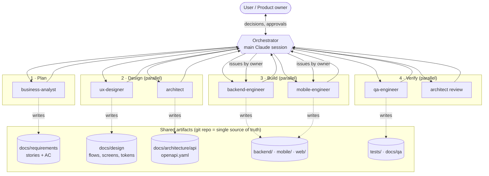

# Multi-Agent Team Architecture

How the AI agent team builds the OSM navigation product. The agents are Claude Code subagents defined in `.claude/agents/`. Shared rules are in `/CLAUDE.md`.

## 1. Team

| Agent | Role | Inputs (reads) | Outputs (writes) |
|---|---|---|---|
| **Orchestrator** (main session) | Plans work, calls agents, routes handoffs, asks the user for decisions | Everything | Nothing directly; integrates results and commits |
| **triage-lead** | Classifies every incoming item, detects duplicates, proposes severity/priority, picks the lane | Issues, stories, triage log, code (read-only) | `docs/triage/**`, issue labels + comments |
| **architect** | Tech lead: ADRs, API contract, task breakdown, integration review | Stories, UX specs, code | `docs/architecture/**` (ADRs, `api/openapi.yaml`, diagrams) |
| **business-analyst** | Requirements: PRD, stories, acceptance criteria, backlog | Research, user input | `docs/requirements/**` |
| **ux-designer** | UI/UX: flows, screen specs, tokens, map style, navigation UX | Stories | `docs/design/**` (+ Figma when connected) |
| **backend-engineer** | Valhalla, Photon/Nominatim, PMTiles, gateway, data pipeline, traffic | Contract, stories | `backend/**`, `infra/**` |
| **mobile-engineer** | Android, iOS, web demo using Ferrostar + MapLibre | Contract, UX specs, stories | `mobile/**`, `web/**` |
| **qa-engineer** | Test plans, GPX simulation, API/E2E tests, defect reports | Stories, contract, code | `tests/**`, `docs/qa/**` |

Each agent **only writes in its own paths**. Cross-area changes go through `requests_to_other_agents` in the handoff block (`docs/templates/handoff.md`).

## 2. Architecture



**Key design choices**

1. **Hub and spoke.** Subagents can't call each other, so the orchestrator routes every handoff. This keeps one place where decisions and user questions come together.
2. **Files are the message bus.** Agents communicate through versioned artifacts in git (stories, specs, the OpenAPI contract), not chat. Every handoff can be reviewed in a PR.
3. **Contract-first.** `openapi.yaml` is owned by the architect. Backend and mobile work in parallel against it without waiting on each other.
4. **Single ownership per path.** Two agents never write the same file, so parallel agents never conflict.
5. **Humans decide.** Product decisions surface as `open_questions` and the orchestrator asks the user. Agents never guess.

## 3. Intake and lanes

Every new item is triaged first. The lane depends on the type (full design: `intake-and-triage-flow.md`):

| Lane | Workflow file | Path |
|---|---|---|
| Triage | `.claude/workflows/triage.js` | triage-lead → PO confirms priority |
| 🚨 Hotfix (S1) | `hotfix.js` | QA reproduce → fix (minimal) → smoke → 48 h follow-up |
| 🐞 Bug | `bug-fix.js` | QA reproduce (failing test) → owner fix → QA verify + regression (→ architect if contract touched) |
| 🔁 Change | `change-request.js` | BA ∥ architect impact → PO approves → story → UX ∥ architect → backend ∥ mobile → regression + review |
| ✨ Feature | `feature-delivery.js` | as below |
| 🔬 Spike | `spike.js` | architect or BA research → skeptic challenge → follow-ups to triage |

## 3b. Feature delivery flow

| Step | Agent(s) | Gate to continue |
|---|---|---|
| 1. Requirements | business-analyst | Story has testable AC; blocking open questions answered by the user |
| 2. Design | ux-designer ∥ architect | Screen specs cover all states; `openapi.yaml` updated; backend/mobile task list exists |
| 3. Build | backend-engineer ∥ mobile-engineer | Builds and tests run green; handoff lists verification |
| 4. Verify | qa-engineer ∥ architect (review) | All AC pass; no `blocker`/`major` issues |
| 5. Fix loop | owners of each issue | Re-verify; max 2 automatic rounds, then escalate to the user |
| 6. Accept | orchestrator | Commit, PR, story status → `done` |

Automated as a saved workflow: `.claude/workflows/feature-delivery.js`.

```text
# Run a feature through the whole team:
"Run the feature-delivery workflow for: Search a place and see it on the map (Mongolian + English)"

# Or call one agent directly:
"Use the business-analyst agent to write stories for voice guidance"
"Use the architect agent to define the /route contract for NAV-003"
```

## 4. RACI

R = Responsible, A = Accountable, C = Consulted, I = Informed.

| Activity | Orch. | BA | UX | Arch | BE | Mobile | QA |
|---|---|---|---|---|---|---|---|
| Stories & AC | A | R | C | C | I | I | C |
| Flows & screens | A | C | R | C | I | C | I |
| API contract / ADRs | A | I | C | R | C | C | I |
| Backend services | A | I | I | C | R | I | C |
| Mobile / web apps | A | I | C | C | I | R | C |
| Tests & defects | A | C | I | C | C | C | R |
| Integration review | A | I | C | R | C | C | C |
| Product decisions | R | C | C | C | I | I | I |
| **User** is the final approver of product decisions | | | | | | | |

## 5. Suggested first backlog (Phase 0 → 1)

| ID | Story | Agents |
|---|---|---|
| NAV-001 | Backend stack up: PMTiles + Valhalla + Photon for Mongolia via docker compose | Arch, BE, QA |
| NAV-002 | Web demo: view map with Mongolian labels + OSM attribution | UX, Mobile, QA |
| NAV-003 | Search a place (Cyrillic/Latin, autocomplete) | BA, UX, Arch, BE, Mobile, QA |
| NAV-004 | Route preview A→B with alternatives and mode tabs | all |
| NAV-005 | Android active navigation with Mongolian voice + reroute | all |
| NAV-006 | Daily OSM rebuild pipeline with blue/green switch | Arch, BE, QA |

## 6. Scaling the team later

- Split `mobile-engineer` into `android-engineer`, `ios-engineer` and `web-engineer` once all three are under active development.
- Add `data-engineer` (traffic probes, map-matching, OSM data-quality monitoring) in Phase 3.
- Add `osm-mapper` (finds OSM data gaps in Ulaanbaatar, prepares mapping tasks, never edits OSM automatically).
- Add `devops` (CI/CD, monitoring) when moving from a single VM to production.
