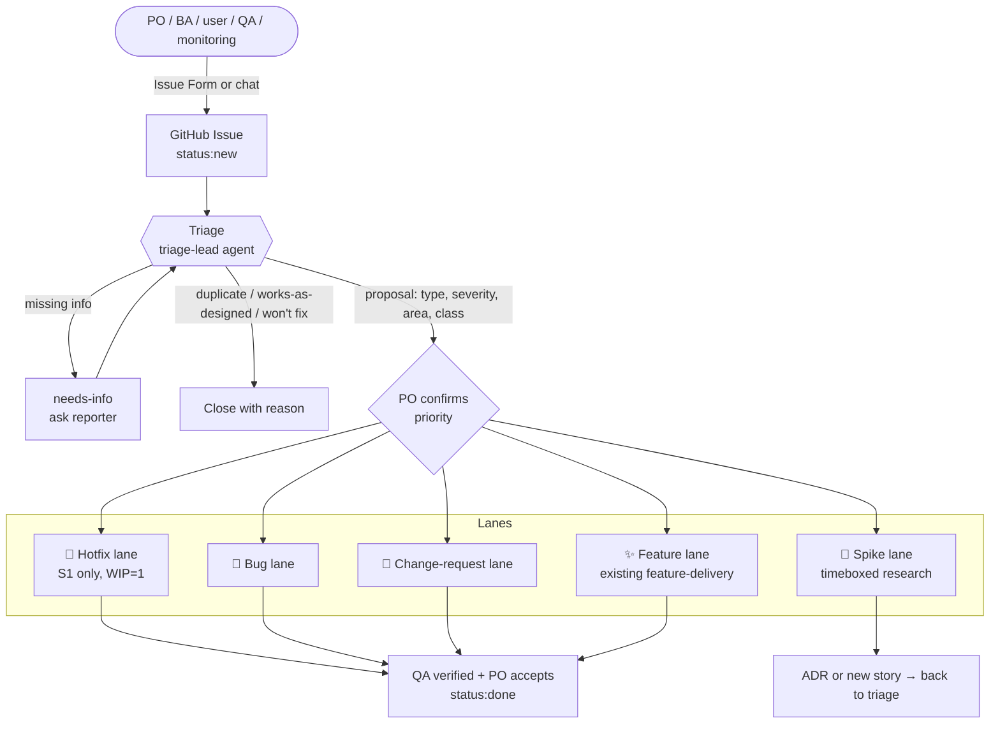
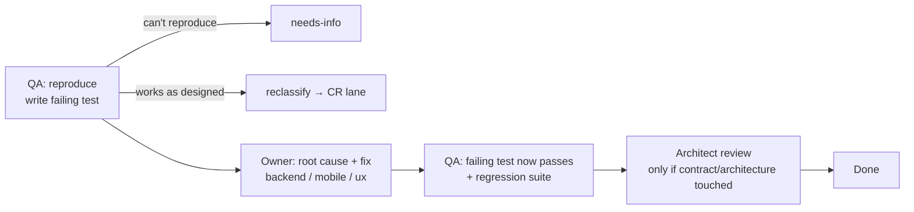
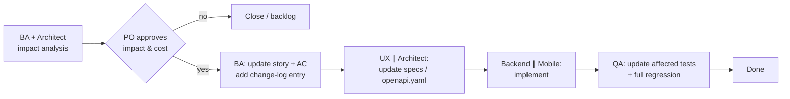

# Intake & Triage Flow: features, changes and bugs

*Research + design, 29 Sep 2026. Extends `agent-architecture.md`.*

**Status: implemented.**

| Part | File |
|---|---|
| Triage agent | `.claude/agents/triage-lead.md` |
| Workflows | `.claude/workflows/triage.js`, `bug-fix.js`, `hotfix.js`, `change-request.js`, `spike.js` (feature lane: `feature-delivery.js`) |
| Issue forms | `.github/ISSUE_TEMPLATE/1-bug.yml` … `5-tech-debt.yml` |
| Labels | `.github/labels.yml`, synced by `.github/workflows/labels.yml` on pushes to `master` |
| Triage log | `docs/triage/log.md` |
| Orchestrator procedure | `CLAUDE.md` → "Intake procedure" |

## 1. Problem with the current flow

The current team has **one pipeline** (`feature-delivery`: BA → UX ∥ Architect → Backend ∥ Mobile → QA ∥ Review). That works for new features, but:

| Situation | What goes wrong today |
|---|---|
| PO reports a **bug** | It runs through BA and UX for nothing. Nobody reproduces it first, so a "fix" may not fix anything. |
| PO **changes** an existing feature | A new story gets written instead of updating the old one. Design, contract, code and tests drift apart. No impact analysis. |
| **Production outage** | It waits in the same queue as normal work. |
| Idea needs **research first** | There's no timeboxed "spike" path, so it gets forced into a story too early. |
| Item is a **duplicate** or "works as designed" | Nothing catches it, and agents do unnecessary work. |
| New request arrives **while a story is in progress** | Agents may silently change scope mid-flight. |

## 2. What established practice says

| Practice | Key idea we adopt | Source |
|---|---|---|
| **Bug triage** (Atlassian, QA practice) | Every report gets three decisions: *Is it valid (bug / duplicate / feature / already fixed)? What's the impact? When do we fix it?* | [Atlassian](https://www.atlassian.com/agile/software-development/bug-triage), [Plane](https://plane.so/blog/bug-triage-process-how-to-run-it-and-what-to-prioritize) |
| **Severity ≠ priority** | Severity is the technical impact (set by QA/engineering). Priority is business urgency (set by the PO). A high-severity bug hitting 0.1% of users can rank below a medium bug hitting every new user. | [BrowserStack](https://www.browserstack.com/guide/bug-severity-vs-priority), [Plane](https://plane.so/blog/bug-severity-vs-priority-in-testing-key-differences) |
| **Kanban classes of service** | Four lanes by cost of delay: **Expedite** (WIP limit 1, interrupts other work), **Fixed date**, **Standard** (FIFO), **Intangible** (tech debt; first to give way). | [Kanban University / DJAA](https://djaa.com/classes-of-service/), [Businessmap](https://businessmap.io/kanban-resources/getting-started/kanban-classes-of-service) |
| **Definition of Ready / Done** | Work enters the build only when it's ready: clear AC, repro steps, design and contract available. | Scrum practice |
| **Structured intake forms** | GitHub Issue Forms (YAML) collect only the fields needed to triage and apply labels automatically. | [GitHub issue forms examples](https://github.com/freerouting/freerouting/pull/898) |
| **AI triage agents** | An agent classifies type, severity and area, detects duplicates, asks for missing info (`needs-info`), and records its reasoning. It **never invents facts**. | [ClawAgora triage guide](https://www.clawagora.com/en/blog/automate-github-issue-triage-ai-agent) |
| **Human-in-the-loop gates** | Humans approve at decision points (priority, scope change, acceptance), not at every step. | [HULA, arXiv 2411.12924](https://arxiv.org/abs/2411.12924), [Port.io](https://www.port.io/blog/human-in-the-loop-for-ai-coding-agents) |

## 3. Proposed flow

### 3.1 Overview



### 3.2 Issue types (intake forms)

| Type | Who usually raises it | Required fields |
|---|---|---|
| **Feature** | PO, BA | Problem / goal, persona, expected value, rough priority, deadline (if any) |
| **Change request** | PO, BA | Story ID being changed, what changes and why, what must *not* change |
| **Bug** | QA, PO, users | Steps to reproduce, expected vs actual, platform/version, location (coordinates/route), screenshot/GPX/log |
| **Spike / question** | anyone | Question to answer, timebox, decision it unblocks |
| **Tech debt** | architect, engineers | Risk if not done, affected area |

### 3.3 Triage (new `triage-lead` step)

Runs on every new issue in **minutes, not days**:

1. **Validate:** real issue? Duplicate (search open and closed issues and stories)? "Works as designed", which is really a change request, not a bug? Already fixed?
2. **Classify:** type, `area:*` (routing / search / tiles / android / ios / web / design / data-OSM), linked story ID.
3. **Assess:**
   - Bugs: **severity** S1–S4 (see matrix), reproducible yes/no.
   - Features and CRs: size S/M/L, affected artifacts.
4. **Propose** priority P0–P3 and class of service. **The PO confirms.** This is the only mandatory human gate at intake.
5. **Route** to a lane and set `status:ready` once the Definition of Ready is met, or `needs-info` otherwise.

A special case for **OSM data bugs**: a "wrong turn", missing street or wrong name is often an **OpenStreetMap data problem**, not a code bug. Triage tags these `area:data-osm`. The fix is to correct OSM (by a human mapper, following OSM's rules) and wait for the next rebuild. No code change.

### 3.4 Severity × priority → class of service

| Severity (QA sets) | Meaning (navigation examples) |
|---|---|
| **S1 Critical** | Service down; app crashes on start; routes lead into illegal or dangerous manoeuvres (wrong way on a one-way street, closed bridge); data or privacy leak |
| **S2 Major** | Core feature broken for many users: rerouting fails, voice silent, search returns nothing in Mongolian |
| **S3 Minor** | Feature degraded or has a workaround: wrong ETA, lane arrows missing, UI glitch |
| **S4 Trivial** | Cosmetic: typo, alignment, colour |

| | P0 (now) | P1 (this iteration) | P2 (next) | P3 (backlog) |
|---|---|---|---|---|
| **S1** | 🚨 Expedite / hotfix | Bug lane, top | — | — |
| **S2** | Bug lane, top | Bug lane | Bug lane | — |
| **S3** | — | Bug lane | Bug lane | Backlog |
| **S4** | — | — | Batched with a related story | Backlog |

The PO can raise priority freely. **Only S1 may use the expedite lane** (WIP limit 1), so it can't be abused as a shortcut.

### 3.5 The five lanes

**🚨 Hotfix lane (S1 / P0)**
```
QA reproduce (failing test) → owner fixes (minimal change) → QA verify + smoke → release
→ follow-up within 48 h: root-cause note, regression test kept, story/AC updated if a gap was found
```
BA, UX and full review are skipped at first and backfilled afterwards.

**🐞 Bug lane**

Key rule: **no fix without a reproduction**. The failing test becomes a permanent regression test.

**🔁 Change-request lane** (modifying something that already exists)

The impact analysis lists **every artifact touched**: story/AC, screens, API operations, code modules, tests, and in-progress work that conflicts. Artifacts are updated **in dependency order** (story → design/contract → code → tests), so they never drift.

**✨ Feature lane:** the existing `feature-delivery` workflow, now started only after triage and Definition of Ready.

**🔬 Spike lane:** architect or BA researches with a timebox (e.g., 1 agent run). The output is an ADR, a recommendation, or new stories, which go back to triage. No production code.

### 3.6 Changes that arrive mid-flight

If the PO changes a story **while it's in progress**:
1. Agents **don't** absorb it silently. The orchestrator pauses at the next stage boundary.
2. Triage creates a **change request** linked to the in-progress story.
3. PO chooses: **(a)** finish as is and do the CR next (the default, since it protects flow), **(b)** stop, apply the CR, and restart from the affected stage, or **(c)** drop the in-progress work.

Bugs QA finds *during* a story's verification are **not new issues**. They go into that story's fix loop. Only defects outside the story's scope become new bug issues.

### 3.7 Definition of Ready / Done

| | Ready (may enter a lane) | Done |
|---|---|---|
| Feature | Story with Given/When/Then AC; no blocking questions; priority set | All AC pass; architect review has no blocker or major issues; docs updated; PO accepts |
| Change request | Impact analysis approved by PO | Updated story, specs, contract, code and tests are consistent; regression green |
| Bug | Repro steps + environment; severity set | Failing test now passes; regression green; root cause noted |
| Hotfix | S1 confirmed by QA | Fixed + released; follow-up issue created for root cause and backfill |
| Spike | Question + timebox | ADR or recommendation written; follow-up items triaged |

### 3.8 Status labels (GitHub)

```
type:feature | type:change | type:bug | type:spike | type:tech-debt
sev:S1..S4        prio:P0..P3        cos:expedite | cos:fixed-date | cos:standard | cos:intangible
area:routing | area:search | area:tiles | area:gateway | area:android | area:ios | area:web | area:design | area:data-osm
status:new → status:triaged → status:ready → status:in-progress → status:in-review → status:done
             needs-info | blocked | duplicate | wont-fix
```

### 3.9 Traceability

Each story file gets a **change log** section and a trace table so a change or bug can be followed end to end:

| AC | Screen spec | API operation | Code | Test | Issues |
|---|---|---|---|---|---|
| NAV-004 AC2 | screens/route-preview.md | `GET /route` | `backend/...`, `mobile/android/...` | `tests/api/route_alternatives` | #12 (bug), #15 (CR) |

## 4. Changes to the agent team

| Change | Why |
|---|---|
| **New agent `triage-lead`** (reads everything; writes only issue labels and comments plus `docs/requirements/triage-log.md`) | One consistent triage voice; keeps the BA focused on stories and QA on testing |
| `business-analyst` also owns **impact analysis** for CRs (with the architect) and story **change logs** | Change requests update the existing story instead of creating a parallel one |
| `qa-engineer` owns **reproduction** and **severity** | No fix without a failing test; severity set by the technical side |
| PO (human) owns **priority** and CR approval | Business decisions stay human |
| New workflows: `triage.js` (router), `bug-fix.js`, `change-request.js`, `hotfix.js`, `spike.js`; `feature-delivery.js` unchanged | Right-sized path per type instead of one heavy pipeline |
| `.github/ISSUE_TEMPLATE/*.yml` issue forms + label set | Structured intake from the PO, BA, QA and users |

## 5. Human gates (kept to a minimum)

| Gate | Who | When |
|---|---|---|
| Confirm priority / class | PO | After triage, every issue (one click: accept the proposal or change it) |
| Approve CR impact | PO | Before any rework on existing features |
| Mid-flight scope change | PO | Only when a CR hits in-progress work |
| Accept delivery | PO | End of feature / CR lane |
| Everything else | agents | Automatic, with handoff blocks as the audit trail |
